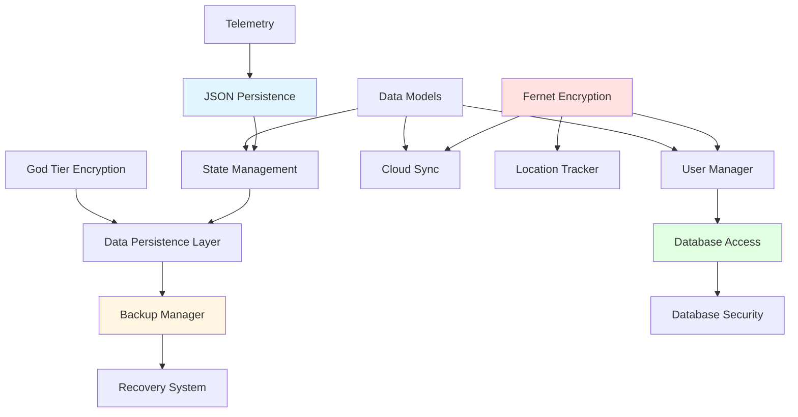

# Data Infrastructure Relationship Overview

**Agent:** AGENT-058 - Data Infrastructure Relationship Mapping Specialist  
**Mission:** Document relationships for 12 data systems  
**Date:** 2026-04-20

---


## Navigation

**Location**: `relationships\data\00-DATA-INFRASTRUCTURE-OVERVIEW.md`

**Parent**: [[relationships\data\README.md]]


## Executive Summary

Project-AI employs a sophisticated multi-layered data infrastructure with 12 interconnected systems managing persistence, [[02-ENCRYPTION-CHAINS.md|security]], synchronization, and recovery. This document provides a comprehensive map of data relationships, flows, and dependencies. For security architecture details, see [[../security/01_security_system_overview.md|Security System Overview]].

---

## System Architecture Overview

```
┌─────────────────────────────────────────────────────────────────┐
│                    DATA INFRASTRUCTURE LAYERS                   │
├─────────────────────────────────────────────────────────────────┤
│                                                                 │
│  Layer 1: PERSISTENCE & STATE MANAGEMENT                       │
│  ┌──────────────┐  ┌──────────────┐  ┌──────────────┐         │
│  │ JSON         │  │ State        │  │ Data         │         │
│  │ Persistence  │→ │ Management   │→ │ Persistence  │         │
│  └──────────────┘  └──────────────┘  └──────────────┘         │
│                                                                 │
│  Layer 2: SECURITY & ENCRYPTION (→ [[../security/03_defense_layers.md|Defense Layers]])
│  ┌──────────────┐  ┌──────────────┐  ┌──────────────┐         │
│  │ Fernet       │  │ God Tier     │  │ Database     │         │
│  │ Encryption   │→ │ Encryption   │→ │ Security     │         │
│  └──────────────┘  └──────────────┘  └──────────────┘         │
│                                                                 │
│  Layer 3: DATA ACCESS & MANAGEMENT                             │
│  ┌──────────────┐  ┌──────────────┐  ┌──────────────┐         │
│  │ User         │  │ Database     │  │ Data         │         │
│  │ Manager      │→ │ Access       │→ │ Models       │         │
│  └──────────────┘  └──────────────┘  └──────────────┘         │
│                                                                 │
│  Layer 4: SYNCHRONIZATION & MONITORING (→ [[../monitoring/04-telemetry-system.md|Monitoring]])
│  ┌──────────────┐  ┌──────────────┐                           │
│  │ Cloud Sync   │  │ Telemetry    │                           │
│  │ Manager      │→ │ System       │                           │
│  └──────────────┘  └──────────────┘                           │
│                                                                 │
│  Layer 5: BACKUP & RECOVERY                                    │
│  ┌──────────────┐  ┌──────────────┐                           │
│  │ Backup       │  │ Recovery     │                           │
│  │ Manager      │→ │ System       │                           │
│  └──────────────┘  └──────────────┘                           │
│                                                                 │
└─────────────────────────────────────────────────────────────────┘
```

---

## 12 Core Data Systems

### 1. **JSON Persistence**
- **Location:** `src/app/core/ai_systems.py` [[src/app/core/ai_systems.py]] (`_atomic_write_json`)
- **Purpose:** Atomic write operations with file locking
- **Serves:** All JSON-based systems
- **Pattern:** Write-to-temp → atomic-replace → release-lock

### 2. **State Management**
- **Location:** `src/app/core/ai_systems.py` [[src/app/core/ai_systems.py]] + `data_persistence.py`
- **Purpose:** Centralized state coordination
- **Components:** AIPersona, MemoryExpansion, LearningRequest, PluginManager, CommandOverride
- **Pattern:** Load → modify → atomic-save

### 3. **Data Persistence Layer**
- **Location:** `src/app/core/data_persistence.py` [[src/app/core/data_persistence.py]]
- **Purpose:** Encrypted state management, versioning, compression
- **Features:** AES-256-GCM, ChaCha20-Poly1305, Fernet encryption
- **Pattern:** Serialize → compress → encrypt → persist

### 4. **Fernet Encryption**
- **Location:** `cryptography.fernet.Fernet` (used throughout)
- **Purpose:** Symmetric encryption for user data, cloud sync, location history (see [[../security/01_security_system_overview.md|Security Overview]])
- **Key Source:** [[../configuration/02_environment_manager_relationships.md|Environment Manager]] (`.env` [[.env]] FERNET_KEY) or runtime generation
- **Usage:** User Manager, Cloud Sync, Location Tracker

### 5. **God Tier Encryption**
- **Location:** `utils/encryption/god_tier_encryption.py`
- **Purpose:** 7-layer military-grade encryption (see [[../security/03_defense_layers.md|Defense Layers]])
- **Layers:** SHA-512 hash → Fernet → AES-256-GCM → ChaCha20 → RSA-4096 → ECC-521
- **Use Case:** Maximum security scenarios (see [[02-ENCRYPTION-CHAINS.md|Encryption Chains]])

### 6. **User Manager**
- **Location:** `src/app/core/user_manager.py` [[src/app/core/user_manager.py]]
- **Purpose:** User authentication, profile management
- **Data File:** `data/users.json`
- **Security:** pbkdf2_sha256 password hashing (see [[../security/02_threat_models.md|Threat Models]]) (bcrypt fallback)
- **Features:** Account lockout, password migration, Fernet cipher setup

### 7. **Database Access**
- **Location:** `src/app/security/database_security.py` [[src/app/security/database_security.py]]
- **Purpose:** Parameterized SQL queries, SQL injection prevention (see [[../security/06_data_flow_diagrams.md|Data Flow Diagrams]])
- **Database:** SQLite (`data/secure.db`)
- **Tables:** users, sessions, audit_log, agent_state, knowledge_base
- **Pattern:** Context manager transactions with rollback

### 8. **Data Models**
- **Location:** Embedded in each system (AIPersona, MemoryExpansion, etc.)
- **Purpose:** Define data structures and persistence schemas
- **Format:** JSON with versioned schemas
- **Examples:**
  - AIPersona: `personality`, `mood`, `interactions`
  - MemoryExpansion: `knowledge_base`, `conversations`
  - LearningRequest: `requests`, `black_vault`

### 9. **Cloud Sync**
- **Location:** `src/app/core/cloud_sync.py` [[src/app/core/cloud_sync.py]]
- **Purpose:** Encrypted bidirectional cloud synchronization (see [[03-SYNC-STRATEGIES.md|Sync Strategies]])
- **Data File:** `data/sync_metadata.json`
- **Security:** Fernet encryption before upload (see [[../security/06_data_flow_diagrams.md|Data Flow Diagrams]])
- **Features:** Device ID generation, conflict resolution, auto-sync

### 10. **Telemetry**
- **Location:** `src/app/core/telemetry.py` [[src/app/core/telemetry.py]]
- **Purpose:** Opt-in event logging with atomic writes (see [[../monitoring/04-telemetry-system.md|Telemetry System]])
- **Data File:** `logs/telemetry.json`
- **Pattern:** Load → append → rotate (max 1000 events) → atomic write
- **Status:** Disabled by default ([[../configuration/02_environment_manager_relationships.md|Environment Manager]]: `TELEMETRY_ENABLED=false`)

### 11. **Backup Manager**
- **Location:** `src/app/core/data_persistence.py` [[src/app/core/data_persistence.py]] (`BackupManager`)
- **Purpose:** Automated backup creation and management
- **Backup Dir:** `data/backups/`
- **Features:** Compression (tar.gz), SHA-256 checksums, automatic rotation
- **Retention:** Configurable (default: 7 backups)

### 12. **Recovery System**
- **Location:** `src/app/core/data_persistence.py` [[src/app/core/data_persistence.py]] (`BackupManager.restore_backup`)
- **Purpose:** Restore from backups with verification (see [[04-BACKUP-RECOVERY.md|Backup & Recovery]])
- **Safety:** Creates pre-restore backup, verifies checksums (see [[../monitoring/06-error-tracking.md|Error Tracking]])
- **Pattern:** Verify → backup-current → restore → cleanup

---

## Cross-System Dependencies



---

## Data Flow Patterns

### Pattern 1: User Authentication Flow
```
User Login Attempt
   ↓
UserManager.login(username, password)
   ↓
Read users.json (JSON Persistence)
   ↓
Decrypt password hash (pbkdf2_sha256) → [[../security/02_threat_models.md|Threat Models]]
   ↓
Validate credentials → [[../security/01_security_system_overview.md|Security Overview]]
   ↓
Create session token (Database Access)
   ↓
Log audit event (Database Security) → [[../monitoring/06-error-tracking.md|Error Tracking]]
   ↓
Update user metadata (State Management)
   ↓
Sync to cloud (Cloud Sync + Fernet Encryption)
```

### Pattern 2: AI Persona State Update
```
User Interaction
   ↓
AIPersona.update_conversation_state()
   ↓
Increment interaction counter (Data Model)
   ↓
Update mood/personality traits (State Management)
   ↓
_save_state() → _atomic_write_json (JSON Persistence)
   ↓
data/ai_persona/state.json persisted
   ↓
Telemetry event (optional) → [[../monitoring/04-telemetry-system.md|Telemetry System]]→ [[../monitoring/04-telemetry-system.md|Telemetry System]]
```

### Pattern 3: Cloud Sync Bidirectional Flow
```
Local Data Change
   ↓
CloudSyncManager.bidirectional_sync(username, local_data)
   ↓
Download cloud data → decrypt (Fernet) → [[../security/06_data_flow_diagrams.md|Data Flow Diagrams]]
   ↓
Resolve conflict (timestamp comparison) → [[03-SYNC-STRATEGIES.md|Sync Strategies]]
   ↓
Upload resolved data → encrypt (Fernet) → [[../security/03_defense_layers.md|Defense Layers]]
   ↓
Update sync_metadata.json (JSON Persistence)
   ↓
Device list updated (Cloud endpoint)
```

### Pattern 4: Encrypted State Persistence
```
State Change (e.g., memory, learning request)
   ↓
EncryptedStateManager.save_encrypted_state(state_id, data)
   ↓
Serialize to JSON (Data Models)
   ↓
Compress with gzip (Data Persistence)
   ↓
Encrypt (AES-256-GCM or ChaCha20-Poly1305) → [[02-ENCRYPTION-CHAINS.md|Encryption Chains]]
   ↓
Save to data/{state_id}.enc + {state_id}.meta
   ↓
Update key rotation tracking (State Management) → [[../security/03_defense_layers.md|Defense Layers]]
```

### Pattern 5: Backup and Recovery Chain
```
Scheduled/Manual Backup Trigger
   ↓
BackupManager.create_backup()
   ↓
Read all files from data/ directory
   ↓
Create tar.gz archive (compression)
   ↓
Calculate SHA-256 checksum
   ↓
Save backup metadata (.meta file)
   ↓
Cleanup old backups (max_backups=7)
   ↓
Recovery trigger (if needed)
   ↓
BackupManager.restore_backup(backup_name)
   ↓
Verify checksum
   ↓
Create pre-restore backup (safety)
   ↓
Remove current data/
   ↓
Extract backup archive
   ↓
State systems reload from restored files
```

---

## Persistence Patterns by System

### JSON-Based Persistence (9 systems)
```
System                    File Path                              Format     Encryption
─────────────────────────────────────────────────────────────────────────────────────
User Manager             data/users.json                         JSON       No (hashed passwords)
AI Persona               data/ai_persona/state.json              JSON       No
Memory Expansion         data/memory/knowledge.json              JSON       No
                        data/memory/conversations.json           JSON       No
Learning Requests        data/learning_requests/requests.json    JSON       No
Command Override         data/command_override_config.json       JSON       No
Cloud Sync Metadata      data/sync_metadata.json                 JSON       No
Telemetry                logs/telemetry.json                     JSON       No
Plugin Manager           data/plugins/enabled.json               JSON       No
```

### Encrypted Persistence (3 systems)
```
System                    File Pattern                           Algorithm         Compression
─────────────────────────────────────────────────────────────────────────────────────────────
Encrypted State Mgr      data/{state_id}.enc + .meta             AES-256-GCM      gzip
Cloud Sync (in-flight)   (Network transmission)                  Fernet           No
Location Tracker         data/location_history.json              Fernet           No
```

### Database Persistence (1 system)
```
System                    File Path                              Schema            Indexes
───────────────────────────────────────────────────────────────────────────────────────────
Database Security        data/secure.db                          SQLite            Yes
  Tables: users, sessions, audit_log, agent_state, knowledge_base
```

---

## Data Integrity Mechanisms

### 1. Atomic Writes
- **Implementation:** `_atomic_write_json()` in `ai_systems.py`
- **Pattern:** Write to temp file → fsync → atomic replace
- **Locking:** File-based lockfile with stale detection
- **Benefits:** Prevents corruption from concurrent writes

### 2. Checksums
- **Usage:** Backup verification, data integrity
- **Algorithm:** SHA-256
- **Validation:** Before restore operations

### 3. Versioning
- **System:** DataMigrationManager in `data_persistence.py`
- **Format:** Semantic versioning (major.minor.patch)
- **Migrations:** Registered migration functions between versions

### 4. Transactions
- **System:** Database Security (SQLite)
- **Pattern:** BEGIN → operations → COMMIT or ROLLBACK
- **Scope:** Multi-table operations with ACID guarantees

### 5. Encryption Integrity
- **AEAD Ciphers:** AES-256-GCM, ChaCha20-Poly1305 (authenticated)
- **Tamper Detection:** Built-in MAC verification
- **Key Rotation:** Automatic rotation with configurable intervals (default: 90 days)

---

## Synchronization Patterns

### Internal Synchronization
```
Component Updates → State Management → JSON Persistence
                                    ↓
                              Atomic Write Lock
                                    ↓
                            Concurrent-Safe Update
```

### External Synchronization
```
Local Change → Cloud Sync Manager → Encrypt (Fernet)
                                  ↓
                        HTTP POST to Cloud API
                                  ↓
                    Update sync_metadata.json
                                  ↓
            Device List Synchronized Across Devices
```

### Conflict Resolution Strategy
```
Timestamp Comparison (ISO 8601)
  ↓
Most Recent Wins
  ↓
Merge Strategy: None (last-write-wins)
  ↓
Upload resolved state to all devices
```

---

## Data Directory Structure

```
T:\Project-AI-main\
│
├── data/                              # Primary data directory
│   ├── users.json                     # User Manager
│   ├── sync_metadata.json             # Cloud Sync
│   ├── command_override_config.json   # Command Override System
│   │
│   ├── ai_persona/                    # AI Persona state
│   │   └── state.json
│   │
│   ├── memory/                        # Memory Expansion
│   │   ├── knowledge.json
│   │   └── conversations.json
│   │
│   ├── learning_requests/             # Learning Request Manager
│   │   └── requests.json
│   │
│   ├── plugins/                       # Plugin Manager
│   │   └── enabled.json
│   │
│   ├── backups/                       # Backup Manager
│   │   ├── backup_YYYYMMDD_HHMMSS.tar.gz
│   │   └── backup_YYYYMMDD_HHMMSS.meta
│   │
│   ├── secure.db                      # SQLite database
│   │
│   └── .keys/                         # Encrypted State Manager
│       ├── master.key                 # Encryption keys
│       ├── current_key_id
│       └── last_rotation
│
├── logs/                              # Logging directory
│   └── telemetry.json                 # Telemetry System
│
└── config/                            # Configuration
    └── migrations/                    # Data migration scripts
```

---

## Security Architecture

### Encryption Hierarchy
```
Level 1: No Encryption (JSON files)
   → Used for: Non-sensitive state (persona mood, plugin list)
   → Protection: File system permissions only

Level 2: Fernet Encryption (AES-128)
   → Used for: Cloud sync, location history
   → Key source: .env (FERNET_KEY)
   → Strength: Symmetric, time-stamped tokens

Level 3: Password Hashing (pbkdf2_sha256)
   → Used for: User credentials
   → Iterations: 29000 (default)
   → Salt: Random per-password

Level 4: Database Encryption (SQLite)
   → Used for: Parameterized queries, injection prevention
   → Pattern: Prepared statements with ? placeholders

Level 5: AES-256-GCM (Encrypted State Manager)
   → Used for: Critical state persistence
   → Features: Authenticated encryption, nonce-based
   → Key rotation: 90-day default

Level 6: ChaCha20-Poly1305
   → Used for: High-speed authenticated encryption
   → Alternative to AES for performance-critical paths

Level 7: God Tier Encryption
   → Used for: Maximum security scenarios
   → Layers: 7 (hash → Fernet → AES → ChaCha → RSA-4096 → ECC-521)
   → Status: Available but not default (performance trade-off)
```

---

## Key Management

### Fernet Keys
- **Storage:** [[../configuration/02_environment_manager_relationships.md|Environment Manager]] (`.env` [[.env]])
- **Fallback:** Runtime generation (non-persistent)
- **Format:** URL-safe base64-encoded 32-byte key
- **Usage:** Cloud sync, location tracker (see [[../configuration/07_secrets_management_relationships.md|Secrets Management]])

### Encrypted State Manager Keys
- **Storage:** `data/.keys/master.key` (owner-only permissions)
- **Rotation:** Automatic based on `key_rotation_days` (default: 90)
- **Archive:** Old keys saved as `master_{key_id}.key`
- **Algorithm-specific:**
  - Fernet: 32-byte key
  - AES-256-GCM: 32-byte key
  - ChaCha20-Poly1305: 32-byte key

### Password Hashes
- **Algorithm:** pbkdf2_sha256 (primary), bcrypt (legacy) (see [[../security/02_threat_models.md|Threat Models]])
- **Storage:** `data/users.json` (password_hash field)
- **Migration:** Automatic upgrade from plaintext on first load

### Database Keys
- **Type:** None (SQLite database not encrypted at rest)
- **Protection:** Parameterized queries, SQL injection prevention
- **Future:** Consider SQLCipher for database-level encryption

---

## Performance Considerations

See [[../monitoring/05-performance-monitoring.md|Performance Monitoring]] for comprehensive metrics.

### JSON Persistence Bottlenecks
- **Issue:** Atomic write locks can serialize high-frequency updates
- **Mitigation:** Coalesce rapid updates, batch writes
- **Current:** Lockfile timeout = 5 seconds (see [[01-PERSISTENCE-PATTERNS.md|Persistence Patterns]])

### Cloud Sync Latency
- **Issue:** Network round-trip for each sync operation
- **Mitigation:** Auto-sync interval = 300 seconds (5 minutes) via [[../configuration/10_default_values_relationships.md|Default Values]]
- **Pattern:** Bidirectional sync with conflict resolution (see [[03-SYNC-STRATEGIES.md|Sync Strategies]])

### Encryption Overhead
- **Fernet:** ~10-20% overhead (acceptable)
- **AES-256-GCM:** Hardware-accelerated (minimal overhead)
- **God Tier:** 7-layer = ~300-500% overhead (use sparingly) (see [[02-ENCRYPTION-CHAINS.md|Encryption Chains]])

### Backup Compression
- **Format:** tar.gz (gzip compression)
- **Ratio:** ~60-80% size reduction (typical)
- **Trade-off:** CPU time vs. storage space (monitored via [[../monitoring/05-performance-monitoring.md|Performance Monitoring]])

---

## Monitoring and Observability

See [[../monitoring/04-telemetry-system.md|Telemetry System]] for full observability architecture.

### Telemetry Events
```python
# Event structure
{
    "name": "user_login",
    "timestamp": 1735012345.678,
    "payload": {
        "username": "user123",
        "device_id": "abc123...",
        "success": true
    }
}
```

### Audit Logging (Database)
```sql
-- audit_log table schema
CREATE TABLE audit_log (
    id INTEGER PRIMARY KEY,
    user_id INTEGER,
    action TEXT NOT NULL,           -- "login", "state_change", "backup_created"
    resource TEXT,                  -- "users.json", "ai_persona/state.json"
    details TEXT,                   -- JSON details
    ip_address TEXT,
    timestamp TIMESTAMP DEFAULT CURRENT_TIMESTAMP
);
```

### State Change Tracking
- **System:** All AI systems log to standard Python logging (see [[../monitoring/06-error-tracking.md|Error Tracking]])
- **Format:** `logger.info/warning/error()`
- **Destination:** Console + file (if configured via [[../configuration/01_config_loader_relationships.md|Config Loader]])

---

## Disaster Recovery Procedures

### Backup Strategy
1. **Frequency:** Automatic after significant state changes
2. **Retention:** 7 backups (configurable)
3. **Storage:** `data/backups/` directory
4. **Verification:** SHA-256 checksums before restore

### Recovery Steps
```bash
# List available backups
backup_manager.list_backups()

# Restore from backup (with pre-restore safety backup)
backup_manager.restore_backup("backup_20260420_143000")

# Manual restore (if needed)
cd data/backups
tar -xzf backup_20260420_143000.tar.gz -C ../../data/
```

### Data Loss Scenarios

#### Scenario 1: Corrupted JSON file
- **Detection:** JSON parsing exception on load
- **Mitigation:** Restore from most recent backup
- **Prevention:** Atomic writes with lockfiles

#### Scenario 2: Failed cloud sync
- **Detection:** Sync upload/download returns False
- **Mitigation:** Fallback to local data, retry on next interval
- **Prevention:** Network timeout = 30 seconds, exponential backoff

#### Scenario 3: Encryption key loss
- **Detection:** Decryption failure on load
- **Mitigation:** Restore from backup (if keys archived)
- **Prevention:** Key archiving in `data/.keys/master_{key_id}.key`

#### Scenario 4: Database corruption
- **Detection:** SQLite integrity check failure
- **Mitigation:** Restore secure.db from backup
- **Prevention:** Transaction-based writes, WAL mode

---

## Future Enhancements

### Recommended Improvements
1. **Database Encryption:** Migrate to SQLCipher for encrypted SQLite
2. **Distributed Sync:** Multi-device conflict resolution with CRDTs
3. **Incremental Backups:** Delta backups for large datasets
4. **Real-time Replication:** Streaming replication to cloud
5. **Schema Validation:** JSON Schema validation before persistence
6. **Audit Trail Encryption:** Encrypt audit_log table entries
7. **Key Derivation:** HKDF for key hierarchy and domain separation
8. **Zero-Knowledge Sync:** End-to-end encryption with cloud provider untrusted

---

## Related Documentation

### Data Layer Documentation
- **[[01-PERSISTENCE-PATTERNS.md|Persistence Patterns]]** - Detailed persistence implementation patterns
- **[[02-ENCRYPTION-CHAINS.md|Encryption Chains]]** - Encryption flows and key management
- **[[03-SYNC-STRATEGIES.md|Sync Strategies]]** - Cloud sync and conflict resolution
- **[[04-BACKUP-RECOVERY.md|Backup & Recovery]]** - Backup strategies and disaster recovery
- **[05-DATA-MODELS.md](./05-DATA-MODELS.md)** - Schema definitions and versioning
- **[06-DATABASE-ARCHITECTURE.md](./06-DATABASE-ARCHITECTURE.md)** - SQLite database design

### Cross-System Documentation
- **[[../security/01_security_system_overview.md|Security System Overview]]** - Security architecture
- **[[../security/03_defense_layers.md|Defense Layers]]** - 7-layer encryption hierarchy
- **[[../security/06_data_flow_diagrams.md|Data Flow Diagrams]]** - Security data flows
- **[[../monitoring/04-telemetry-system.md|Telemetry System]]** - Observability and metrics
- **[[../monitoring/05-performance-monitoring.md|Performance Monitoring]]** - Performance metrics
- **[[../monitoring/06-error-tracking.md|Error Tracking]]** - Error logging and tracking
- **[[../configuration/02_environment_manager_relationships.md|Environment Manager]]** - Environment variables
- **[[../configuration/07_secrets_management_relationships.md|Secrets Management]]** - Secrets and keys
- **[[../configuration/10_default_values_relationships.md|Default Values]]** - Configuration defaults

---

**Document Version:** 1.0.0  
**Last Updated:** 2026-04-20  
**Maintained By:** AGENT-058 (Data Infrastructure Relationship Mapping Specialist)


---

## See Also

### Related Source Documentation

- **05 Data Persistence Layer Model**: [[source-docs\data-models\05-data-persistence-layer-model.md]]
- **Documentation Index**: [[source-docs\data-models\README.md]]
