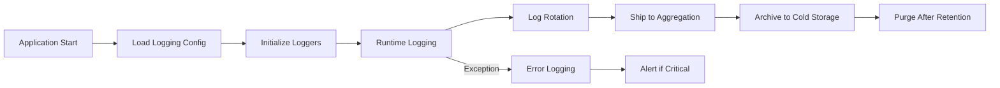
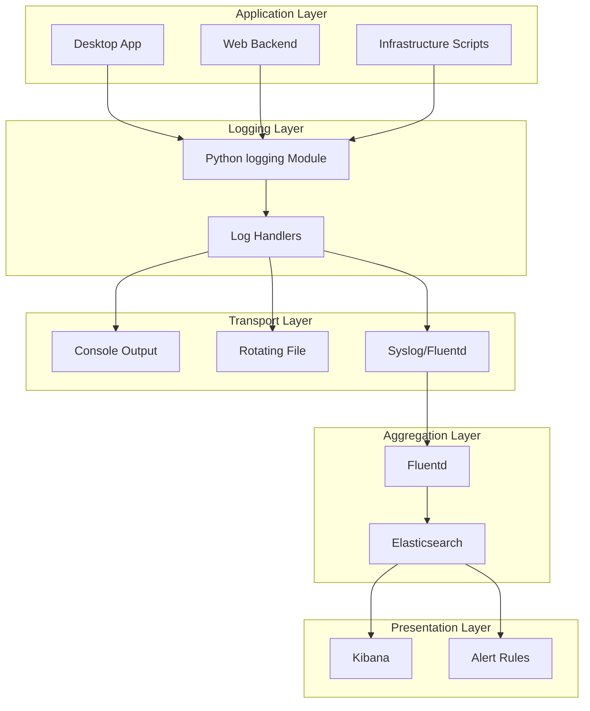
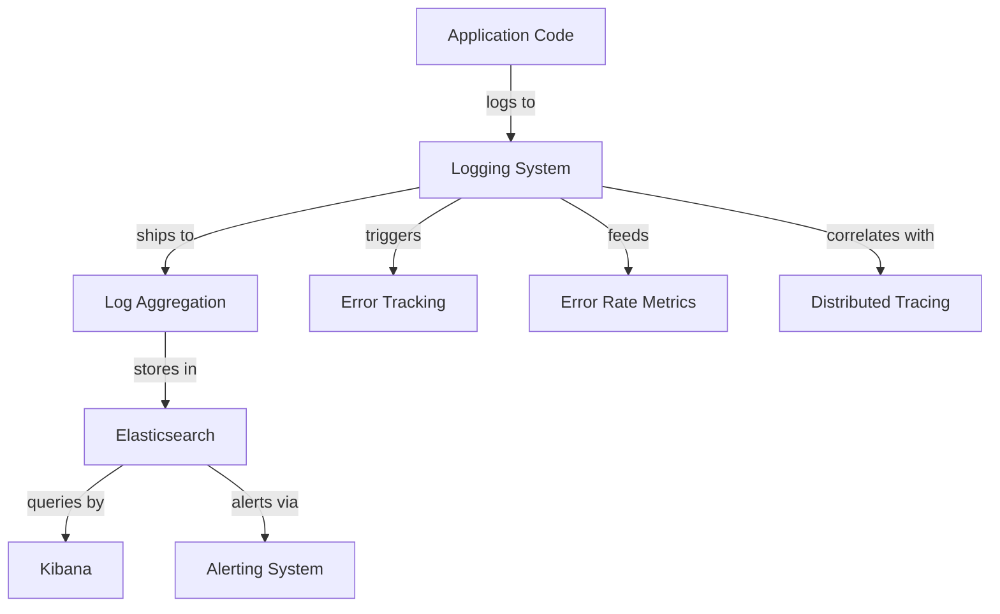

# Logging System - Comprehensive Relationship Map

## Executive Summary

The Logging System provides structured event logging across all Project-AI components using Python's built-in `logging` module. It serves as the foundation for debugging, audit trails, and operational visibility, with universal integration across desktop, web, and infrastructure layers.

---

## 1. WHAT: Component Functionality & Boundaries

### Core Responsibilities

1. **Structured Event Logging**
   - Captures application events with severity levels (DEBUG, INFO, WARNING, ERROR, CRITICAL)
   - Structured JSON formatting for machine parsing
   - Context enrichment (timestamps, module names, line numbers, thread IDs)
   - Correlation IDs for request tracing

2. **Multi-Level Logging**
   ```python
   import logging
   logger = logging.getLogger(__name__)
   
   logger.debug("Detailed diagnostic information")
   logger.info("User logged in successfully", extra={"user_id": 123})
   logger.warning("Disk usage above 80%", extra={"usage_percent": 85})
   logger.error("Failed to connect to database", exc_info=True)
   logger.critical("System shutdown initiated", extra={"reason": "OOM"})
   ```

3. **Handler Configuration**
   - Console Handler: Human-readable output during development
   - File Handler: Rotating log files (`logs/app.log`, max 10MB × 5 files)
   - Syslog Handler: Remote log shipping to aggregation system
   - Stream Handler: Custom integrations (e.g., CloudWatch, Datadog)

4. **Formatter Patterns**
   - **Development**: `%(asctime)s - %(name)s - %(levelname)s - %(message)s`
   - **Production (JSON)**:
     ```json
     {
       "timestamp": "2026-04-20T15:30:45.123Z",
       "level": "ERROR",
       "logger": "app.core.ai_systems",
       "message": "FourLaws validation failed",
       "context": {
         "user_id": 123,
         "trace_id": "abc123",
         "action": "delete_user_data"
       },
       "exc_info": "Traceback..."
     }
     ```

### Boundaries & Limitations

- **Does NOT**: Store logs persistently (delegates to Log Aggregation system)
- **Does NOT**: Perform log analysis or querying (use Elasticsearch/Kibana)
- **Does NOT**: Handle alerting (delegates to Alerting system)
- **Stateless**: Each log statement is independent (no session state)
- **Performance Impact**: Synchronous logging can block execution (use async handlers for high-volume)

### Data Structures

**Log Record Attributes** (Python `LogRecord` object):
```python
{
    'name': str,           # Logger name (e.g., 'app.core.ai_systems')
    'levelno': int,        # Numeric level (10=DEBUG, 50=CRITICAL)
    'levelname': str,      # 'DEBUG', 'INFO', 'WARNING', 'ERROR', 'CRITICAL'
    'pathname': str,       # Full path to source file
    'filename': str,       # Source file name
    'module': str,         # Module name
    'lineno': int,         # Line number of log statement
    'funcName': str,       # Function name
    'created': float,      # Timestamp (seconds since epoch)
    'asctime': str,        # Formatted timestamp
    'msecs': float,        # Millisecond portion of timestamp
    'thread': int,         # Thread ID
    'threadName': str,     # Thread name
    'process': int,        # Process ID
    'message': str,        # Formatted log message
    'exc_info': tuple,     # Exception info (type, value, traceback)
    'stack_info': str,     # Stack trace (if requested)
}
```

**Custom Context Fields** (via `extra` parameter):
- `user_id`: int - User identifier for action attribution
- `trace_id`: str - Distributed trace correlation ID
- `request_id`: str - HTTP request identifier
- `session_id`: str - User session identifier
- `ip_address`: str - Client IP (anonymized if PII concerns)
- `action`: str - High-level action being performed
- `duration_ms`: int - Operation duration in milliseconds

---

## 2. WHO: Stakeholders & Decision-Makers

### Primary Stakeholders

| Stakeholder | Role | Authority Level | Decision Power |
|------------|------|----------------|----------------|
| **SRE Team** | Operational visibility | CRITICAL | Sets log levels, retention policies |
| **Developers** | Debugging and troubleshooting | HIGH | Adds log statements, context fields |
| **Security Team** | Audit trail review | CRITICAL | Defines security event logging requirements |
| **Platform Team** | Infrastructure management | HIGH | Configures log shipping, aggregation |
| **Compliance Officer** | Regulatory requirements | OVERSIGHT | Mandates retention, PII handling |

### User Classes

1. **Log Producers** (All Developers)
   - Desktop app developers: 50+ modules import `logging`
   - Web backend developers: Flask request/response logging
   - Infrastructure scripts: Deployment, backup, cron jobs

2. **Log Consumers**
   - **Developers**: Debugging via local log files during development
   - **SREs**: Operational troubleshooting via Kibana dashboards
   - **Security Analysts**: Audit trail review for incident investigation
   - **Compliance Auditors**: Periodic review of access logs

3. **Log Administrators**
   - **Platform Team**: Configures log rotation, shipping, retention
   - **SRE Lead**: Sets log levels per environment (DEBUG in dev, INFO in prod)
   - **Security Lead**: Defines audit log requirements

### Maintainer Responsibilities

- **Code Owners**: @platform-team, @sre-team
- **Review Requirements**: 1 approval for log level changes, 2 for retention policy changes
- **On-Call**: Platform team (log ingestion failures), SRE team (query performance)

---

## 3. WHEN: Lifecycle & Review Cycle

### Logging Timeline



### Review Schedule

- **Daily**: Log volume dashboard (detect anomalies)
- **Weekly**: Error rate trends (identify recurring issues)
- **Monthly**: Retention policy compliance audit
- **Quarterly**: Log level review (adjust per environment)
- **Annually**: Full logging architecture review

### Lifecycle Stages

1. **Creation** (Application Startup)
   - Load configuration from `logging.conf` or environment variables
   - Initialize root logger and module-specific loggers
   - Configure handlers (console, file, syslog)

2. **Active Logging** (Runtime)
   - Log statements executed as application runs
   - Context fields added via `extra` parameter
   - Exception info captured via `exc_info=True`

3. **Rotation** (Every 10 MB or Daily)
   - Old log file renamed with timestamp (`app.log.2026-04-20`)
   - New log file created
   - Oldest files deleted per retention policy

4. **Aggregation** (Real-Time)
   - Syslog handler ships logs to Fluentd/Logstash
   - Logs indexed in Elasticsearch
   - Available for querying within 30 seconds

5. **Archival** (After 30 Days)
   - Hot logs moved to warm storage (compressed)
   - Warm logs (90 days) moved to cold storage (S3/Glacier)

6. **Purge** (After 1 Year)
   - Cold logs deleted (except audit logs: 7 years)

---

## 4. WHERE: File Paths & Integration Points

### Source Code Locations

**Logging Configuration**:
- **Environment Config**: `.env` (LOG_LEVEL=INFO)
- **Django Config**: `web/backend/settings.py` (lines 150-180)
- **Desktop Logging**: No centralized config (per-module `getLogger(__name__)`)

**Key Integration Points**:
```
src/app/
├── main.py:10                    # logging.basicConfig()
├── core/
│   ├── ai_systems.py:15         # logger = logging.getLogger(__name__)
│   ├── user_manager.py:12       # logger = logging.getLogger(__name__)
│   ├── command_override.py:18   # logger = logging.getLogger(__name__)
│   └── (all core modules)       # Universal logging import
├── gui/
│   ├── leather_book_interface.py:22
│   └── dashboard_handlers.py:15
└── agents/
    ├── oversight.py:10
    └── (all agent modules)

web/backend/
├── app.py:25                     # Configure Flask logging
├── api/routes.py:15             # Request/response logging middleware
└── services/:*                  # Service-layer logging

tests/
└── test_*.py:10                 # Logging disabled during tests (CRITICAL level)
```

### Integration Architecture



### Data Flow

1. **Log Statement Execution**: `logger.error("Failed to authenticate", extra={"user_id": 123})`
2. **Handler Processing**: Console (dev), File (prod), Syslog (prod)
3. **Formatting**: JSON formatter adds timestamp, context fields
4. **Transport**: Syslog handler sends to Fluentd on localhost:5140
5. **Aggregation**: Fluentd enriches with host metadata, ships to Elasticsearch
6. **Indexing**: Elasticsearch indexes log with `@timestamp` and fields
7. **Querying**: Kibana dashboard queries ES, displays logs in real-time

---

## 5. WHY: Problem Solved & Design Rationale

### Problem Statement

**Requirements**:
- **R1**: Universal logging across all application components
- **R2**: Structured logs for machine parsing and analysis
- **R3**: Correlation IDs for distributed tracing
- **R4**: Audit trail for security and compliance
- **R5**: Performance: Minimal overhead (< 1ms per log statement)

**Pain Points Without Logging**:
- No visibility into application behavior in production
- Debugging requires reproducing issues locally
- Security incidents have no audit trail
- Compliance requirements cannot be met

### Design Rationale

**Why Python `logging` Module?**
- ✅ Built-in, zero external dependencies
- ✅ Mature, battle-tested (20+ years)
- ✅ Hierarchical logger namespaces (`app.core.ai_systems`)
- ✅ Flexible handler/formatter architecture
- ✅ Thread-safe by default

**Why Structured JSON Logging?**
- ✅ Machine-parsable (Elasticsearch, Splunk)
- ✅ Consistent field names across services
- ✅ Supports nested objects (context fields)
- ❌ Cons: Less human-readable (mitigated with console handler in dev)

**Why Separate Handlers for Dev/Prod?**
- ✅ Dev: Human-readable console output for debugging
- ✅ Prod: JSON to file + syslog for aggregation
- ✅ Avoid performance overhead of syslog in dev

### Architectural Tradeoffs

| Decision | Pros | Cons | Mitigation |
|----------|------|------|------------|
| Synchronous logging | Simple, reliable delivery | Blocks execution on I/O | Use async handler for high-volume apps |
| File rotation by size | Predictable disk usage | Log files split mid-request | Also rotate by time (daily) |
| Syslog for shipping | Standard protocol, broad support | UDP can lose messages | Use TCP syslog or Fluentd with buffering |
| JSON formatting | Machine-parsable, structured | Large log size | Compress before shipping (gzip) |

### Alternative Approaches Considered

1. **Custom Logging Framework**: Rejected (reinventing wheel, maintenance burden)
2. **Third-Party Library (loguru, structlog)**: Rejected (external dependency, migration cost)
3. **Direct Write to Elasticsearch**: Rejected (coupling, dependency on ES availability)
4. **Logging to Database**: Rejected (performance overhead, scaling issues)

---

## 6. Dependency Graph

### Upstream Dependencies

**Consumed By**:
- **All Application Modules** (50+ files import `logging`)
- **Error Tracking System** (captures exception logs)
- **Alerting System** (monitors error rate from logs)
- **Audit Trail System** (uses security event logs)

### Downstream Dependencies

**Depends On**:
- **Python Standard Library** (`logging` module)
- **File System** (for file handler, log rotation)
- **Syslog Daemon** (for remote log shipping)
- **Log Aggregation System** (Fluentd, Logstash)

### Peer Integrations

- **Tracing System**: Logs include `trace_id` for correlation
- **Metrics System**: Error logs trigger error rate metrics
- **Performance Monitoring**: Slow query logs feed performance analysis



---

## 7. Risk Assessment

### Likelihood × Impact Matrix

| Risk | Likelihood | Impact | Severity | Mitigation |
|------|-----------|--------|----------|------------|
| Log volume surge (denial of disk) | MEDIUM | HIGH | 🟡 MEDIUM | Disk usage alerts, aggressive rotation |
| PII leakage in logs | LOW | CRITICAL | 🟠 HIGH | Automated PII scrubbing, developer training |
| Log shipping failure (lost logs) | MEDIUM | MEDIUM | 🟡 MEDIUM | Local file buffering, retry logic |
| Performance degradation (sync I/O) | LOW | MEDIUM | 🟢 LOW | Async handlers, log level filtering |
| Unauthorized log access | LOW | HIGH | 🟡 MEDIUM | RBAC for Kibana, log encryption at rest |

### Security Considerations

**Threats**:
- **T1**: Sensitive data (passwords, tokens) logged in plain text → [[../security/02_threat_models.md|Threat Models]]
- **T2**: Logs accessible without authentication → [[../security/01_security_system_overview.md|Security Overview]]
- **T3**: Log injection attacks (attacker-controlled log messages) → [[../security/02_threat_models.md|Threat Models]]

**Controls**:
- **C1**: Developer training on what NOT to log (credentials, PII) → [[../security/01_security_system_overview.md|Security Overview]]
- **C2**: Automated PII detection and scrubbing (regex patterns) → [[../data/02-ENCRYPTION-CHAINS.md|Encryption Chains]]
- **C3**: Log access control via RBAC (Elasticsearch/Kibana) → [[../security/01_security_system_overview.md|Security Overview]]
- **C4**: Input sanitization to prevent log injection → [[../security/02_threat_models.md|Threat Models]]

### Related Systems
- **Security**: [[../security/01_security_system_overview.md|Security Overview]] | [[../security/04_incident_response_chains.md|Incident Response]] | [[../security/07_security_metrics.md|Security Metrics]]
- **Data**: [[../data/02-ENCRYPTION-CHAINS.md|Encryption Chains]] | [[../data/04-BACKUP-RECOVERY.md|Backup & Recovery]]
- **Configuration**: [[../configuration/02_environment_manager_relationships.md|Environment Manager]] | [[../configuration/07_secrets_management_relationships.md|Secrets Management]]

---

## 8. Integration Checklist

### For New Consumers (Developers Adding Logging)

**Step 1: Import Logger**
```python
import logging
logger = logging.getLogger(__name__)  # Use __name__ for hierarchical namespacing
```

**Step 2: Choose Appropriate Log Level**
- `DEBUG`: Detailed diagnostic info (disabled in production)
- `INFO`: Informational messages (user actions, state changes)
- `WARNING`: Unexpected but handled (deprecated API usage, fallback triggered)
- `ERROR`: Errors that need attention (failed API calls, exceptions)
- `CRITICAL`: System-critical failures (database unreachable, OOM)

**Step 3: Add Context Fields**
```python
logger.info(
    "User authenticated successfully",
    extra={
        "user_id": user.id,
        "ip_address": request.remote_addr,
        "auth_method": "oauth",
        "trace_id": get_trace_id()
    }
)
```

**Step 4: Log Exceptions Properly**
```python
try:
    risky_operation()
except Exception as e:
    logger.error(
        "Operation failed",
        exc_info=True,  # Includes full stack trace
        extra={"operation": "risky_operation", "user_id": user_id}
    )
    raise  # Re-raise after logging
```

**Step 5: Verify Logs**
- **Development**: Check console output
- **Staging**: Verify logs appear in Kibana within 1 minute
- **Production**: Confirm log volume metrics in Grafana

### Configuration Requirements

**Environment Variables**:
```bash
LOG_LEVEL=INFO                  # DEBUG, INFO, WARNING, ERROR, CRITICAL
LOG_FORMAT=json                 # json, plain
LOG_FILE=/var/log/app/app.log  # File path
SYSLOG_HOST=localhost           # Syslog server
SYSLOG_PORT=514                 # Syslog port
```

**Deployment Checklist**:
- [ ] Log directory exists with write permissions (`/var/log/app/`)
- [ ] Log rotation configured (logrotate or Python RotatingFileHandler)
- [ ] Syslog handler connected to aggregation system
- [ ] Kibana dashboards created for new service
- [ ] Alert rules configured for error rate

---

## 9. Future Roadmap

### Planned Enhancements (6 Months)

- [ ] **Async Logging**: Non-blocking handlers for high-volume applications
- [ ] **Sampling**: Log 100% of errors, 1% of info messages (reduce volume)
- [ ] **Automatic PII Scrubbing**: Regex-based redaction of emails, credit cards, SSNs
- [ ] **Correlation ID Propagation**: Automatic trace_id injection in all logs
- [ ] **Structured Exception Logging**: JSON-serialized exception objects

### Considered (12 Months)

- [ ] **OpenTelemetry Integration**: Unified logging + tracing (automatic correlation)
- [ ] **Log-Derived Metrics**: Automatically generate metrics from log patterns
- [ ] **Contextual Log Levels**: DEBUG for specific users/requests without changing global level
- [ ] **Log Sampling Intelligence**: Sample less for redundant messages (rate limiting)

### Research Phase

- [ ] **Machine Learning for Anomaly Detection**: Detect unusual log patterns (security, bugs)
- [ ] **Natural Language Querying**: "Show me all errors for user 123 today"
- [ ] **Automatic Log Summarization**: AI-generated summaries of log bursts

---

## 10. API Reference Card

### Quick Reference

**Import and Initialize**:
```python
import logging
logger = logging.getLogger(__name__)
```

**Basic Logging**:
```python
logger.debug("Diagnostic message")
logger.info("Informational message")
logger.warning("Warning message")
logger.error("Error message")
logger.critical("Critical failure")
```

**Logging with Context**:
```python
logger.info("User action", extra={"user_id": 123, "action": "login"})
```

**Logging Exceptions**:
```python
try:
    risky_operation()
except Exception:
    logger.exception("Operation failed")  # Automatically includes exc_info
```

**Conditional Logging** (Performance):
```python
if logger.isEnabledFor(logging.DEBUG):
    logger.debug(f"Expensive computation: {expensive_function()}")
```

**Logger Configuration** (Application Startup):
```python
logging.basicConfig(
    level=logging.INFO,
    format='%(asctime)s - %(name)s - %(levelname)s - %(message)s',
    handlers=[
        logging.StreamHandler(),  # Console
        logging.FileHandler('app.log'),  # File
    ]
)
```

### Common Patterns

**Request Logging (Web)**:
```python
@app.before_request
def log_request():
    logger.info(
        "Incoming request",
        extra={
            "method": request.method,
            "path": request.path,
            "ip": request.remote_addr,
            "trace_id": generate_trace_id()
        }
    )
```

**Performance Logging**:
```python
import time
start = time.time()
perform_operation()
duration_ms = (time.time() - start) * 1000
logger.info("Operation completed", extra={"duration_ms": duration_ms})
```

**Security Event Logging**:
```python
logger.warning(
    "Failed authentication attempt",
    extra={
        "user_id": user_id,
        "ip_address": ip,
        "reason": "invalid_password",
        "attempt_count": attempts
    }
)
```

---

## Contact & Support

**Questions**: @platform-team, @sre-team  
**Logging Issues**: Slack #observability  
**On-Call**: SRE rotation (PagerDuty)

**Documentation**:
- Python Logging Cookbook: https://docs.python.org/3/howto/logging-cookbook.html
- Internal Wiki: https://wiki.project-ai/logging

---

**Status**: ✅ PRODUCTION  
**Last Updated**: 2026-04-20 by AGENT-066  
**Next Review**: 2026-07-20
