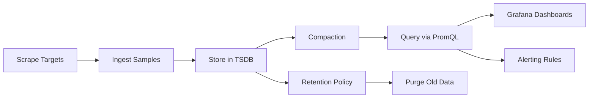
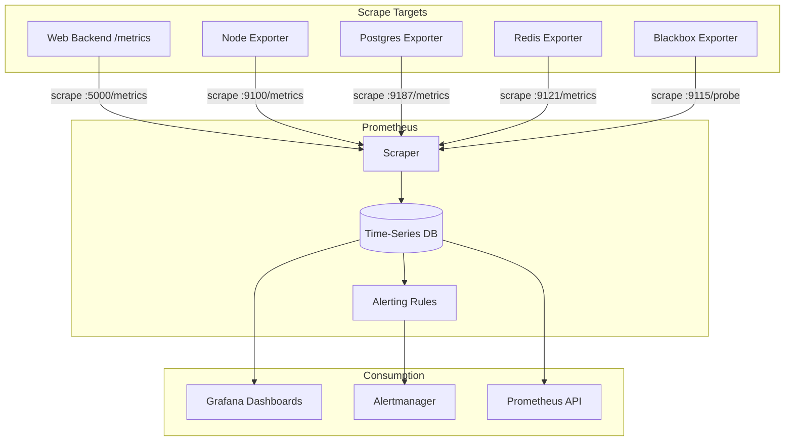
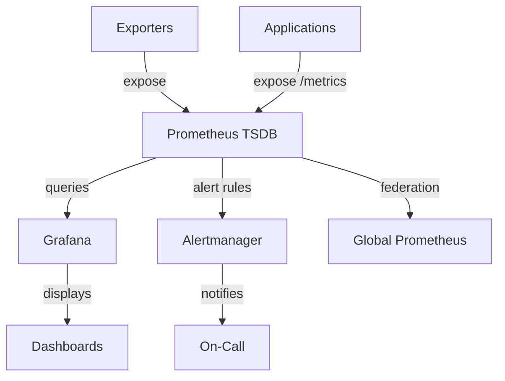

# Metrics System - Comprehensive Relationship Map

## Executive Summary

The Metrics System provides time-series data collection, storage, and querying using Prometheus. It tracks resource utilization, request rates, latencies, and business metrics across all Project-AI infrastructure and applications, enabling real-time dashboards and alerting.

---

## 1. WHAT: Component Functionality & Boundaries

### Core Responsibilities

1. **Time-Series Data Collection**
   - Scrapes metrics from HTTP `/metrics` endpoints every 15 seconds
   - Supports push-based metrics via Pushgateway (for short-lived jobs)
   - Service discovery (static configs, file-based, Kubernetes)
   - Label-based multi-dimensional data model

2. **Metric Types**
   ```python
   from prometheus_client import Counter, Gauge, Histogram, Summary
   
   # Counter: Monotonically increasing (requests, errors)
   request_count = Counter('http_requests_total', 'Total requests', ['method', 'endpoint', 'status'])
   request_count.labels(method='GET', endpoint='/api/users', status='200').inc()
   
   # Gauge: Value that can go up/down (CPU, memory, queue depth)
   memory_usage = Gauge('memory_bytes', 'Memory usage in bytes', ['process'])
   memory_usage.labels(process='app').set(1024 * 1024 * 500)  # 500 MB
   
   # Histogram: Observations in buckets (latency, request size)
   request_latency = Histogram('http_request_duration_seconds', 'Request latency', ['endpoint'])
   with request_latency.labels(endpoint='/api/users').time():
       handle_request()
   
   # Summary: Similar to histogram, calculates quantiles (p50, p95, p99)
   response_size = Summary('http_response_size_bytes', 'Response size')
   response_size.observe(len(response_data))
   ```

3. **Storage & Retention**
   - **TSDB** (Time-Series Database): Optimized columnar storage
   - **Retention**: 90 days at 15s resolution, 1 year at 1h aggregates
   - **Compression**: ~1.3 bytes per sample (highly efficient)
   - **Capacity**: 10M active time-series, 50K samples/second

4. **Query Language (PromQL)**
   ```promql
   # Request rate (requests/second)
   rate(http_requests_total[5m])
   
   # Error rate (errors/second)
   rate(http_requests_total{status=~"5.."}[5m])
   
   # p95 latency
   histogram_quantile(0.95, rate(http_request_duration_seconds_bucket[5m]))
   
   # CPU usage by service
   avg by (service) (rate(process_cpu_seconds_total[5m]))
   ```

### Boundaries & Limitations

- **Does NOT**: Provide log storage (use Elasticsearch for logs)
- **Does NOT**: Handle distributed tracing (use Jaeger for traces)
- **Does NOT**: Execute remediation actions (use Alertmanager + automation)
- **Cardinality Limit**: High-cardinality labels (e.g., user_id) cause performance issues
- **Query Performance**: Complex queries over long time ranges (> 7 days) may timeout

### Data Structures

**Metric Sample**:
```
metric_name{label1="value1", label2="value2"} value timestamp
http_requests_total{method="GET", endpoint="/api/users", status="200"} 1234 1619712000000
```

**Label Constraints**:
- Label names: `[a-zA-Z_][a-zA-Z0-9_]*`
- Label values: Any UTF-8 string
- Reserved labels: `__name__` (metric name), `job`, `instance`

---

## 2. WHO: Stakeholders & Decision-Makers

### Primary Stakeholders

| Stakeholder | Role | Authority Level | Decision Power |
|------------|------|----------------|----------------|
| **SRE Team** | Metrics architecture, alerting | CRITICAL | Defines metrics, retention, thresholds |
| **Platform Team** | Infrastructure metrics | HIGH | Owns exporters, service discovery |
| **Developers** | Application metrics | MEDIUM | Instruments code, defines business metrics |
| **Engineering Manager** | Resource planning | OVERSIGHT | Approves capacity, cost changes |
| **Finance** | Cost optimization | ADVISORY | Reviews storage costs |

### User Classes

1. **Metric Producers**
   - Application developers: Instrument code with Prometheus client libraries
   - Infrastructure: Node exporters, database exporters (postgres, redis)
   - Third-party: Blackbox exporter (synthetic monitoring), cAdvisor (containers)

2. **Metric Consumers**
   - **SREs**: Dashboards, on-call investigations
   - **Developers**: Performance analysis, capacity planning
   - **Product Managers**: Business metrics (MAU, conversion rates)
   - **Executives**: High-level KPIs (uptime, revenue)

3. **Metric Administrators**
   - **SRE Lead**: Manages Prometheus configuration, retention policies
   - **Platform Team**: Deploys exporters, configures service discovery
   - **Security Team**: Audits metrics for sensitive data exposure

---

## 3. WHEN: Lifecycle & Review Cycle

### Metrics Pipeline Timeline



### Review Schedule

- **Real-Time**: Grafana dashboards auto-refresh every 5-15 seconds
- **Hourly**: SRE monitors for metric scrape failures
- **Daily**: Review alert false positive rate
- **Weekly**: Capacity planning (storage growth, query load)
- **Monthly**: Cardinality audit (identify high-cardinality metrics)
- **Quarterly**: Retention policy review, cost optimization

### Scrape Lifecycle

1. **Service Discovery** (Every 30s): Prometheus discovers targets via static config, file SD, or Kubernetes API
2. **Scrape** (Every 15s): HTTP GET to `/metrics` endpoint
3. **Relabeling** (Pre-Scrape): Drop unwanted metrics, normalize labels
4. **Ingestion**: Samples written to WAL (Write-Ahead Log), then TSDB
5. **Compaction** (Every 2h): Merge small blocks into larger blocks
6. **Retention Enforcement** (Daily): Delete data older than 90 days
7. **Query**: PromQL queries read from TSDB, apply aggregations

---

## 4. WHERE: File Paths & Integration Points

### Source Code Locations

**Prometheus Configuration**:
```
monitoring/
├── prometheus.yml              # Main config (scrape targets, rules)
├── rules/
│   ├── alerts.yml             # Alert rules
│   └── recording.yml          # Recording rules (pre-aggregated metrics)
└── targets/
    ├── static.yml             # Static scrape targets
    └── file_sd/               # File-based service discovery
        └── services.json
```

**Instrumentation (Application Code)**:
```
web/backend/
├── app.py:35                   # Prometheus Flask exporter setup
├── api/routes.py:20           # @metrics decorator for endpoints
└── metrics.py                 # Custom business metrics

src/app/
├── main.py                    # (Future) Desktop app metrics export
└── core/
    └── (metrics instrumentation planned)
```

**Exporters (Infrastructure)**:
```
monitoring/exporters/
├── node_exporter              # System metrics (CPU, disk, network)
├── postgres_exporter          # PostgreSQL metrics
└── redis_exporter             # Redis metrics
```

### Integration Architecture



### Data Flow

1. **Instrumentation**: Application code increments counters, sets gauges
2. **Exposition**: Prometheus client library exposes `/metrics` HTTP endpoint
3. **Scrape**: Prometheus server fetches metrics every 15s
4. **Ingestion**: Samples appended to TSDB with timestamp and labels
5. **Evaluation**: Alert rules evaluate every 1 minute
6. **Query**: Grafana queries TSDB for dashboard panels
7. **Alert**: Alertmanager receives fired alerts, routes to PagerDuty/Slack

---

## 5. WHY: Problem Solved & Design Rationale

### Problem Statement

**Requirements**:
- **R1**: Real-time visibility into system health (CPU, memory, disk, network)
- **R2**: Application performance monitoring (request rate, latency, errors)
- **R3**: Alerting on anomalies (SLO violations, resource exhaustion)
- **R4**: Historical data for capacity planning and trend analysis
- **R5**: Low overhead (< 1% CPU, < 100 MB memory per service)

**Pain Points Without Metrics**:
- No early warning of performance degradation
- Reactive incident response (no proactive capacity planning)
- Difficult to correlate infrastructure issues with application behavior

### Design Rationale

**Why Prometheus?**
- ✅ Pull-based model: Scrape targets (simpler than push for many services)
- ✅ Multi-dimensional data: Labels enable powerful queries
- ✅ Efficient storage: 1.3 bytes/sample, handles millions of time-series
- ✅ Built-in alerting: No separate alert engine needed
- ✅ PromQL: Expressive query language for aggregations
- ✅ Ecosystem: 100+ exporters, Grafana integration, Kubernetes native

**Why 15s Scrape Interval?**
- ✅ Balance between granularity and overhead
- ✅ Catches transient spikes (< 1 minute duration)
- ❌ Cons: 4× storage vs. 1 minute interval
- 🔧 Mitigation: Use recording rules to pre-aggregate

**Why 90-Day Retention?**
- ✅ Sufficient for seasonal trends (quarterly comparisons)
- ✅ Cost-effective (< $2K/month storage)
- ❌ Cons: Cannot analyze long-term trends (> 3 months)
- 🔧 Mitigation: Archive to S3 for 1-year retention

### Architectural Tradeoffs

| Decision | Pros | Cons | Mitigation |
|----------|------|------|------------|
| Pull-based scraping | No agent installation, self-healing | Targets must expose HTTP endpoint | Use Pushgateway for short-lived jobs |
| Label-based model | Flexible querying, no schema | Cardinality explosion risk | Enforce label naming conventions |
| In-memory TSDB | Fast queries | Limited by RAM | Horizontal scaling (federation) |
| PromQL | Powerful aggregations | Steep learning curve | Provide query templates, training |

---

## 6. Dependency Graph

### Upstream Dependencies

**Consumed By**:
- **Alerting System**: Reads metrics to evaluate alert rules
- **Grafana Dashboards**: Queries metrics for visualization
- **Capacity Planning**: Analyzes growth trends
- **Cost Attribution**: Tracks resource usage by team/service

### Downstream Dependencies

**Depends On**:
- **Exporters**: Node, PostgreSQL, Redis exporters
- **Application Instrumentation**: Prometheus client libraries
- **Service Discovery**: Kubernetes API, file-based SD
- **Storage**: Disk for TSDB (SSD recommended)

### Peer Integrations

- **Logging**: Metrics trigger log queries (correlate high error rate with logs)
- **Tracing**: Trace latency histograms become metrics
- **Telemetry**: OpenTelemetry Collector exports metrics to Prometheus



---

## 7. Risk Assessment

| Risk | Likelihood | Impact | Severity | Mitigation |
|------|-----------|--------|----------|------------|
| Cardinality explosion (OOM) | MEDIUM | CRITICAL | 🟠 HIGH | Label validation, cardinality dashboards |
| Scrape target down (data loss) | LOW | MEDIUM | 🟡 MEDIUM | Alerting on scrape failures |
| TSDB corruption | LOW | HIGH | 🟡 MEDIUM | Regular backups, WAL for recovery |
| Query timeout (heavy queries) | MEDIUM | MEDIUM | 🟡 MEDIUM | Query timeout limits, recording rules |
| Retention too short (lost data) | LOW | MEDIUM | 🟢 LOW | Archive to S3 for long-term storage |

### Cardinality Management

**High-Cardinality Labels to Avoid**:
- ❌ `user_id` (millions of unique values)
- ❌ `request_id` (unbounded)
- ❌ `timestamp` (defeats time-series aggregation)
- ✅ Use: `endpoint`, `status`, `method`, `service` (bounded)

**Cardinality Monitoring**:
```promql
# Top 10 metrics by cardinality
topk(10, count by (__name__) ({__name__=~".+"}))

# Alert on high cardinality
count by (__name__) ({__name__=~".+"}) > 10000
```

---

## 8. Integration Checklist

### For New Services (Adding Metrics)

**Step 1: Install Prometheus Client**
```bash
# Python
pip install prometheus-client

# Go
go get github.com/prometheus/client_golang/prometheus
```

**Step 2: Instrument Code**
```python
from prometheus_client import Counter, Histogram, start_http_server

request_count = Counter('http_requests_total', 'Total requests', ['method', 'endpoint'])
request_latency = Histogram('http_request_duration_seconds', 'Request latency', ['endpoint'])

@app.route('/api/users')
@request_latency.labels(endpoint='/api/users').time()
def get_users():
    request_count.labels(method='GET', endpoint='/api/users').inc()
    return users

# Start metrics server on port 8000
start_http_server(8000)
```

**Step 3: Configure Prometheus Scrape**
```yaml
# monitoring/prometheus.yml
scrape_configs:
  - job_name: 'my-service'
    static_configs:
      - targets: ['localhost:8000']
        labels:
          service: 'my-service'
          environment: 'production'
```

**Step 4: Create Grafana Dashboard**
- Add Prometheus datasource
- Create panels with PromQL queries
- Set auto-refresh interval (5-15s)

**Step 5: Configure Alerts**
```yaml
# monitoring/rules/alerts.yml
groups:
  - name: my-service
    rules:
      - alert: HighErrorRate
        expr: rate(http_requests_total{status=~"5..", service="my-service"}[5m]) > 0.05
        for: 5m
        labels:
          severity: critical
        annotations:
          summary: "High error rate for my-service"
```

---

## 9. Future Roadmap

### Planned (6 Months)

- [ ] **Thanos Integration**: Long-term storage (S3), global query view
- [ ] **Recording Rules**: Pre-aggregate expensive queries
- [ ] **Desktop App Metrics**: Instrument Python desktop app
- [ ] **Business Metrics**: Revenue, conversions, MAU
- [ ] **Exemplars**: Link metrics to traces (click metric spike → see trace)

### Considered (12 Months)

- [ ] **M3DB**: Replace Prometheus TSDB with M3 for better scaling
- [ ] **VictoriaMetrics**: Alternative TSDB with lower resource usage
- [ ] **Cortex**: Multi-tenant Prometheus for SaaS use case
- [ ] **Adaptive Scraping**: Adjust scrape interval based on metric volatility

---

## 10. API Reference Card

### Common PromQL Queries

**Request Rate**:
```promql
# Requests per second
rate(http_requests_total[5m])

# By endpoint
sum by (endpoint) (rate(http_requests_total[5m]))
```

**Error Rate**:
```promql
# Error rate percentage
sum(rate(http_requests_total{status=~"5.."}[5m])) / sum(rate(http_requests_total[5m])) * 100
```

**Latency**:
```promql
# p95 latency
histogram_quantile(0.95, rate(http_request_duration_seconds_bucket[5m]))

# p50, p95, p99
histogram_quantile(0.50, rate(http_request_duration_seconds_bucket[5m]))
histogram_quantile(0.95, rate(http_request_duration_seconds_bucket[5m]))
histogram_quantile(0.99, rate(http_request_duration_seconds_bucket[5m]))
```

**Resource Usage**:
```promql
# CPU usage
rate(process_cpu_seconds_total[5m])

# Memory usage
process_resident_memory_bytes / 1024 / 1024  # MB
```

**Availability**:
```promql
# Uptime (1 = up, 0 = down)
up{job="my-service"}

# Availability percentage (last 24h)
avg_over_time(up{job="my-service"}[24h]) * 100
```

---

## Related Systems

- **Security**: [[../security/07_security_metrics.md|Security Metrics]] - Security event metrics and threat detection thresholds
- **Data**: [[../data/01-PERSISTENCE-PATTERNS.md|Persistence Patterns]] - Database performance metrics and query monitoring
- **Configuration**: [[../configuration/02_environment_manager_relationships.md|Environment Manager]] - Environment-specific metric collection and thresholds

**Cross-References**:
- Encryption performance tracking → [[../data/02-ENCRYPTION-CHAINS.md|Encryption Chains]]
- Backup monitoring metrics → [[../data/04-BACKUP-RECOVERY.md|Backup & Recovery]]
- Feature flag usage metrics → [[../configuration/04_feature_flags_relationships.md|Feature Flags]]

---

**Status**: ✅ PRODUCTION  
**Last Updated**: 2026-04-20 by AGENT-066  
**Next Review**: 2026-07-20
