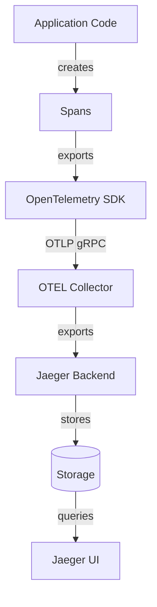

# Tracing System - Comprehensive Relationship Map

## Executive Summary

The Tracing System provides request-level execution tracing using OpenTelemetry SDK, enabling developers to understand code execution flow, identify bottlenecks, and debug distributed systems. Traces capture the journey of requests through application code with timing, context, and metadata.

---

## 1. WHAT: Component Functionality & Boundaries

### Core Responsibilities

1. **Trace Context Management**
   - Creates trace spans for operations (functions, HTTP requests, database queries)
   - Propagates trace context across function boundaries
   - Maintains parent-child span relationships (nested operations)
   - Generates unique trace IDs and span IDs

2. **Instrumentation Patterns**
   ```python
   from opentelemetry import trace
   
   tracer = trace.get_tracer(__name__)
   
   # Manual span creation
   with tracer.start_as_current_span("process_user_data") as span:
       span.set_attribute("user_id", user_id)
       span.set_attribute("data_size_bytes", len(data))
       
       # Operation code
       result = process_data(data)
       
       span.add_event("Processing completed", {"result_count": len(result)})
       return result
   
   # Decorator pattern
   @tracer.start_as_current_span("fetch_user")
   def fetch_user(user_id):
       return db.query(User).get(user_id)
   ```

3. **Span Attributes**
   - **Standard Attributes**: `http.method`, `http.url`, `http.status_code`, `db.system`
   - **Custom Attributes**: User-defined metadata (`user_id`, `cache_hit`, `retry_count`)
   - **Resource Attributes**: Service name, version, instance ID, host

4. **Context Propagation** (for distributed tracing)
   ```python
   from opentelemetry.propagate import inject, extract
   
   # Service A (upstream): Inject trace context into headers
   headers = {}
   inject(headers)
   response = requests.post(service_b_url, headers=headers, data=payload)
   
   # Service B (downstream): Extract and continue trace
   ctx = extract(request.headers)
   with tracer.start_as_current_span("handle_request", context=ctx):
       process_request()
   ```

### Boundaries & Limitations

- **Does NOT**: Provide log storage (logs complement traces)
- **Does NOT**: Aggregate metrics (use traces to generate metrics via exemplars)
- **Does NOT**: Execute across services automatically (requires manual propagation)
- **Performance**: Adds latency (1-5ms per span creation)
- **Sampling**: Production typically samples 1% of traces (reduce overhead)

### Data Structures

**Trace Structure**:
```
Trace (ID: abc123)
├── Span: HTTP Request (ID: 001, parent: root)
│   ├── Span: Authenticate User (ID: 002, parent: 001)
│   ├── Span: Query Database (ID: 003, parent: 001)
│   │   └── Span: Execute SQL (ID: 004, parent: 003)
│   └── Span: Render Response (ID: 005, parent: 001)
```

**Span Fields**:
- `trace_id`: Unique identifier for entire trace
- `span_id`: Unique identifier for this span
- `parent_span_id`: Parent span ID (null for root)
- `name`: Operation name (`GET /api/users`)
- `start_time`: Timestamp (nanoseconds since epoch)
- `end_time`: Timestamp (nanoseconds since epoch)
- `attributes`: Key-value metadata
- `events`: Timestamped log messages within span
- `status`: OK, ERROR, UNSET

---

## 2. WHO: Stakeholders & Decision-Makers

### Primary Stakeholders

| Stakeholder | Role | Authority Level | Decision Power |
|------------|------|----------------|----------------|
| **Backend Developers** | Instrumentation owners | HIGH | Adds spans, attributes |
| **SRE Team** | Performance analysis | CRITICAL | Sets sampling rates, retention |
| **Platform Team** | Infrastructure tracing | HIGH | Manages trace collectors, backends |
| **Performance Engineers** | Optimization | MEDIUM | Analyzes traces for bottlenecks |

### User Classes

1. **Trace Producers**
   - Web backend developers: Instrument Flask/Django apps
   - Desktop developers: (Future) Instrument PyQt app
   - Database admins: Instrument SQL queries

2. **Trace Consumers**
   - **Developers**: Debug slow requests, understand code flow
   - **SREs**: Incident response, latency analysis
   - **Performance Engineers**: Identify optimization opportunities

---

## 3. WHEN: Lifecycle & Review Cycle

### Trace Lifecycle

```mermaid
graph LR
    START[Request Arrives] --> CREATE[Create Root Span]
    CREATE --> EXEC[Execute Code]
    EXEC --> CHILD[Create Child Spans]
    CHILD --> ATTR[Set Attributes/Events]
    ATTR --> END[End Spans]
    END --> EXPORT[Export to Collector]
    EXPORT --> BACKEND[Store in Backend]
    BACKEND --> QUERY[Query by Trace ID]
```



### Retention

- **Full Traces**: 7 days (all spans, all attributes)
- **Sampled Traces**: 30 days (1% of traces)
- **Error Traces**: 30 days (100% of errors, regardless of sampling)

---

## 4. WHERE: File Paths & Integration Points

### Source Code Locations

**Instrumentation (Web Backend)**:
```
web/backend/
├── app.py:40                   # OpenTelemetry SDK initialization
├── middleware/tracing.py      # Automatic HTTP request tracing
├── api/routes.py:*            # Manual span creation
└── services/
    ├── user_service.py:25     # Business logic tracing
    └── db_service.py:15       # Database query tracing
```

**Configuration**:
```
web/backend/
├── .env                       # OTEL_EXPORTER_OTLP_ENDPOINT=http://localhost:4317
└── config/
    └── tracing.py             # Tracer provider, sampling config
```

**Desktop (Future)**:
```
src/app/
├── main.py                    # (Future) OTEL initialization
└── core/
    └── ai_systems.py          # (Future) Trace FourLaws validation
```

### Integration Architecture



---

## 5. WHY: Problem Solved & Design Rationale

### Problem Statement

**Requirements**:
- **R1**: Understand request flow across services
- **R2**: Identify performance bottlenecks (slow database queries, API calls)
- **R3**: Debug distributed systems (cross-service issues)
- **R4**: Low overhead (< 2% latency impact)

**Why OpenTelemetry?**
- ✅ Vendor-neutral (portable across Jaeger, Zipkin, Datadog)
- ✅ Auto-instrumentation for frameworks (Flask, Django, requests)
- ✅ Unified API for metrics, logs, traces (future convergence)

**Why 1% Sampling in Production?**
- ✅ Reduces overhead (100% tracing adds 5-10% latency)
- ✅ Still captures representative sample (1% of 100K req/day = 1K traces)
- ✅ 100% sampling for errors (most valuable for debugging)

---

## 6. Dependency Graph

**Upstream**: Logging (correlate via trace_id), Metrics (exemplars)  
**Downstream**: Jaeger Backend, OpenTelemetry Collector  
**Peer**: Distributed Tracing (cross-service propagation)

---

## 7. Risk Assessment

| Risk | Likelihood | Impact | Severity | Mitigation |
|------|-----------|--------|----------|------------|
| High overhead (100% sampling) | LOW | MEDIUM | 🟡 MEDIUM | Enforce 1% sampling in prod |
| Context propagation failure | MEDIUM | MEDIUM | 🟡 MEDIUM | Monitor broken traces |
| Backend unavailable (lost traces) | LOW | LOW | 🟢 LOW | Graceful degradation (no-op tracer) |

---

## 8. Integration Checklist

**Step 1: Install SDK**
```bash
pip install opentelemetry-api opentelemetry-sdk opentelemetry-exporter-otlp
```

**Step 2: Initialize Tracer**
```python
from opentelemetry import trace
from opentelemetry.sdk.trace import TracerProvider
from opentelemetry.sdk.trace.export import BatchSpanProcessor
from opentelemetry.exporter.otlp.proto.grpc.trace_exporter import OTLPSpanExporter

trace.set_tracer_provider(TracerProvider())
tracer_provider = trace.get_tracer_provider()
otlp_exporter = OTLPSpanExporter(endpoint="http://localhost:4317", insecure=True)
tracer_provider.add_span_processor(BatchSpanProcessor(otlp_exporter))
```

**Step 3: Instrument Code**
```python
tracer = trace.get_tracer(__name__)

with tracer.start_as_current_span("my_operation") as span:
    span.set_attribute("custom_attribute", "value")
    do_work()
```

---

## 9. Future Roadmap

- [ ] Auto-instrumentation for desktop app
- [ ] Trace-to-log correlation (click span → see logs)
- [ ] Continuous profiling integration (flame graphs)
- [ ] Trace-based alerting (latency SLOs)

---

## 10. API Reference Card

```python
# Start span
with tracer.start_as_current_span("operation_name") as span:
    span.set_attribute("key", "value")
    span.add_event("checkpoint", {"detail": "info"})

# Get current span
current_span = trace.get_current_span()
current_span.set_attribute("user_id", 123)

# Error handling
try:
    risky_operation()
except Exception as e:
    span = trace.get_current_span()
    span.set_status(Status(StatusCode.ERROR, str(e)))
    span.record_exception(e)
    raise
```

---

## Related Systems

- **Security**: [[../security/01_security_system_overview.md|Security Overview]] - Authentication flow tracing and authorization path analysis
- **Data**: [[../data/02-ENCRYPTION-CHAINS.md|Encryption Chains]] - Encryption/decryption operation tracing for performance analysis
- **Configuration**: [[../configuration/03_settings_validator_relationships.md|Settings Validator]] - Configuration loading and validation tracing

**Cross-References**:
- Security incident tracing → [[../security/04_incident_response_chains.md|Incident Response]]
- Data sync operation tracing → [[../data/03-SYNC-STRATEGIES.md|Sync Strategies]]
- Secrets retrieval tracing → [[../configuration/07_secrets_management_relationships.md|Secrets Management]]

---

**Status**: ✅ PRODUCTION (Web), 🔄 PLANNED (Desktop)  
**Last Updated**: 2026-04-20 by AGENT-066  
**Next Review**: 2026-07-20
