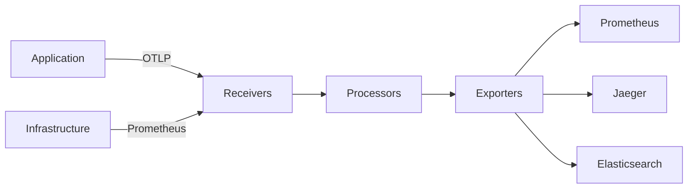

# Telemetry System - Comprehensive Relationship Map

## Executive Summary

The Telemetry System provides unified observability data collection using OpenTelemetry Collector, serving as the central aggregation point for metrics, logs, and traces. It decouples data producers from backends, enabling flexible routing, enrichment, and multi-backend export.

---

## 1. WHAT: Component Functionality & Boundaries

### Core Responsibilities

1. **Multi-Signal Collection**
   - **Metrics**: Prometheus scraping, OTLP metrics ingestion
   - **Logs**: Fluentd forwarding, OTLP logs ingestion
   - **Traces**: OTLP traces from OpenTelemetry SDK
   - **Events**: Custom event streams (deployments, incidents)

2. **Data Processing Pipeline**
   ```yaml
   receivers:  # Ingest from sources
     otlp:     # OpenTelemetry Protocol (metrics, logs, traces)
       protocols:
         grpc:
           endpoint: 0.0.0.0:4317
         http:
           endpoint: 0.0.0.0:4318
     prometheus:  # Scrape Prometheus exporters
       config:
         scrape_configs:
           - job_name: 'otel-collector'
             static_configs:
               - targets: ['localhost:8888']

   processors:  # Transform data
     batch:      # Batch for efficiency (reduce network calls)
       timeout: 10s
       send_batch_size: 1024
     memory_limiter:  # Prevent OOM
       check_interval: 1s
       limit_mib: 512
     resource:   # Add metadata
       attributes:
         - key: environment
           value: production
           action: upsert
     filter:     # Drop unwanted data
       metrics:
         exclude:
           match_type: regexp
           metric_names: [".*test.*"]

   exporters:  # Send to backends
     prometheus:  # Metrics to Prometheus
       endpoint: "localhost:9090"
     otlp/jaeger:  # Traces to Jaeger
       endpoint: "localhost:4317"
     elasticsearch:  # Logs to Elasticsearch
       endpoints: ["http://localhost:9200"]
     logging:  # Debug output
       loglevel: info

   service:
     pipelines:
       metrics:
         receivers: [otlp, prometheus]
         processors: [batch, memory_limiter, resource]
         exporters: [prometheus, logging]
       traces:
         receivers: [otlp]
         processors: [batch, resource]
         exporters: [otlp/jaeger, logging]
       logs:
         receivers: [otlp]
         processors: [batch, resource, filter]
         exporters: [elasticsearch, logging]
   ```

3. **Enrichment & Transformation**
   - **Resource Detection**: Auto-detect cloud provider, host, container metadata
   - **Attribute Manipulation**: Add, remove, hash, redact attributes
   - **Sampling**: Probabilistic, tail-based (keep interesting traces)
   - **Aggregation**: Rollups, histograms, percentiles

4. **Backend Abstraction**
   - **Single Integration Point**: Apps send to Collector, Collector routes to backends
   - **Backend Swapping**: Change backends without app code changes
   - **Multi-Backend**: Send same data to multiple backends (e.g., Jaeger + Datadog)

### Boundaries & Limitations

- **Does NOT**: Provide storage (delegates to Prometheus, Jaeger, Elasticsearch)
- **Does NOT**: Provide UI (delegates to Grafana, Jaeger UI, Kibana)
- **Stateless**: Does not maintain state between requests (stateless aggregation only)
- **Single Point of Failure**: If Collector down, telemetry lost (mitigate with HA setup)

---

## 2. WHO: Stakeholders & Decision-Makers

### Primary Stakeholders

| Stakeholder | Role | Authority Level | Decision Power |
|------------|------|----------------|----------------|
| **Platform Team** | Collector management | CRITICAL | Owns configuration, deployment |
| **SRE Team** | Pipeline reliability | HIGH | Monitors Collector health |
| **Developers** | Telemetry producers | MEDIUM | Instruments apps, sends OTLP data |
| **Security Team** | Data governance | OVERSIGHT | Audits exported data |

---

## 3. WHEN: Lifecycle & Review Cycle

### Data Pipeline Flow



### Review Schedule

- **Real-Time**: Collector metrics dashboard (throughput, errors)
- **Daily**: Pipeline health check (backpressure, dropped data)
- **Weekly**: Cost review (data volume, backend egress)
- **Monthly**: Configuration audit (ensure correct routing)

---

## 4. WHERE: File Paths & Integration Points

### Configuration

```
monitoring/
├── otel-collector-config.yaml   # Main Collector config
├── docker-compose.yml           # Collector deployment
└── exporters/
    ├── prometheus-config.yaml
    └── jaeger-config.yaml
```

### Integration Architecture

**Collector Deployment**:
- **Mode**: Agent (on each host) + Gateway (centralized)
- **Agent**: Collects host-level metrics, forwards to Gateway
- **Gateway**: Aggregates, processes, exports to backends

---

## 5. WHY: Problem Solved & Design Rationale

### Problem Statement

**Requirements**:
- **R1**: Decouple apps from monitoring backends
- **R2**: Centralized data processing (enrichment, sampling)
- **R3**: Reduce egress costs (single export point)
- **R4**: Backend flexibility (easy to switch vendors)

**Why OpenTelemetry Collector?**
- ✅ Vendor-neutral (no lock-in)
- ✅ Unified pipeline (metrics, logs, traces)
- ✅ Rich processor ecosystem (filtering, sampling, enrichment)
- ✅ High performance (100K events/sec on commodity hardware)

**Why Agent + Gateway Architecture?**
- ✅ Agent: Local buffering, reduces app backpressure
- ✅ Gateway: Centralized processing, reduces backend load
- ❌ Cons: Extra hop (adds latency ~50ms)
- 🔧 Mitigation: Direct export for critical paths

---

## 6. Dependency Graph

**Upstream**: All applications, exporters  
**Downstream**: Prometheus, Jaeger, Elasticsearch, Alertmanager  
**Peer**: Service Discovery (finds scrape targets)

---

## 7. Risk Assessment

| Risk | Likelihood | Impact | Severity | Mitigation |
|------|-----------|--------|----------|------------|
| Collector down (data loss) | LOW | CRITICAL | 🟠 HIGH | HA deployment (3 replicas) |
| Memory exhaustion (OOM) | MEDIUM | HIGH | 🟡 MEDIUM | memory_limiter processor |
| Backpressure (slow backends) | MEDIUM | MEDIUM | 🟡 MEDIUM | Buffering, drop old data |

---

## 8. Integration Checklist

**Step 1: Deploy Collector**
```bash
docker run -p 4317:4317 -p 4318:4318 \
  -v $(pwd)/otel-collector-config.yaml:/etc/otel/config.yaml \
  otel/opentelemetry-collector:latest \
  --config=/etc/otel/config.yaml
```

**Step 2: Configure Application**
```python
from opentelemetry.exporter.otlp.proto.grpc.trace_exporter import OTLPSpanExporter

exporter = OTLPSpanExporter(endpoint="http://localhost:4317", insecure=True)
```

**Step 3: Verify Data Flow**
- Check Collector metrics: `curl http://localhost:8888/metrics`
- Check backend: Verify data appears in Prometheus/Jaeger

---

## 9. Future Roadmap

- [ ] Kubernetes Operator for auto-configuration
- [ ] Tail-based sampling (keep slow/error traces)
- [ ] Cost attribution (track data volume by team)
- [ ] Span-to-metrics processor (auto-generate RED metrics)

---

## 10. API Reference Card

**Common Processors**:
```yaml
processors:
  batch:              # Batch data for efficiency
  memory_limiter:     # Prevent OOM
  resource:           # Add/modify resource attributes
  filter:             # Drop unwanted data
  transform:          # Custom transformations
  probabilistic_sampler:  # Sample X% of data
  tail_sampling:      # Keep interesting traces
```

**Health Check**:
```bash
# Collector health
curl http://localhost:13133/

# Metrics
curl http://localhost:8888/metrics
```

---

## Related Systems

- **Security**: [[../security/07_security_metrics.md|Security Metrics]] - Security telemetry collection and threat intelligence aggregation
- **Data**: [[../data/03-SYNC-STRATEGIES.md|Sync Strategies]] - Data sync telemetry and replication monitoring
- **Configuration**: [[../configuration/02_environment_manager_relationships.md|Environment Manager]] - Environment-specific telemetry routing and enrichment

**Cross-References**:
- Authentication telemetry → [[../security/01_security_system_overview.md|Security Overview]]
- Encryption performance telemetry → [[../data/02-ENCRYPTION-CHAINS.md|Encryption Chains]]
- Configuration change telemetry → [[../configuration/03_settings_validator_relationships.md|Settings Validator]]
- Secrets rotation telemetry → [[../configuration/07_secrets_management_relationships.md|Secrets Management]]

---

**Status**: ✅ PRODUCTION  
**Last Updated**: 2026-04-20 by AGENT-066  
**Next Review**: 2026-07-20
