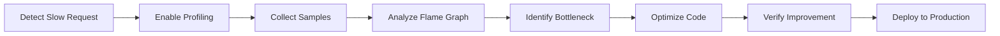
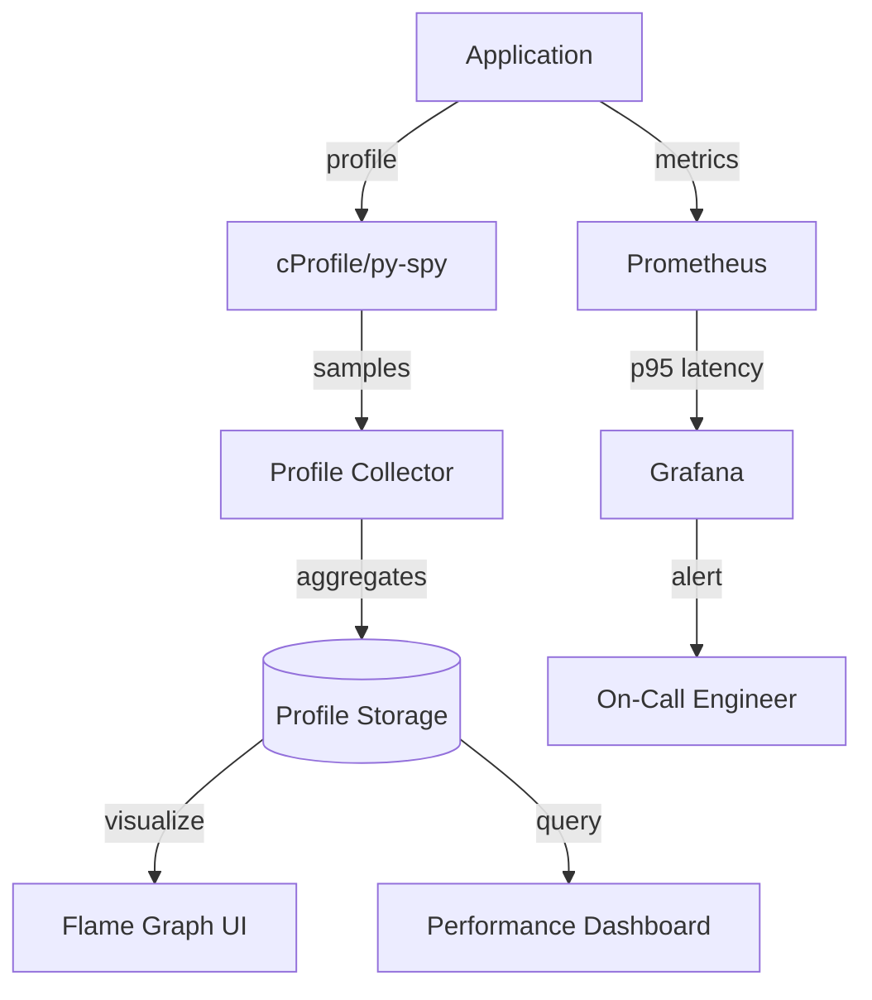

# Performance Monitoring - Comprehensive Relationship Map

## Executive Summary

Performance Monitoring provides application and system performance analysis through profiling, APM (Application Performance Monitoring), and resource tracking. It identifies bottlenecks, memory leaks, and optimization opportunities using flame graphs, CPU/memory profiling, and latency tracking.

---

## 1. WHAT: Component Functionality & Boundaries

### Core Responsibilities

1. **CPU Profiling**
   ```python
   import cProfile
   import pstats
   
   # Profile a function
   profiler = cProfile.Profile()
   profiler.enable()
   
   expensive_function()
   
   profiler.disable()
   stats = pstats.Stats(profiler)
   stats.sort_stats('cumulative')
   stats.print_stats(20)  # Top 20 functions by cumulative time
   ```

2. **Memory Profiling**
   ```python
   from memory_profiler import profile
   
   @profile
   def memory_intensive_function():
       large_list = [0] * (10 ** 6)
       return sum(large_list)
   
   # Output:
   # Line    Mem usage    Increment   Line Contents
   # 3       50.0 MiB     50.0 MiB    large_list = [0] * (10 ** 6)
   # 4       58.2 MiB      8.2 MiB    return sum(large_list)
   ```

3. **Flame Graph Generation**
   - Visualize CPU time distribution across call stacks
   - Tools: `py-spy` (sampling profiler), `austin` (C extensions)
   - Use case: Identify hot paths in production

4. **Latency Tracking**
   - p50, p95, p99 latency for endpoints
   - Slow query detection (database, API calls)
   - Request waterfall analysis (breakdown by component)

5. **Resource Attribution**
   - CPU/memory usage by user, tenant, or request
   - Cost allocation for multi-tenant systems

### Boundaries & Limitations

- **Does NOT**: Provide real-time alerting (use Alerting system)
- **Does NOT**: Store long-term metrics (use Metrics system)
- **Overhead**: Continuous profiling adds 1-3% CPU overhead
- **Sampling**: Production profiling typically samples (not every request)

### Data Structures

**Profile Sample**:
```python
{
    "function": "process_user_data",
    "filename": "user_service.py",
    "lineno": 45,
    "cpu_time_ms": 250,
    "wall_time_ms": 300,
    "memory_allocated_mb": 15,
    "call_count": 100
}
```

**Flame Graph Node**:
```
Function Name (CPU time: 150ms, 30% of total)
├── Child Function A (50ms, 10%)
├── Child Function B (80ms, 16%)
└── Child Function C (20ms, 4%)
```

---

## 2. WHO: Stakeholders & Decision-Makers

### Primary Stakeholders

| Stakeholder | Role | Authority Level | Decision Power |
|------------|------|----------------|----------------|
| **Performance Engineers** | Optimization | CRITICAL | Identifies bottlenecks, proposes fixes |
| **Developers** | Code owners | HIGH | Implements optimizations |
| **SRE Team** | Production monitoring | HIGH | Enables/disables profiling |
| **Capacity Planning** | Resource forecasting | MEDIUM | Uses perf data for sizing |

### User Classes

1. **Performance Analyzers**
   - Performance engineers: Full-time optimization work
   - Developers: Ad-hoc profiling during development
   - SREs: Production incident response (slow requests)

2. **Data Consumers**
   - Management: Performance KPIs (p95 latency, throughput)
   - Product: User experience metrics (page load time)

---

## 3. WHEN: Lifecycle & Review Cycle

### Profiling Workflow



### Review Schedule

- **Continuous**: p95 latency monitoring (real-time dashboards)
- **Daily**: Review slowest endpoints (top 10)
- **Weekly**: Performance regression tests (CI/CD)
- **Monthly**: Full performance audit (comprehensive profiling)
- **Quarterly**: Capacity planning review

---

## 4. WHERE: File Paths & Integration Points

### Source Code Locations

**Profiling Tools**:
```
tools/
├── profile_cpu.py          # CPU profiling script
├── profile_memory.py       # Memory profiling script
├── flamegraph.py           # Flame graph generator
└── analyze_traces.py       # Trace latency analyzer
```

**Integration (Web Backend)**:
```
web/backend/
├── middleware/profiling.py  # Conditional profiling middleware
└── api/
    └── profile_endpoint.py  # Trigger profiling via API
```

**Desktop App** (Future):
```
src/app/
├── core/
│   └── performance.py       # (Future) Desktop perf monitoring
└── gui/
    └── profiler_ui.py       # (Future) Built-in profiler
```

### Integration Architecture



---

## 5. WHY: Problem Solved & Design Rationale

### Problem Statement

**Requirements**:
- **R1**: Identify performance bottlenecks in production
- **R2**: Detect memory leaks and resource exhaustion
- **R3**: Low overhead (< 3% CPU impact)
- **R4**: Production-safe (no crashes, graceful degradation)

**Pain Points Without Performance Monitoring**:
- Blind spots: Can't explain why requests are slow
- Reactive: Only notice performance issues when users complain
- Guesswork: Optimize based on intuition, not data

### Design Rationale

**Why cProfile for CPU?**
- ✅ Built-in, no dependencies
- ✅ Low overhead (deterministic profiling)
- ❌ Cons: Intrusive (slows down execution)
- 🔧 Mitigation: Use py-spy for production (sampling, no overhead)

**Why Sampling Profilers (py-spy)?**
- ✅ Very low overhead (< 1% CPU)
- ✅ Production-safe (external process, no code changes)
- ✅ Flame graphs out-of-the-box
- ❌ Cons: Misses short-lived functions
- 🔧 Mitigation: Combine with deterministic profiling in dev

**Why p95/p99 Latency (Not Average)?**
- ✅ Captures tail latency (worst user experience)
- ✅ Averages hide outliers
- ❌ Cons: Requires histogram metrics
- 🔧 Mitigation: Use Prometheus histograms

---

## 6. Dependency Graph

**Upstream**:
- Metrics System: Latency histograms
- Tracing System: Trace sampling for slow requests
- Logging System: Slow query logs

**Downstream**:
- Grafana: Performance dashboards
- Alerting: Latency SLO violations

**Peer**:
- Error Tracking: Correlate errors with perf degradation

---

## 7. Risk Assessment

| Risk | Likelihood | Impact | Severity | Mitigation |
|------|-----------|--------|----------|------------|
| Profiling overhead (prod outage) | LOW | CRITICAL | 🟡 MEDIUM | Use sampling, enable on % of requests |
| Memory profiling crashes app | LOW | HIGH | 🟡 MEDIUM | Test in staging first |
| Flame graph storage costs | MEDIUM | LOW | 🟢 LOW | Expire profiles after 7 days |

---

## 8. Integration Checklist

**Step 1: Install Profiling Tools**
```bash
pip install py-spy memory-profiler
```

**Step 2: Profile in Development**
```bash
# CPU profiling
python -m cProfile -o output.prof app.py
python -m pstats output.prof

# Memory profiling
python -m memory_profiler app.py

# Flame graph
py-spy record --rate 100 --output flamegraph.svg -- python app.py
```

**Step 3: Production Profiling**
```bash
# Attach to running process (no app restart)
py-spy record --pid 12345 --duration 60 --output profile.svg
```

**Step 4: Analyze Results**
- Flame graph: Identify wide bars (hot functions)
- Memory profile: Look for continuous growth (memory leaks)
- Latency dashboard: Correlate p95 spikes with deployments

---

## 9. Future Roadmap

- [ ] Continuous profiling (always-on, 1% sampling)
- [ ] Auto-profiling on SLO violations (automatic trigger)
- [ ] Differential flame graphs (compare before/after optimization)
- [ ] Memory leak detection automation (alert on growth trend)
- [ ] eBPF-based profiling (kernel-level visibility)

---

## 10. API Reference Card

**CPU Profiling**:
```python
import cProfile
cProfile.run('expensive_function()', 'output.prof')
```

**Memory Profiling**:
```python
from memory_profiler import profile
@profile
def my_function():
    pass
```

**Flame Graph**:
```bash
py-spy record --output flamegraph.svg -- python app.py
```

**Latency Tracking (Prometheus)**:
```python
from prometheus_client import Histogram
latency = Histogram('http_request_duration_seconds', 'Latency', ['endpoint'])

with latency.labels(endpoint='/api/users').time():
    handle_request()
```

---

## Related Systems

- **Security**: [[../security/01_security_system_overview.md|Security Overview]] - Authentication/authorization performance profiling
- **Data**: [[../data/01-PERSISTENCE-PATTERNS.md|Persistence Patterns]] - Database query performance and optimization
- **Configuration**: [[../configuration/03_settings_validator_relationships.md|Settings Validator]] - Configuration validation performance analysis

**Cross-References**:
- Encryption overhead profiling → [[../data/02-ENCRYPTION-CHAINS.md|Encryption Chains]]
- Backup performance monitoring → [[../data/04-BACKUP-RECOVERY.md|Backup & Recovery]]
- Sync performance analysis → [[../data/03-SYNC-STRATEGIES.md|Sync Strategies]]
- Feature flag evaluation latency → [[../configuration/04_feature_flags_relationships.md|Feature Flags]]
- Secrets decryption performance → [[../configuration/07_secrets_management_relationships.md|Secrets Management]]

---

**Status**: ✅ DEVELOPMENT TOOLS READY, 🔄 PRODUCTION INTEGRATION PLANNED  
**Last Updated**: 2026-04-20 by AGENT-066  
**Next Review**: 2026-07-20
