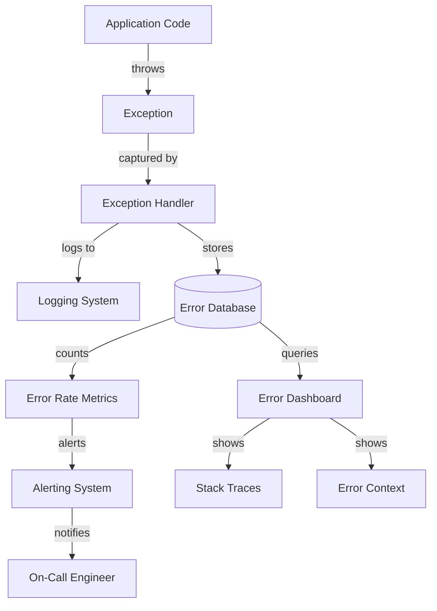

# Error Tracking - Comprehensive Relationship Map

## Executive Summary

Error Tracking captures, deduplicates, and alerts on application exceptions and errors. It provides stack traces, contextual data, and release tracking to enable rapid debugging and regression detection. Integrates with logging and alerting systems for comprehensive error management.

---

## 1. WHAT: Component Functionality & Boundaries

### Core Responsibilities

1. **Exception Capture**
   ```python
   import logging
   import traceback
   import hashlib
   
   logger = logging.getLogger(__name__)
   
   def capture_exception(exc, context=None):
       """Capture exception with full context for error tracking."""
       error_data = {
           'exception_type': type(exc).__name__,
           'exception_message': str(exc),
           'stack_trace': traceback.format_exc(),
           'timestamp': datetime.utcnow().isoformat(),
           'context': context or {},
           'fingerprint': generate_fingerprint(exc),
       }
       
       logger.error(
           f"Exception captured: {exc}",
           extra=error_data,
           exc_info=True
       )
       
       return error_data
   
   def generate_fingerprint(exc):
       """Generate unique fingerprint for deduplication."""
       stack_trace = traceback.extract_tb(exc.__traceback__)
       relevant_frames = [f"{f.filename}:{f.lineno}:{f.name}" for f in stack_trace]
       fingerprint_string = f"{type(exc).__name__}|{'|'.join(relevant_frames)}"
       return hashlib.sha256(fingerprint_string.encode()).hexdigest()[:16]
   ```

2. **Error Deduplication**
   - **Fingerprinting**: Generate unique ID based on exception type + stack trace
   - **Grouping**: Group identical errors together
   - **Count Tracking**: Track occurrence count per fingerprint
   - **First/Last Seen**: Track when error first appeared and last occurred

3. **Contextual Data Collection**
   ```python
   def enrich_error_context(request, user):
       """Add contextual data to error reports."""
       return {
           'user_id': user.id if user else None,
           'request_id': request.headers.get('X-Request-ID'),
           'url': request.url,
           'method': request.method,
           'ip_address': request.remote_addr,
           'user_agent': request.headers.get('User-Agent'),
           'referrer': request.headers.get('Referer'),
           'tags': {
               'environment': os.getenv('ENVIRONMENT', 'development'),
               'version': os.getenv('APP_VERSION', 'unknown'),
               'service': 'web-backend',
           },
           'breadcrumbs': get_recent_user_actions(user),  # Last 10 actions
       }
   ```

4. **Release Tracking**
   - **Version Tagging**: Tag errors with release version (git commit SHA)
   - **Regression Detection**: Detect new errors after deployment
   - **Blame Assignment**: Identify which commit introduced error

5. **Alerting Integration**
   - **Threshold Alerts**: Alert when error rate exceeds threshold
   - **New Error Alerts**: Alert on first occurrence of new error type
   - **Regression Alerts**: Alert when previously fixed error reappears

### Boundaries & Limitations

- **Does NOT**: Fix errors automatically (alerts humans)
- **Does NOT**: Prevent errors (defensive programming required)
- **Does NOT**: Store all exceptions (only errors/critical, not warnings)
- **Sampling**: High-volume errors may be sampled (first 100, then 1%)

### Data Structures

**Error Event**:
```python
{
    'id': 'uuid',
    'fingerprint': 'abc123def456',
    'exception_type': 'ValueError',
    'exception_message': 'Invalid user ID: -1',
    'stack_trace': '...',
    'timestamp': '2026-04-20T15:30:00Z',
    'first_seen': '2026-04-20T10:00:00Z',
    'last_seen': '2026-04-20T15:30:00Z',
    'count': 42,
    'context': {
        'user_id': 123,
        'request_id': 'req_abc',
        'url': '/api/users/-1',
        'environment': 'production',
        'release': 'v1.2.3',
    },
    'tags': ['backend', 'api', 'user-service'],
    'breadcrumbs': [
        {'action': 'login', 'timestamp': '2026-04-20T15:28:00Z'},
        {'action': 'view_profile', 'timestamp': '2026-04-20T15:29:00Z'},
    ],
}
```

---

## 2. WHO: Stakeholders & Decision-Makers

### Primary Stakeholders

| Stakeholder | Role | Authority Level | Decision Power |
|------------|------|----------------|----------------|
| **Developers** | Error resolution | CRITICAL | Investigates, fixes errors |
| **SRE Team** | Production stability | CRITICAL | Monitors error rates, escalates |
| **QA Team** | Error verification | MEDIUM | Verifies fixes in staging |
| **Product Managers** | User impact assessment | ADVISORY | Prioritizes error fixes |

### User Classes

1. **Error Producers**
   - All application code (exception handlers)
   - Web backend: HTTP middleware captures unhandled exceptions
   - Desktop app: Top-level exception handler

2. **Error Consumers**
   - Developers: Debug errors, identify root cause
   - SREs: Monitor error rates, page on-call
   - QA: Verify errors fixed in new releases

---

## 3. WHEN: Lifecycle & Review Cycle

### Error Lifecycle


### Review Schedule

- **Real-Time**: Error dashboard (new errors, rate spikes)
- **Hourly**: SRE monitors critical error rate
- **Daily**: Developers review new errors assigned to them
- **Weekly**: Team reviews top 10 errors by frequency
- **Monthly**: Error resolution metrics (MTTR, error rate trend)

---

## 4. WHERE: File Paths & Integration Points

### Source Code Locations

**Error Handling (Web Backend)**:
```
web/backend/
├── middleware/
│   ├── error_handler.py:15       # Global exception handler
│   └── logging_middleware.py:25  # Request/response error logging
├── services/
│   ├── error_tracking.py         # Error tracking service
│   └── fingerprinting.py         # Error fingerprinting logic
└── models/
    └── error_event.py             # Error event data model
```

**Error Handling (Desktop App)**:
```
src/app/
├── main.py:25                     # Top-level exception handler
└── core/
    └── error_handler.py           # Exception logging with context
```

**Configuration**:
```
web/backend/
├── .env                           # ERROR_TRACKING_ENABLED=true
└── config/
    └── error_tracking.py          # Error tracking config
```

### Integration Architecture



---

## 5. WHY: Problem Solved & Design Rationale

### Problem Statement

**Requirements**:
- **R1**: Capture all unhandled exceptions with full context
- **R2**: Deduplicate similar errors (avoid alert fatigue)
- **R3**: Track error rates and trends
- **R4**: Detect regressions (new errors after deployment)
- **R5**: Low overhead (< 50ms per error)

**Pain Points Without Error Tracking**:
- Errors disappear in logs (hard to find)
- Duplicate errors create noise
- No visibility into error rates
- Cannot detect regressions

### Design Rationale

**Why Fingerprinting for Deduplication?**
- ✅ Groups identical errors across users/requests
- ✅ Reduces noise (100 identical errors = 1 issue)
- ✅ Enables trend analysis (is error increasing?)
- ❌ Cons: Different errors may hash to same fingerprint
- 🔧 Mitigation: Use exception type + top 3 stack frames

**Why Store Context (user, request, breadcrumbs)?**
- ✅ Enables reproduction (know exact state when error occurred)
- ✅ Speeds debugging (no need to ask user "what did you do?")
- ❌ Cons: PII concerns (user IDs, IP addresses)
- 🔧 Mitigation: Hash PII, retention policy (30 days)

**Why Release Tracking?**
- ✅ Detect regressions (errors introduced in latest release)
- ✅ Blame assignment (which commit broke it?)
- ✅ Rollback decision (if error rate spikes post-deploy)

---

## 6. Dependency Graph

**Upstream**:
- Logging System: Error logs feed error tracking
- Alerting System: Error rate triggers alerts
- Monitoring: Error rate metrics

**Downstream**:
- Dashboard: Error visualization
- GitHub Integration: Auto-create issues for new errors
- PagerDuty: Critical error alerts

**Peer**:
- Tracing System: Correlate errors with slow traces
- Metrics System: Error rate metrics

---

## 7. Risk Assessment

| Risk | Likelihood | Impact | Severity | Mitigation |
|------|-----------|--------|----------|------------|
| PII leakage in error context | MEDIUM | HIGH | 🟠 HIGH | Scrub PII, hash user IDs |
| Error storage costs (high volume) | MEDIUM | MEDIUM | 🟡 MEDIUM | Sampling, retention policy |
| Alert fatigue (too many errors) | HIGH | MEDIUM | 🟡 MEDIUM | Deduplication, threshold tuning |
| Error tracking unavailable | LOW | MEDIUM | 🟢 LOW | Graceful degradation (log only) |

---

## 8. Integration Checklist

**Step 1: Add Global Exception Handler**
```python
@app.errorhandler(Exception)
def handle_exception(exc):
    error_event = capture_exception(
        exc,
        context=enrich_error_context(request, current_user)
    )
    return jsonify({'error': 'Internal server error'}), 500
```

**Step 2: Instrument Critical Functions**
```python
def critical_operation():
    try:
        risky_code()
    except Exception as exc:
        capture_exception(exc, context={'operation': 'critical_operation'})
        raise  # Re-raise after capturing
```

**Step 3: Configure Alerts**
```yaml
# Alert on error rate spike
- alert: HighErrorRate
  expr: rate(errors_total[5m]) > 10
  for: 5m
  labels:
    severity: critical
  annotations:
    summary: "High error rate detected"
```

**Step 4: Create Error Dashboard**
- Panel 1: Error rate over time
- Panel 2: Top 10 errors by frequency
- Panel 3: New errors (first seen < 24h)
- Panel 4: Error distribution by release

---

## 9. Future Roadmap

- [ ] Automatic GitHub issue creation for new errors
- [ ] Error resolution tracking (MTTR metrics)
- [ ] Similar error detection (ML-based grouping)
- [ ] Automatic error categorization (bug vs. user error)
- [ ] Integration with Sentry/Rollbar (third-party error tracking)

---

## 10. API Reference Card

**Capture Exception**:
```python
from app.services.error_tracking import capture_exception

try:
    risky_operation()
except Exception as exc:
    capture_exception(exc, context={'user_id': 123, 'action': 'risky_op'})
    raise
```

**Query Errors**:
```python
from app.services.error_tracking import get_errors

# Get recent errors
errors = get_errors(limit=10, since='2026-04-20')

# Get errors by fingerprint
errors = get_errors(fingerprint='abc123')

# Get error trend
trend = get_error_trend(fingerprint='abc123', days=7)
```

**Mark Error Resolved**:
```python
from app.services.error_tracking import mark_resolved

mark_resolved(fingerprint='abc123', release='v1.2.4')
```

---

## Related Systems

- **Security**: [[../security/04_incident_response_chains.md|Incident Response]] - Security-related errors and incident creation
- **Data**: [[../data/01-PERSISTENCE-PATTERNS.md|Persistence Patterns]] - Database errors and data integrity failures
- **Configuration**: [[../configuration/03_settings_validator_relationships.md|Settings Validator]] - Configuration errors and validation failures

**Cross-References**:
- Authentication/authorization errors → [[../security/01_security_system_overview.md|Security Overview]]
- Encryption errors → [[../data/02-ENCRYPTION-CHAINS.md|Encryption Chains]]
- Backup failure tracking → [[../data/04-BACKUP-RECOVERY.md|Backup & Recovery]]
- Sync errors → [[../data/03-SYNC-STRATEGIES.md|Sync Strategies]]
- Feature flag errors → [[../configuration/04_feature_flags_relationships.md|Feature Flags]]
- Secrets retrieval errors → [[../configuration/07_secrets_management_relationships.md|Secrets Management]]

---

**Status**: ✅ PRODUCTION  
**Last Updated**: 2026-04-20 by AGENT-066  
**Next Review**: 2026-07-20
