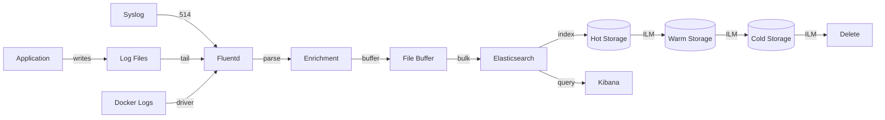
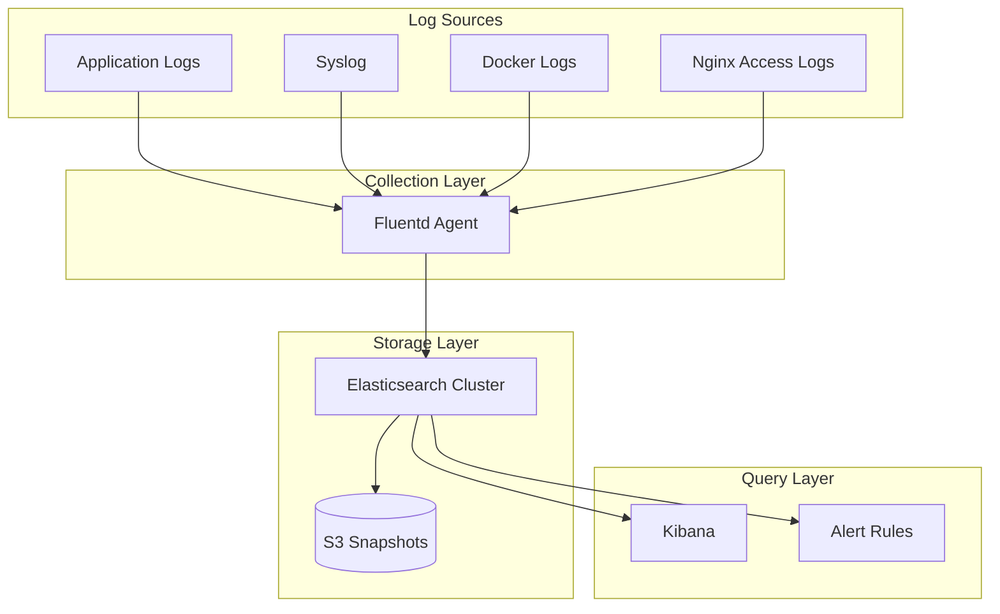

# Log Aggregation - Comprehensive Relationship Map

## Executive Summary

Log Aggregation provides centralized collection, parsing, enrichment, and indexing of logs from all sources using Fluentd/Logstash → Elasticsearch → Kibana (ELK stack). Enables full-text search, correlation, and visualization of log data across the entire infrastructure.

---

## 1. WHAT: Component Functionality & Boundaries

### Core Responsibilities

1. **Multi-Source Log Collection**
   ```ruby
   # Fluentd configuration
   <source>
     @type tail
     path /var/log/app/*.log
     pos_file /var/log/fluentd/app.pos
     tag app.logs
     <parse>
       @type json
       time_key timestamp
       time_format %Y-%m-%dT%H:%M:%S.%LZ
     </parse>
   </source>
   
   <source>
     @type syslog
     port 514
     tag syslog
   </source>
   
   <source>
     @type forward
     port 24224
     bind 0.0.0.0
   </source>
   ```

2. **Log Parsing & Enrichment**
   ```ruby
   <filter app.logs>
     @type parser
     key_name message
     <parse>
       @type json
     </parse>
   </filter>
   
   <filter **>
     @type record_transformer
     <record>
       hostname "#{Socket.gethostname}"
       environment "#{ENV['ENVIRONMENT']}"
       cluster "#{ENV['CLUSTER_NAME']}"
     </record>
   </filter>
   ```

3. **Buffering & Retry Logic**
   - **Memory Buffer**: Fast, but lost on crash
   - **File Buffer**: Persistent, survives restarts
   - **Retry Policy**: Exponential backoff, max 10 retries
   - **Overflow Handling**: Drop oldest logs when buffer full

4. **Index Management** (Elasticsearch)
   - **Time-Based Indices**: `logs-YYYY-MM-DD` (daily rollover)
   - **Index Templates**: Define mappings, settings for new indices
   - **ILM (Index Lifecycle Management)**:
     - **Hot** (0-7 days): High-performance storage, full indexing
     - **Warm** (7-30 days): Compressed, read-only
     - **Cold** (30-90 days): Snapshot to S3, minimal disk
     - **Delete** (>90 days): Purge from cluster

5. **Full-Text Search** (Kibana)
   ```
   # Lucene query syntax
   level:ERROR AND service:web-backend AND timestamp:[now-1h TO now]
   
   # KQL (Kibana Query Language)
   level: "ERROR" and service: "web-backend" and user_id: 123
   ```

### Boundaries & Limitations

- **Does NOT**: Generate logs (apps produce logs)
- **Does NOT**: Execute alerts (Elasticsearch Watcher or external alerting)
- **Does NOT**: Provide real-time streaming (30-60s lag)
- **Cardinality**: High-cardinality fields (e.g., trace_id) strain indexing
- **Cost**: Storage costs scale with log volume (GB/day)

### Data Structures

**Log Event** (JSON):
```json
{
  "@timestamp": "2026-04-20T15:30:45.123Z",
  "level": "ERROR",
  "logger": "app.core.ai_systems",
  "message": "FourLaws validation failed",
  "context": {
    "user_id": 123,
    "trace_id": "abc123",
    "action": "delete_user_data"
  },
  "exc_info": "Traceback...",
  "hostname": "app-server-01",
  "environment": "production",
  "service": "desktop-app"
}
```

---

## 2. WHO: Stakeholders & Decision-Makers

### Primary Stakeholders

| Stakeholder | Role | Authority Level | Decision Power |
|------------|------|----------------|----------------|
| **SRE Team** | Log pipeline management | CRITICAL | Configures collection, retention |
| **Platform Team** | Infrastructure | HIGH | Deploys Fluentd agents, ES cluster |
| **Security Team** | Audit trail | CRITICAL | Defines audit log requirements |
| **Developers** | Log consumers | MEDIUM | Queries logs for debugging |
| **Compliance** | Retention policy | OVERSIGHT | Mandates retention durations |

---

## 3. WHEN: Lifecycle & Review Cycle

### Log Pipeline Flow



### Retention Policy

- **Hot** (0-30 days): Full-text search, real-time queries
- **Warm** (30-90 days): Compressed, slower queries
- **Cold** (90-365 days): S3 snapshots, restore on demand
- **Audit Logs**: 7 years (compliance requirement)

---

## 4. WHERE: File Paths & Integration Points

### Configuration

```
monitoring/
├── fluentd/
│   ├── fluent.conf               # Main config
│   ├── conf.d/
│   │   ├── sources.conf         # Log sources
│   │   ├── filters.conf         # Parsing, enrichment
│   │   └── outputs.conf         # Elasticsearch output
│   └── plugins/                  # Custom plugins
└── elasticsearch/
    ├── elasticsearch.yml         # ES config
    └── index-templates/
        └── logs-template.json    # Index template
```

### Integration Architecture



---

## 5. WHY: Problem Solved & Design Rationale

### Problem Statement

**Requirements**:
- **R1**: Centralize logs from 50+ sources
- **R2**: Full-text search across all logs
- **R3**: Retain logs per compliance policy
- **R4**: Real-time visibility (< 1 minute lag)
- **R5**: Cost-effective storage (< $0.10/GB/month)

**Why Fluentd?**
- ✅ Flexible input/output plugins (100+ integrations)
- ✅ Reliable buffering (file-based, survives crashes)
- ✅ Low resource usage (< 200 MB RAM per agent)
- ❌ Cons: Complex configuration (Ruby DSL)
- 🔧 Mitigation: Use modular configs, templates

**Why Elasticsearch?**
- ✅ Full-text search with Lucene
- ✅ Horizontal scalability (add nodes)
- ✅ JSON-native (no schema required)
- ❌ Cons: High resource usage (RAM, disk)
- 🔧 Mitigation: Hot/warm/cold tiering, ILM

**Why Daily Indices?**
- ✅ Easy to delete old data (drop index)
- ✅ Optimized for time-range queries
- ❌ Cons: Management overhead (many indices)
- 🔧 Mitigation: ILM automation, index rollover

---

## 6. Dependency Graph

**Upstream**:
- Logging System: Produces logs
- All Applications: Generate log files

**Downstream**:
- Elasticsearch: Stores indexed logs
- Kibana: Visualizes logs
- Alerting: Queries ES for alert rules

**Peer**:
- Metrics System: Correlate metrics with logs
- Tracing System: Correlate traces with logs (via trace_id)

---

## 7. Risk Assessment

| Risk | Likelihood | Impact | Severity | Mitigation |
|------|-----------|--------|----------|------------|
| Fluentd down (log loss) | LOW | HIGH | 🟡 MEDIUM | File buffering, HA deployment |
| ES cluster full (ingest failure) | MEDIUM | HIGH | 🟠 HIGH | Disk usage alerts, auto-cleanup |
| High-cardinality field (slow queries) | MEDIUM | MEDIUM | 🟡 MEDIUM | Field data limit, keyword fields |
| PII in logs (compliance violation) | MEDIUM | CRITICAL | 🟠 HIGH | Automated PII scrubbing |

---

## 8. Integration Checklist

**Step 1: Install Fluentd Agent**
```bash
# Ubuntu
curl -L https://toolbelt.treasuredata.com/sh/install-ubuntu-focal-td-agent4.sh | sh

# Configure
cat > /etc/td-agent/td-agent.conf <<EOF
<source>
  @type tail
  path /var/log/myapp/*.log
  tag myapp
  <parse>
    @type json
  </parse>
</source>

<match **>
  @type elasticsearch
  host elasticsearch.example.com
  port 9200
  index_name logs-%Y.%m.%d
  <buffer>
    @type file
    path /var/log/td-agent/buffer
    flush_interval 10s
  </buffer>
</match>
EOF

# Start
systemctl start td-agent
```

**Step 2: Create Elasticsearch Index Template**
```bash
curl -X PUT "localhost:9200/_index_template/logs" -H 'Content-Type: application/json' -d'
{
  "index_patterns": ["logs-*"],
  "template": {
    "settings": {
      "number_of_shards": 3,
      "number_of_replicas": 1,
      "index.lifecycle.name": "logs-policy"
    },
    "mappings": {
      "properties": {
        "@timestamp": {"type": "date"},
        "level": {"type": "keyword"},
        "message": {"type": "text"},
        "trace_id": {"type": "keyword"}
      }
    }
  }
}
'
```

**Step 3: Configure ILM Policy**
```bash
curl -X PUT "localhost:9200/_ilm/policy/logs-policy" -H 'Content-Type: application/json' -d'
{
  "policy": {
    "phases": {
      "hot": {
        "actions": {
          "rollover": {
            "max_age": "1d",
            "max_size": "50gb"
          }
        }
      },
      "warm": {
        "min_age": "7d",
        "actions": {
          "shrink": {"number_of_shards": 1},
          "forcemerge": {"max_num_segments": 1}
        }
      },
      "cold": {
        "min_age": "30d",
        "actions": {
          "freeze": {}
        }
      },
      "delete": {
        "min_age": "90d",
        "actions": {
          "delete": {}
        }
      }
    }
  }
}
'
```

---

## 9. Future Roadmap

- [ ] OpenTelemetry Collector integration (unified telemetry)
- [ ] Automated anomaly detection (ML-based log analysis)
- [ ] Log-to-metric transformation (generate metrics from logs)
- [ ] Multi-cluster federation (global log search)

---

## 10. API Reference Card

**Fluentd Output to ES**:
```ruby
<match app.**>
  @type elasticsearch
  host localhost
  port 9200
  index_name logs-%Y.%m.%d
  type_name _doc
</match>
```

**Elasticsearch Query**:
```bash
# Search logs
curl -X GET "localhost:9200/logs-*/_search" -H 'Content-Type: application/json' -d'
{
  "query": {
    "bool": {
      "must": [
        {"match": {"level": "ERROR"}},
        {"range": {"@timestamp": {"gte": "now-1h"}}}
      ]
    }
  },
  "sort": [{"@timestamp": "desc"}],
  "size": 100
}
'
```

**Kibana Discover Query**:
```
level: "ERROR" AND service: "web-backend" AND @timestamp:[now-1h TO now]
```

---

## Related Systems

- **Security**: [[../security/07_security_metrics.md|Security Metrics]] - Security log aggregation and audit trail centralization
- **Data**: [[../data/04-BACKUP-RECOVERY.md|Backup & Recovery]] - Log backup and archival strategies
- **Configuration**: [[../configuration/02_environment_manager_relationships.md|Environment Manager]] - Environment-specific log routing and retention

**Cross-References**:
- Authentication logs → [[../security/01_security_system_overview.md|Security Overview]]
- Incident response logs → [[../security/04_incident_response_chains.md|Incident Response]]
- Threat detection logs → [[../security/02_threat_models.md|Threat Models]]
- Data access logs → [[../data/02-ENCRYPTION-CHAINS.md|Encryption Chains]]
- Configuration change logs → [[../configuration/03_settings_validator_relationships.md|Settings Validator]]
- Secrets access logs → [[../configuration/07_secrets_management_relationships.md|Secrets Management]]

---

**Status**: ✅ PRODUCTION  
**Last Updated**: 2026-04-20 by AGENT-066  
**Next Review**: 2026-07-20
