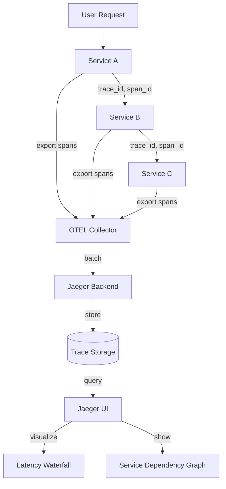
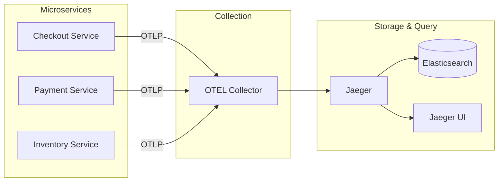

# Distributed Tracing - Comprehensive Relationship Map

## Executive Summary

Distributed Tracing provides cross-service request flow tracking using OpenTelemetry instrumentation and Jaeger backend. Enables understanding of request lifecycles across microservices, identifying bottlenecks, and debugging failures in distributed systems with service dependency graphs and latency waterfalls.

---

## 1. WHAT: Component Functionality & Boundaries

### Core Responsibilities

1. **Cross-Service Context Propagation**
   ```python
   from opentelemetry import trace
   from opentelemetry.propagate import inject, extract
   import requests
   
   # Service A (upstream)
   tracer = trace.get_tracer(__name__)
   with tracer.start_as_current_span("call_service_b") as span:
       headers = {}
       inject(headers)  # Inject trace context into HTTP headers
       # Headers now contain: traceparent: 00-<trace_id>-<span_id>-01
       
       response = requests.post(
           "http://service-b/api/process",
           headers=headers,
           json=payload
       )
   
   # Service B (downstream)
   from flask import request
   
   @app.route('/api/process', methods=['POST'])
   def process():
       # Extract trace context from incoming headers
       ctx = extract(request.headers)
       
       with tracer.start_as_current_span("process_data", context=ctx) as span:
           # This span is now part of the same trace from Service A
           span.set_attribute("data_size", len(request.json))
           result = process_data(request.json)
           return jsonify(result)
   ```

2. **W3C Trace Context Standard**
   ```
   traceparent: 00-0af7651916cd43dd8448eb211c80319c-b7ad6b7169203331-01
                ││  │                                │                ││
                ││  │                                │                │└─ sampled flag (01 = sampled)
                ││  │                                │                └─ parent span ID
                ││  │                                └─ trace ID (globally unique)
                │└─ version (00 = current version)
                └─ field separator
   ```

3. **Service Dependency Mapping**
   - **Automatic Discovery**: Jaeger analyzes traces to build dependency graph
   - **Visualization**: Shows services, call volumes, error rates
   - **Critical Path**: Highlights slowest services in request flow

4. **Latency Waterfall Analysis**
   ```
   Trace: GET /api/checkout (total: 850ms)
   ├─ Span: authenticate_user (50ms)
   ├─ Span: fetch_cart (200ms)
   │  ├─ Span: db_query (150ms) ⚠️ SLOW
   │  └─ Span: cache_lookup (50ms)
   ├─ Span: calculate_total (100ms)
   └─ Span: process_payment (500ms)
      ├─ Span: call_payment_gateway (450ms) ⚠️ SLOW
      └─ Span: record_transaction (50ms)
   ```

5. **Sampling Strategies**
   ```python
   from opentelemetry.sdk.trace.sampling import (
       TraceIdRatioBased,
       ParentBased,
       ALWAYS_ON,
       ALWAYS_OFF
   )
   
   # Probabilistic sampling (1% of traces)
   sampler = TraceIdRatioBased(0.01)
   
   # Parent-based (inherit parent's sampling decision)
   sampler = ParentBased(root=TraceIdRatioBased(0.01))
   
   # Conditional sampling (always sample errors)
   from opentelemetry.sdk.trace import TracerProvider
   from custom_samplers import ErrorAwareSampler
   
   sampler = ErrorAwareSampler(
       default_rate=0.01,
       error_rate=1.0  # 100% sampling for errors
   )
   ```

### Boundaries & Limitations

- **Does NOT**: Trace within single function (use profilers for that)
- **Does NOT**: Store logs (logs complement traces)
- **Does NOT**: Provide metrics aggregation (use metrics system)
- **Microservices-Focused**: Less useful for monolithic apps
- **Overhead**: Context propagation adds 1-5ms latency per hop

### Data Structures

**Trace**:
```json
{
  "traceID": "0af7651916cd43dd8448eb211c80319c",
  "spans": [
    {
      "spanID": "b7ad6b7169203331",
      "operationName": "GET /api/checkout",
      "startTime": 1619712000000000,
      "duration": 850000,
      "tags": {
        "http.method": "GET",
        "http.url": "/api/checkout",
        "http.status_code": 200,
        "user_id": "123"
      },
      "references": []  // Root span, no parent
    },
    {
      "spanID": "c8be7c8270203442",
      "operationName": "db_query",
      "startTime": 1619712050000000,
      "duration": 150000,
      "tags": {
        "db.system": "postgresql",
        "db.statement": "SELECT * FROM carts WHERE user_id = $1"
      },
      "references": [
        {
          "refType": "CHILD_OF",
          "spanID": "b7ad6b7169203331"
        }
      ]
    }
  ],
  "processes": {
    "p1": {
      "serviceName": "checkout-service",
      "tags": {
        "version": "1.2.3",
        "environment": "production"
      }
    }
  }
}
```

---

## 2. WHO: Stakeholders & Decision-Makers

### Primary Stakeholders

| Stakeholder | Role | Authority Level | Decision Power |
|------------|------|----------------|----------------|
| **Backend Developers** | Instrumentation | CRITICAL | Adds spans, propagates context |
| **SRE Team** | Production tracing | HIGH | Sets sampling rates, retention |
| **Platform Team** | Infrastructure | HIGH | Deploys Jaeger, manages storage |
| **Microservices Architects** | Service design | MEDIUM | Designs service boundaries |

---

## 3. WHEN: Lifecycle & Review Cycle

### Distributed Trace Flow



### Retention

- **Full Traces**: 7 days (100% of sampled traces)
- **Error Traces**: 30 days (100% sampling for errors)
- **High-Volume Services**: 1% sampling (reduce overhead)

---

## 4. WHERE: File Paths & Integration Points

### Configuration

```
monitoring/
├── jaeger/
│   ├── docker-compose.yml        # Jaeger all-in-one deployment
│   └── jaeger-config.yaml        # Collector config
└── otel-collector-config.yaml    # OTLP → Jaeger export
```

**Jaeger Deployment** (Docker Compose):
```yaml
version: '3'
services:
  jaeger:
    image: jaegertracing/all-in-one:latest
    ports:
      - "5775:5775/udp"   # Zipkin compact thrift
      - "6831:6831/udp"   # Jaeger compact thrift
      - "6832:6832/udp"   # Jaeger binary thrift
      - "5778:5778"       # Serve configs
      - "16686:16686"     # Jaeger UI
      - "14268:14268"     # Jaeger collector HTTP
      - "14250:14250"     # Jaeger collector gRPC
      - "9411:9411"       # Zipkin HTTP
    environment:
      COLLECTOR_ZIPKIN_HTTP_PORT: 9411
      SPAN_STORAGE_TYPE: elasticsearch
      ES_SERVER_URLS: http://elasticsearch:9200
```

### Integration Architecture



---

## 5. WHY: Problem Solved & Design Rationale

### Problem Statement

**Requirements**:
- **R1**: Understand request flow across 15+ microservices
- **R2**: Identify which service caused slow request
- **R3**: Debug cross-service failures
- **R4**: Visualize service dependencies

**Why OpenTelemetry?**
- ✅ Vendor-neutral (not locked to Jaeger)
- ✅ Auto-instrumentation (Flask, Django, requests)
- ✅ W3C standard (interoperability)
- ✅ Unified API (metrics, logs, traces future convergence)

**Why Jaeger Backend?**
- ✅ Open-source (CNCF graduated project)
- ✅ Scalable (Elasticsearch backend)
- ✅ Rich UI (waterfall, dependency graph)
- ❌ Cons: Resource-intensive (ES cluster required)
- 🔧 Mitigation: Use Cassandra or in-memory for lower scale

**Why 1% Sampling in Production?**
- ✅ Reduces overhead (100% tracing adds 10-20% latency)
- ✅ Still captures representative sample (10K traces/day)
- ✅ 100% sampling for errors (most valuable)

---

## 6. Dependency Graph

**Upstream**:
- Tracing System: Creates spans
- Logging System: Correlates logs via trace_id
- Metrics System: Exemplars link metrics to traces

**Downstream**:
- Jaeger Backend: Stores traces
- Elasticsearch: Trace storage
- Grafana: Traces plugin for visualization

**Peer**:
- Service Mesh: Envoy/Istio can auto-inject tracing
- API Gateway: Initiates traces for incoming requests

---

## 7. Risk Assessment

| Risk | Likelihood | Impact | Severity | Mitigation |
|------|-----------|--------|----------|------------|
| Context propagation failure (broken traces) | MEDIUM | MEDIUM | 🟡 MEDIUM | Monitor trace completeness |
| High overhead (100% sampling) | LOW | HIGH | 🟡 MEDIUM | Enforce 1% sampling |
| Storage costs (ES cluster) | MEDIUM | MEDIUM | 🟡 MEDIUM | Retention policy, sampling |
| Missing instrumentation (blind spots) | MEDIUM | MEDIUM | 🟡 MEDIUM | Auto-instrumentation, coverage dashboard |

---

## 8. Integration Checklist

**Step 1: Install OpenTelemetry SDK**
```bash
pip install opentelemetry-api opentelemetry-sdk opentelemetry-instrumentation-flask opentelemetry-exporter-otlp
```

**Step 2: Auto-Instrument Flask App**
```python
from flask import Flask
from opentelemetry import trace
from opentelemetry.sdk.trace import TracerProvider
from opentelemetry.sdk.trace.export import BatchSpanProcessor
from opentelemetry.exporter.otlp.proto.grpc.trace_exporter import OTLPSpanExporter
from opentelemetry.instrumentation.flask import FlaskInstrumentor

app = Flask(__name__)

# Setup tracing
trace.set_tracer_provider(TracerProvider())
otlp_exporter = OTLPSpanExporter(endpoint="http://localhost:4317", insecure=True)
trace.get_tracer_provider().add_span_processor(BatchSpanProcessor(otlp_exporter))

# Auto-instrument Flask
FlaskInstrumentor().instrument_app(app)

@app.route('/api/checkout')
def checkout():
    return jsonify({"status": "success"})
```

**Step 3: Deploy Jaeger**
```bash
docker run -d --name jaeger \
  -p 16686:16686 \
  -p 14250:14250 \
  jaegertracing/all-in-one:latest
```

**Step 4: View Traces**
- Open Jaeger UI: http://localhost:16686
- Search for service: "checkout-service"
- View trace waterfall, service dependencies

---

## 9. Future Roadmap

- [ ] Tail-based sampling (keep slow/error traces dynamically)
- [ ] Trace-to-log correlation (click span → see logs)
- [ ] Trace-based alerts (SLO violations per endpoint)
- [ ] Service mesh integration (Istio auto-tracing)

---

## 10. API Reference Card

**Propagate Context (HTTP)**:
```python
from opentelemetry.propagate import inject, extract

# Inject (upstream service)
headers = {}
inject(headers)
requests.post(url, headers=headers)

# Extract (downstream service)
ctx = extract(request.headers)
with tracer.start_as_current_span("operation", context=ctx):
    pass
```

**Query Traces (Jaeger API)**:
```bash
# Search traces by service
curl "http://localhost:16686/api/traces?service=checkout-service&limit=20"

# Get specific trace
curl "http://localhost:16686/api/traces/<trace_id>"
```

**Sampling Config**:
```python
from opentelemetry.sdk.trace.sampling import TraceIdRatioBased
sampler = TraceIdRatioBased(0.01)  # 1% sampling
```

---

## Related Systems

- **Security**: [[../security/01_security_system_overview.md|Security Overview]] - Security control tracing (authentication, authorization flows)
- **Data**: [[../data/03-SYNC-STRATEGIES.md|Sync Strategies]] - Cross-service data synchronization tracing
- **Configuration**: [[../configuration/03_settings_validator_relationships.md|Settings Validator]] - Configuration propagation tracing across microservices

**Cross-References**:
- Security incident traces → [[../security/04_incident_response_chains.md|Incident Response]]
- Encryption operation traces → [[../data/02-ENCRYPTION-CHAINS.md|Encryption Chains]]
- Data persistence traces → [[../data/01-PERSISTENCE-PATTERNS.md|Persistence Patterns]]
- Feature flag evaluation traces → [[../configuration/04_feature_flags_relationships.md|Feature Flags]]
- Secrets retrieval traces → [[../configuration/07_secrets_management_relationships.md|Secrets Management]]

---

**Status**: ✅ PRODUCTION (Web), 🔄 PLANNED (Desktop)  
**Last Updated**: 2026-04-20 by AGENT-066  
**Next Review**: 2026-07-20
