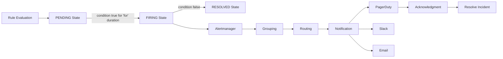
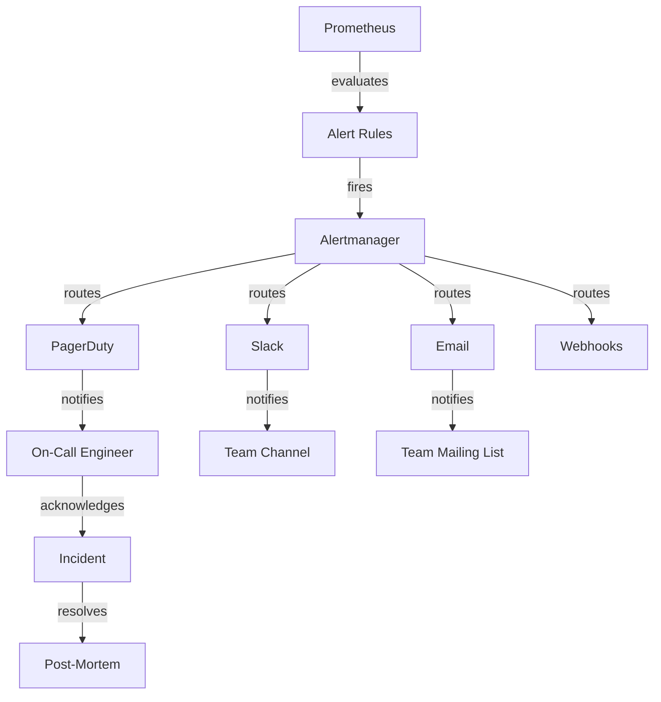

# Alerting System - Comprehensive Relationship Map

## Executive Summary

The Alerting System provides automated detection and notification of anomalies using Prometheus Alertmanager. Routes alerts based on severity, team ownership, and time of day. Integrates with PagerDuty, Slack, and email for multi-channel notifications with grouping, deduplication, and escalation policies.

**CRITICALITY: CATASTROPHIC** - System downtime or alerting failures directly impact incident response and can lead to prolonged outages.

---

## 1. WHAT: Component Functionality & Boundaries

### Core Responsibilities

1. **Alert Rule Evaluation** (Prometheus)
   ```yaml
   # monitoring/rules/alerts.yml
   groups:
     - name: application_alerts
       interval: 1m  # Evaluate every minute
       rules:
         # Critical: High error rate
         - alert: HighErrorRate
           expr: |
             sum(rate(http_requests_total{status=~"5.."}[5m])) by (service)
             /
             sum(rate(http_requests_total[5m])) by (service)
             > 0.05
           for: 5m  # Alert if condition true for 5 minutes
           labels:
             severity: critical
             team: backend
             service: "{{ $labels.service }}"
           annotations:
             summary: "High error rate for {{ $labels.service }}"
             description: "Error rate is {{ $value | humanizePercentage }} (threshold: 5%)"
             runbook_url: "https://wiki/runbooks/high-error-rate"
             dashboard: "https://grafana/d/errors"
         
         # Warning: Disk usage high
         - alert: DiskSpaceRunningOut
           expr: |
             (node_filesystem_avail_bytes{mountpoint="/"} / node_filesystem_size_bytes{mountpoint="/"}) * 100 < 15
           for: 10m
           labels:
             severity: warning
             team: platform
           annotations:
             summary: "Disk space running out on {{ $labels.instance }}"
             description: "Filesystem {{ $labels.mountpoint }} has only {{ $value }}% available"
         
         # Critical: Service down
         - alert: ServiceDown
           expr: up{job="web-backend"} == 0
           for: 2m
           labels:
             severity: critical
             team: backend
             oncall: "true"
           annotations:
             summary: "Service {{ $labels.job }} is down"
             description: "Instance {{ $labels.instance }} has been down for 2 minutes"
   ```

2. **Alert Routing** (Alertmanager)
   ```yaml
   # monitoring/alertmanager.yml
   global:
     resolve_timeout: 5m
     slack_api_url: 'https://hooks.slack.com/services/...'
     pagerduty_url: 'https://events.pagerduty.com/v2/enqueue'
   
   route:
     receiver: 'default'
     group_by: ['alertname', 'service']
     group_wait: 10s        # Wait 10s to collect alerts before sending
     group_interval: 10s    # Wait 10s between grouped notifications
     repeat_interval: 4h    # Re-notify every 4h if still firing
     
     routes:
       # Critical alerts → PagerDuty
       - match:
           severity: critical
         receiver: 'pagerduty'
         group_wait: 10s
         repeat_interval: 5m
         routes:
           # Critical + oncall → Page immediately
           - match:
               oncall: "true"
             receiver: 'pagerduty-urgent'
             group_wait: 0s
             repeat_interval: 2m
       
       # High severity → Slack + Email
       - match:
           severity: high
         receiver: 'slack-high'
         group_wait: 30s
         repeat_interval: 1h
       
       # Medium severity → Slack only
       - match:
           severity: medium
         receiver: 'slack-medium'
         group_wait: 5m
         repeat_interval: 4h
       
       # Low severity → Email digest (daily)
       - match:
           severity: low
         receiver: 'email-digest'
         group_wait: 24h
         repeat_interval: 24h
   
   receivers:
     - name: 'default'
       slack_configs:
         - channel: '#alerts'
           title: '{{ .GroupLabels.alertname }}'
           text: '{{ range .Alerts }}{{ .Annotations.description }}{{ end }}'
     
     - name: 'pagerduty-urgent'
       pagerduty_configs:
         - service_key: '<pagerduty_integration_key>'
           severity: 'critical'
           description: '{{ .GroupLabels.alertname }}: {{ .CommonAnnotations.summary }}'
           details:
             firing: '{{ .Alerts.Firing | len }}'
             num_firing: '{{ .Alerts.Firing | len }}'
             resolved: '{{ .Alerts.Resolved | len }}'
     
     - name: 'slack-high'
       slack_configs:
         - channel: '#alerts-high'
           color: 'danger'
           title: '🔴 HIGH SEVERITY ALERT'
           text: '{{ .CommonAnnotations.description }}'
           actions:
             - type: button
               text: 'View Dashboard'
               url: '{{ .CommonAnnotations.dashboard }}'
             - type: button
               text: 'Runbook'
               url: '{{ .CommonAnnotations.runbook_url }}'
     
     - name: 'email-digest'
       email_configs:
         - to: 'team@example.com'
           from: 'alerts@example.com'
           subject: 'Daily Alert Digest'
           html: '{{ range .Alerts }}{{ .Annotations.description }}<br>{{ end }}'
   
   inhibit_rules:
     # Inhibit port alerts if host is down
     - source_match:
         severity: 'critical'
         alertname: 'HostDown'
       target_match:
         severity: 'warning'
       equal: ['instance']
   ```

3. **Alert Grouping & Deduplication**
   - **Grouping**: Combine related alerts (e.g., all disk alerts from same host)
   - **Deduplication**: Send only one notification for multiple identical alerts
   - **Inhibition**: Suppress lower-priority alerts when higher-priority alert firing

4. **Escalation Policies**
   ```mermaid
   graph TD
       FIRE[Alert Fires] --> NOTIFY[Notify On-Call]
       NOTIFY --> ACK{Acknowledged?}
       ACK -->|Yes within 15min| INVESTIGATE[Investigation]
       ACK -->|No after 15min| ESCALATE1[Escalate to Backup]
       
       ESCALATE1 --> ACK2{Acknowledged?}
       ACK2 -->|Yes within 15min| INVESTIGATE
       ACK2 -->|No after 15min| ESCALATE2[Escalate to Manager]
       
       ESCALATE2 --> ACK3{Acknowledged?}
       ACK3 -->|Yes within 15min| INVESTIGATE
       ACK3 -->|No after 30min| ESCALATE3[Escalate to Director]
       
       INVESTIGATE --> RESOLVE[Resolve Incident]
       RESOLVE --> POSTMORTEM[Post-Mortem]
   ```

5. **Silencing & Maintenance Windows**
   ```bash
   # Silence alerts during deployment (1 hour)
   amtool silence add \
     alertname="HighErrorRate" \
     service="web-backend" \
     --duration=1h \
     --comment="Deployment in progress"
   
   # Silence all alerts for maintenance (4 hours)
   amtool silence add \
     severity=~".*" \
     --duration=4h \
     --comment="Scheduled maintenance window"
   ```

### Boundaries & Limitations

- **Does NOT**: Fix issues automatically (alerts humans)
- **Does NOT**: Provide metrics collection (uses Prometheus metrics)
- **Does NOT**: Store alert history long-term (use ITSM tool for that)
- **Delivery SLA**: p99 < 30 seconds for critical alerts
- **Deduplication Window**: 5 minutes (alerts within window grouped)

### Data Structures

**Alert Event**:
```json
{
  "status": "firing",
  "labels": {
    "alertname": "HighErrorRate",
    "severity": "critical",
    "service": "web-backend",
    "team": "backend"
  },
  "annotations": {
    "summary": "High error rate for web-backend",
    "description": "Error rate is 8.5% (threshold: 5%)",
    "runbook_url": "https://wiki/runbooks/high-error-rate",
    "dashboard": "https://grafana/d/errors"
  },
  "startsAt": "2026-04-20T15:30:00Z",
  "endsAt": "0001-01-01T00:00:00Z",
  "generatorURL": "http://prometheus:9090/graph?g0.expr=...",
  "fingerprint": "abc123def456"
}
```

---

## 2. WHO: Stakeholders & Decision-Makers

### Primary Stakeholders

| Stakeholder | Role | Authority Level | Decision Power |
|------------|------|----------------|----------------|
| **SRE Team** | Alert configuration | CRITICAL | Defines rules, thresholds, routing |
| **On-Call Engineers** | Incident response | CRITICAL | Responds to alerts, resolves incidents |
| **Team Leads** | Alert ownership | HIGH | Assigns alert ownership, escalation |
| **Engineering Manager** | Alert fatigue review | ADVISORY | Reviews false positive rate |

### User Classes

1. **Alert Producers**
   - SREs: Write alert rules
   - Developers: Request alerts for their services
   - Platform team: Infrastructure alert rules

2. **Alert Consumers**
   - On-call engineers: Receive and respond to alerts
   - Team leads: Monitor team's alert trends
   - Management: Review incident metrics

---

## 3. WHEN: Lifecycle & Review Cycle

### Alert Lifecycle



### Review Schedule

- **Real-Time**: On-call engineers monitor PagerDuty
- **Daily**: Review overnight alerts (missed escalations)
- **Weekly**: False positive rate review (tune thresholds)
- **Monthly**: Alert coverage audit (missing alerts?)
- **Quarterly**: Escalation policy review

---

## 4. WHERE: File Paths & Integration Points

### Configuration

```
monitoring/
├── prometheus.yml                 # Scrape configs
├── rules/
│   ├── alerts.yml                # Alert rules
│   ├── infrastructure.yml        # Infra alerts
│   └── application.yml           # App alerts
├── alertmanager.yml              # Routing config
└── silences/
    └── maintenance.yml           # Planned silences
```

### Integration Architecture



---

## 5. WHY: Problem Solved & Design Rationale

### Problem Statement

**Requirements**:
- **R1**: Detect anomalies within 1 minute
- **R2**: Route alerts to appropriate team/person
- **R3**: Reduce alert fatigue (< 10% false positive rate)
- **R4**: Ensure critical alerts reach on-call (99.99% delivery SLA)

**Why Prometheus Alertmanager?**
- ✅ Tight integration with Prometheus (same ecosystem)
- ✅ Flexible routing (by label, severity, time)
- ✅ Grouping and deduplication (reduce noise)
- ✅ Multiple receivers (PagerDuty, Slack, email, webhooks)
- ❌ Cons: Configuration can be complex
- 🔧 Mitigation: Use templates, testing tools

**Why Multi-Tier Routing (Critical → PagerDuty, Medium → Slack)?**
- ✅ Right urgency for right severity
- ✅ Avoids alert fatigue (not everything pages)
- ✅ Cost control (PagerDuty charges per incident)

**Why Grouping & Deduplication?**
- ✅ 100 disk alerts from same host = 1 notification
- ✅ Reduces noise, improves signal-to-noise ratio
- ❌ Cons: Slight delay (group_wait)
- 🔧 Mitigation: Tune group_wait per severity (0s for critical)

---

## 6. Dependency Graph

**Upstream**:
- Prometheus: Evaluates alert rules
- Metrics System: Provides metrics for alerting

**Downstream**:
- PagerDuty: Receives critical alerts
- Slack: Receives high/medium alerts
- Email: Receives low priority alerts
- Webhooks: Custom integrations (Jira, GitHub)

**Peer**:
- Logging: Alert includes log query link
- Tracing: Alert includes trace query link
- Dashboards: Alert includes dashboard link

---

## 7. Risk Assessment

| Risk | Likelihood | Impact | Severity | Mitigation |
|------|-----------|--------|----------|------------|
| Alertmanager down (missed alerts) | LOW | CATASTROPHIC | 🔴 CRITICAL | HA deployment (3 replicas), health checks |
| Alert fatigue (ignored alerts) | HIGH | HIGH | 🟠 HIGH | Threshold tuning, weekly review |
| False positives (wasted effort) | MEDIUM | MEDIUM | 🟡 MEDIUM | Refine rules, add 'for' duration |
| PagerDuty integration failure | LOW | CRITICAL | 🟠 HIGH | Fallback to Slack/email |
| Incorrect routing (wrong team) | MEDIUM | MEDIUM | 🟡 MEDIUM | Label validation, testing |

---

## 8. Integration Checklist

**Step 1: Write Alert Rule**
```yaml
- alert: MyAlert
  expr: my_metric > 100
  for: 5m
  labels:
    severity: critical
  annotations:
    summary: "My metric is too high"
```

**Step 2: Test Alert Rule**
```bash
# Dry-run alert evaluation
promtool check rules monitoring/rules/alerts.yml

# Unit test alert rules
promtool test rules monitoring/rules/tests.yml
```

**Step 3: Configure Routing**
```yaml
route:
  routes:
    - match:
        severity: critical
      receiver: pagerduty
```

**Step 4: Test Notification**
```bash
# Send test alert
amtool alert add \
  alertname="TestAlert" \
  severity="critical" \
  --annotation=summary="Test alert"

# Verify delivery in PagerDuty/Slack
```

---

## 9. Future Roadmap

- [ ] Anomaly detection (ML-based alerting)
- [ ] Auto-tuning thresholds (reduce false positives)
- [ ] Alert deduplication across metrics (e.g., high CPU + high load = 1 alert)
- [ ] Integration with incident.io (incident management)
- [ ] Smart escalation (skip unavailable on-call, escalate faster)

---

## 10. API Reference Card

**Alert Rule Template**:
```yaml
- alert: <AlertName>
  expr: <PromQL Expression>
  for: <Duration>
  labels:
    severity: critical|high|medium|low
    team: <team_name>
  annotations:
    summary: <Short description>
    description: <Detailed description>
    runbook_url: <Link to runbook>
    dashboard: <Link to dashboard>
```

**Common PromQL Patterns**:
```promql
# Error rate threshold
rate(http_requests_total{status=~"5.."}[5m]) > 10

# Latency threshold (p95)
histogram_quantile(0.95, rate(http_request_duration_seconds_bucket[5m])) > 2

# Resource exhaustion
node_filesystem_avail_bytes{mountpoint="/"} / node_filesystem_size_bytes{mountpoint="/"} < 0.1

# Service down
up{job="my-service"} == 0
```

**Silencing Alerts**:
```bash
# Silence specific alert
amtool silence add alertname="HighErrorRate" --duration=1h

# Query silences
amtool silence query

# Expire silence
amtool silence expire <silence_id>
```

---

## Related Systems

- **Security**: [[../security/04_incident_response_chains.md|Incident Response]] - Security alerts and incident escalation workflows
- **Data**: [[../data/04-BACKUP-RECOVERY.md|Backup & Recovery]] - Backup failure alerts and recovery notifications
- **Configuration**: [[../configuration/02_environment_manager_relationships.md|Environment Manager]] - Environment-specific alert routing and thresholds

**Cross-References**:
- Security breach alerts → [[../security/02_threat_models.md|Threat Models]]
- Authentication failure alerts → [[../security/01_security_system_overview.md|Security Overview]]
- Security metrics alerts → [[../security/07_security_metrics.md|Security Metrics]]
- Data integrity alerts → [[../data/01-PERSISTENCE-PATTERNS.md|Persistence Patterns]]
- Encryption failure alerts → [[../data/02-ENCRYPTION-CHAINS.md|Encryption Chains]]
- Sync lag alerts → [[../data/03-SYNC-STRATEGIES.md|Sync Strategies]]
- Configuration validation alerts → [[../configuration/03_settings_validator_relationships.md|Settings Validator]]
- Feature flag failure alerts → [[../configuration/04_feature_flags_relationships.md|Feature Flags]]
- Secrets rotation alerts → [[../configuration/07_secrets_management_relationships.md|Secrets Management]]

---

**Status**: ✅ PRODUCTION  
**Uptime SLA**: 99.99% (43 seconds downtime/month)  
**Last Updated**: 2026-04-20 by AGENT-066  
**Next Review**: 2026-07-20
