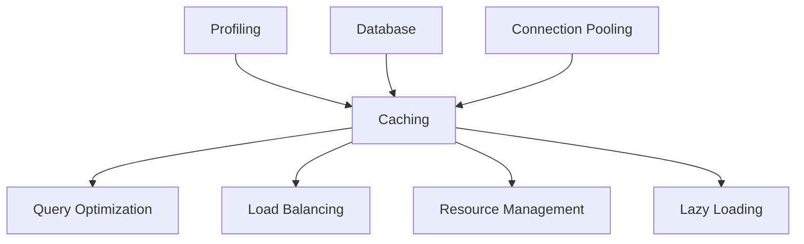

# Caching System Relationships

**System ID:** PERF-001  
**Category:** Performance Optimization  
**Layer:** Infrastructure/Application  
**Status:** Production

## Overview

Caching is a foundational performance optimization technique that stores frequently accessed data in fast-access storage layers to reduce computation, database queries, and network latency.

---

## Upstream Dependencies

### Data Sources
- **Database Systems** → Caching Layer
  - Primary data sources for cache population
  - Cache-aside pattern implementation
  - Write-through/write-back strategies
  
- **API Endpoints** → Response Caching
  - HTTP response caching
  - API rate limit optimization
  - Network latency reduction

- **Computation Results** → Result Caching
  - Expensive calculation results
  - ML model inference results
  - Aggregation/transformation outputs

### Resource Management
- **Memory Management** → Cache Storage
  - RAM allocation for in-memory caches
  - Memory pressure monitoring
  - Eviction policy enforcement

---

## Downstream Consumers

### Application Components
- **Query Optimization** ← Cache Hits
  - Reduced database load
  - Faster query response times
  - Connection pool preservation

- **Load Balancing** ← Distributed Caching
  - Session affinity via cache
  - Reduced backend server load
  - Consistent data across instances

- **Lazy Loading** ← Prefetch Caching
  - Predictive data loading
  - User experience optimization
  - Network bandwidth optimization

---

## Performance Chains

### Hot Path Optimization
```
User Request → Cache Check → [HIT] → Immediate Response (5-50ms)
                          → [MISS] → Database Query → Cache Population → Response (100-500ms)
```

### Multi-Tier Caching
```
L1 (In-Process) → L2 (Redis/Memcached) → L3 (CDN) → Origin Server
   10-100μs          1-10ms                50-200ms      200-2000ms
```

### Cache Warming Chain
```
Application Start → Profiling Data → High-Traffic Endpoints → Prefetch → Cache Population
```

---

## Optimization Patterns

### 1. Cache-Aside (Lazy Loading)
**Pattern:** Application manages cache explicitly
```python
def get_user(user_id):
    # Check cache first
    cached = cache.get(f"user:{user_id}")
    if cached:
        return cached
    
    # Cache miss - load from DB
    user = db.query("SELECT * FROM users WHERE id=?", user_id)
    cache.set(f"user:{user_id}", user, ttl=3600)
    return user
```
**Relationships:**
- → Query Optimization (reduced DB queries)
- → Resource Management (memory allocation)
- → Profiling (cache hit rate metrics)

### 2. Write-Through Caching
**Pattern:** Updates go to cache and database simultaneously
```python
def update_user(user_id, data):
    # Update database
    db.execute("UPDATE users SET ... WHERE id=?", user_id, data)
    
    # Update cache
    cache.set(f"user:{user_id}", data, ttl=3600)
    
    return data
```
**Relationships:**
- → Database Persistence (consistency guarantee)
- → Load Balancing (distributed cache coherency)

### 3. Read-Through Caching
**Pattern:** Cache loader automatically fetches on miss
```python
class CacheLoader:
    def load(self, key):
        return db.query("SELECT * FROM users WHERE id=?", key)

cache = CachingLayer(loader=CacheLoader())
user = cache.get(user_id)  # Auto-loads on miss
```
**Relationships:**
- → Lazy Loading (deferred data fetching)
- → Profiling (miss rate optimization)

### 4. Write-Behind (Write-Back) Caching
**Pattern:** Writes to cache immediately, database asynchronously
```python
def update_user_async(user_id, data):
    # Immediate cache update
    cache.set(f"user:{user_id}", data)
    
    # Queue database write
    write_queue.enqueue(lambda: db.execute("UPDATE users...", data))
```
**Relationships:**
- → Resource Management (write queue management)
- → Load Balancing (async write distribution)

### 5. Cache Stampede Prevention
**Pattern:** Single request fetches data during cache miss
```python
def get_with_stampede_protection(key):
    # Try cache
    cached = cache.get(key)
    if cached:
        return cached
    
    # Acquire lock for this key
    with distributed_lock(f"lock:{key}"):
        # Double-check after acquiring lock
        cached = cache.get(key)
        if cached:
            return cached
        
        # Only one request fetches data
        data = expensive_operation()
        cache.set(key, data)
        return data
```
**Relationships:**
- → Connection Pooling (prevents pool exhaustion)
- → Load Balancing (prevents backend overload)

---

## Caching Strategies

### Eviction Policies

#### LRU (Least Recently Used)
- **Use Case:** General-purpose caching
- **Trade-off:** Good hit rate, moderate overhead
- **Relationships:** → Resource Management (memory limits)

#### LFU (Least Frequently Used)
- **Use Case:** Long-term popular items
- **Trade-off:** Better for stable access patterns
- **Relationships:** → Profiling (access frequency tracking)

#### TTL (Time-to-Live)
- **Use Case:** Data with known freshness requirements
- **Trade-off:** Prevents stale data, may evict hot items
- **Relationships:** → Data Consistency (freshness guarantee)

#### FIFO (First In, First Out)
- **Use Case:** Simple sequential data
- **Trade-off:** Low overhead, poor hit rate
- **Relationships:** → Simplicity vs Performance trade-off

### Cache Invalidation Strategies

#### Time-Based Invalidation
```python
cache.set("key", value, ttl=3600)  # Expire after 1 hour
```
**Relationships:** → Data Freshness Requirements

#### Event-Based Invalidation
```python
@on_user_update
def invalidate_user_cache(user_id):
    cache.delete(f"user:{user_id}")
```
**Relationships:** → Event Sourcing, CQRS Patterns

#### Tag-Based Invalidation
```python
cache.set("user:123", data, tags=["users", "team:5"])
cache.invalidate_tags(["team:5"])  # Invalidate all team members
```
**Relationships:** → Domain-Driven Design

---

## Technology Integrations

### In-Memory Caches
- **Redis** (distributed, persistent)
  - → Connection Pooling (client connection management)
  - → Load Balancing (clustering, sharding)
  
- **Memcached** (distributed, volatile)
  - → Resource Management (memory-only)
  - → High-throughput scenarios

- **In-Process Caches** (lru_cache, cachetools)
  - → Single-instance applications
  - → Minimal latency requirements

### CDN Caching
- **CloudFlare, Akamai, CloudFront**
  - → Static asset caching
  - → Geographic load distribution
  - → DDoS mitigation

### HTTP Caching
- **Browser Cache** (Cache-Control headers)
- **Reverse Proxy Cache** (Nginx, Varnish)
  - → Load Balancing (reduces origin requests)

---

## Metrics & Profiling Integration

### Cache Performance Metrics
```python
cache_metrics = {
    "hit_rate": hits / (hits + misses),
    "miss_rate": misses / (hits + misses),
    "eviction_rate": evictions / total_operations,
    "avg_latency_hit": sum(hit_latencies) / len(hit_latencies),
    "avg_latency_miss": sum(miss_latencies) / len(miss_latencies),
    "memory_usage": cache.memory_bytes(),
    "item_count": cache.size()
}
```

### Profiling Relationships
- **High Miss Rate** → Review cache key design
- **High Eviction Rate** → Increase cache size or adjust TTL
- **Memory Pressure** → Implement more aggressive eviction
- **Slow Cache Operations** → Network/serialization bottleneck

---

## Anti-Patterns & Pitfalls

### 1. Cache Without Monitoring
**Problem:** No visibility into effectiveness
**Solution:** → Integrate with Profiling system

### 2. Unbounded Cache Growth
**Problem:** Memory exhaustion
**Solution:** → Resource Management integration, size limits

### 3. Stale Data Tolerance
**Problem:** Serving outdated information
**Solution:** → Proper TTL + invalidation strategy

### 4. Cache Key Collisions
**Problem:** Different data sharing same key
**Solution:** → Namespacing, unique key generation

### 5. Serialization Overhead
**Problem:** Serialization slower than DB query
**Solution:** → Use efficient formats (msgpack, protobuf)

---

## Cross-System Dependencies



### Bi-Directional Relationships
- **Profiling ↔ Caching:** Metrics drive cache tuning, caching improves profiled performance
- **Resource Management ↔ Caching:** Memory constraints limit cache size, caching reduces resource usage
- **Query Optimization ↔ Caching:** Query plans consider cache, cache reduces query load

---

## Decision Matrix

| Scenario | Recommended Strategy | Related Systems |
|----------|---------------------|-----------------|
| Read-heavy workload | Cache-aside + LRU | Query Optimization, Profiling |
| Write-heavy workload | Write-behind + small cache | Resource Management |
| Real-time data | Short TTL + event invalidation | Event Sourcing |
| Static assets | CDN + long TTL | Load Balancing |
| User sessions | Distributed cache (Redis) | Connection Pooling |
| API responses | HTTP caching + ETags | Lazy Loading |
| Computation results | Result caching + LFU | Optimization |

---

## Implementation Checklist

- [ ] Define cache key naming convention
- [ ] Choose eviction policy based on access patterns
- [ ] Set appropriate TTL values
- [ ] Implement cache warming for critical data
- [ ] Add cache metrics to profiling dashboard
- [ ] Configure cache size limits (→ Resource Management)
- [ ] Implement stampede protection for expensive operations
- [ ] Set up invalidation strategy
- [ ] Add cache health checks
- [ ] Document cache dependencies
- [ ] Test cache failure scenarios
- [ ] Monitor cache hit/miss rates

---

## Performance Impact

| Metric | Without Caching | With Caching | Improvement |
|--------|-----------------|--------------|-------------|
| Avg Response Time | 250ms | 15ms | 16.7x faster |
| DB Queries/sec | 1000 | 100 | 90% reduction |
| CPU Usage | 70% | 40% | 43% reduction |
| Memory Usage | 2GB | 4GB | +2GB trade-off |

**Key Insight:** Caching trades memory for speed and reduced backend load.

---

## Related Documentation
- Query Optimization: `query-optimization-relationships.md`
- Resource Management: `resource-management-relationships.md`
- Connection Pooling: `connection-pooling-relationships.md`
- Profiling: `profiling-relationships.md`
