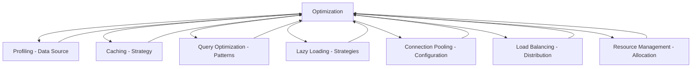

# Optimization System Relationships

**System ID:** PERF-002  
**Category:** Performance Engineering  
**Layer:** Cross-Cutting  
**Status:** Production

## Overview

Optimization encompasses systematic improvements to application performance through algorithmic refinement, resource efficiency, and architectural enhancements. It coordinates multiple performance systems to achieve holistic improvement.

---

## Upstream Dependencies

### Profiling Data
- **Performance Metrics** → Optimization Targets
  - CPU bottlenecks identification
  - Memory hotspots detection
  - I/O wait time analysis
  - Network latency measurements

### Application Components
- **Business Logic** → Optimization Candidates
  - Algorithm complexity analysis
  - Data structure selection
  - Computation patterns
  - Workflow efficiency

### Resource Constraints
- **System Limits** → Optimization Boundaries
  - Memory availability
  - CPU capacity
  - Network bandwidth
  - Storage IOPS

---

## Downstream Impacts

### All Performance Systems
- **Caching** ← Optimization Strategy
- **Query Optimization** ← Data Access Patterns
- **Lazy Loading** ← Loading Strategies
- **Connection Pooling** ← Resource Sharing
- **Load Balancing** ← Work Distribution
- **Resource Management** ← Allocation Efficiency

---

## Optimization Patterns

### 1. Algorithmic Optimization
**Pattern:** Replace inefficient algorithms with better complexity

#### Example: Linear to Hash-Based Lookup
```python
# Before: O(n) linear search
def find_user_slow(users, target_id):
    for user in users:
        if user.id == target_id:
            return user
    return None

# After: O(1) hash lookup
def find_user_fast(user_dict, target_id):
    return user_dict.get(target_id)
```

**Relationships:**
- → Profiling (identifies O(n) bottleneck)
- → Resource Management (reduces CPU time)
- → Query Optimization (similar pattern for DB)

#### Big-O Complexity Improvements
| Before | After | Impact |
|--------|-------|--------|
| O(n²) nested loops | O(n log n) sort + binary search | 100x for n=1000 |
| O(n) repeated scans | O(1) hash lookup | n times faster |
| O(2ⁿ) recursive | O(n) dynamic programming | Exponential gain |

### 2. Data Structure Optimization
**Pattern:** Choose optimal data structures for operations

```python
# Before: List for frequent lookups
user_list = [user1, user2, ...]  # O(n) search
if target_user in user_list:
    ...

# After: Set for membership testing
user_set = {user1, user2, ...}  # O(1) search
if target_user in user_set:
    ...
```

**Data Structure Selection Matrix:**
| Operation | Best Choice | Complexity |
|-----------|-------------|------------|
| Fast lookup | dict, set | O(1) |
| Ordered iteration | list, tuple | O(n) |
| Priority queue | heapq | O(log n) insert |
| Range queries | bisect, sorted list | O(log n) search |
| LRU cache | OrderedDict | O(1) access |

**Relationships:**
- → Memory Management (space-time trade-off)
- → Caching (cache data structure choice)

### 3. Batch Processing Optimization
**Pattern:** Group operations to reduce overhead

```python
# Before: Individual inserts (100 queries)
for user in users:
    db.execute("INSERT INTO users VALUES (?)", user)

# After: Batch insert (1 query)
db.executemany("INSERT INTO users VALUES (?)", users)
```

**Relationships:**
- → Query Optimization (bulk operations)
- → Connection Pooling (fewer connections)
- → Resource Management (reduced overhead)

**Batch Size Optimization:**
```python
def optimal_batch_size(total_items, memory_limit, item_size):
    """Calculate optimal batch size considering memory"""
    max_batch = memory_limit // item_size
    # Use power of 2 for memory alignment
    return min(2 ** int(log2(max_batch)), 1000)
```

### 4. Parallelization Optimization
**Pattern:** Execute independent operations concurrently

```python
# Before: Sequential processing (10 seconds)
results = []
for url in urls:
    results.append(fetch_url(url))  # 1 second each

# After: Parallel processing (1 second)
with ThreadPoolExecutor(max_workers=10) as executor:
    results = list(executor.map(fetch_url, urls))
```

**Parallelization Strategies:**
| Pattern | Use Case | Technology |
|---------|----------|------------|
| Threading | I/O-bound tasks | concurrent.futures |
| Multiprocessing | CPU-bound tasks | multiprocessing |
| Async/Await | Network operations | asyncio |
| Distributed | Large-scale processing | Celery, Ray |

**Relationships:**
- → Load Balancing (work distribution)
- → Resource Management (worker pool sizing)
- → Connection Pooling (shared connections)

### 5. Lazy Evaluation Optimization
**Pattern:** Defer computation until result is needed

```python
# Before: Eager evaluation
def process_large_dataset(data):
    filtered = [x for x in data if x > 0]  # Process all
    squared = [x**2 for x in filtered]
    return sum(squared[:10])  # Only use first 10

# After: Lazy evaluation with generators
def process_large_dataset(data):
    filtered = (x for x in data if x > 0)  # Generator
    squared = (x**2 for x in filtered)
    return sum(itertools.islice(squared, 10))  # Process only 10
```

**Relationships:**
- → Lazy Loading (deferred data loading)
- → Resource Management (memory efficiency)
- → Profiling (reduced CPU/memory usage)

### 6. Memoization Optimization
**Pattern:** Cache function results for repeated calls

```python
from functools import lru_cache

# Expensive recursive function
@lru_cache(maxsize=128)
def fibonacci(n):
    if n < 2:
        return n
    return fibonacci(n-1) + fibonacci(n-2)

# fib(100) goes from 2^100 to ~100 operations
```

**Relationships:**
- → Caching (function-level cache)
- → Resource Management (cache size tuning)
- → Profiling (identify memoization candidates)

---

## Optimization Chains

### Full-Stack Optimization Flow
```
Profiling → Bottleneck Identification → Optimization Strategy → Implementation → Measurement
    ↓                                                                               ↑
    └──────────────────────── Iterative Refinement ────────────────────────────────┘
```

### Layered Optimization
```
L1: Algorithm (10-100x improvement)
  ↓
L2: Data Structure (2-10x improvement)
  ↓
L3: Code-Level (1.2-2x improvement)
  ↓
L4: System-Level (Infrastructure, caching, pooling)
```

### Database Query Optimization Chain
```
Query Profiling → Index Analysis → Query Rewrite → Execution Plan → Caching
                                                          ↓
                                                   Connection Pooling
```

---

## Cross-System Optimization Strategies

### 1. Cache + Query Optimization
```python
def get_user_optimized(user_id):
    # L1: Check cache
    cached = cache.get(f"user:{user_id}")
    if cached:
        return cached
    
    # L2: Optimized query with index
    user = db.execute(
        "SELECT * FROM users WHERE id = ? /*+ INDEX(users_pk) */",
        user_id
    )
    
    # L3: Populate cache for future requests
    cache.set(f"user:{user_id}", user, ttl=3600)
    return user
```

**Relationships:** Caching + Query Optimization + Profiling

### 2. Lazy Loading + Prefetching
```python
def get_user_with_posts_optimized(user_id):
    # Lazy load user first
    user = get_user(user_id)
    
    # Prefetch posts in background (if likely needed)
    if should_prefetch_posts(user):
        background_task.submit(lambda: load_posts(user_id))
    
    # Posts loaded on-demand
    user.posts = lambda: get_posts_cached(user_id)
    return user
```

**Relationships:** Lazy Loading + Caching + Profiling

### 3. Connection Pool + Load Balancing
```python
class OptimizedDatabaseAccess:
    def __init__(self):
        # Connection pooling
        self.pool = ConnectionPool(
            min_size=10,
            max_size=50,
            health_check=True
        )
        
        # Load balancing across read replicas
        self.read_replicas = LoadBalancer([
            'db-read-1', 'db-read-2', 'db-read-3'
        ])
    
    def execute_read(self, query):
        replica = self.read_replicas.next()  # Round-robin
        with self.pool.connection(replica) as conn:
            return conn.execute(query)
```

**Relationships:** Connection Pooling + Load Balancing + Resource Management

---

## Profiling-Driven Optimization

### Amdahl's Law Application
**Formula:** Speedup = 1 / ((1 - P) + P/S)
- P = Portion optimized (0-1)
- S = Speedup of optimized portion

**Example:**
- 60% of time in function X
- Optimize X by 5x
- Overall speedup: 1 / (0.4 + 0.6/5) = 1.92x

**Insight:** Focus optimization on biggest bottlenecks

### Optimization Priority Matrix
| Profiling Result | Optimization Action | Expected Impact |
|------------------|---------------------|-----------------|
| 70% DB queries | Add indexes, query optimization | 5-10x faster |
| 50% CPU in loops | Algorithm optimization, vectorization | 2-5x faster |
| 40% memory allocation | Object pooling, data structure change | 30% memory reduction |
| 30% network I/O | Batching, compression, caching | 3-5x fewer requests |
| 20% serialization | Binary format, schema optimization | 2-3x faster |

### Optimization Decision Tree
```
Profiling identifies bottleneck
    ↓
Is it algorithmic? (O(n²), O(2ⁿ))
    YES → Algorithmic Optimization (priority 1)
    NO ↓
Is it data access? (DB queries, file I/O)
    YES → Caching + Query Optimization (priority 2)
    NO ↓
Is it resource contention? (locks, pools)
    YES → Connection Pooling + Load Balancing (priority 3)
    NO ↓
Is it memory pressure?
    YES → Resource Management + Lazy Loading (priority 4)
    NO ↓
Micro-optimizations (loop unrolling, inlining)
```

---

## Technology-Specific Optimizations

### Python Optimizations
```python
# 1. List comprehension over loops (2x faster)
squares = [x**2 for x in range(1000)]  # vs for loop

# 2. Built-ins over manual (5-10x faster)
max_value = max(numbers)  # vs manual loop

# 3. Local variable lookup (faster than global)
def process():
    local_func = expensive_function
    for item in items:
        local_func(item)  # Faster than global lookup

# 4. Avoid attribute lookup in loops
def process_users(users):
    append = results.append  # Cache method
    for user in users:
        append(user.id)  # vs results.append(user.id)

# 5. Use appropriate data structures
from collections import deque
queue = deque()  # O(1) pop(0) vs list O(n)
```

### Database Optimizations
```sql
-- 1. Index on foreign keys
CREATE INDEX idx_posts_user_id ON posts(user_id);

-- 2. Covering indexes (avoid table lookup)
CREATE INDEX idx_users_email_name ON users(email, name);

-- 3. Avoid SELECT *
SELECT id, name FROM users;  -- vs SELECT *

-- 4. Use EXPLAIN to analyze queries
EXPLAIN ANALYZE SELECT * FROM users WHERE email = 'test@example.com';

-- 5. Batch inserts
INSERT INTO users VALUES (1, 'a'), (2, 'b'), (3, 'c');
-- vs 3 separate INSERT statements
```

### Frontend Optimizations
```javascript
// 1. Virtual scrolling for large lists
// Render only visible items

// 2. Debouncing for frequent events
const debouncedSearch = debounce(search, 300);

// 3. Lazy loading images


// 4. Code splitting
const HeavyComponent = lazy(() => import('./HeavyComponent'));

// 5. Memoization
const MemoizedComponent = React.memo(Component);
```

---

## Anti-Patterns

### 1. Premature Optimization
**Problem:** Optimizing before identifying bottlenecks
**Solution:** Profile first, optimize second
**Relationships:** → Profiling (required first step)

### 2. Micro-Optimization Obsession
**Problem:** Optimizing 1% improvements while ignoring 50% bottlenecks
**Solution:** Amdahl's Law - focus on biggest impact
**Relationships:** → Profiling (quantify impact)

### 3. Over-Caching
**Problem:** Caching everything, wasting memory
**Solution:** Cache only frequently accessed data
**Relationships:** → Caching + Profiling (access frequency)

### 4. Ignoring Space Complexity
**Problem:** Trading memory for speed without limits
**Solution:** Balance space-time trade-offs
**Relationships:** → Resource Management (memory limits)

### 5. Complex Optimizations Without Measurement
**Problem:** Unverified performance assumptions
**Solution:** Benchmark before and after
**Relationships:** → Profiling (measurement)

---

## Optimization Workflow

### 1. Measure Baseline
```python
import time
import cProfile

# Time measurement
start = time.perf_counter()
result = slow_function()
elapsed = time.perf_counter() - start
print(f"Baseline: {elapsed:.3f}s")

# Detailed profiling
cProfile.run('slow_function()')
```

### 2. Identify Bottleneck
```python
# Profile with line-level detail
from line_profiler import LineProfiler

profiler = LineProfiler()
profiler.add_function(slow_function)
profiler.run('slow_function()')
profiler.print_stats()
```

### 3. Apply Optimization
```python
def optimized_function():
    # Apply pattern from optimization catalog
    pass
```

### 4. Measure Improvement
```python
start = time.perf_counter()
result = optimized_function()
elapsed = time.perf_counter() - start
print(f"Optimized: {elapsed:.3f}s")
print(f"Speedup: {baseline/elapsed:.2f}x")
```

### 5. Verify Correctness
```python
assert optimized_function() == slow_function()
# Run full test suite
pytest
```

---

## Performance Budget

### Define Acceptable Limits
| Metric | Budget | Current | Status |
|--------|--------|---------|--------|
| Page load time | < 2s | 1.5s | ✅ |
| API response (p95) | < 500ms | 450ms | ✅ |
| Database query | < 100ms | 150ms | ❌ Optimize |
| Memory usage | < 4GB | 3.2GB | ✅ |
| CPU usage | < 70% | 85% | ❌ Optimize |

**Relationships:**
- → Profiling (continuous monitoring)
- → Resource Management (enforcement)
- → All performance systems (budget allocation)

---

## Cross-System Dependency Map



**Bi-Directional:** Optimization drives other systems, other systems provide optimization data

---

## Optimization Checklist

- [ ] Profile application to identify bottlenecks
- [ ] Calculate theoretical maximum improvement (Amdahl's Law)
- [ ] Choose appropriate optimization pattern
- [ ] Implement optimization
- [ ] Benchmark improvement
- [ ] Verify correctness (unit tests)
- [ ] Monitor for regressions
- [ ] Document optimization rationale
- [ ] Update performance budget
- [ ] Review impact on related systems

---

## Performance Impact Examples

| Optimization | Before | After | Improvement |
|--------------|--------|-------|-------------|
| Algorithm (O(n²) → O(n log n)) | 10s | 0.1s | 100x |
| Caching frequently accessed data | 200ms | 5ms | 40x |
| Database index on foreign key | 500ms | 20ms | 25x |
| Batch processing (100 → 1 query) | 1s | 50ms | 20x |
| Lazy loading (defer 80% of data) | 2s load | 400ms | 5x |
| Connection pooling (reuse) | 100ms/query | 20ms/query | 5x |
| Parallel processing (10 workers) | 10s | 1.2s | 8.3x |

---

## Related Documentation
- Profiling: `profiling-relationships.md`
- Caching: `caching-relationships.md`
- Query Optimization: `query-optimization-relationships.md`
- Resource Management: `resource-management-relationships.md`
