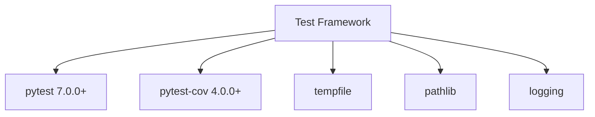
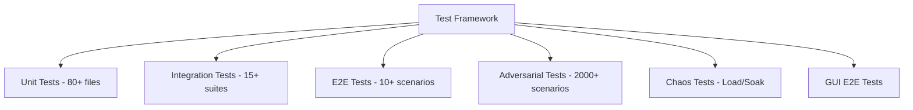
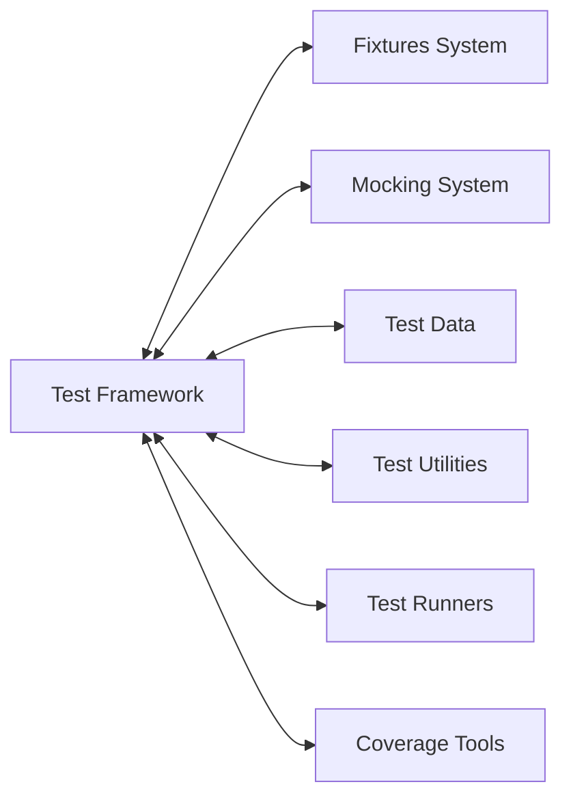
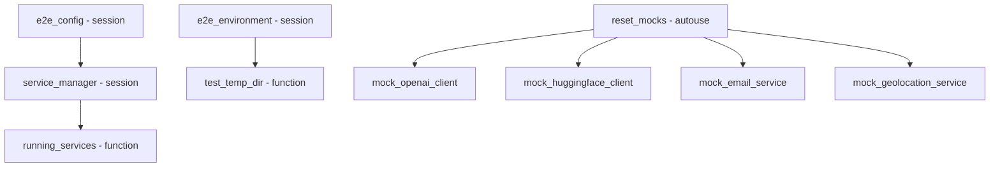

# Test Framework Relationships

**System:** Test Framework  
**Layer:** Testing Infrastructure  
**Agent:** AGENT-061  
**Status:** ✅ COMPLETE

## Overview

The test framework is built on **pytest** with extensive fixture architecture, custom markers, and multi-scope configuration management.

## Core Components

### Pytest Configuration

**Primary Files:**
- `pytest.ini` - Core pytest configuration
- `pyproject.toml` - Tool configuration and markers
- `tests/conftest.py` - Root-level fixtures
- `e2e/conftest.py` - E2E test fixtures
- `tests/gradle_evolution/conftest.py` - Gradle test fixtures

**Framework Stack:**
```
pytest 7.0.0+
├── pytest-cov 4.0.0+ (coverage measurement)
├── ruff (linting integration)
└── Custom markers (28+ specialized markers)
```

## Relationships

### UPSTREAM Dependencies



**Dependency Details:**
- **pytest 7.0.0+** - Core test runner and fixture management
- **pytest-cov 4.0.0+** - Coverage measurement and reporting
- **tempfile** - Temporary directory management for isolated testing
- **pathlib** - Cross-platform path handling
- **logging** - Test execution logging and debugging

### DOWNSTREAM Consumers



**Consumer Categories:**
1. **Unit Tests** (`tests/test_*.py`) - 80+ test files
2. **Integration Tests** (`tests/integration/`, `tests/e2e/`) - 15+ suites
3. **E2E Tests** (`e2e/`) - Full system integration tests
4. **Adversarial Tests** (`tests/test_four_laws_*.py`) - 2000+ security scenarios
5. **Chaos Tests** (`tests/chaos/`, `tests/test_tarl_load_chaos_soak.py`)
6. **GUI Tests** (`tests/gui_e2e/`) - PyQt6 UI testing

### LATERAL Integrations



**Integration Points:**
- **Fixtures System** - Dependency injection via pytest fixtures
- **Mocking System** - Mock service integration (OpenAI, HuggingFace, etc.)
- **Test Data** - JSON-based test data loading
- **Test Utilities** - Helper functions (wait_for_condition, assertions)
- **Test Runners** - npm, pytest, CI/CD integration
- **Coverage Tools** - pytest-cov, analyze_coverage.py

## Configuration Architecture

### Pytest Markers (28 Total)

**Core Markers** (pyproject.toml):
```python
markers = [
    "unit: Unit tests",
    "integration: Integration tests",
]
```

**E2E Markers** (e2e/conftest.py):
```python
- e2e: End-to-end test
- gui: GUI test
- api: API test
- council_hub: Council Hub test
- triumvirate: Triumvirate test
- watch_tower: Watch Tower test
- tarl: TARL enforcement test
- security: Security test
- slow: Slow-running test
- batch: Batch processing test
- temporal: Temporal workflow test
- memory: Memory system test
- knowledge: Knowledge base test
- rag: RAG pipeline test
- agents: Multi-agent test
- failover: Failover test
- recovery: Recovery test
- circuit_breaker: Circuit breaker test
- adversarial: Adversarial/security test
```

### Test Paths Configuration

**pytest.ini:**
```ini
[pytest]
pythonpath = src
testpaths = tests
filterwarnings =
    ignore::DeprecationWarning:passlib
```

**pyproject.toml:**
```toml
[tool.pytest.ini_options]
testpaths = ["tests"]
python_files = "test_*.py"
addopts = "--strict-markers -v"
```

## Multi-Scope Fixture Strategy

### Session-Scoped Fixtures

**Purpose:** Expensive setup that persists across entire test run

```python
@pytest.fixture(scope="session")
def e2e_environment():
    """Set up E2E test environment for entire session."""
    env = E2ETestEnvironment()
    env.setup()
    yield env
    env.teardown()

@pytest.fixture(scope="session")
def e2e_config():
    """Get E2E configuration for tests."""
    return get_config()

@pytest.fixture(scope="session")
def service_manager(e2e_config):
    """Service manager fixture for entire test session."""
    manager = ServiceManager(e2e_config)
    yield manager
    manager.stop_all()
```

**Characteristics:**
- Set up once per test session
- Shared across all tests
- Minimal overhead
- Used for: environment setup, service managers, configuration

### Function-Scoped Fixtures

**Purpose:** Isolated state for each test function

```python
@pytest.fixture
def persona():
    """Create persona."""
    with tempfile.TemporaryDirectory() as tmpdir:
        yield AIPersona(data_dir=tmpdir)

@pytest.fixture
def memory():
    """Create memory system."""
    with tempfile.TemporaryDirectory() as tmpdir:
        yield MemoryExpansionSystem(data_dir=tmpdir)

@pytest.fixture(scope="function", autouse=True)
def reset_mocks():
    """Reset all mock services before each test."""
    reset_all_mocks()
    yield
    reset_all_mocks()
```

**Characteristics:**
- Created fresh for each test
- Complete isolation between tests
- Automatic cleanup via context managers
- Used for: AI systems, mock resets, temporary state

## Fixture Dependency Graph



**Dependency Patterns:**
- Session fixtures → Function fixtures (environment → temp dir)
- Service fixtures → Running services (manager → started services)
- Mock reset (autouse) → Individual mocks (automatic cleanup)

## Test Discovery

### Automatic Discovery Rules

```python
# Path-based auto-marking
def pytest_collection_modifyitems(config, items):
    """Modify test items during collection."""
    for item in items:
        if "e2e" in str(item.fspath):
            item.add_marker(pytest.mark.e2e)
```

**Discovery Patterns:**
1. **File Pattern:** `test_*.py` in `tests/` directory
2. **Class Pattern:** `Test*` classes
3. **Function Pattern:** `test_*` functions
4. **Auto-marking:** Tests in `e2e/` auto-marked as `@pytest.mark.e2e`

## Test Execution Commands

### Core Commands

```bash
# All tests
pytest -v

# Unit tests only
pytest -m unit

# Integration tests only
pytest -m integration

# E2E tests only
pytest -m e2e

# With coverage
pytest --cov=src --cov-report=html

# Specific marker
pytest -m "security and not slow"

# Parallel execution (via npm)
npm run test:python  # runs pytest -q
```

### CI/CD Integration

**GitHub Actions Integration:**
```yaml
# From .github/workflows/codex-deus-ultimate.yml
- name: Run Unit Tests
  run: pytest -m unit --cov=src --cov-report=json

- name: Run Integration Tests
  run: pytest -m integration --cov-append

- name: Run E2E Tests
  run: pytest -m e2e --cov-append

- name: Run Security Tests
  run: pytest -m security --cov-append
```

## Isolation Patterns

### Temporary Directory Pattern

**Standard Pattern:**
```python
@pytest.fixture
def system_under_test():
    with tempfile.TemporaryDirectory() as tmpdir:
        yield SystemUnderTest(data_dir=tmpdir)
```

**Benefits:**
- Complete filesystem isolation
- Automatic cleanup
- No test data pollution
- Thread-safe

**Used By:**
- `tests/test_ai_systems.py` - AI system fixtures
- `tests/test_user_manager.py` - User management fixtures
- All systems accepting `data_dir` parameter

### Mock Reset Pattern

**Autouse Fixture:**
```python
@pytest.fixture(scope="function", autouse=True)
def reset_mocks():
    """Reset all mock services before each test."""
    reset_all_mocks()
    yield
    reset_all_mocks()
```

**Benefits:**
- Automatic cleanup
- No manual reset needed
- Prevents test interdependencies

## Path Resolution

### Multi-Root Path Configuration

**tests/conftest.py:**
```python
ROOT = Path(__file__).resolve().parent.parent
SRC = ROOT / "src"

for path in (ROOT, SRC):
    path_str = str(path)
    if path_str not in sys.path:
        sys.path.insert(0, path_str)
```

**Purpose:**
- Allows imports from `src/` (src layout)
- Allows imports from project root (web package)
- Cross-module test imports

## Key Relationships Summary

### Provides To

| System | Relationship | Description |
|--------|-------------|-------------|
| **Fixtures** | Foundation | Provides fixture management and dependency injection |
| **Unit Tests** | Execution | Runs 80+ unit test files |
| **Integration Tests** | Execution | Runs 15+ integration test suites |
| **E2E Tests** | Execution | Runs end-to-end scenarios |
| **Coverage Tools** | Integration | Integrates pytest-cov for coverage measurement |
| **Test Runners** | Interface | Provides pytest CLI for npm/CI/CD |

### Depends On

| System | Relationship | Description |
|--------|-------------|-------------|
| **pytest** | Core | Test runner and fixture engine |
| **pytest-cov** | Plugin | Coverage measurement |
| **Python stdlib** | Utilities | tempfile, pathlib, logging |
| **Fixtures** | Dependency Injection | All fixture definitions |

## Testing Guarantees

### Framework Guarantees

1. **Isolation:** Each test runs in isolated environment (tempdir)
2. **Repeatability:** Mock reset ensures consistent state
3. **Discovery:** Automatic test discovery via naming conventions
4. **Cleanup:** Automatic cleanup via context managers
5. **Markers:** 28+ markers for selective test execution
6. **Coverage:** Integrated coverage measurement

### Compliance with Governance

**Workspace Profile Requirements:**
- ✅ 80%+ test coverage (via pytest-cov)
- ✅ Unit/Integration/E2E separation (via markers)
- ✅ Deterministic testing (via fixture isolation)
- ✅ Comprehensive test matrix (28+ markers)
- ✅ CI/CD integration (via GitHub Actions)

## Integration Points

### Critical Integrations

1. **Fixtures System** (`relationships/testing/02_fixtures_relationships.md`)
   - Dependency injection
   - Scope management
   - Cleanup automation

2. **Test Utilities** (`relationships/testing/03_test_utilities_relationships.md`)
   - Helper functions
   - Assertion utilities
   - Wait conditions

3. **Coverage Tools** (`relationships/testing/10_coverage_tools_relationships.md`)
   - pytest-cov integration
   - Coverage reporting
   - Threshold enforcement

4. **Test Runners** (`relationships/testing/09_test_runners_relationships.md`)
   - CLI execution
   - npm integration
   - CI/CD automation

## Architectural Notes

### Design Patterns

1. **Fixture Factory Pattern:** Session fixtures create function-scoped fixtures
2. **Context Manager Pattern:** Automatic cleanup via `with` statements
3. **Autouse Pattern:** Automatic mock reset via autouse fixtures
4. **Auto-marking Pattern:** Path-based automatic marker application

### Best Practices

1. **Always use tempdir for filesystem tests** (prevents data pollution)
2. **Use session fixtures for expensive setup** (minimize overhead)
3. **Use function fixtures for isolated state** (ensure test independence)
4. **Use autouse for cleanup** (prevent manual cleanup errors)
5. **Use markers for selective execution** (optimize CI/CD runtime)

## Testing the Test Framework

**Meta-testing:** The test framework itself is validated through:
- 80+ unit tests exercising fixtures
- Integration tests validating multi-scope fixtures
- E2E tests validating full test execution pipeline

---

**Document Version:** 1.0  
**Last Updated:** 2026-04-20  
**Maintainer:** AGENT-061
