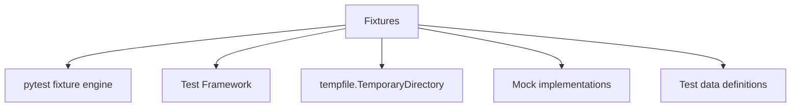
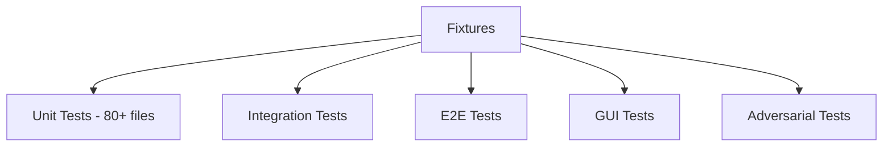
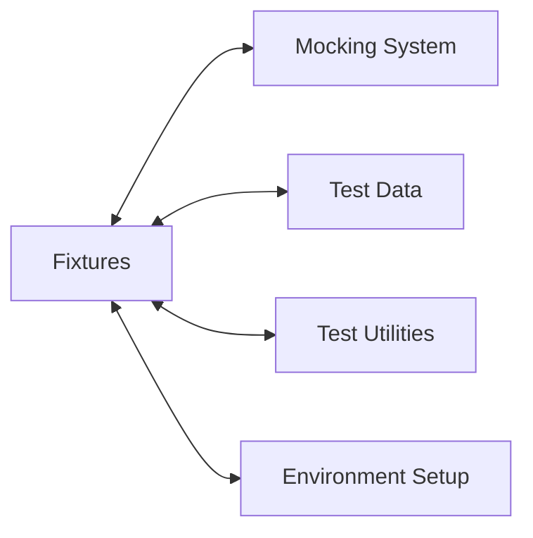
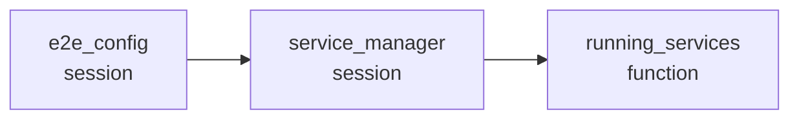
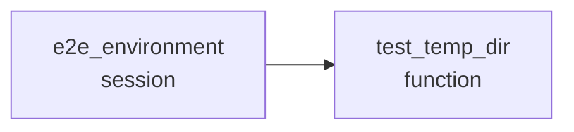
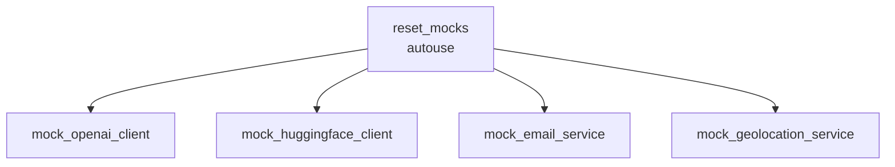

# Fixtures Relationships

**System:** Fixtures  
**Layer:** Testing Infrastructure  
**Agent:** AGENT-061  
**Status:** ✅ COMPLETE

## Overview

The fixture system provides dependency injection, state management, and automatic cleanup for all tests. It uses pytest's multi-scope fixture architecture with session, function, and autouse patterns.

## Core Components

### Fixture Files

**Location Map:**
```
tests/conftest.py          # Root-level fixtures (path setup)
e2e/conftest.py            # E2E fixtures (28 fixtures)
e2e/fixtures/
├── mocks.py              # Mock service fixtures
├── test_data.py          # Test data fixtures
└── test_users.py         # User fixtures
tests/gradle_evolution/conftest.py  # Gradle test fixtures
```

**Fixture Count:** 28+ fixtures across 5 files

## Relationships

### UPSTREAM Dependencies



**Dependency Details:**
- **pytest** - Fixture engine and scope management
- **Test Framework** - Marker definitions and configuration
- **tempfile** - Temporary directory creation
- **Mock Classes** - MockOpenAIClient, MockHuggingFaceClient, etc.
- **Test Data** - TEST_PERSONA_STATES, TEST_KNOWLEDGE_BASE, etc.

### DOWNSTREAM Consumers



**All test files consume fixtures:**
- `tests/test_ai_systems.py` - Uses persona, memory, manager fixtures
- `tests/test_user_manager.py` - Uses tempdir fixtures
- `tests/e2e/test_system_integration_e2e.py` - Uses flask_client, authenticated fixtures
- `tests/gui_e2e/test_launch_and_login.py` - Uses GUI fixtures

### LATERAL Integrations



## Fixture Architecture

### Session-Scoped Fixtures

**Purpose:** Expensive setup shared across all tests

```python
# e2e/conftest.py

@pytest.fixture(scope="session")
def e2e_config():
    """Get E2E configuration for tests."""
    return get_config()

@pytest.fixture(scope="session")
def e2e_environment():
    """Set up E2E test environment for entire session."""
    env = E2ETestEnvironment()
    env.setup()
    yield env
    env.teardown()

@pytest.fixture(scope="session")
def service_manager(e2e_config):
    """Service manager fixture for entire test session."""
    manager = ServiceManager(e2e_config)
    yield manager
    manager.stop_all()
```

**Characteristics:**
- Created once per test session
- Shared across all tests
- Explicit cleanup in teardown
- Used for: configuration, environment, service managers

**Session Fixtures List:**
1. `e2e_config` - Test configuration
2. `e2e_environment` - Environment setup/teardown
3. `service_manager` - Service lifecycle management

### Function-Scoped Fixtures

**Purpose:** Isolated state for each test

```python
# tests/test_ai_systems.py

@pytest.fixture
def persona():
    """Create persona."""
    with tempfile.TemporaryDirectory() as tmpdir:
        yield AIPersona(data_dir=tmpdir)

@pytest.fixture
def memory():
    """Create memory system."""
    with tempfile.TemporaryDirectory() as tmpdir:
        yield MemoryExpansionSystem(data_dir=tmpdir)

@pytest.fixture
def manager():
    """Create manager."""
    with tempfile.TemporaryDirectory() as tmpdir:
        yield LearningRequestManager(data_dir=tmpdir)

# e2e/conftest.py

@pytest.fixture(scope="function")
def test_temp_dir(e2e_environment):
    """Get temporary directory for test."""
    return e2e_environment.get_temp_dir()

@pytest.fixture(scope="function")
def running_services(service_manager):
    """Start all services for a test function."""
    service_manager.start_all(wait_for_health=True)
    yield service_manager
    service_manager.stop_all()
```

**Characteristics:**
- Created fresh for each test
- Automatic cleanup via context managers
- Complete isolation between tests
- Used for: AI systems, services, temporary directories

**Function Fixtures List (Core AI Systems):**
1. `persona` - AIPersona with tempdir
2. `memory` - MemoryExpansionSystem with tempdir
3. `manager` - LearningRequestManager with tempdir
4. `test_temp_dir` - Temporary directory
5. `running_services` - Started service manager
6. `health_checker` - HealthChecker instance

### Autouse Fixtures

**Purpose:** Automatic execution before/after each test

```python
# e2e/conftest.py

@pytest.fixture(scope="function", autouse=True)
def reset_mocks():
    """Reset all mock services before each test."""
    reset_all_mocks()
    yield
    reset_all_mocks()
```

**Characteristics:**
- Runs automatically (no explicit injection)
- Ensures clean state between tests
- No return value needed
- Used for: mock reset, cleanup, logging

**Autouse Fixtures List:**
1. `reset_mocks` - Automatic mock service reset

## Fixture Dependency Chains

### Configuration Chain



**Flow:**
1. `e2e_config` loads test configuration (session)
2. `service_manager` uses config to create manager (session)
3. `running_services` starts services from manager (function)

**Dependencies:**
```python
def service_manager(e2e_config):  # Depends on e2e_config
    return ServiceManager(e2e_config)

def running_services(service_manager):  # Depends on service_manager
    service_manager.start_all(wait_for_health=True)
    yield service_manager
    service_manager.stop_all()
```

### Environment Chain



**Flow:**
1. `e2e_environment` sets up test environment (session)
2. `test_temp_dir` gets temporary directory from environment (function)

**Dependencies:**
```python
def e2e_environment():
    env = E2ETestEnvironment()
    env.setup()
    yield env
    env.teardown()

def test_temp_dir(e2e_environment):  # Depends on e2e_environment
    return e2e_environment.get_temp_dir()
```

### Mock Chain



**Flow:**
1. `reset_mocks` runs automatically before each test (autouse)
2. Individual mock fixtures return pre-configured mock instances
3. `reset_mocks` runs automatically after each test (cleanup)

**Dependencies:**
```python
@pytest.fixture(scope="function", autouse=True)
def reset_mocks():  # Runs automatically
    reset_all_mocks()
    yield
    reset_all_mocks()

@pytest.fixture
def mock_openai_client():  # Available after reset
    return mock_openai

@pytest.fixture
def mock_huggingface_client():
    return mock_huggingface
```

## Fixture Categories

### 1. Configuration Fixtures

**Purpose:** Provide test configuration

```python
@pytest.fixture(scope="session")
def e2e_config():
    """Get E2E configuration for tests."""
    return get_config()
```

**Fixtures:**
- `e2e_config` - E2E test configuration

### 2. Environment Fixtures

**Purpose:** Set up and tear down test environment

```python
@pytest.fixture(scope="session")
def e2e_environment():
    """Set up E2E test environment for entire session."""
    env = E2ETestEnvironment()
    env.setup()
    yield env
    env.teardown()

@pytest.fixture(scope="function")
def test_temp_dir(e2e_environment):
    """Get temporary directory for test."""
    return e2e_environment.get_temp_dir()
```

**Fixtures:**
- `e2e_environment` - Environment setup/teardown
- `test_temp_dir` - Temporary directory

### 3. Service Fixtures

**Purpose:** Manage external services

```python
@pytest.fixture(scope="session")
def service_manager(e2e_config):
    """Service manager fixture for entire test session."""
    manager = ServiceManager(e2e_config)
    yield manager
    manager.stop_all()

@pytest.fixture(scope="function")
def running_services(service_manager):
    """Start all services for a test function."""
    service_manager.start_all(wait_for_health=True)
    yield service_manager
    service_manager.stop_all()

@pytest.fixture(scope="function")
def health_checker():
    """Health checker fixture."""
    return HealthChecker()
```

**Fixtures:**
- `service_manager` - Service lifecycle management
- `running_services` - Started services
- `health_checker` - Health check utility

### 4. User Fixtures

**Purpose:** Provide test user accounts

```python
# e2e/conftest.py

@pytest.fixture
def admin_user():
    """Admin user fixture."""
    return get_admin_user()

@pytest.fixture
def regular_user():
    """Regular user fixture."""
    return get_regular_user()
```

**Fixtures:**
- `admin_user` - Admin user credentials
- `regular_user` - Regular user credentials

**User Data Structure** (e2e/fixtures/test_users.py):
```python
def get_admin_user():
    return {
        "username": "admin",
        "password": "open-sesame",
        "role": "admin",
    }

def get_regular_user():
    return {
        "username": "testuser",
        "password": "test-password",
        "role": "user",
    }
```

### 5. Test Data Fixtures

**Purpose:** Provide pre-configured test data

```python
# e2e/conftest.py

@pytest.fixture
def test_persona_state():
    """Test AI persona state."""
    return TEST_PERSONA_STATES["neutral"].copy()

@pytest.fixture
def test_knowledge_base():
    """Test knowledge base data."""
    return TEST_KNOWLEDGE_BASE.copy()

@pytest.fixture
def test_audit_logs():
    """Test audit log data."""
    return TEST_AUDIT_LOGS.copy()
```

**Fixtures:**
- `test_persona_state` - AI persona state data
- `test_knowledge_base` - Knowledge base data
- `test_audit_logs` - Audit log data

**Test Data Structures** (e2e/fixtures/test_data.py):
```python
TEST_PERSONA_STATES = {
    "curious": {
        "personality_traits": {
            "curiosity": 0.9,
            "empathy": 0.6,
            "creativity": 0.8,
            "patience": 0.5,
        },
        "mood": "excited",
        "interaction_count": 42,
    },
    "neutral": {
        "personality_traits": {
            "curiosity": 0.5,
            "empathy": 0.5,
            "creativity": 0.5,
            "patience": 0.5,
        },
        "mood": "neutral",
        "interaction_count": 0,
    },
}

TEST_KNOWLEDGE_BASE = {
    "user_preferences": [
        {"key": "theme", "value": "dark"},
        {"key": "language", "value": "english"},
    ],
    "learned_facts": [
        {
            "category": "science",
            "fact": "The speed of light is approximately 299,792,458 m/s",
            "confidence": 1.0,
        },
    ],
}
```

### 6. Mock Service Fixtures

**Purpose:** Provide mock external services

```python
# e2e/conftest.py

@pytest.fixture
def mock_openai_client():
    """Mock OpenAI client fixture."""
    return mock_openai

@pytest.fixture
def mock_huggingface_client():
    """Mock HuggingFace client fixture."""
    return mock_huggingface

@pytest.fixture
def mock_email_service():
    """Mock email service fixture."""
    return mock_email

@pytest.fixture
def mock_geolocation_service():
    """Mock geolocation service fixture."""
    return mock_geolocation
```

**Fixtures:**
- `mock_openai_client` - Mock OpenAI API
- `mock_huggingface_client` - Mock HuggingFace API
- `mock_email_service` - Mock email service
- `mock_geolocation_service` - Mock geolocation service

### 7. AI System Fixtures

**Purpose:** Provide isolated AI system instances

```python
# tests/test_ai_systems.py

@pytest.fixture
def persona():
    """Create persona."""
    with tempfile.TemporaryDirectory() as tmpdir:
        yield AIPersona(data_dir=tmpdir)

@pytest.fixture
def memory():
    """Create memory system."""
    with tempfile.TemporaryDirectory() as tmpdir:
        yield MemoryExpansionSystem(data_dir=tmpdir)

@pytest.fixture
def manager():
    """Create manager."""
    with tempfile.TemporaryDirectory() as tmpdir:
        yield LearningRequestManager(data_dir=tmpdir)
```

**Fixtures:**
- `persona` - AIPersona with isolated data directory
- `memory` - MemoryExpansionSystem with isolated data directory
- `manager` - LearningRequestManager with isolated data directory

### 8. Flask/Web Fixtures

**Purpose:** Provide Flask test client and authentication

```python
# tests/e2e/test_system_integration_e2e.py

@pytest.fixture
def flask_client():
    """Create Flask test client."""
    flask_app.config.update({"TESTING": True})
    with flask_app.test_client() as client:
        yield client

@pytest.fixture
def authenticated_flask_admin(flask_client):
    """Create authenticated admin session in Flask backend."""
    login_payload = {"username": "admin", "password": "open-sesame"}
    response = flask_client.post("/api/auth/login", json=login_payload)
    assert response.status_code == 200
    data = response.get_json()
    return {"client": flask_client, "token": data["token"], "user": data["user"]}
```

**Fixtures:**
- `flask_client` - Flask test client
- `authenticated_flask_admin` - Authenticated admin session

## Fixture Usage Patterns

### Pattern 1: Tempdir Isolation

**Pattern:**
```python
@pytest.fixture
def system_under_test():
    with tempfile.TemporaryDirectory() as tmpdir:
        yield SystemUnderTest(data_dir=tmpdir)
```

**Benefits:**
- Complete filesystem isolation
- Automatic cleanup
- No test pollution
- Thread-safe

**Used By:**
- All AI system fixtures (persona, memory, manager)
- User manager fixtures
- Any system with persistent state

### Pattern 2: Fixture Chaining

**Pattern:**
```python
@pytest.fixture(scope="session")
def config():
    return load_config()

@pytest.fixture
def manager(config):  # Depends on config
    return Manager(config)

@pytest.fixture
def running_manager(manager):  # Depends on manager
    manager.start()
    yield manager
    manager.stop()
```

**Benefits:**
- Clear dependency hierarchy
- Shared configuration
- Explicit lifecycle management

**Used By:**
- e2e_config → service_manager → running_services
- e2e_environment → test_temp_dir

### Pattern 3: Autouse for Cleanup

**Pattern:**
```python
@pytest.fixture(scope="function", autouse=True)
def cleanup():
    reset_state()
    yield
    reset_state()
```

**Benefits:**
- Automatic execution
- No manual cleanup needed
- Consistent state between tests

**Used By:**
- reset_mocks fixture

### Pattern 4: Data Copy

**Pattern:**
```python
@pytest.fixture
def test_data():
    return TEST_DATA_CONSTANT.copy()
```

**Benefits:**
- Prevents mutation of shared data
- Each test gets fresh copy
- Safe for parallel execution

**Used By:**
- test_persona_state (uses .copy())
- test_knowledge_base (uses .copy())
- test_audit_logs (uses .copy())

## Fixture Scope Strategy

### When to Use Session Scope

**Criteria:**
- Expensive setup (>1s)
- Read-only usage
- No state modification
- Shared configuration

**Examples:**
- `e2e_config` - Configuration loading
- `e2e_environment` - Environment setup
- `service_manager` - Service manager creation

### When to Use Function Scope

**Criteria:**
- Test isolation required
- State modification
- Temporary resources
- Each test needs fresh instance

**Examples:**
- `persona` - AI system with state
- `memory` - Memory system with state
- `running_services` - Started services
- `test_temp_dir` - Temporary directory

## Fixture Naming Conventions

### Naming Patterns

| Pattern | Example | Purpose |
|---------|---------|---------|
| `<system>` | `persona` | Core system instance |
| `test_<data>` | `test_persona_state` | Test data |
| `mock_<service>` | `mock_openai_client` | Mock service |
| `running_<service>` | `running_services` | Active service |
| `<adjective>_<noun>` | `authenticated_flask_admin` | Modified instance |

## Key Relationships Summary

### Provides To

| System | Relationship | Description |
|--------|-------------|-------------|
| **Unit Tests** | Dependency Injection | Provides isolated AI systems |
| **Integration Tests** | State Management | Provides shared services |
| **E2E Tests** | Environment Setup | Provides running environment |
| **Mocking System** | Mock Instances | Provides configured mocks |
| **Test Data** | Data Provisioning | Provides test data copies |

### Depends On

| System | Relationship | Description |
|--------|-------------|-------------|
| **pytest** | Core Engine | Fixture management and scoping |
| **Test Framework** | Configuration | Markers and test discovery |
| **Mock Classes** | Implementation | MockOpenAI, MockHuggingFace, etc. |
| **Test Data** | Constants | TEST_PERSONA_STATES, etc. |
| **tempfile** | Utilities | Temporary directory management |

## Testing Guarantees

### Fixture Guarantees

1. **Isolation:** Function-scoped fixtures provide complete isolation
2. **Cleanup:** Context managers ensure automatic cleanup
3. **Consistency:** Autouse fixtures ensure consistent state
4. **Dependency:** Fixture dependencies are resolved correctly
5. **Scope:** Session fixtures shared, function fixtures isolated

### Compliance with Governance

**Workspace Profile Requirements:**
- ✅ Complete isolation (tempdir pattern)
- ✅ Automatic cleanup (context managers)
- ✅ Dependency injection (pytest fixtures)
- ✅ State management (session vs function scope)
- ✅ Mock integration (mock fixtures)

## Architectural Notes

### Design Patterns

1. **Factory Pattern:** Fixtures act as factories for test objects
2. **Dependency Injection Pattern:** pytest resolves fixture dependencies
3. **Context Manager Pattern:** Automatic cleanup via `with` statements
4. **Singleton Pattern:** Session fixtures are singletons per session
5. **Copy-on-Access Pattern:** Test data fixtures return copies

### Best Practices

1. **Always use tempdir for filesystem tests** (prevents pollution)
2. **Use session scope for expensive setup** (minimize overhead)
3. **Use function scope for stateful tests** (ensure isolation)
4. **Use autouse for global cleanup** (prevent manual errors)
5. **Copy test data** (prevent mutation of shared constants)
6. **Chain fixtures for dependencies** (clear hierarchy)

---

**Document Version:** 1.0  
**Last Updated:** 2026-04-20  
**Maintainer:** AGENT-061
