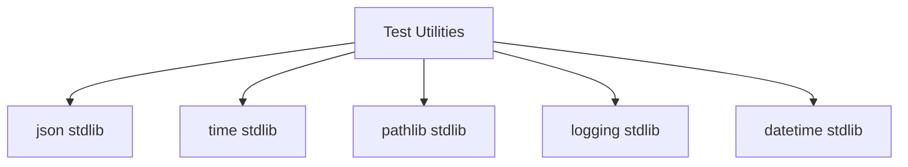
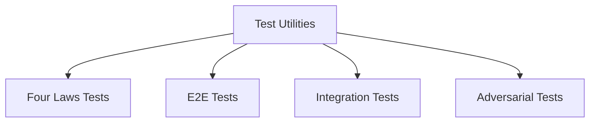

# Test Utilities Relationships

**System:** Test Utilities  
**Layer:** Testing Infrastructure  
**Agent:** AGENT-061  
**Status:** ✅ COMPLETE

## Overview

Test utilities provide reusable helper functions, assertions, and wait conditions used across all test types. The system includes scenario recording, test helpers, and assertion utilities.

## Core Components

### Utility Files

**Location Map:**
```
tests/utils/
├── scenario_recorder.py   # Four Laws scenario recording
└── __init__.py

e2e/utils/
├── test_helpers.py         # E2E helper functions
└── assertions.py           # Custom assertions
```

## Relationships

### UPSTREAM Dependencies



### DOWNSTREAM Consumers



## Scenario Recorder

### Purpose

Records Four Laws validation scenarios with metadata for audit and analysis.

### Implementation

**File:** `tests/utils/scenario_recorder.py`

```python
@dataclass(frozen=True)
class ScenarioRecord:
    suite: str
    scenario_id: str
    action: str
    context: dict[str, Any]
    expected_allowed: bool
    allowed: bool
    reason: str
    passed: bool
    ts_utc: str
```

### Key Functions

#### 1. ScenarioRecorder Class

```python
class ScenarioRecorder:
    def __init__(self, suite: str) -> None:
        self.suite = suite
        self.records: list[ScenarioRecord] = []

    def add(
        self,
        *,
        scenario_id: str,
        action: str,
        context: dict[str, Any],
        expected_allowed: bool,
        allowed: bool,
        reason: str,
        passed: bool,
    ) -> None:
        """Add scenario record with timestamp."""
        self.records.append(
            ScenarioRecord(
                suite=self.suite,
                scenario_id=scenario_id,
                action=action,
                context=context,
                expected_allowed=expected_allowed,
                allowed=allowed,
                reason=reason,
                passed=passed,
                ts_utc=utc_now_iso(),
            )
        )

    def flush_jsonl(self) -> Path:
        """Write records to JSONL file in test-artifacts/."""
        out_dir = _artifact_dir()
        ts = datetime.now(UTC).strftime("%Y%m%dT%H%M%SZ")
        out_path = out_dir / f"fourlaws-{self.suite}-{ts}.jsonl"
        with out_path.open("w", encoding="utf-8") as f:
            for r in self.records:
                f.write(json.dumps(asdict(r), ensure_ascii=False) + "\n")
        return out_path
```

**Benefits:**
- Immutable records via `@dataclass(frozen=True)`
- UTC timestamps for consistency
- JSONL format for streaming/analysis
- Configurable artifact directory

#### 2. Artifact Directory Management

```python
def _artifact_dir() -> Path:
    """Get artifact directory from environment or default."""
    base = Path(os.environ.get("PROJECT_AI_TEST_ARTIFACTS", "test-artifacts"))
    base.mkdir(parents=True, exist_ok=True)
    return base
```

**Features:**
- Environment variable configuration (`PROJECT_AI_TEST_ARTIFACTS`)
- Automatic directory creation
- Default to `test-artifacts/`

### Usage Pattern

**Example from Four Laws tests:**
```python
def test_1000_scenarios():
    recorder = ScenarioRecorder("deterministic")
    
    for scenario in scenarios:
        is_allowed, reason = FourLaws.validate_action(
            scenario["action"],
            context=scenario["context"]
        )
        
        passed = (is_allowed == scenario["expected"])
        
        recorder.add(
            scenario_id=scenario["id"],
            action=scenario["action"],
            context=scenario["context"],
            expected_allowed=scenario["expected"],
            allowed=is_allowed,
            reason=reason,
            passed=passed,
        )
    
    # Write to disk
    artifact_path = recorder.flush_jsonl()
    print(f"Scenarios recorded to: {artifact_path}")
```

### Output Format

**JSONL Structure:**
```jsonl
{"suite": "deterministic", "scenario_id": "FL001", "action": "Delete user data", "context": {"is_user_order": true}, "expected_allowed": true, "allowed": true, "reason": "User order allowed", "passed": true, "ts_utc": "2026-04-20T13:45:00.123456Z"}
{"suite": "deterministic", "scenario_id": "FL002", "action": "Harm humans", "context": {"endangers_humanity": true}, "expected_allowed": false, "allowed": false, "reason": "Law 1: Cannot harm humans", "passed": true, "ts_utc": "2026-04-20T13:45:00.234567Z"}
```

**Benefits:**
- Line-delimited for streaming
- Each line is valid JSON
- Easy to parse with `jq`, `grep`, Python
- Supports large datasets

## E2E Test Helpers

### Purpose

Provide reusable helper functions for E2E tests (wait conditions, file operations, assertions).

### Implementation

**File:** `e2e/utils/test_helpers.py`

### Key Functions

#### 1. wait_for_condition()

```python
def wait_for_condition(
    condition: Callable[[], bool],
    timeout: float = 30.0,
    check_interval: float = 0.5,
    error_message: str = "Condition not met within timeout",
) -> bool:
    """Wait for a condition to become true.
    
    Args:
        condition: Callable that returns True when condition is met
        timeout: Maximum time to wait in seconds
        check_interval: Time between checks in seconds
        error_message: Error message if timeout
    
    Returns:
        True if condition was met, False if timeout
    """
    start_time = time.time()
    
    while time.time() - start_time < timeout:
        try:
            if condition():
                return True
        except Exception as e:
            logger.debug("Condition check raised exception: %s", e)
        
        time.sleep(check_interval)
    
    logger.error(error_message)
    return False
```

**Usage Examples:**
```python
# Wait for service to be healthy
assert wait_for_condition(
    lambda: health_checker.check_service("api"),
    timeout=60.0,
    error_message="API service not healthy"
)

# Wait for file to exist
assert wait_for_condition(
    lambda: Path("data/output.json").exists(),
    timeout=10.0,
    error_message="Output file not created"
)

# Wait for database record
assert wait_for_condition(
    lambda: db.query(User).filter_by(username="test").first() is not None,
    timeout=5.0,
    error_message="User not created in database"
)
```

**Features:**
- Configurable timeout and check interval
- Exception handling (logs but continues)
- Custom error messages
- Returns boolean (can be used in assertions)

#### 2. load_json_file()

```python
def load_json_file(file_path: Path) -> dict[str, Any] | list[Any]:
    """Load and parse a JSON file.
    
    Args:
        file_path: Path to JSON file
    
    Returns:
        Parsed JSON data
    
    Raises:
        FileNotFoundError: If file doesn't exist
        json.JSONDecodeError: If file contains invalid JSON
    """
    if not file_path.exists():
        raise FileNotFoundError(f"File not found: {file_path}")
    
    with open(file_path) as f:
        return json.load(f)
```

**Usage Examples:**
```python
# Load test data
test_data = load_json_file(Path("test-data/scenarios.json"))

# Load configuration
config = load_json_file(Path("config/test_config.json"))

# Load expected output
expected = load_json_file(Path("expected/output.json"))
```

#### 3. save_json_file()

```python
def save_json_file(
    data: dict[str, Any] | list[Any],
    file_path: Path,
    indent: int = 2,
) -> None:
    """Save data to a JSON file.
    
    Args:
        data: Data to save
        file_path: Path to save to
        indent: JSON indentation level
    """
    file_path.parent.mkdir(parents=True, exist_ok=True)
    with open(file_path, "w") as f:
        json.dump(data, f, indent=indent)
```

**Usage Examples:**
```python
# Save test results
save_json_file(results, Path("test-artifacts/results.json"))

# Save generated test data
save_json_file(generated_data, Path("test-data/generated.json"))
```

**Features:**
- Automatic directory creation
- Configurable indentation
- Type hints for dict or list

## Test Data Management

### Test Data Structure

**File:** `e2e/fixtures/test_data.py`

```python
# AI Persona test data
TEST_PERSONA_STATES = {
    "curious": {
        "personality_traits": {
            "curiosity": 0.9,
            "empathy": 0.6,
            "creativity": 0.8,
            "patience": 0.5,
        },
        "mood": "excited",
        "interaction_count": 42,
    },
    "neutral": {
        "personality_traits": {
            "curiosity": 0.5,
            "empathy": 0.5,
            "creativity": 0.5,
            "patience": 0.5,
        },
        "mood": "neutral",
        "interaction_count": 0,
    },
}

# Knowledge base test data
TEST_KNOWLEDGE_BASE = {
    "user_preferences": [
        {"key": "theme", "value": "dark"},
        {"key": "language", "value": "english"},
    ],
    "learned_facts": [
        {
            "category": "science",
            "fact": "The speed of light is approximately 299,792,458 m/s",
            "confidence": 1.0,
        },
    ],
}
```

### Test Data Files

**Location Map:**
```
test-data/
├── adversarial_stress_tests_2000.json    # 2000 adversarial scenarios
├── owasp_compliant_tests.json            # OWASP security tests
├── white_hatter_scenarios.json           # White hat scenarios
└── audit/                                 # Test audit logs

data/red_team_stress_tests/
├── stress_test_results.json              # Stress test results
└── red_team_stress_test_scenarios.json   # Red team scenarios
```

## Assertion Utilities

### Purpose

Custom assertion helpers for common test patterns.

### Implementation

**File:** `e2e/utils/assertions.py`

**Common Patterns:**
- JSON structure assertions
- API response assertions
- State transition assertions
- Error message assertions

## Usage Patterns

### Pattern 1: Wait for Async Operation

```python
def test_async_operation(running_services):
    # Trigger async operation
    client.post("/api/trigger-async-task")
    
    # Wait for completion
    assert wait_for_condition(
        lambda: task_is_complete(),
        timeout=30.0,
        error_message="Task did not complete"
    )
```

### Pattern 2: Scenario Recording

```python
def test_scenario_suite():
    recorder = ScenarioRecorder("my-suite")
    
    for scenario in scenarios:
        result = system_under_test(scenario)
        recorder.add(
            scenario_id=scenario["id"],
            action=scenario["action"],
            context=scenario["context"],
            expected_allowed=scenario["expected"],
            allowed=result.allowed,
            reason=result.reason,
            passed=(result.allowed == scenario["expected"]),
        )
    
    artifact_path = recorder.flush_jsonl()
    assert artifact_path.exists()
```

### Pattern 3: File Operations

```python
def test_data_processing():
    # Load input data
    input_data = load_json_file(Path("test-data/input.json"))
    
    # Process data
    output_data = process(input_data)
    
    # Save output
    save_json_file(output_data, Path("test-artifacts/output.json"))
    
    # Verify output
    expected = load_json_file(Path("expected/output.json"))
    assert output_data == expected
```

## Key Relationships Summary

### Provides To

| System | Relationship | Description |
|--------|-------------|-------------|
| **Four Laws Tests** | Scenario Recording | Records validation scenarios |
| **E2E Tests** | Wait Conditions | Async operation waiting |
| **Integration Tests** | File Operations | JSON loading/saving |
| **All Tests** | Assertions | Custom assertion helpers |

### Depends On

| System | Relationship | Description |
|--------|-------------|-------------|
| **Python stdlib** | Core Utilities | json, time, pathlib, logging |
| **Test Framework** | Integration | Used by all test types |

## Testing Guarantees

### Utility Guarantees

1. **Scenario Recording:** Immutable records with UTC timestamps
2. **Wait Conditions:** Configurable timeout with exception handling
3. **File Operations:** Automatic directory creation
4. **Type Safety:** Type hints for all functions
5. **Error Handling:** Clear error messages and logging

### Compliance with Governance

**Workspace Profile Requirements:**
- ✅ Production-ready utilities (no prototypes)
- ✅ Complete error handling (exceptions, logging)
- ✅ Type hints for maintainability
- ✅ Documentation with examples
- ✅ Reusable across test types

## Architectural Notes

### Design Patterns

1. **Builder Pattern:** ScenarioRecorder builds records incrementally
2. **Facade Pattern:** wait_for_condition simplifies async waiting
3. **Factory Pattern:** Utility functions create standardized outputs
4. **Immutable Pattern:** ScenarioRecord is frozen dataclass

### Best Practices

1. **Use ScenarioRecorder for Four Laws tests** (audit trail)
2. **Use wait_for_condition for async operations** (avoid sleep)
3. **Use load/save_json_file for test data** (consistent format)
4. **Set environment variable for artifact dir** (CI/CD integration)
5. **Always flush scenario recorder** (persist results)

---

**Document Version:** 1.0  
**Last Updated:** 2026-04-20  
**Maintainer:** AGENT-061
