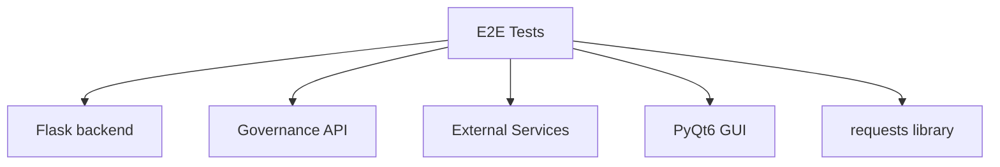
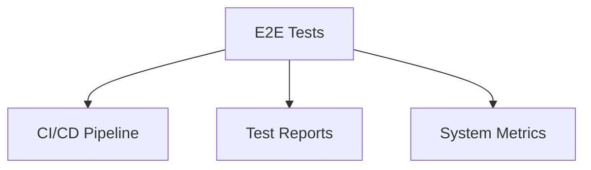
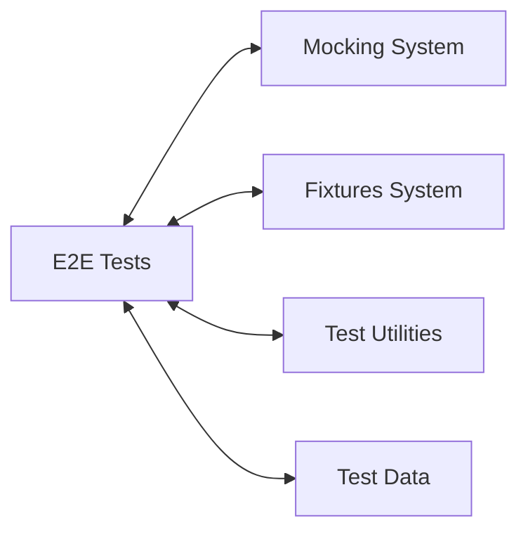

# E2E Tests Relationships

**System:** E2E Tests  
**Layer:** End-to-End Testing  
**Agent:** AGENT-061  
**Status:** ✅ COMPLETE

## Overview

End-to-End (E2E) tests validate complete system workflows across multiple components, including web backend, governance APIs, services, and integrations. Tests span from authentication through governed operations.

## Core Components

### E2E Test Structure

**Location Map:**
```
e2e/
├── conftest.py                 # E2E fixtures and configuration
├── config/
│   └── e2e_config.py          # E2E configuration management
├── fixtures/
│   ├── mocks.py               # Mock external services
│   ├── test_data.py           # Test data constants
│   └── test_users.py          # User credentials
├── orchestration/
│   ├── service_manager.py     # Service lifecycle management
│   ├── setup_teardown.py      # Environment setup/teardown
│   └── health_checks.py       # Service health checking
├── reporting/                  # Test reporting utilities
├── scenarios/                  # Test scenarios
└── utils/                      # E2E-specific utilities

tests/e2e/
├── test_system_integration_e2e.py      # Cross-component flows
├── test_governance_api_e2e.py          # Governance API tests
├── test_web_backend_endpoints.py       # Backend endpoint tests
└── test_web_backend_complete_e2e.py    # Complete backend flows

tests/gui_e2e/
└── test_launch_and_login.py            # GUI E2E tests
```

**Test Count:** 10+ E2E test scenarios

## Relationships

### UPSTREAM Dependencies



**Dependency Details:**
- **Flask Backend** - Web API testing (`web/backend/app.py`)
- **Governance API** - Policy enforcement testing (`start_api.py`)
- **External Services** - OpenAI, HuggingFace (mocked)
- **PyQt6** - GUI testing (via QTest)
- **requests** - HTTP client for API testing

### DOWNSTREAM Consumers



**E2E test results feed:**
- CI/CD validation gates
- Test coverage reports
- System performance metrics
- Integration health monitoring

### LATERAL Integrations



## E2E Test Architecture

### Service Manager

**Purpose:** Manage lifecycle of services required for E2E tests

**File:** `e2e/orchestration/service_manager.py`

```python
class ServiceManager:
    def __init__(self, config):
        self.config = config
        self.services = {}
    
    def start_all(self, wait_for_health=True):
        """Start all configured services."""
        for service in self.config.services:
            self.start_service(service)
        
        if wait_for_health:
            self.wait_for_health()
    
    def stop_all(self):
        """Stop all running services."""
        for service_name in self.services:
            self.stop_service(service_name)
    
    def wait_for_health(self, timeout=60):
        """Wait for all services to be healthy."""
        for service_name in self.services:
            wait_for_condition(
                lambda: self.check_health(service_name),
                timeout=timeout,
                error_message=f"{service_name} not healthy"
            )
```

**Managed Services:**
- Flask backend (port 5000)
- Governance API (port 8001)
- Mock external services

### Health Checker

**Purpose:** Verify service health and readiness

**File:** `e2e/orchestration/health_checks.py`

```python
class HealthChecker:
    def check_service(self, service_url: str) -> bool:
        """Check if service is healthy."""
        try:
            response = requests.get(
                f"{service_url}/health",
                timeout=5
            )
            return response.status_code == 200
        except requests.exceptions.RequestException:
            return False
    
    def wait_for_service(
        self,
        service_url: str,
        timeout: float = 30.0
    ) -> bool:
        """Wait for service to be healthy."""
        return wait_for_condition(
            lambda: self.check_service(service_url),
            timeout=timeout,
            error_message=f"Service {service_url} not healthy"
        )
```

**Health Endpoints:**
- `/health` - Service health status
- `/ready` - Service readiness status

### E2E Environment

**Purpose:** Set up and tear down test environment

**File:** `e2e/orchestration/setup_teardown.py`

```python
class E2ETestEnvironment:
    def __init__(self):
        self.temp_dirs = []
        self.started_services = []
    
    def setup(self):
        """Set up E2E test environment."""
        # Create temp directories
        # Configure services
        # Set environment variables
        pass
    
    def teardown(self):
        """Tear down E2E test environment."""
        # Stop services
        # Clean up temp directories
        # Reset environment
        pass
    
    def get_temp_dir(self) -> Path:
        """Get isolated temporary directory for test."""
        temp_dir = tempfile.mkdtemp()
        self.temp_dirs.append(temp_dir)
        return Path(temp_dir)
```

## E2E Test Categories

### 1. Cross-Component Integration Tests

**File:** `tests/e2e/test_system_integration_e2e.py`

**Purpose:** Test workflows spanning multiple components

```python
class TestCrossComponentIntegration:
    def test_e2e_web_to_governance_flow(
        self,
        authenticated_flask_admin,
        governance_api_available
    ):
        """
        Test complete flow: User authenticates in web backend,
        then submits governed intent.
        """
        # Step 1: User is authenticated in Flask backend
        client = authenticated_flask_admin["client"]
        token = authenticated_flask_admin["token"]
        
        # Step 2: Verify Flask auth works
        profile_response = client.get(
            "/api/auth/profile",
            headers={"X-Auth-Token": token}
        )
        assert profile_response.status_code == 200
        
        # Step 3: User submits intent to governance API
        intent = {
            "actor": "human",
            "action": "read",
            "target": f"/data/{username}/profile.json",
            "origin": "web-frontend",
            "context": {"authenticated_user": username},
        }
        
        gov_response = requests.post(
            f"{GOVERNANCE_API_URL}/intent",
            json=intent,
            timeout=TIMEOUT
        )
        
        assert gov_response.status_code == 200
        assert gov_response.json()["allowed"] is True
```

**Test Scenarios:**
- Web authentication → Governance API
- Web backend → External services
- GUI → Backend → Database
- User flow → AI processing → Response

### 2. Governance API E2E Tests

**File:** `tests/e2e/test_governance_api_e2e.py`

**Purpose:** Test governance policy enforcement end-to-end

**Test Scenarios:**
- Intent validation with Four Laws
- Policy enforcement across services
- Audit log generation
- Override system integration

### 3. Web Backend E2E Tests

**File:** `tests/e2e/test_web_backend_endpoints.py`

**Purpose:** Test all Flask backend endpoints

**Test Scenarios:**
- Authentication endpoints (`/api/auth/login`, `/api/auth/profile`)
- AI system endpoints (persona, memory, learning)
- Data analysis endpoints
- Image generation endpoints

### 4. Complete Backend Flow Tests

**File:** `tests/e2e/test_web_backend_complete_e2e.py`

**Purpose:** Test complete user workflows in web backend

**Test Scenarios:**
- User registration → Login → Profile update → Logout
- AI interaction: Query → Processing → Response → Memory storage
- Data upload → Analysis → Results → Export
- Image generation → Storage → Retrieval

### 5. GUI E2E Tests

**File:** `tests/gui_e2e/test_launch_and_login.py`

**Purpose:** Test PyQt6 GUI workflows

**Test Scenarios:**
- Application launch
- Login flow (Tron page → Dashboard)
- Dashboard interactions
- Image generation UI
- Settings panel

## E2E Fixture Usage

### Session-Scoped Fixtures

```python
@pytest.fixture(scope="session")
def e2e_environment():
    """Set up E2E test environment for entire session."""
    env = E2ETestEnvironment()
    env.setup()
    yield env
    env.teardown()

@pytest.fixture(scope="session")
def service_manager(e2e_config):
    """Service manager fixture for entire test session."""
    manager = ServiceManager(e2e_config)
    yield manager
    manager.stop_all()
```

**Used For:**
- Environment setup (once per session)
- Service manager (shared across tests)
- Configuration loading

### Function-Scoped Fixtures

```python
@pytest.fixture(scope="function")
def running_services(service_manager):
    """Start all services for a test function."""
    service_manager.start_all(wait_for_health=True)
    yield service_manager
    service_manager.stop_all()

@pytest.fixture
def flask_client():
    """Create Flask test client."""
    flask_app.config.update({"TESTING": True})
    with flask_app.test_client() as client:
        yield client

@pytest.fixture
def authenticated_flask_admin(flask_client):
    """Create authenticated admin session."""
    login_payload = {"username": "admin", "password": "open-sesame"}
    response = flask_client.post("/api/auth/login", json=login_payload)
    data = response.get_json()
    return {
        "client": flask_client,
        "token": data["token"],
        "user": data["user"]
    }
```

**Used For:**
- Service startup/shutdown per test
- Flask test client
- Authenticated sessions

## E2E Test Patterns

### Pattern 1: Service-Dependent Tests

```python
def test_with_services(running_services, health_checker):
    """Test that requires running services."""
    # Services are automatically started by running_services fixture
    assert health_checker.check_service("http://localhost:5000")
    
    # Test logic
    response = requests.get("http://localhost:5000/api/endpoint")
    assert response.status_code == 200
    
    # Services automatically stopped after test
```

### Pattern 2: Authenticated API Tests

```python
def test_authenticated_endpoint(authenticated_flask_admin):
    """Test endpoint requiring authentication."""
    client = authenticated_flask_admin["client"]
    token = authenticated_flask_admin["token"]
    
    response = client.get(
        "/api/protected/endpoint",
        headers={"X-Auth-Token": token}
    )
    
    assert response.status_code == 200
```

### Pattern 3: Cross-Service Integration

```python
def test_cross_service_flow(
    authenticated_flask_admin,
    governance_api_available
):
    """Test flow across multiple services."""
    # Step 1: Web backend operation
    client = authenticated_flask_admin["client"]
    response1 = client.post("/api/action", json=data)
    
    # Step 2: Governance validation
    intent = {"action": "...", "context": {...}}
    response2 = requests.post(
        f"{GOVERNANCE_API_URL}/intent",
        json=intent
    )
    
    # Step 3: Verify integration
    assert response1.status_code == 200
    assert response2.json()["allowed"] is True
```

## E2E Test Markers

**Available Markers:**
```python
@pytest.mark.e2e              # Auto-applied to all tests in e2e/
@pytest.mark.gui              # GUI tests
@pytest.mark.api              # API tests
@pytest.mark.council_hub      # Council Hub tests
@pytest.mark.triumvirate      # Triumvirate tests
@pytest.mark.watch_tower      # Watch Tower tests
@pytest.mark.tarl             # TARL enforcement tests
@pytest.mark.security         # Security tests
@pytest.mark.slow             # Slow-running tests
@pytest.mark.temporal         # Temporal workflow tests
@pytest.mark.failover         # Failover tests
@pytest.mark.recovery         # Recovery tests
@pytest.mark.circuit_breaker  # Circuit breaker tests
```

**Usage:**
```bash
# Run all E2E tests
pytest -m e2e

# Run GUI E2E tests only
pytest -m "e2e and gui"

# Run API E2E tests, excluding slow tests
pytest -m "e2e and api and not slow"
```

## Mock Service Integration

**E2E tests use mocks for external services:**

```python
@pytest.fixture
def mock_openai_client():
    """Mock OpenAI client for E2E tests."""
    return mock_openai

@pytest.fixture
def mock_huggingface_client():
    """Mock HuggingFace client for E2E tests."""
    return mock_huggingface
```

**Mocked Services:**
- OpenAI API (chat completions, image generation)
- HuggingFace API (model inference)
- Email service (emergency alerts)
- Geolocation service (location tracking)

**Benefits:**
- No external API calls (faster, cheaper)
- Deterministic responses
- Offline testing
- No rate limits

## E2E Test Data

**Test User Accounts:**
```python
# Admin user
{
    "username": "admin",
    "password": "open-sesame",
    "role": "admin"
}

# Regular user
{
    "username": "testuser",
    "password": "test-password",
    "role": "user"
}
```

**Test AI Persona States:**
- Curious (high curiosity, low patience)
- Cautious (low curiosity, high patience)
- Neutral (balanced traits)

## Key Relationships Summary

### Provides To

| System | Relationship | Description |
|--------|-------------|-------------|
| **CI/CD** | Validation | Pre-merge integration validation |
| **System Metrics** | Monitoring | End-to-end health metrics |
| **Test Reports** | Coverage | Integration coverage reporting |
| **Documentation** | Examples | Real-world usage examples |

### Depends On

| System | Relationship | Description |
|--------|-------------|-------------|
| **Flask Backend** | Testing | Web API integration |
| **Governance API** | Testing | Policy enforcement |
| **Mocking System** | Dependencies | External service mocks |
| **Fixtures** | Infrastructure | Test fixtures and data |
| **Test Utilities** | Helpers | Wait conditions, assertions |

## Testing Guarantees

### E2E Guarantees

1. **Cross-Component:** Tests span multiple system components
2. **Real Workflows:** Tests simulate actual user workflows
3. **Service Integration:** Tests validate service communication
4. **Mock Isolation:** Tests use mocks for external dependencies
5. **Health Checks:** Tests verify service health before execution

### Compliance with Governance

**Workspace Profile Requirements:**
- ✅ Full system integration (cross-component tests)
- ✅ Production-like scenarios (real workflows)
- ✅ Service health validation (health checks)
- ✅ Mock external dependencies (deterministic)
- ✅ CI/CD integration (automated validation)

## Architectural Notes

### Design Patterns

1. **Service Orchestration Pattern:** ServiceManager controls services
2. **Health Check Pattern:** Verify service readiness
3. **Test Double Pattern:** Mocks for external services
4. **Fixture Chain Pattern:** Session → Function fixtures

### Best Practices

1. **Always check service health before tests** (health_checker)
2. **Use running_services for service-dependent tests** (auto lifecycle)
3. **Use authenticated fixtures for protected endpoints** (no manual login)
4. **Mock external services** (deterministic, fast, offline)
5. **Use wait_for_condition for async operations** (avoid sleep)

---

**Document Version:** 1.0  
**Last Updated:** 2026-04-20  
**Maintainer:** AGENT-061
