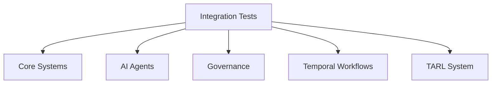
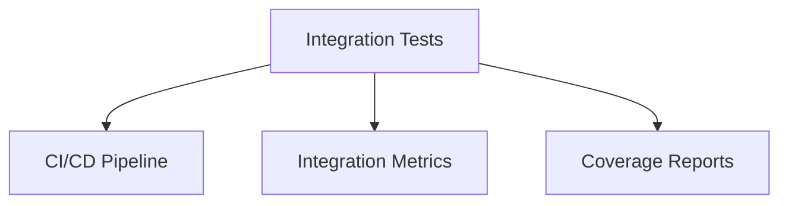
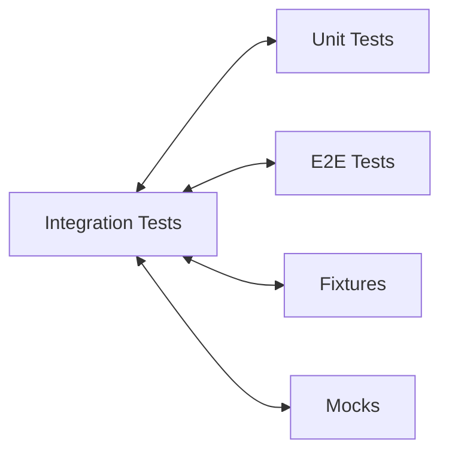

# Integration Tests Relationships

**System:** Integration Tests  
**Layer:** Integration Testing  
**Agent:** AGENT-061  
**Status:** ✅ COMPLETE

## Overview

Integration tests validate interactions between multiple modules/components within the same system layer. They test module boundaries, data flow, and component communication without full E2E orchestration.

## Core Components

### Integration Test Structure

**Location Map:**
```
tests/integration/            # Integration test suites (currently empty subdirectory)
tests/
├── test_integration_flow.py                  # Integration flow tests
├── test_integration_pipeline_blocking.py     # Pipeline blocking tests
├── test_integration_user_learning.py         # User+Learning integration
├── test_full_integration.py                  # Full system integration
├── test_council_hub_integration.py           # Council Hub integration
├── test_defense_engine_integration.py        # Defense engine integration
├── test_god_tier_integration.py              # God tier system integration
├── test_temporal_integration.py              # Temporal workflow integration
├── test_tarl_integration.py                  # TARL integration
├── test_antigravity_integration.py           # Antigravity integration
├── test_codex_integration.py                 # Codex integration
└── test_deepseek_integration.py              # DeepSeek integration
```

**Test Count:** 12+ integration test files

## Relationships

### UPSTREAM Dependencies



**Dependency Details:**
- **Core Systems** - ai_systems.py, user_manager.py
- **AI Agents** - oversight, planner, validator, explainability
- **Governance** - Policy enforcement, Four Laws
- **Temporal** - Workflow execution
- **TARL** - Build system integration

### DOWNSTREAM Consumers



### LATERAL Integrations



## Integration Test Categories

### 1. System Integration Tests

**File:** `tests/test_full_integration.py`

**Purpose:** Test integration of all core systems

**Components Tested:**
- FourLaws + AIPersona
- MemoryExpansion + LearningRequest
- CommandOverride + UserManager
- All 6 AI systems together

**Example:**
```python
def test_full_system_integration():
    """Test integration of all core systems."""
    # Create all systems
    four_laws = FourLaws()
    persona = AIPersona(data_dir=tmpdir)
    memory = MemoryExpansionSystem(data_dir=tmpdir)
    learning = LearningRequestManager(data_dir=tmpdir)
    override = CommandOverride(data_dir=tmpdir)
    
    # Test interaction: Learning request validation
    req_id = learning.create_request("Python", "Learn async")
    is_allowed, reason = four_laws.validate_action(
        "Learn Python async",
        context={"is_learning": True}
    )
    assert is_allowed
    
    # Test interaction: Persona + Memory
    conv_id = memory.log_conversation("Hello", "Hi!")
    persona.adjust_trait("curiosity", 0.1)
    stats = persona.get_statistics()
    
    assert len(conv_id) > 0
    assert stats["personality"]["curiosity"] > 0.5
```

### 2. Pipeline Integration Tests

**File:** `tests/test_integration_pipeline_blocking.py`

**Purpose:** Test data pipeline integration and blocking behavior

**Components Tested:**
- Data ingestion → Processing → Storage
- Pipeline stages with blocking
- Error propagation through pipeline

### 3. User-Learning Integration

**File:** `tests/test_integration_user_learning.py`

**Purpose:** Test integration between user management and learning systems

**Components Tested:**
- UserManager + LearningRequestManager
- User authentication → Learning request
- Black Vault integration

**Example:**
```python
def test_user_learning_integration():
    """Test integration between user and learning systems."""
    user_manager = UserManager(data_dir=tmpdir1)
    learning_manager = LearningRequestManager(data_dir=tmpdir2)
    
    # Create user
    user_manager.create_user("testuser", "password123")
    
    # User creates learning request
    req_id = learning_manager.create_request(
        topic="Python",
        description="Learn async",
        requester="testuser"
    )
    
    # Approve request
    learning_manager.approve_request(req_id)
    
    # Verify request status
    requests = learning_manager.get_all_requests()
    assert requests[req_id]["status"] == "approved"
    assert requests[req_id]["requester"] == "testuser"
```

### 4. Council Hub Integration

**File:** `tests/test_council_hub_integration.py`

**Purpose:** Test Council Hub integration with governance

**Components Tested:**
- Council Hub decision-making
- Multi-agent coordination
- Governance policy enforcement

### 5. Defense Engine Integration

**File:** `tests/test_defense_engine_integration.py`

**Purpose:** Test defense engine integration with security systems

**Components Tested:**
- Defense engine + Security agents
- Threat detection + Response
- Four Laws enforcement

### 6. Temporal Integration

**File:** `tests/test_temporal_integration.py`

**Purpose:** Test Temporal workflow integration

**Components Tested:**
- Temporal workflows + AI systems
- Workflow scheduling + Execution
- Durable execution guarantees

### 7. TARL Integration

**File:** `tests/test_tarl_integration.py`

**Purpose:** Test TARL build system integration

**Components Tested:**
- TARL CLI + Build system
- Dependency resolution
- Artifact caching

### 8. External System Integration

**Files:**
- `test_antigravity_integration.py` - Antigravity system
- `test_codex_integration.py` - Codex system
- `test_deepseek_integration.py` - DeepSeek model

**Purpose:** Test integration with external systems/models

## Integration Test Patterns

### Pattern 1: Two-System Integration

```python
def test_two_system_integration():
    """Test interaction between two systems."""
    system_a = SystemA(data_dir=tmpdir1)
    system_b = SystemB(data_dir=tmpdir2)
    
    # System A produces data
    data = system_a.produce_data()
    
    # System B consumes data
    result = system_b.consume_data(data)
    
    # Verify integration
    assert result.success
    assert result.data_source == "SystemA"
```

### Pattern 2: Pipeline Integration

```python
def test_pipeline_integration():
    """Test data flow through pipeline."""
    ingestion = IngestionSystem()
    processing = ProcessingSystem()
    storage = StorageSystem()
    
    # Ingest data
    raw_data = ingestion.ingest(source)
    
    # Process data
    processed_data = processing.process(raw_data)
    
    # Store data
    storage.store(processed_data)
    
    # Verify pipeline
    retrieved = storage.retrieve(processed_data.id)
    assert retrieved == processed_data
```

### Pattern 3: Multi-Component Integration

```python
def test_multi_component_integration():
    """Test interaction of 3+ components."""
    component_a = ComponentA()
    component_b = ComponentB()
    component_c = ComponentC()
    
    # Component A → B
    data_ab = component_a.send_to(component_b)
    
    # Component B → C
    data_bc = component_b.send_to(component_c)
    
    # Verify end-to-end flow
    final_result = component_c.finalize()
    assert final_result.includes(data_ab)
    assert final_result.includes(data_bc)
```

### Pattern 4: Error Propagation Integration

```python
def test_error_propagation():
    """Test error propagation through integrated systems."""
    system_a = SystemA()
    system_b = SystemB()
    
    # Trigger error in System A
    with pytest.raises(SystemAError) as exc_info:
        system_a.fail()
    
    # Verify error propagates to System B
    result = system_b.handle_error(exc_info.value)
    assert result.error_handled
    assert result.source == "SystemA"
```

## Integration Fixtures

### Multi-System Fixtures

```python
@pytest.fixture
def integrated_systems():
    """Create integrated system instances."""
    with tempfile.TemporaryDirectory() as tmpdir1:
        with tempfile.TemporaryDirectory() as tmpdir2:
            system_a = SystemA(data_dir=tmpdir1)
            system_b = SystemB(data_dir=tmpdir2)
            yield (system_a, system_b)
```

### Shared State Fixtures

```python
@pytest.fixture
def shared_data_dir():
    """Create shared directory for integrated systems."""
    with tempfile.TemporaryDirectory() as tmpdir:
        yield tmpdir
```

## Integration Test Markers

**Integration Marker:**
```python
@pytest.mark.integration  # Defined in pyproject.toml
```

**Usage:**
```bash
# Run integration tests only
pytest -m integration

# Run integration and E2E tests
pytest -m "integration or e2e"

# Run unit tests (exclude integration)
pytest -m "not integration"
```

## Integration vs Unit vs E2E

### Distinction Table

| Aspect | Unit Tests | Integration Tests | E2E Tests |
|--------|-----------|-------------------|-----------|
| **Scope** | Single function/class | 2-5 components | Full system |
| **Dependencies** | Mocked | Partially real | Real services |
| **Isolation** | Complete | Partial | Minimal |
| **Speed** | Fast (<1s) | Medium (1-5s) | Slow (5-60s) |
| **Marker** | `@pytest.mark.unit` | `@pytest.mark.integration` | `@pytest.mark.e2e` |
| **Example** | `test_ai_systems.py` | `test_user_learning_integration.py` | `test_system_integration_e2e.py` |

### When to Use Integration Tests

**Use Integration Tests When:**
- Testing module boundaries
- Testing data flow between components
- Testing API contracts between modules
- Testing error propagation
- Not requiring full system orchestration

**Don't Use Integration Tests When:**
- Testing single function (use unit tests)
- Testing full user workflow (use E2E tests)
- Testing isolated logic (use unit tests)

## Key Relationships Summary

### Provides To

| System | Relationship | Description |
|--------|-------------|-------------|
| **CI/CD** | Validation | Module integration validation |
| **Coverage** | Metrics | Integration coverage reporting |
| **Documentation** | Examples | Component interaction examples |

### Depends On

| System | Relationship | Description |
|--------|-------------|-------------|
| **Core Systems** | Testing | AI systems, user management |
| **Fixtures** | Infrastructure | Multi-system fixtures |
| **Mocks** | Partial | Selective mocking |
| **Test Utilities** | Helpers | Assertions, wait conditions |

## Testing Guarantees

### Integration Guarantees

1. **Module Boundaries:** Tests validate interfaces between modules
2. **Data Flow:** Tests verify data transformation across components
3. **Error Handling:** Tests verify error propagation
4. **Partial Isolation:** Tests use real implementations where feasible
5. **Performance:** Tests execute faster than E2E (1-5s range)

### Compliance with Governance

**Workspace Profile Requirements:**
- ✅ Component integration (module boundaries)
- ✅ Partial mocking (real implementations preferred)
- ✅ CI/CD integration (automated validation)
- ✅ Coverage reporting (integration coverage)
- ✅ Documentation (interaction examples)

## Architectural Notes

### Design Patterns

1. **Fixture Chain Pattern:** Multi-system fixture creation
2. **Pipeline Pattern:** Data flow through stages
3. **Error Propagation Pattern:** Error handling across boundaries
4. **Partial Mock Pattern:** Mock only external dependencies

### Best Practices

1. **Test 2-5 components per test** (not single, not full system)
2. **Use real implementations where possible** (avoid over-mocking)
3. **Test data flow and transformations** (not just success/failure)
4. **Test error propagation** (verify errors cross boundaries)
5. **Keep tests focused** (one integration point per test)

---

**Document Version:** 1.0  
**Last Updated:** 2026-04-20  
**Maintainer:** AGENT-061
