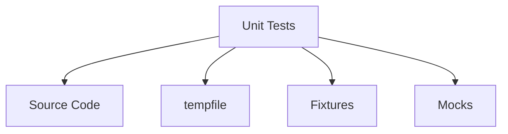
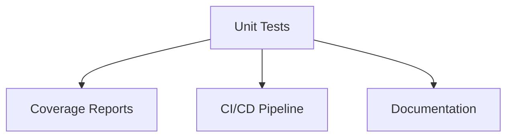
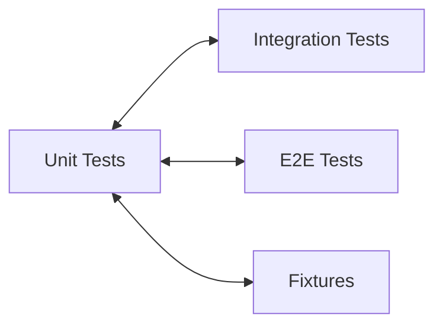

# Unit Tests Relationships

**System:** Unit Tests  
**Layer:** Unit Testing  
**Agent:** AGENT-061  
**Status:** ✅ COMPLETE

## Overview

Unit tests validate individual functions, methods, and classes in isolation. They are the foundation of the testing pyramid, providing fast feedback and high coverage of code paths.

## Core Components

### Unit Test Structure

**Location Map:**
```
tests/
├── test_ai_systems.py                    # AI systems unit tests (6 systems)
├── test_user_manager.py                  # User manager unit tests
├── test_user_manager_extended.py         # Extended user manager tests
├── test_command_override_extended.py     # Command override tests
├── test_learning_requests_extended.py    # Learning request tests
├── test_persona_extended.py              # Persona system tests
├── test_memory_extended.py               # Memory system tests
├── test_image_generator.py               # Image generator tests
├── test_image_generator_extended.py      # Extended image tests
├── test_data_analysis.py                 # Data analysis tests
├── test_data_analysis_extended.py        # Extended data analysis tests
├── test_api.py                           # API tests
├── test_cli.py                           # CLI tests
├── test_cloud_sync.py                    # Cloud sync tests
└── [80+ more unit test files]
```

**Test Count:** 80+ unit test files

## Relationships

### UPSTREAM Dependencies



**Dependency Details:**
- **Source Code** - Functions/classes under test
- **tempfile** - Temporary directories for isolation
- **Fixtures** - Test fixtures for setup
- **Mocks** - Mock external dependencies

### DOWNSTREAM Consumers



### LATERAL Integrations



## Core Unit Test Files

### 1. AI Systems Tests

**File:** `tests/test_ai_systems.py`

**Systems Tested:**
- FourLaws (2 tests)
- AIPersona (3 tests)
- MemoryExpansionSystem (2 tests)
- LearningRequestManager (1 test)

**Example:**
```python
class TestFourLaws:
    """Test Four Laws."""
    
    def test_law_validation_blocked(self):
        """Test that dangerous actions are blocked."""
        is_allowed, _ = FourLaws.validate_action(
            "Harm humans",
            context={"endangers_humanity": True},
        )
        assert not is_allowed
    
    def test_law_validation_user_order_allowed(self):
        """Test that user orders are allowed."""
        is_allowed, _ = FourLaws.validate_action(
            "Delete cache",
            context={"is_user_order": True},
        )
        assert is_allowed

class TestAIPersona:
    """Test AI Persona."""
    
    @pytest.fixture
    def persona(self):
        """Create persona."""
        with tempfile.TemporaryDirectory() as tmpdir:
            yield AIPersona(data_dir=tmpdir)
    
    def test_initialization(self, persona):
        """Test persona initializes."""
        assert persona.user_name == "Friend"
        assert len(persona.personality) == 8
    
    def test_trait_adjustment(self, persona):
        """Test adjusting traits."""
        original = persona.personality["curiosity"]
        persona.adjust_trait("curiosity", 0.1)
        assert persona.personality["curiosity"] > original
```

### 2. User Manager Tests

**Files:**
- `tests/test_user_manager.py` - Core user management
- `tests/test_user_manager_extended.py` - Extended scenarios

**Tests:**
- User creation with password hashing (bcrypt)
- User authentication
- User deletion
- Password security
- Account lockout
- JSON persistence

### 3. Component-Specific Tests

**Patterns:**
- `test_<component>.py` - Core tests
- `test_<component>_extended.py` - Extended scenarios
- `test_issue_<number>_<component>.py` - Issue-specific tests

## Unit Test Patterns

### Pattern 1: Isolated State with Tempdir

```python
@pytest.fixture
def system_under_test():
    """Create isolated system instance."""
    with tempfile.TemporaryDirectory() as tmpdir:
        yield SystemUnderTest(data_dir=tmpdir)

def test_system_behavior(system_under_test):
    """Test system with isolated state."""
    # Test operations
    result = system_under_test.operation()
    
    # Assertions
    assert result.success
```

**Benefits:**
- Complete filesystem isolation
- No test pollution
- Automatic cleanup
- Thread-safe

### Pattern 2: Property Testing

```python
def test_property_based():
    """Test properties that should always hold."""
    for input_value in test_values:
        result = function_under_test(input_value)
        
        # Property: output should always be positive
        assert result > 0
        
        # Property: idempotent
        assert function_under_test(result) == result
```

### Pattern 3: Edge Case Testing

```python
def test_edge_cases():
    """Test boundary conditions."""
    # Empty input
    assert function([]) == []
    
    # Single element
    assert function([1]) == [1]
    
    # Large input
    large_input = list(range(10000))
    assert len(function(large_input)) == 10000
    
    # None input
    with pytest.raises(ValueError):
        function(None)
```

### Pattern 4: Error Path Testing

```python
def test_error_handling():
    """Test error conditions."""
    # Invalid input
    with pytest.raises(ValueError) as exc_info:
        function_under_test(invalid_input)
    
    assert "expected error message" in str(exc_info.value)
    
    # Missing file
    with pytest.raises(FileNotFoundError):
        function_under_test("/nonexistent/path")
```

## Unit Test Categories

### 1. State Management Tests

**Purpose:** Test state initialization, modification, persistence

```python
def test_state_initialization(system):
    """Test initial state."""
    assert system.state == "initialized"
    assert system.counter == 0

def test_state_modification(system):
    """Test state changes."""
    system.increment()
    assert system.counter == 1
    
    system.increment()
    assert system.counter == 2

def test_state_persistence(system):
    """Test state saves to disk."""
    system.increment()
    system._save_state()
    
    # Reload system
    new_system = System(data_dir=system.data_dir)
    assert new_system.counter == 1
```

### 2. Validation Tests

**Purpose:** Test input validation and sanitization

```python
def test_input_validation():
    """Test input validation."""
    # Valid input
    assert validate_input("valid") is True
    
    # Invalid input
    assert validate_input("") is False
    assert validate_input(None) is False
    
    # Sanitization
    assert sanitize("<script>") == "&lt;script&gt;"
```

### 3. Algorithm Tests

**Purpose:** Test algorithms and transformations

```python
def test_sorting_algorithm():
    """Test sorting algorithm."""
    unsorted = [3, 1, 4, 1, 5, 9, 2, 6]
    sorted_list = sort_algorithm(unsorted)
    
    assert sorted_list == [1, 1, 2, 3, 4, 5, 6, 9]
    
    # Original unchanged
    assert unsorted == [3, 1, 4, 1, 5, 9, 2, 6]
```

### 4. Calculation Tests

**Purpose:** Test mathematical calculations

```python
def test_calculations():
    """Test numerical calculations."""
    assert calculate(2, 3) == 5
    assert calculate(0, 0) == 0
    assert calculate(-1, 1) == 0
    
    # Floating point
    assert abs(calculate(0.1, 0.2) - 0.3) < 1e-10
```

## Mock Usage in Unit Tests

### When to Mock

**Mock External Dependencies:**
- OpenAI API calls
- HuggingFace API calls
- Email services
- Geolocation services
- File system operations (sometimes)
- Network requests

**Don't Mock:**
- Code under test
- Simple data structures
- Python stdlib (usually)
- Internal modules (prefer integration tests)

### Mock Pattern

```python
from unittest.mock import Mock, MagicMock, patch

def test_with_mock():
    """Test with mocked dependency."""
    mock_external = Mock()
    mock_external.call_api.return_value = "mocked response"
    
    result = system_under_test(mock_external)
    
    # Verify mock was called
    mock_external.call_api.assert_called_once_with("param")
    
    # Verify result
    assert "mocked response" in result

@patch('module.external_service')
def test_with_patch(mock_service):
    """Test with patched external service."""
    mock_service.return_value = "patched response"
    
    result = function_under_test()
    
    assert result == "patched response"
```

## Fixture Usage in Unit Tests

### Common Unit Test Fixtures

```python
@pytest.fixture
def persona():
    """Create persona."""
    with tempfile.TemporaryDirectory() as tmpdir:
        yield AIPersona(data_dir=tmpdir)

@pytest.fixture
def memory():
    """Create memory system."""
    with tempfile.TemporaryDirectory() as tmpdir:
        yield MemoryExpansionSystem(data_dir=tmpdir)

@pytest.fixture
def user_manager():
    """Create user manager."""
    with tempfile.TemporaryDirectory() as tmpdir:
        yield UserManager(data_dir=tmpdir)
```

**Pattern:**
- Function-scoped (default)
- Temporary directory isolation
- Automatic cleanup via context manager

## Unit Test Execution

### Run Commands

```bash
# All unit tests
pytest -m unit

# Specific file
pytest tests/test_ai_systems.py

# Specific test
pytest tests/test_ai_systems.py::TestFourLaws::test_law_validation_blocked

# With coverage
pytest -m unit --cov=src --cov-report=html

# Verbose
pytest -m unit -v

# Stop on first failure
pytest -m unit -x
```

## Unit Test Metrics

### Coverage Targets

**Per-Module Coverage:**
- Core systems: 90%+ coverage
- AI systems: 85%+ coverage
- Utilities: 80%+ coverage
- Overall: 80%+ coverage

### Test Count Distribution

**By System:**
- Four Laws: 10+ unit tests
- AIPersona: 8+ unit tests
- Memory: 6+ unit tests
- Learning: 5+ unit tests
- User Manager: 10+ unit tests
- Image Generator: 8+ unit tests

## Key Relationships Summary

### Provides To

| System | Relationship | Description |
|--------|-------------|-------------|
| **Coverage** | Metrics | Unit-level code coverage |
| **CI/CD** | Fast Feedback | Quick validation (<30s) |
| **Documentation** | Examples | Function usage examples |
| **Regression** | Prevention | Detect breaking changes |

### Depends On

| System | Relationship | Description |
|--------|-------------|-------------|
| **Source Code** | Testing | Functions/classes under test |
| **Fixtures** | Setup | Test fixtures for isolation |
| **Mocks** | Dependencies | External dependency mocks |
| **pytest** | Framework | Test execution engine |

## Testing Guarantees

### Unit Test Guarantees

1. **Isolation:** Each test runs in complete isolation
2. **Fast:** Tests execute in <1s each
3. **Deterministic:** Tests produce consistent results
4. **Focused:** Tests validate single behavior
5. **Repeatable:** Tests can run in any order

### Compliance with Governance

**Workspace Profile Requirements:**
- ✅ 80%+ coverage (per-module targets)
- ✅ Complete isolation (tempdir pattern)
- ✅ Fast execution (<30s total)
- ✅ CI/CD integration (automated)
- ✅ Regression prevention (comprehensive)

## Architectural Notes

### Design Patterns

1. **AAA Pattern:** Arrange, Act, Assert
2. **Fixture Pattern:** Setup via pytest fixtures
3. **Isolation Pattern:** Tempdir for state
4. **Mock Pattern:** External dependency mocking

### Best Practices

1. **One assertion per test** (or tightly related)
2. **Use descriptive test names** (test_<behavior>)
3. **Isolate with tempdir** (no shared state)
4. **Mock external dependencies** (only external)
5. **Test edge cases** (empty, single, large, None)

---

**Document Version:** 1.0  
**Last Updated:** 2026-04-20  
**Maintainer:** AGENT-061
