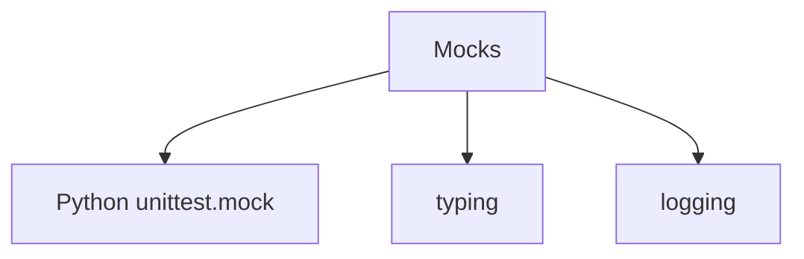
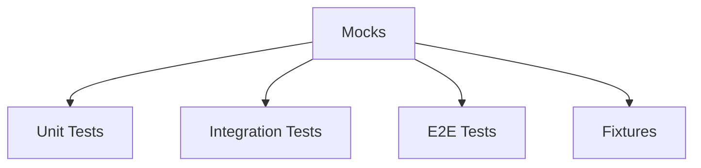
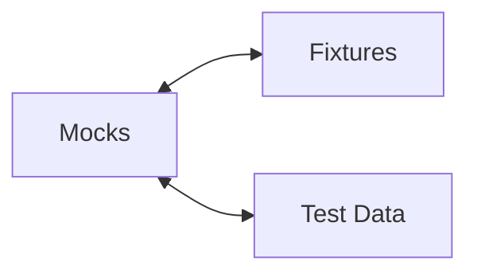

# Mocks Relationships

**System:** Mocks  
**Layer:** Testing Infrastructure  
**Agent:** AGENT-061  
**Status:** ✅ COMPLETE

## Overview

The mocking system provides test doubles for external services, enabling deterministic, fast, and offline testing without real API calls or external dependencies.

## Core Components

### Mock Files

**Location Map:**
```
e2e/fixtures/
└── mocks.py                    # Mock service implementations

tests/ (inline mocks)
├── test_*.py                   # unittest.mock usage
└── conftest.py                 # Mock fixtures
```

## Relationships

### UPSTREAM Dependencies



### DOWNSTREAM Consumers



### LATERAL Integrations



## Mock Service Implementations

### 1. MockOpenAIClient

**File:** `e2e/fixtures/mocks.py`

**Purpose:** Mock OpenAI API for chat completions and image generation

```python
class MockOpenAIClient:
    """Mock OpenAI API client for testing."""
    
    def __init__(self):
        """Initialize mock OpenAI client."""
        self.calls: list[dict[str, Any]] = []
    
    def chat_completions_create(
        self,
        model: str,
        messages: list[dict[str, str]],
        **kwargs: Any,
    ) -> dict[str, Any]:
        """Mock chat completions endpoint."""
        self.calls.append({
            "method": "chat.completions.create",
            "model": model,
            "messages": messages,
            "kwargs": kwargs,
        })
        
        return {
            "id": "chatcmpl-mock-123",
            "object": "chat.completion",
            "model": model,
            "choices": [{
                "index": 0,
                "message": {
                    "role": "assistant",
                    "content": "This is a mock response from the AI assistant.",
                },
                "finish_reason": "stop",
            }],
        }
    
    def images_generate(
        self,
        prompt: str,
        n: int = 1,
        size: str = "1024x1024",
        **kwargs: Any,
    ) -> dict[str, Any]:
        """Mock image generation endpoint."""
        self.calls.append({
            "method": "images.generate",
            "prompt": prompt,
            "n": n,
            "size": size,
            "kwargs": kwargs,
        })
        
        return {
            "created": 1234567890,
            "data": [
                {"url": f"https://mock-image-url.example.com/image_{i}.png"}
                for i in range(n)
            ],
        }
    
    def get_call_count(self) -> int:
        """Get number of calls made."""
        return len(self.calls)
    
    def get_calls(self) -> list[dict[str, Any]]:
        """Get all calls made to mock."""
        return self.calls.copy()
    
    def reset(self) -> None:
        """Reset mock state."""
        self.calls.clear()
```

**Mocked Endpoints:**
- `chat.completions.create` - GPT chat completions
- `images.generate` - DALL-E image generation

**Features:**
- Call tracking (method, parameters)
- Deterministic responses
- Call count introspection
- Reset capability

### 2. MockHuggingFaceClient

**File:** `e2e/fixtures/mocks.py`

**Purpose:** Mock HuggingFace API for model inference

```python
class MockHuggingFaceClient:
    """Mock HuggingFace API client for testing."""
    
    def __init__(self):
        """Initialize mock HuggingFace client."""
        self.calls: list[dict[str, Any]] = []
    
    def inference(
        self,
        model: str,
        inputs: str | dict[str, Any],
        **kwargs: Any,
    ) -> dict[str, Any] | bytes:
        """Mock model inference endpoint."""
        self.calls.append({
            "method": "inference",
            "model": model,
            "inputs": inputs,
            "kwargs": kwargs,
        })
        
        # Image generation models
        if "stable-diffusion" in model.lower():
            return b"mock_image_bytes"
        
        # Text generation models
        return {
            "generated_text": "This is mock generated text.",
        }
    
    def get_call_count(self) -> int:
        """Get number of calls made."""
        return len(self.calls)
    
    def reset(self) -> None:
        """Reset mock state."""
        self.calls.clear()
```

**Mocked Endpoints:**
- `inference` - Model inference for text/image generation

**Features:**
- Model-specific responses (text vs image)
- Call tracking
- Reset capability

### 3. MockEmailService

**File:** `e2e/fixtures/mocks.py`

**Purpose:** Mock email service for emergency alerts

```python
class MockEmailService:
    """Mock email service for testing."""
    
    def __init__(self):
        """Initialize mock email service."""
        self.sent_emails: list[dict[str, Any]] = []
    
    def send_email(
        self,
        to: str | list[str],
        subject: str,
        body: str,
        **kwargs: Any,
    ) -> bool:
        """Mock email sending."""
        self.sent_emails.append({
            "to": to,
            "subject": subject,
            "body": body,
            "kwargs": kwargs,
        })
        return True
    
    def get_sent_count(self) -> int:
        """Get number of emails sent."""
        return len(self.sent_emails)
    
    def get_last_email(self) -> dict[str, Any] | None:
        """Get last sent email."""
        return self.sent_emails[-1] if self.sent_emails else None
    
    def reset(self) -> None:
        """Reset mock state."""
        self.sent_emails.clear()
```

**Mocked Operations:**
- `send_email` - Email sending

**Features:**
- Email tracking (to, subject, body)
- Last email retrieval
- Sent count introspection

### 4. MockGeolocationService

**File:** `e2e/fixtures/mocks.py`

**Purpose:** Mock geolocation service for location tracking

```python
class MockGeolocationService:
    """Mock geolocation service for testing."""
    
    def __init__(self):
        """Initialize mock geolocation service."""
        self.calls: list[dict[str, Any]] = []
    
    def get_location(
        self,
        ip_address: str | None = None,
        **kwargs: Any,
    ) -> dict[str, Any]:
        """Mock location retrieval."""
        self.calls.append({
            "method": "get_location",
            "ip_address": ip_address,
            "kwargs": kwargs,
        })
        
        return {
            "ip": ip_address or "192.168.1.1",
            "city": "Mock City",
            "region": "Mock Region",
            "country": "Mock Country",
            "latitude": 37.7749,
            "longitude": -122.4194,
        }
    
    def reset(self) -> None:
        """Reset mock state."""
        self.calls.clear()
```

**Mocked Operations:**
- `get_location` - IP geolocation

**Features:**
- Deterministic location data
- Call tracking

## Mock Instance Management

### Global Mock Instances

**File:** `e2e/fixtures/mocks.py`

```python
# Global mock instances
mock_openai = MockOpenAIClient()
mock_huggingface = MockHuggingFaceClient()
mock_email = MockEmailService()
mock_geolocation = MockGeolocationService()

def reset_all_mocks() -> None:
    """Reset all mock services."""
    mock_openai.reset()
    mock_huggingface.reset()
    mock_email.reset()
    mock_geolocation.reset()
```

**Benefits:**
- Single instances shared across tests
- Centralized reset function
- Easy fixture creation

### Autouse Reset Fixture

**File:** `e2e/conftest.py`

```python
@pytest.fixture(scope="function", autouse=True)
def reset_mocks():
    """Reset all mock services before each test."""
    reset_all_mocks()
    yield
    reset_all_mocks()
```

**Benefits:**
- Automatic reset before/after each test
- No manual cleanup needed
- Prevents test interdependencies

## Mock Fixtures

### Mock Service Fixtures

**File:** `e2e/conftest.py`

```python
@pytest.fixture
def mock_openai_client():
    """Mock OpenAI client fixture."""
    return mock_openai

@pytest.fixture
def mock_huggingface_client():
    """Mock HuggingFace client fixture."""
    return mock_huggingface

@pytest.fixture
def mock_email_service():
    """Mock email service fixture."""
    return mock_email

@pytest.fixture
def mock_geolocation_service():
    """Mock geolocation service fixture."""
    return mock_geolocation
```

**Usage in Tests:**
```python
def test_with_mocks(mock_openai_client, mock_email_service):
    """Test using mock services."""
    # Use OpenAI mock
    response = mock_openai_client.chat_completions_create(
        model="gpt-4",
        messages=[{"role": "user", "content": "Hello"}]
    )
    
    # Use email mock
    mock_email_service.send_email(
        to="test@example.com",
        subject="Test",
        body="Test body"
    )
    
    # Verify mock calls
    assert mock_openai_client.get_call_count() == 1
    assert mock_email_service.get_sent_count() == 1
```

## unittest.mock Usage

### Mock/MagicMock Pattern

**Common Pattern in Tests:**
```python
from unittest.mock import Mock, MagicMock, patch

def test_with_mock():
    """Test with unittest.mock."""
    # Create mock
    mock_service = Mock()
    mock_service.method.return_value = "mocked"
    
    # Use mock
    result = function_under_test(mock_service)
    
    # Verify
    mock_service.method.assert_called_once_with("arg")
    assert result == "expected"
```

### Patch Decorator Pattern

**Common Pattern:**
```python
@patch('module.ExternalService')
def test_with_patch(mock_service):
    """Test with patched dependency."""
    mock_service.return_value.method.return_value = "patched"
    
    result = function_under_test()
    
    assert result == "expected"
```

### Patch Context Manager Pattern

**Common Pattern:**
```python
def test_with_context_patch():
    """Test with context manager patch."""
    with patch('module.external_call') as mock_call:
        mock_call.return_value = "patched"
        
        result = function_under_test()
        
        assert result == "expected"
        mock_call.assert_called_once()
```

## Mock Call Tracking

### Call Introspection

**Available Methods:**
```python
# Get all calls
calls = mock_openai.get_calls()

# Get call count
count = mock_openai.get_call_count()

# Get specific call
first_call = calls[0]
assert first_call["method"] == "chat.completions.create"
assert first_call["model"] == "gpt-4"

# Verify call parameters
assert first_call["messages"][0]["role"] == "user"
```

### Usage in Tests

```python
def test_call_tracking(mock_openai_client):
    """Test with call tracking."""
    # Make multiple calls
    mock_openai_client.chat_completions_create(
        model="gpt-4",
        messages=[{"role": "user", "content": "Hello"}]
    )
    
    mock_openai_client.images_generate(
        prompt="A cat",
        n=2
    )
    
    # Verify calls
    assert mock_openai_client.get_call_count() == 2
    
    calls = mock_openai_client.get_calls()
    assert calls[0]["method"] == "chat.completions.create"
    assert calls[1]["method"] == "images.generate"
    assert calls[1]["n"] == 2
```

## Mocking Strategies

### Strategy 1: Custom Mock Classes

**When to Use:**
- Complex external services
- Multiple endpoints to mock
- Need call tracking
- Need deterministic responses

**Examples:**
- MockOpenAIClient
- MockHuggingFaceClient

### Strategy 2: unittest.mock

**When to Use:**
- Simple dependencies
- One-off mocks
- Quick tests
- Standard library functions

**Examples:**
- Patching file operations
- Mocking time.time()
- Mocking requests.get()

### Strategy 3: Partial Mocking

**When to Use:**
- Integration tests
- Mock only external services
- Keep internal logic real

**Example:**
```python
def test_partial_mock():
    """Test with partial mocking."""
    # Real AI system
    persona = AIPersona(data_dir=tmpdir)
    
    # Mock OpenAI
    with patch('module.openai_client', mock_openai):
        result = persona.generate_response("Hello")
    
    # Real memory system
    memory = MemoryExpansionSystem(data_dir=tmpdir)
    memory.log_conversation("Hello", result)
```

## Key Relationships Summary

### Provides To

| System | Relationship | Description |
|--------|-------------|-------------|
| **Unit Tests** | Dependencies | External service mocks |
| **Integration Tests** | Partial Mocking | Selective mocking |
| **E2E Tests** | Service Mocks | Full mock services |
| **Fixtures** | Mock Instances | Pre-configured mocks |

### Depends On

| System | Relationship | Description |
|--------|-------------|-------------|
| **unittest.mock** | Foundation | Mock/MagicMock/patch |
| **typing** | Type Hints | Type annotations |
| **logging** | Debugging | Mock call logging |

## Testing Guarantees

### Mock Guarantees

1. **Deterministic:** Mocks return consistent responses
2. **Fast:** No network calls or external dependencies
3. **Trackable:** All calls are recorded
4. **Resettable:** State can be reset between tests
5. **Offline:** Tests work without internet

### Compliance with Governance

**Workspace Profile Requirements:**
- ✅ Deterministic testing (consistent responses)
- ✅ Fast execution (no external calls)
- ✅ Complete isolation (no side effects)
- ✅ Call verification (tracking enabled)
- ✅ Automatic cleanup (autouse reset)

## Architectural Notes

### Design Patterns

1. **Test Double Pattern:** Mocks as stand-ins for real services
2. **Singleton Pattern:** Global mock instances
3. **Observer Pattern:** Call tracking
4. **Factory Pattern:** Mock fixtures create instances

### Best Practices

1. **Use custom mocks for complex services** (MockOpenAI)
2. **Use unittest.mock for simple cases** (file ops, time)
3. **Always reset mocks between tests** (autouse fixture)
4. **Track calls for verification** (get_calls, get_call_count)
5. **Return deterministic data** (no random values)

---

**Document Version:** 1.0  
**Last Updated:** 2026-04-20  
**Maintainer:** AGENT-061
