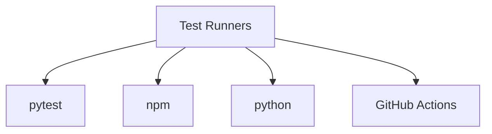
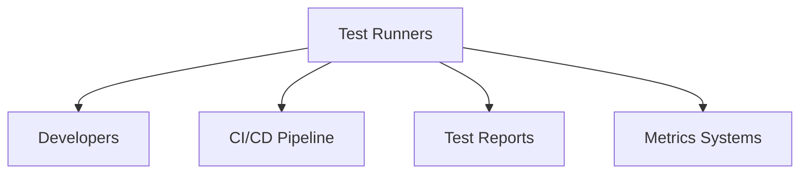
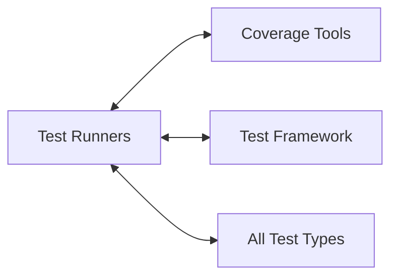

# Test Runners Relationships

**System:** Test Runners  
**Layer:** Testing Infrastructure  
**Agent:** AGENT-061  
**Status:** ✅ COMPLETE

## Overview

Test runners provide execution interfaces for tests, including pytest CLI, npm scripts, and CI/CD integrations. They orchestrate test execution, reporting, and coverage measurement.

## Core Components

### Test Runner Interfaces

**Execution Methods:**
```
1. pytest (direct)          # Python test runner
2. npm run test             # npm script wrapper
3. CI/CD workflows          # GitHub Actions
4. Manual scripts           # Bash/PowerShell scripts
```

## Relationships

### UPSTREAM Dependencies



**Dependency Details:**
- **pytest** - Python test execution engine
- **npm** - Node.js package manager for scripts
- **python** - Python interpreter
- **GitHub Actions** - CI/CD platform

### DOWNSTREAM Consumers



### LATERAL Integrations



## Pytest CLI

### Basic Commands

```bash
# Run all tests
pytest

# Run with verbose output
pytest -v

# Run specific marker
pytest -m unit
pytest -m integration
pytest -m e2e

# Run specific file
pytest tests/test_ai_systems.py

# Run specific test
pytest tests/test_ai_systems.py::TestFourLaws::test_law_validation_blocked

# Stop on first failure
pytest -x

# Show local variables on failure
pytest -l

# Run last failed tests
pytest --lf

# Run failed first, then rest
pytest --ff
```

### Coverage Commands

```bash
# Run with coverage
pytest --cov=src

# Coverage with HTML report
pytest --cov=src --cov-report=html

# Coverage with JSON report
pytest --cov=src --cov-report=json

# Coverage with XML report (for CI)
pytest --cov=src --cov-report=xml

# Append coverage (for multiple test runs)
pytest -m unit --cov=src --cov-report=json
pytest -m integration --cov-append
pytest -m e2e --cov-append
```

### Marker-Based Execution

```bash
# Unit tests only
pytest -m unit

# Integration tests only
pytest -m integration

# E2E tests only
pytest -m e2e

# Security tests
pytest -m security

# Slow tests excluded
pytest -m "not slow"

# Combine markers
pytest -m "e2e and not slow"
pytest -m "integration or e2e"
pytest -m "security and not adversarial"
```

### Parallel Execution

```bash
# Run tests in parallel (requires pytest-xdist)
pytest -n auto          # Auto-detect CPU count
pytest -n 4             # Use 4 workers

# Parallel with coverage
pytest -n auto --cov=src --cov-report=html
```

## npm Scripts

### Package.json Scripts

**File:** `package.json`

```json
{
  "scripts": {
    "test": "npm run test:js && npm run test:python",
    "test:js": "node --test src/**/*.test.js",
    "test:python": "pytest -q",
    "lint": "ruff check .",
    "format": "ruff check . --fix"
  }
}
```

### npm Test Commands

```bash
# Run all tests (JS + Python)
npm test

# Run Python tests only
npm run test:python

# Run JavaScript tests only
npm run test:js

# Run linter
npm run lint

# Run formatter
npm run format
```

**Benefits:**
- Unified interface (npm test)
- Cross-language support
- CI/CD compatibility
- Developer convenience

## CI/CD Integration

### GitHub Actions Workflow

**File:** `.github/workflows/codex-deus-ultimate.yml`

**Test Execution Phases:**

#### Phase 1: Unit Tests

```yaml
- name: Run Unit Tests
  run: pytest -m unit --cov=src --cov-report=json
  
- name: Upload Unit Test Coverage
  uses: actions/upload-artifact@v3
  with:
    name: unit-coverage
    path: test-artifacts/coverage.json
```

#### Phase 2: Integration Tests

```yaml
- name: Run Integration Tests
  run: pytest -m integration --cov-append --cov-report=json
  
- name: Upload Integration Coverage
  uses: actions/upload-artifact@v3
  with:
    name: integration-coverage
    path: test-artifacts/coverage.json
```

#### Phase 3: E2E Tests

```yaml
- name: Start Services
  run: |
    python start_api.py &
    sleep 10
  
- name: Run E2E Tests
  run: pytest -m e2e --cov-append --cov-report=json
  
- name: Stop Services
  run: pkill -f start_api.py
```

#### Phase 4: Security Tests

```yaml
- name: Run Security Tests
  run: pytest -m security --cov-append --cov-report=json

- name: Run Adversarial Tests
  run: pytest -m adversarial --cov-append --cov-report=json
```

#### Phase 5: Coverage Reporting

```yaml
- name: Generate Coverage Report
  run: pytest --cov=src --cov-report=html --cov-report=xml

- name: Upload Coverage to Codecov
  uses: codecov/codecov-action@v3
  with:
    files: ./coverage.xml
    
- name: Check Coverage Threshold
  run: |
    coverage report --fail-under=80
```

### CI Test Matrix

**Multi-Version Testing:**
```yaml
strategy:
  matrix:
    python-version: [3.11, 3.12]
    os: [ubuntu-latest, windows-latest, macos-latest]

steps:
  - uses: actions/setup-python@v4
    with:
      python-version: ${{ matrix.python-version }}
      
  - name: Run Tests
    run: pytest -v
```

**Benefits:**
- Test on multiple Python versions
- Test on multiple OS platforms
- Detect platform-specific issues

## Custom Test Scripts

### Bash Scripts

**Pattern:**
```bash
#!/bin/bash
# run_tests.sh

set -e  # Exit on error

echo "Running unit tests..."
pytest -m unit --cov=src --cov-report=json

echo "Running integration tests..."
pytest -m integration --cov-append

echo "Running E2E tests..."
pytest -m e2e --cov-append

echo "Generating coverage report..."
pytest --cov-report=html

echo "All tests passed!"
```

### PowerShell Scripts

**Pattern:**
```powershell
# run_tests.ps1

Write-Host "Running unit tests..." -ForegroundColor Green
pytest -m unit --cov=src --cov-report=json

Write-Host "Running integration tests..." -ForegroundColor Green
pytest -m integration --cov-append

Write-Host "Running E2E tests..." -ForegroundColor Green
pytest -m e2e --cov-append

Write-Host "Generating coverage report..." -ForegroundColor Green
pytest --cov-report=html

Write-Host "All tests passed!" -ForegroundColor Green
```

### Python Test Scripts

**File:** `tests/run_exhaustive_tests.py`

```python
#!/usr/bin/env python3
"""Run exhaustive test suite."""

import subprocess
import sys

def run_tests(marker: str, description: str) -> bool:
    """Run tests with specific marker."""
    print(f"\n{'='*60}")
    print(f"Running {description}...")
    print('='*60)
    
    result = subprocess.run(
        ["pytest", "-m", marker, "-v"],
        capture_output=True,
        text=True
    )
    
    print(result.stdout)
    if result.returncode != 0:
        print(result.stderr, file=sys.stderr)
        return False
    
    return True

def main():
    """Run all test categories."""
    test_suites = [
        ("unit", "Unit Tests"),
        ("integration", "Integration Tests"),
        ("e2e", "E2E Tests"),
        ("security", "Security Tests"),
    ]
    
    all_passed = True
    for marker, description in test_suites:
        if not run_tests(marker, description):
            all_passed = False
    
    if all_passed:
        print("\n✅ All test suites passed!")
        return 0
    else:
        print("\n❌ Some test suites failed!")
        return 1

if __name__ == "__main__":
    sys.exit(main())
```

**Usage:**
```bash
python tests/run_exhaustive_tests.py
```

## Test Execution Strategies

### Strategy 1: Fast Feedback Loop

**Purpose:** Quick validation during development

```bash
# Run only unit tests (fastest)
pytest -m unit

# Run specific file
pytest tests/test_ai_systems.py

# Run last failed tests
pytest --lf
```

**Characteristics:**
- <30s execution time
- High frequency (every save)
- Unit tests only

### Strategy 2: Pre-Commit Validation

**Purpose:** Validation before committing code

```bash
# Run unit + integration tests
pytest -m "unit or integration"

# With coverage
pytest -m "unit or integration" --cov=src

# With linting
ruff check . && pytest -m "unit or integration"
```

**Characteristics:**
- 1-2 minute execution time
- Run before git commit
- Unit + integration tests

### Strategy 3: Pre-Push Validation

**Purpose:** Full validation before pushing to remote

```bash
# Run all tests
pytest

# With coverage threshold
pytest --cov=src --cov-report=html
coverage report --fail-under=80
```

**Characteristics:**
- 5-10 minute execution time
- Run before git push
- All test types

### Strategy 4: CI/CD Full Suite

**Purpose:** Comprehensive validation in CI/CD

```yaml
# All test types with coverage
- pytest -m unit --cov=src
- pytest -m integration --cov-append
- pytest -m e2e --cov-append
- pytest -m security --cov-append
- pytest --cov-report=xml
```

**Characteristics:**
- 10-30 minute execution time
- Run on every PR/push
- All tests + coverage + security

## Test Output Formats

### Console Output

```bash
# Standard output
pytest

# Verbose output
pytest -v

# Quiet output
pytest -q

# Very verbose (show all details)
pytest -vv
```

### Report Formats

```bash
# JUnit XML (for CI)
pytest --junitxml=test-results.xml

# HTML report
pytest --html=test-report.html --self-contained-html

# JSON report
pytest --json-report --json-report-file=test-report.json
```

### Coverage Reports

```bash
# Terminal output
pytest --cov=src --cov-report=term

# HTML report (browsable)
pytest --cov=src --cov-report=html
# Opens: htmlcov/index.html

# XML report (for CI)
pytest --cov=src --cov-report=xml
# Generates: coverage.xml

# JSON report (for parsing)
pytest --cov=src --cov-report=json
# Generates: test-artifacts/coverage.json
```

## Test Runner Configuration

### pytest.ini

**File:** `pytest.ini`

```ini
[pytest]
pythonpath = src
testpaths = tests
filterwarnings =
    ignore::DeprecationWarning:passlib
```

### pyproject.toml

**File:** `pyproject.toml`

```toml
[tool.pytest.ini_options]
testpaths = ["tests"]
python_files = "test_*.py"
addopts = "--strict-markers -v"
markers = [
    "unit: Unit tests",
    "integration: Integration tests",
]
```

## Environment Variables

### Test-Specific Variables

```bash
# Set test environment
export PROJECT_AI_TEST_ARTIFACTS="./test-artifacts"
export TESTING=1

# Disable external services
export MOCK_EXTERNAL_SERVICES=1

# CI environment
export CI=true
export GITHUB_ACTIONS=true
```

## Key Relationships Summary

### Provides To

| System | Relationship | Description |
|--------|-------------|-------------|
| **Developers** | Interface | Test execution CLI |
| **CI/CD** | Automation | Automated test execution |
| **Coverage Tools** | Integration | Coverage measurement |
| **Reports** | Output | Test reports and artifacts |

### Depends On

| System | Relationship | Description |
|--------|-------------|-------------|
| **pytest** | Core | Test execution engine |
| **Test Framework** | Configuration | Markers, fixtures, discovery |
| **Tests** | Content | All test files |
| **Coverage Tools** | Measurement | pytest-cov plugin |

## Testing Guarantees

### Test Runner Guarantees

1. **Consistency:** Same execution across environments
2. **Isolation:** Tests run in isolated processes
3. **Reporting:** Comprehensive test reports
4. **Coverage:** Integrated coverage measurement
5. **CI/CD:** Automated execution in pipelines

### Compliance with Governance

**Workspace Profile Requirements:**
- ✅ Automated execution (CI/CD integration)
- ✅ Coverage measurement (pytest-cov)
- ✅ Multiple interfaces (pytest, npm, CI)
- ✅ Comprehensive reporting (HTML, XML, JSON)
- ✅ Developer convenience (npm scripts)

## Architectural Notes

### Design Patterns

1. **Facade Pattern:** npm scripts abstract pytest
2. **Pipeline Pattern:** CI/CD test execution pipeline
3. **Strategy Pattern:** Different execution strategies
4. **Adapter Pattern:** pytest to CI/CD integration

### Best Practices

1. **Use markers for selective execution** (fast feedback)
2. **Run unit tests frequently** (every save)
3. **Run full suite before pushing** (prevent CI failures)
4. **Use coverage thresholds in CI** (enforce quality)
5. **Parallelize tests in CI** (faster pipelines)

---

**Document Version:** 1.0  
**Last Updated:** 2026-04-20  
**Maintainer:** AGENT-061
