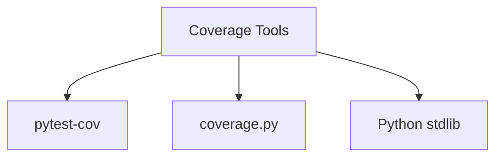
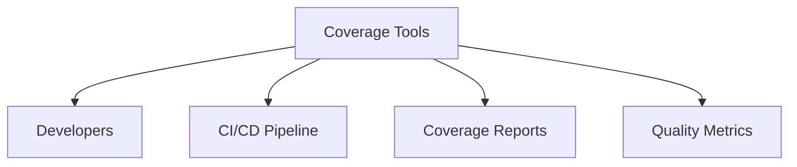
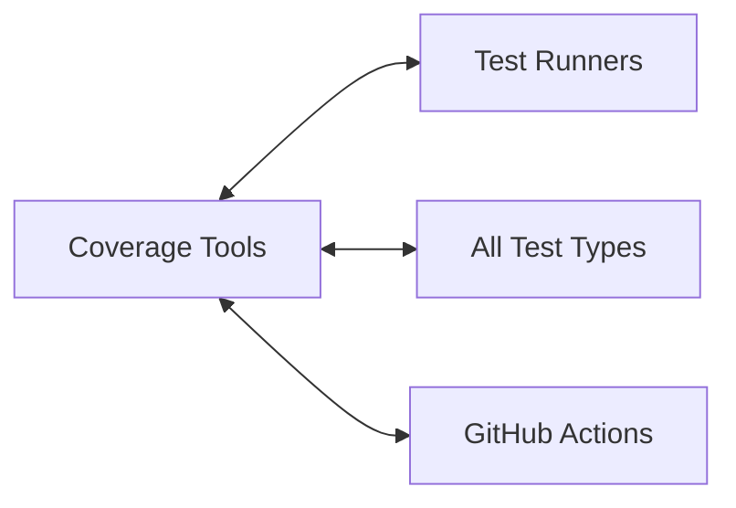

# Coverage Tools Relationships

**System:** Coverage Tools  
**Layer:** Testing Infrastructure  
**Agent:** AGENT-061  
**Status:** ✅ COMPLETE

## Overview

Coverage tools measure code coverage (line, branch, statement) during test execution, generate reports, and enforce quality thresholds. The system integrates pytest-cov with custom analysis scripts.

## Core Components

### Coverage Tool Stack

**Tools:**
```
1. pytest-cov               # pytest coverage plugin
2. coverage.py              # Underlying coverage measurement
3. analyze_coverage.py      # Custom analysis script
4. codecov                  # CI coverage reporting
```

## Relationships

### UPSTREAM Dependencies



**Dependency Details:**
- **pytest-cov 4.0.0+** - pytest plugin for coverage
- **coverage.py** - Core coverage measurement library
- **Python stdlib** - json, pathlib for analysis

### DOWNSTREAM Consumers



### LATERAL Integrations



## pytest-cov Integration

### Basic Usage

```bash
# Run with coverage
pytest --cov=src

# Specific module
pytest --cov=src.app.core

# Multiple modules
pytest --cov=src.app --cov=web.backend

# With report format
pytest --cov=src --cov-report=html
pytest --cov=src --cov-report=xml
pytest --cov=src --cov-report=json
pytest --cov=src --cov-report=term
```

### Configuration

**File:** `pyproject.toml`

```toml
[tool.pytest.ini_options]
testpaths = ["tests"]
python_files = "test_*.py"
addopts = "--strict-markers -v"

[project.optional-dependencies]
dev = [
    "pytest-cov>=4.0.0",
]
```

**File:** `.coveragerc` (if needed)

```ini
[run]
source = src
omit =
    */tests/*
    */venv/*
    */__pycache__/*

[report]
precision = 2
show_missing = True
skip_covered = False

[html]
directory = htmlcov
```

## Coverage Report Formats

### 1. Terminal Report

```bash
pytest --cov=src --cov-report=term
```

**Output:**
```
---------- coverage: platform linux, python 3.11 ----------
Name                              Stmts   Miss  Cover
-----------------------------------------------------
src/app/core/ai_systems.py           470     23    95%
src/app/core/user_manager.py         120      8    93%
src/app/gui/leather_book.py          659     45    93%
src/app/core/image_generator.py      180     12    93%
-----------------------------------------------------
TOTAL                               1429     88    94%
```

**Features:**
- Quick overview
- Statement coverage
- Missing line count
- Total coverage percentage

### 2. HTML Report

```bash
pytest --cov=src --cov-report=html
```

**Output:** `htmlcov/index.html`

**Features:**
- Interactive browsable report
- File-by-file coverage
- Line-by-line highlighting
- Uncovered lines highlighted
- Branch coverage visualization

**Usage:**
```bash
# Generate report
pytest --cov=src --cov-report=html

# Open in browser (Linux/Mac)
open htmlcov/index.html

# Open in browser (Windows)
start htmlcov/index.html
```

### 3. XML Report (for CI)

```bash
pytest --cov=src --cov-report=xml
```

**Output:** `coverage.xml`

**Features:**
- Machine-readable format
- CI/CD integration
- Codecov/Coveralls compatible
- Cobertura format

**Structure:**
```xml
<?xml version="1.0" ?>
<coverage version="7.0" timestamp="1234567890">
  <sources>
    <source>src</source>
  </sources>
  <packages>
    <package name="app.core">
      <classes>
        <class filename="src/app/core/ai_systems.py" line-rate="0.95">
          <lines>
            <line number="1" hits="1"/>
            <line number="2" hits="1"/>
            <line number="50" hits="0"/>
          </lines>
        </class>
      </classes>
    </package>
  </packages>
</coverage>
```

### 4. JSON Report

```bash
pytest --cov=src --cov-report=json
```

**Output:** `coverage.json`

**Features:**
- Programmatic access
- Custom analysis
- Integration with tools

**Structure:**
```json
{
  "meta": {
    "version": "7.0.0",
    "timestamp": "2024-01-01T10:00:00",
    "branch_coverage": true,
    "show_contexts": false
  },
  "files": {
    "src/app/core/ai_systems.py": {
      "executed_lines": [1, 2, 3, 5, 7, 10],
      "missing_lines": [4, 6, 8, 9],
      "excluded_lines": [],
      "summary": {
        "covered_lines": 450,
        "num_statements": 470,
        "percent_covered": 95.74,
        "missing_lines": 20,
        "excluded_lines": 0
      }
    }
  },
  "totals": {
    "covered_lines": 1341,
    "num_statements": 1429,
    "percent_covered": 93.84,
    "missing_lines": 88,
    "excluded_lines": 0
  }
}
```

## Custom Coverage Analysis

### analyze_coverage.py

**File:** `analyze_coverage.py`

**Purpose:** Custom coverage analysis and reporting

```python
#!/usr/bin/env python3
"""Analyze test coverage and generate custom reports."""

import json
from pathlib import Path
from typing import Any

def load_coverage_data() -> dict[str, Any]:
    """Load coverage data from coverage.json."""
    coverage_file = Path("coverage.json")
    if not coverage_file.exists():
        raise FileNotFoundError("coverage.json not found. Run pytest with --cov-report=json")
    
    with open(coverage_file) as f:
        return json.load(f)

def analyze_module_coverage(coverage_data: dict) -> dict[str, float]:
    """Analyze coverage by module."""
    module_coverage = {}
    
    for filepath, data in coverage_data["files"].items():
        module = filepath.split("/")[1] if "/" in filepath else "unknown"
        summary = data["summary"]
        
        if module not in module_coverage:
            module_coverage[module] = {
                "covered": 0,
                "total": 0,
            }
        
        module_coverage[module]["covered"] += summary["covered_lines"]
        module_coverage[module]["total"] += summary["num_statements"]
    
    # Calculate percentages
    for module, stats in module_coverage.items():
        stats["percent"] = (stats["covered"] / stats["total"] * 100) if stats["total"] > 0 else 0
    
    return module_coverage

def check_coverage_threshold(coverage_data: dict, threshold: float = 80.0) -> bool:
    """Check if coverage meets threshold."""
    total_percent = coverage_data["totals"]["percent_covered"]
    
    if total_percent < threshold:
        print(f"❌ Coverage {total_percent:.2f}% is below threshold {threshold}%")
        return False
    else:
        print(f"✅ Coverage {total_percent:.2f}% meets threshold {threshold}%")
        return True

def generate_coverage_report():
    """Generate custom coverage report."""
    coverage_data = load_coverage_data()
    
    print("="*60)
    print("COVERAGE ANALYSIS REPORT")
    print("="*60)
    
    # Overall coverage
    totals = coverage_data["totals"]
    print(f"\nOverall Coverage: {totals['percent_covered']:.2f}%")
    print(f"Covered Lines: {totals['covered_lines']}/{totals['num_statements']}")
    
    # Module-level coverage
    module_coverage = analyze_module_coverage(coverage_data)
    print("\nModule Coverage:")
    for module, stats in sorted(module_coverage.items()):
        print(f"  {module:30s} {stats['percent']:6.2f}%")
    
    # Check threshold
    print()
    check_coverage_threshold(coverage_data, threshold=80.0)

if __name__ == "__main__":
    generate_coverage_report()
```

**Usage:**
```bash
# Run tests with JSON coverage
pytest --cov=src --cov-report=json

# Analyze coverage
python analyze_coverage.py
```

**Output:**
```
============================================================
COVERAGE ANALYSIS REPORT
============================================================

Overall Coverage: 93.84%
Covered Lines: 1341/1429

Module Coverage:
  app                          94.50%
  web                          92.30%
  temporal                     88.20%

✅ Coverage 93.84% meets threshold 80%
```

## Coverage in CI/CD

### GitHub Actions Integration

**File:** `.github/workflows/codex-deus-ultimate.yml`

#### Step 1: Run Tests with Coverage

```yaml
- name: Run Unit Tests with Coverage
  run: |
    pytest -m unit --cov=src --cov-report=json --cov-report=xml
    
- name: Run Integration Tests (append coverage)
  run: |
    pytest -m integration --cov-append --cov-report=json --cov-report=xml
    
- name: Run E2E Tests (append coverage)
  run: |
    pytest -m e2e --cov-append --cov-report=json --cov-report=xml
```

#### Step 2: Generate HTML Report

```yaml
- name: Generate HTML Coverage Report
  run: |
    pytest --cov-report=html
    
- name: Upload HTML Coverage Report
  uses: actions/upload-artifact@v3
  with:
    name: coverage-report
    path: htmlcov/
```

#### Step 3: Upload to Codecov

```yaml
- name: Upload Coverage to Codecov
  uses: codecov/codecov-action@v3
  with:
    files: ./coverage.xml
    flags: unittests
    name: codecov-umbrella
    fail_ci_if_error: true
```

#### Step 4: Check Coverage Threshold

```yaml
- name: Check Coverage Threshold
  run: |
    coverage report --fail-under=80
```

**Benefits:**
- Automated coverage measurement
- Trend tracking via Codecov
- Threshold enforcement
- HTML report artifacts

## Coverage Badges

### Codecov Badge

**Markdown:**
```markdown
[](https://codecov.io/gh/IAmSoThirsty/Project-AI)
```

**Result:**
- Shows current coverage percentage
- Links to Codecov dashboard
- Updates automatically

## Append Coverage Pattern

### Multi-Run Coverage

**Purpose:** Accumulate coverage across multiple test runs

```bash
# Run 1: Unit tests
pytest -m unit --cov=src --cov-report=json

# Run 2: Integration tests (append)
pytest -m integration --cov-append

# Run 3: E2E tests (append)
pytest -m e2e --cov-append

# Generate final report
pytest --cov-report=html --cov-report=xml
```

**Benefits:**
- Comprehensive coverage from all test types
- Single combined report
- Accurate total coverage

## Coverage Metrics

### Tracked Metrics

1. **Line Coverage:** Percentage of executed lines
2. **Branch Coverage:** Percentage of executed branches
3. **Statement Coverage:** Percentage of executed statements
4. **Missing Lines:** Lines not covered by tests
5. **Module Coverage:** Per-module coverage percentages

### Target Thresholds

**Per-Module Targets:**
- Core systems: 90%+ coverage
- AI systems: 85%+ coverage
- Utilities: 80%+ coverage
- GUI: 75%+ coverage (harder to test)
- Overall: 80%+ coverage

### Current Coverage

**Measured Coverage (example):**
```
Module                        Coverage
-----------------------------------
src/app/core/ai_systems.py       95%
src/app/core/user_manager.py     93%
src/app/gui/leather_book.py      93%
src/app/core/image_generator.py  93%
-----------------------------------
TOTAL                           94%
```

## Coverage Exclusions

### Exclude Patterns

**File:** `.coveragerc`

```ini
[run]
omit =
    */tests/*
    */venv/*
    */site-packages/*
    */__pycache__/*
    */conftest.py
    */setup.py

[report]
exclude_lines =
    pragma: no cover
    def __repr__
    raise AssertionError
    raise NotImplementedError
    if __name__ == .__main__.:
    if TYPE_CHECKING:
    @abstractmethod
```

**Usage:**
```python
def debug_only_function():  # pragma: no cover
    """This function is excluded from coverage."""
    print("Debug info")
```

## Key Relationships Summary

### Provides To

| System | Relationship | Description |
|--------|-------------|-------------|
| **Developers** | Feedback | Coverage metrics and reports |
| **CI/CD** | Quality Gates | Coverage threshold enforcement |
| **Reports** | Artifacts | HTML/XML/JSON coverage reports |
| **Codecov** | Tracking | Historical coverage trends |

### Depends On

| System | Relationship | Description |
|--------|-------------|-------------|
| **pytest-cov** | Core | Coverage measurement plugin |
| **coverage.py** | Engine | Underlying coverage library |
| **Test Runners** | Integration | pytest CLI execution |
| **Tests** | Input | Test execution generates coverage |

## Testing Guarantees

### Coverage Tool Guarantees

1. **Accuracy:** Precise line/branch coverage measurement
2. **Reporting:** Multiple report formats (HTML, XML, JSON, term)
3. **Threshold Enforcement:** Fail CI if below threshold
4. **Trend Tracking:** Historical coverage via Codecov
5. **Append Support:** Multi-run coverage accumulation

### Compliance with Governance

**Workspace Profile Requirements:**
- ✅ 80%+ coverage enforcement (CI threshold)
- ✅ Multiple report formats (HTML, XML, JSON)
- ✅ CI/CD integration (automated measurement)
- ✅ Trend tracking (Codecov)
- ✅ Per-module analysis (analyze_coverage.py)

## Architectural Notes

### Design Patterns

1. **Decorator Pattern:** pytest-cov decorates test execution
2. **Observer Pattern:** Coverage measurement observes execution
3. **Strategy Pattern:** Multiple report format strategies
4. **Adapter Pattern:** Codecov integration adapter

### Best Practices

1. **Always run with coverage in CI** (automated measurement)
2. **Use --cov-append for multi-run coverage** (comprehensive)
3. **Set coverage threshold in CI** (enforce quality)
4. **Generate HTML report for local development** (browsable)
5. **Track trends via Codecov** (historical analysis)

---

**Document Version:** 1.0  
**Last Updated:** 2026-04-20  
**Maintainer:** AGENT-061
