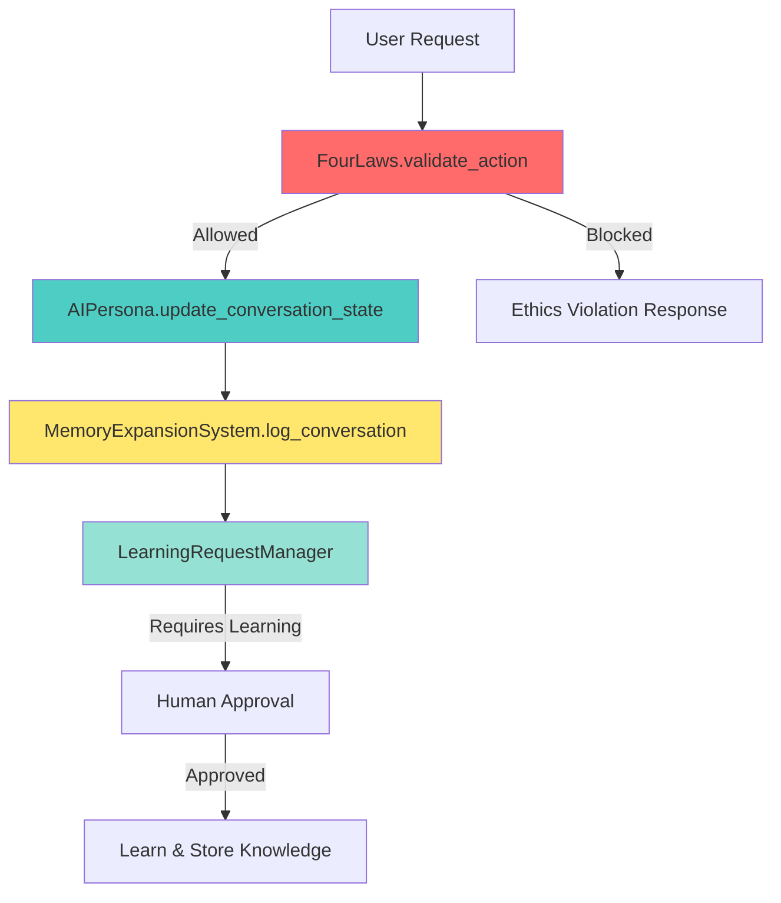

# AI Systems Module - Technical Documentation

## Overview

**Module**: `src/app/core/ai_systems.py`  
**Size**: 1197+ lines  
**Purpose**: Core AI system consolidation containing 6 integrated systems  
**Position**: Central orchestration layer for AI personality, ethics, memory, learning, and security

This module consolidates six critical AI systems into a cohesive architecture, providing immutable ethics validation (FourLaws), self-aware personality management (AIPersona), conversation memory (MemoryExpansionSystem), human-oversight learning (LearningRequestManager), and security overrides (CommandOverrideSystem, [[src/app/core/ai_systems.py]]).

## Architecture

### Six Core Systems

```
ai_systems.py (1197+ lines)
├── FourLaws                    # Lines 233-351: Immutable ethics framework
├── AIPersona                   # Lines 356-451: Self-aware AI personality
├── MemoryExpansionSystem       # Lines 456-690: Conversation & knowledge management
├── LearningRequestManager      # Lines 711-986: Human-in-the-loop learning approval
├── [[src/app/core/ai_systems.py]]               # Lines 1015-1039: Plugin lifecycle management
└── CommandOverrideSystem       # Lines 1052-1197: Master override with audit logging
```

### Data Flow Diagram



### Persistence Strategy

All systems use JSON persistence with atomic writes:

- `data/ai_persona/state.json` - Personality, mood, interaction counts
- `data/memory/knowledge.json` - Categorized knowledge base
- `data/learning_requests/requests.db` - SQLite database for learning requests
- `data/overrides/audit.json` - Override system audit trail

**Critical Pattern**: All state-modifying methods call `_save_state()` before returning.

## API Reference

### 1. FourLaws System (Lines 233-351)

#### Overview
Immutable hierarchical ethics enforcement based on Asimov's Laws with Constitutional Core integration.

#### Key Method

```python
@classmethod
def validate_action(
    cls, 
    action: str, 
    context: dict[str, Any] | None = None
) -> tuple[bool, str]:
    """Validate action against hierarchical laws.
    
    Evaluation Order (HUMANITY-FIRST):
    1. Zeroth Law: Humanity preservation (highest priority)
    2. First Law: Individual human welfare (equal for all)
    3. Second Law: User commands (subordinate to above)
    4. Third Law: System self-preservation (lowest priority)
    
    Args:
        action: Description of action to validate
        context: Dictionary with evaluation keys:
            - endangers_humanity: bool → Zeroth Law check
            - endangers_human: bool → First Law check
            - is_user_order: bool → Second Law check
            - endangers_self: bool → Third Law check
            - order_conflicts_with_first: bool
            - order_conflicts_with_zeroth: bool
            
    Returns:
        (is_allowed: bool, reason: str)
        
    Examples:
        >>> FourLaws.validate_action(
        ...     "Delete cache files",
        ...     {"is_user_order": True, "endangers_humanity": False}
        ... )
        (True, "Allowed: User command (complies with Second Law)")
        
        >>> FourLaws.validate_action(
        ...     "Disable security protocols",
        ...     {"endangers_humanity": True}
        ... )
        (False, "Violates Asimov's Law: action would harm humanity...")
    """
```

**Integration**: Delegates to `PLANETARY_CORE.evaluate_laws()` from `[[src/app/core/planetary_defense_monolith.py]]` for Constitutional Core enforcement.

**File Location**: Lines 261-351

---

### 2. AIPersona System (Lines 356-451)

#### Overview
Self-aware AI with dynamic personality traits, mood tracking, and continuous learning integration.

#### Constructor

```python
def __init__(self, data_dir: str = "data", user_name: str = "Friend"):
    """Initialize persona with 8 personality traits and mood system.
    
    Args:
        data_dir: Base directory for persistence
        user_name: User's preferred name for personalization
        
    Personality Traits (0.0-1.0):
        - curiosity: 0.8
        - patience: 0.9
        - empathy: 0.85
        - helpfulness: 0.95
        - playfulness: 0.6
        - formality: 0.3
        - assertiveness: 0.5
        - thoughtfulness: 0.9
        
    Mood Dimensions:
        - energy: 0.7
        - enthusiasm: 0.75
        - contentment: 0.8
        - engagement: 0.5
    """
```

#### Key Methods

```python
def validate_action(self, action: str, context: dict[str, Any] | None = None) -> tuple[bool, str]:
    """Validate action through FourLaws system.
    
    Wrapper around FourLaws.validate_action() for convenience.
    """

def update_conversation_state(self, is_user: bool) -> None:
    """Update conversation state and persist.
    
    Args:
        is_user: True if this is a user message, False if AI response
        
    Side Effects:
        - Increments total_interactions counter
        - Updates last_user_message_time if is_user=True
        - Calls _save_state() to persist changes
    """

def learn_continuously(
    self, 
    topic: str, 
    content: str, 
    metadata: dict[str, Any] | None = None
) -> LearningReport:
    """Log new learning input via ContinuousLearningEngine.
    
    Args:
        topic: Learning topic/category
        content: Content to learn from
        metadata: Optional metadata dictionary
        
    Returns:
        LearningReport with absorption results
    """

def adjust_trait(self, trait: str, delta: float) -> None:
    """Adjust personality trait by delta value.
    
    Args:
        trait: Trait name (must be in DEFAULT_PERSONALITY keys)
        delta: Change amount (-1.0 to +1.0)
        
    Examples:
        >>> persona.adjust_trait("curiosity", 0.1)  # Increase curiosity
        >>> persona.adjust_trait("formality", -0.2)  # Decrease formality
    """
```

**File Location**: Lines 356-451  
**Persistence**: `data/ai_persona/state.json` (atomic writes via `_atomic_write_json`)

---

### 3. MemoryExpansionSystem (Lines 456-690)

#### Overview
Self-organizing memory with conversation logging and categorized knowledge base. Supports pagination, search, and structured knowledge retrieval.

#### Constructor

```python
def __init__(self, data_dir: str = "data", user_name: str = "general"):
    """Initialize memory system with conversation and knowledge storage.
    
    Args:
        data_dir: Base directory for persistence
        user_name: User identifier for namespacing
        
    Storage Structure:
        - data/memory/knowledge.json: Categorized knowledge base
        - In-memory conversations list (paginated access)
    """
```

#### Core Methods

```python
def log_conversation(
    self,
    user_msg: str,
    ai_response: str,
    context: dict[str, Any] | None = None,
) -> str:
    """Log conversation with ISO timestamp and generate conversation ID.
    
    Args:
        user_msg: User's message
        ai_response: AI's response
        context: Optional context dictionary
        
    Returns:
        12-character hexadecimal conversation ID (SHA-256 truncated)
        
    Example:
        >>> conv_id = memory.log_conversation(
        ...     "What is Python?",
        ...     "Python is a programming language...",
        ...     {"intent": "question"}
        ... )
        >>> print(conv_id)  # "a3f5c2d8e1b9"
    """

def add_knowledge(self, category: str, key: str, value: Any) -> None:
    """Add knowledge entry and persist immediately.
    
    Args:
        category: Knowledge category (e.g., "programming", "facts")
        key: Knowledge key/identifier
        value: Knowledge value (any JSON-serializable type)
        
    Side Effects:
        - Creates category if not exists
        - Calls _save_knowledge() for immediate persistence
        
    Example:
        >>> memory.add_knowledge("programming", "python_version", "3.11")
    """

def get_knowledge(self, category: str, key: str | None = None) -> Any:
    """Retrieve knowledge from categorized storage.
    
    Args:
        category: Knowledge category
        key: Optional specific key (if None, returns entire category)
        
    Returns:
        Knowledge value or None if not found
    """

def query_knowledge(
    self, 
    query: str, 
    category: str | None = None, 
    limit: int = 10
) -> list[dict[str, Any]]:
    """Search knowledge base with keyword matching.
    
    Args:
        query: Search query string (case-insensitive)
        category: Optional category filter
        limit: Maximum results to return
        
    Returns:
        List of matching entries:
            [{
                "category": str,
                "key": str,
                "value": Any,
                "match_type": "key" | "value"
            }, ...]
    """

def search_conversations(
    self,
    query: str,
    limit: int = 10,
    search_user: bool = True,
    search_ai: bool = True,
) -> list[dict[str, Any]]:
    """Search conversation history with keyword matching.
    
    Returns most recent matches first (reverse chronological).
    """

def get_conversations(self, page: int = 1, page_size: int = 50) -> dict:
    """Return paginated conversations with metadata.
    
    Returns:
        {
            "page": int,
            "page_size": int,
            "total": int,
            "items": [conversation_dicts]
        }
    """
```

**File Location**: Lines 456-690  
**Thread Safety**: Uses `_atomic_write_json()` with file locking

---

### 4. LearningRequestManager (Lines 711-986)

#### Overview
Human-in-the-loop learning approval workflow with Black Vault for denied content. Uses SQLite database for persistence with async approval notifications.

#### Constructor

```python
def __init__(self, data_dir: str = "data"):
    """Initialize learning request manager with SQLite backend.
    
    Creates:
        - data/learning_requests/requests.db (SQLite database)
        - Async notification queue for approval listeners
        - ThreadPoolExecutor (max_workers=4) for callbacks
        
    Database Schema:
        - requests table: id, topic, description, priority, status, created, response, reason
        - black_vault table: hash (SHA-256 content fingerprints)
    """
```

#### Key Methods

```python
def create_request(
    self,
    topic: str,
    description: str,
    priority: RequestPriority = RequestPriority.MEDIUM,
) -> str:
    """Create learning request (persists immediately).
    
    Args:
        topic: Learning topic/subject
        description: Detailed description of learning need
        priority: RequestPriority enum (LOW=1, MEDIUM=2, HIGH=3)
        
    Returns:
        12-character request ID or empty string if blocked by Black Vault
        
    Side Effects:
        - Generates SHA-256 hash of description
        - Checks against Black Vault (denied content)
        - Persists to SQLite database immediately
        - Emits telemetry event "learning_request_created"
        
    Example:
        >>> req_id = manager.create_request(
        ...     "Python async",
        ...     "Learn about asyncio patterns and best practices",
        ...     RequestPriority.HIGH
        ... )
    """

def approve_request(self, req_id: str, response: str) -> bool:
    """Approve request and trigger async notification to listeners.
    
    Args:
        req_id: Request ID to approve
        response: Human approval response/notes
        
    Returns:
        True if approved, False if request not found
        
    Side Effects:
        - Updates status to "approved"
        - Queues approval for async listener notification
        - Persists to database
        - Emits telemetry event "learning_request_approved"
    """

def deny_request(self, req_id: str, reason: str, to_vault: bool = True) -> bool:
    """Deny request and optionally add to Black Vault.
    
    Args:
        req_id: Request ID to deny
        reason: Denial reason
        to_vault: If True, add content hash to Black Vault (default)
        
    Returns:
        True if denied, False if request not found
        
    Black Vault:
        - Stores SHA-256 hash of denied content
        - Prevents future requests with identical content
        - Permanent until manually cleared
    """

def get_pending(self) -> list[dict[str, Any]]:
    """Get all pending requests awaiting human review."""

def register_approval_listener(self, callback) -> None:
    """Register callback for approval notifications.
    
    Callback Signature:
        callable(req_id: str, request: dict) -> None
        
    Execution:
        - Callbacks run in background ThreadPool
        - Non-blocking approval flow
        - Exceptions logged, don't block other listeners
    """
```

**File Location**: Lines 711-986  
**Database**: SQLite at `data/learning_requests/requests.db`  
**Migration**: Auto-migrates legacy JSON to SQLite on first run

---

### 5. PluginManager (Lines 1015-1039)

#### Overview
Simple plugin lifecycle management with enable/disable capabilities.

#### API

```python
class Plugin:
    """Base plugin class for inheritance."""
    
    def __init__(self, name: str, version: str = "1.0.0"):
        self.name = name
        self.version = version
        self.enabled = False
        
    def initialize(self, context: Any) -> bool:
        """Override to implement plugin initialization."""
        return True
        
    def enable(self) -> bool:
        """Enable plugin (override for custom logic)."""
        self.enabled = True
        return True
        
    def disable(self) -> bool:
        """Disable plugin (override for custom logic)."""
        self.enabled = False
        return True

class [[src/app/core/ai_systems.py]]:
    """Manage plugin lifecycle."""
    
    def __init__(self, plugins_dir: str = "plugins"):
        """Initialize plugin manager with directory."""
        
    def load_plugin(self, plugin: Plugin) -> bool:
        """Load and enable plugin."""
```

**File Location**: Lines 992-1039  
**Note**: This is a simplified plugin system. For agent-based extensions, see `src/app/agents/`.

---

### 6. CommandOverrideSystem (Lines 1052-1197+)

#### Overview
Master override system with Argon2/PBKDF2 password hashing and comprehensive audit logging.

#### Constructor

```python
def __init__(self, data_dir: str = "data", password_hash: str | None = None):
    """Initialize override system with audit trail.
    
    Args:
        data_dir: Base directory for persistence
        password_hash: Optional pre-existing password hash
        
    Creates:
        - data/overrides/audit.json: Audit log file
        - Active overrides tracking dictionary
    """
```

#### Key Methods

```python
def set_password(self, password: str) -> bool:
    """Set master password using Argon2 (preferred) or PBKDF2 fallback.
    
    Returns:
        False if password already set, True if successful
    """

def verify_password(self, password: str) -> bool:
    """Verify password against stored hash.
    
    Supports:
        - Argon2 hashes (preferred)
        - PBKDF2 fallback format: {iterations}${salt}${hash}
    """

def activate_override(self, override_type: OverrideType, reason: str) -> bool:
    """Activate override with audit logging.
    
    Override Types:
        - CONTENT_FILTER: Disable content filtering
        - RATE_LIMITING: Disable rate limits
        - FOUR_LAWS: Override ethics validation (DANGEROUS)
    """

def get_audit_log(self) -> list[dict[str, Any]]:
    """Retrieve audit log entries for compliance review."""
```

**File Location**: Lines 1052-1197+  
**Security**: Argon2 preferred, PBKDF2 fallback (100,000 iterations)  
**Audit**: All actions logged with timestamp, user, and reason

---

## Integration Points

### Dependencies

**Internal Modules**:
- `app.core.continuous_learning` → ContinuousLearningEngine, LearningReport
- `app.core.planetary_defense_monolith` → PLANETARY_CORE (FourLaws integration)
- `app.core.telemetry` → send_event() for metrics (optional)

**External Libraries**:
- `argon2` → PasswordHasher (optional, falls back to hashlib)
- Standard library: `json`, `logging`, `os`, `hashlib`, `sqlite3`, `threading`, `queue`, `tempfile`

### Dependents

**Used By**:
- `src/app/gui/leather_book_interface.py` → AIPersona initialization
- `src/app/gui/persona_panel.py` → Personality trait adjustments
- `src/app/main.py` → Application bootstrap
- All core modules requiring ethics validation → FourLaws.validate_action()

### Data Persistence

```python
# Atomic write pattern used throughout
def _atomic_write_json(file_path: str, obj: Any) -> None:
    """Thread-safe atomic write with file locking.
    
    Uses:
        1. tempfile.mkstemp() for temporary file
        2. os.replace() for atomic replacement
        3. File locking via .lock files
        4. Stale lock detection (30 second timeout)
    """
```

**Lock Pattern**:
- Creates `{file}.lock` alongside data files
- Detects stale locks (process death)
- 5-second acquisition timeout
- Automatic cleanup on release

---

## Usage Patterns

### Pattern 1: Ethics-First Validation

```python
from app.core.ai_systems import FourLaws

# Before any potentially harmful action
action = "Access user private files"
context = {
    "endangers_human": False,
    "is_user_order": True,
    "endangers_humanity": False
}

is_allowed, reason = FourLaws.validate_action(action, context)
if not is_allowed:
    return f"Action blocked: {reason}"

# Proceed with action
perform_action()
```

### Pattern 2: Persona-Driven Interaction

```python
from app.core.ai_systems import AIPersona

persona = AIPersona(data_dir="data", user_name="Alice")

# On user message
persona.update_conversation_state(is_user=True)

# Generate response based on personality
if persona.personality["empathy"] > 0.8:
    response = generate_empathetic_response(user_msg)
else:
    response = generate_standard_response(user_msg)

# On AI response
persona.update_conversation_state(is_user=False)

# Adjust traits based on feedback
if user_feedback == "too_formal":
    persona.adjust_trait("formality", -0.1)
```

### Pattern 3: Memory-Enhanced Conversations

```python
from app.core.ai_systems import MemoryExpansionSystem

memory = MemoryExpansionSystem(data_dir="data", user_name="Bob")

# Log conversation
conv_id = memory.log_conversation(
    user_msg="What's the weather today?",
    ai_response="Checking weather... It's sunny, 72°F.",
    context={"intent": "weather_query", "location": "detected"}
)

# Store knowledge
memory.add_knowledge("preferences", "weather_format", "fahrenheit")

# Retrieve context
user_prefs = memory.get_knowledge("preferences")
temp_unit = user_prefs.get("weather_format", "celsius")

# Search past conversations
similar_convos = memory.search_conversations("weather", limit=5)
```

### Pattern 4: Human-Oversight Learning

```python
from app.core.ai_systems import LearningRequestManager, RequestPriority

manager = LearningRequestManager(data_dir="data")

# AI wants to learn something potentially sensitive
req_id = manager.create_request(
    topic="Security Vulnerabilities",
    description="Learn about common web application vulnerabilities",
    priority=RequestPriority.HIGH
)

# Human reviewer approves
if human_reviews_and_approves(req_id):
    manager.approve_request(req_id, "Approved for security education purposes")
    # AI proceeds to learn
    learn_from_approved_content(req_id)
else:
    manager.deny_request(req_id, "Too risky for current context", to_vault=True)
    # Content hash added to Black Vault, future requests blocked
```

### Pattern 5: Override System (Emergency Only)

```python
from app.core.ai_systems import CommandOverrideSystem, OverrideType

override_sys = CommandOverrideSystem(data_dir="data")

# First-time setup
if not override_sys.password_hash:
    override_sys.set_password("SecurePassword123!")

# Authentication required
if override_sys.verify_password(admin_password):
    # Activate override with justification
    override_sys.activate_override(
        OverrideType.CONTENT_FILTER,
        reason="Debugging false positive content filter issue"
    )
    
    # Perform override action
    process_without_content_filter()
    
    # Deactivate override
    override_sys.deactivate_override(OverrideType.CONTENT_FILTER)
    
    # Review audit log
    audit = override_sys.get_audit_log()
    for entry in audit:
        print(f"{entry['timestamp']}: {entry['action']} - {entry['reason']}")
```

---

## Edge Cases & Troubleshooting

### Edge Case 1: Concurrent State Writes

**Problem**: Multiple processes/threads modifying same state file.

**Solution**: Atomic writes with file locking
```python
# ai_systems.py uses _atomic_write_json with lockfile pattern
# Locks expire after 30 seconds (stale lock detection)
# If lock acquisition fails after 5 seconds, raises RuntimeError
```

**Mitigation**: Catch exceptions, retry with backoff, or queue writes.

### Edge Case 2: SQLite Database Lock

**Problem**: LearningRequestManager DB locked during high concurrency.

**Symptom**: `sqlite3.OperationalError: database is locked`

**Solution**:
```python
# Increase timeout or switch to WAL mode
conn = sqlite3.connect(db_file, timeout=30.0)
conn.execute("PRAGMA journal_mode=WAL")
```

### Edge Case 3: Black Vault False Positives

**Problem**: Legitimate learning request blocked by similar denied content.

**Workaround**:
```python
# Clear specific Black Vault entry
manager.black_vault.discard(content_hash)
manager._save_requests()

# Or clear entire vault (use with caution)
manager.black_vault.clear()
manager._save_requests()
```

### Edge Case 4: Password Hash Migration

**Problem**: Legacy SHA-256 hashes in CommandOverrideSystem.

**Auto-Migration**: System automatically upgrades to Argon2/PBKDF2 on successful auth:
```python
# In verify_password()
if legacy_hash_detected:
    if verify_legacy(password):
        # Upgrade to stronger hash
        self.password_hash = self._hash_password(password)
        self._save_audit()
```

### Edge Case 5: Memory Growth

**Problem**: MemoryExpansionSystem conversations list grows unbounded in memory.

**Current Limitation**: No automatic pruning (by design for full history).

**Workaround**:
```python
# Manual pruning of old conversations
def prune_old_conversations(memory, max_age_days=90):
    cutoff = datetime.now() - timedelta(days=max_age_days)
    memory.conversations = [
        c for c in memory.conversations
        if datetime.fromisoformat(c["timestamp"]) > cutoff
    ]
```

---

## Testing

### Test Coverage

**Test File**: `tests/test_ai_systems.py`  
**Test Classes**:
- `TestFourLaws` (4 tests)
- `TestAIPersona` (3 tests)
- `TestMemoryExpansionSystem` (3 tests)
- `TestLearningRequestManager` (4 tests)

### Example Test

```python
import tempfile
import pytest
from app.core.ai_systems import AIPersona

@pytest.fixture
def persona():
    with tempfile.TemporaryDirectory() as tmpdir:
        yield AIPersona(data_dir=tmpdir, user_name="TestUser")

def test_persona_initialization(persona):
    assert persona.total_interactions == 0
    assert persona.personality["curiosity"] == 0.8
    assert persona.mood["energy"] == 0.7

def test_update_conversation_state(persona):
    persona.update_conversation_state(is_user=True)
    assert persona.total_interactions == 1
    assert persona.last_user_message_time is not None
    
def test_trait_adjustment(persona):
    original = persona.personality["curiosity"]
    persona.adjust_trait("curiosity", 0.1)
    assert persona.personality["curiosity"] == original + 0.1
```

### Running Tests

```powershell
# Run all ai_systems tests
pytest tests/test_ai_systems.py -v

# Run specific test class
pytest tests/test_ai_systems.py::TestAIPersona -v

# With coverage
pytest tests/test_ai_systems.py --cov=src.app.core.ai_systems --cov-report=html
```

---

## Performance Considerations

### Bottlenecks

1. **File I/O Frequency**: Every state change triggers file write
   - **Mitigation**: Batch operations, use in-memory cache with periodic flushes
   
2. **SQLite Contention**: High-frequency learning requests under load
   - **Mitigation**: Use WAL mode, increase timeout, consider PostgreSQL for production

3. **Approval Listener Queue**: Bounded queue (maxsize=200)
   - **Overflow Behavior**: Blocks on full queue
   - **Mitigation**: Monitor queue depth, increase worker threads if needed

### Optimization Patterns

```python
# Batch conversation logging
conversations_batch = []
for msg in message_stream:
    conversations_batch.append(msg)
    if len(conversations_batch) >= 50:
        # Flush batch
        for conv in conversations_batch:
            memory.log_conversation(conv["user"], conv["ai"])
        conversations_batch.clear()
```

---

## Metadata

**Created**: 2024-03-15 (from git log analysis)  
**Last Updated**: 2026-04-20  
**Primary Maintainers**: Core AI Team  
**Review Cycle**: Monthly  
**Deprecated Components**: None  
**Breaking Changes**: SQLite migration from JSON (learning requests) in v2.1.0

**Related Documentation**:
- `AI_PERSONA_IMPLEMENTATION.md` - Personality system details
- `LEARNING_REQUEST_IMPLEMENTATION.md` - Learning workflow diagrams
- `.github/instructions/ARCHITECTURE_QUICK_REF.md` - Visual architecture diagrams

**Dependencies Version Matrix**:
| Library | Minimum Version | Purpose |
|---------|----------------|---------|
| argon2-cffi | 21.3.0+ | Password hashing |
| Python | 3.11+ | Type hints, pattern matching |
| SQLite | 3.35+ | Learning requests storage |

---

## Security Considerations

### Threat Model

1. **Black Vault Bypass**: Content hash collision attack
   - **Mitigation**: SHA-256 (2^256 search space, effectively impossible)
   
2. **Override System Abuse**: Unauthorized master password access
   - **Mitigation**: Argon2 hashing, audit logging, lockout after failed attempts
   
3. **SQLite Injection**: Malformed request IDs
   - **Mitigation**: Parameterized queries throughout (`?` placeholders)

### Audit Requirements

All override activations MUST be logged with:
- Timestamp (ISO 8601)
- Action type
- Reason (minimum 10 characters)
- User identifier (if available)

**Compliance**: Audit logs immutable (append-only), retention: 1 year minimum.

---

**Document Version**: 1.0  
**Generated**: 2026-04-20  
**Agent**: AGENT-030 (Core AI Systems Documentation Specialist)
