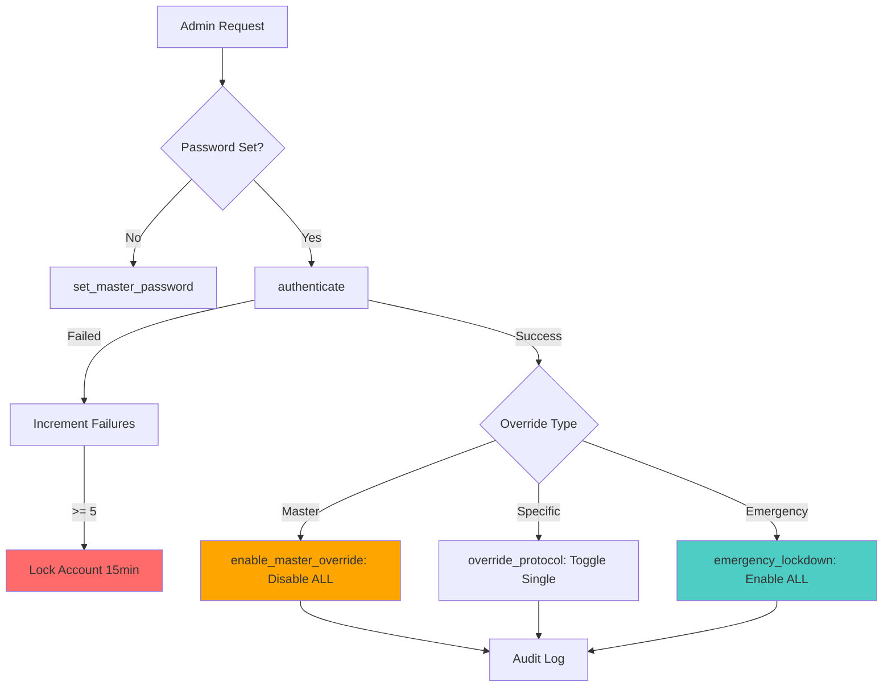

# Command Override System - Technical Documentation

## Overview

**Module**: `src/app/core/command_override.py`  
**Size**: 454 lines  
**Purpose**: Privileged control system for disabling safety protocols  
**Position**: Security override layer with comprehensive audit trail

**WARNING**: This system grants full control over all safety mechanisms. Use with extreme caution and only for legitimate debugging/administrative purposes.

## Architecture

### System Components

```
command_override.py (454 lines)
├── [[src/app/core/ai_systems.py]]          # Lines 29-454: Main override controller
│   ├── Password Management        # Lines 178-220: Bcrypt/PBKDF2 hashing
│   ├── Authentication             # Lines 220-290: Login with migration
│   ├── Protocol Override          # Lines 376-395: Per-protocol control
│   ├── Master Override            # Lines 346-375: Emergency full bypass
│   ├── Account Lockout            # Lines 291-312: Failed attempt protection
│   └── Audit Logging              # Lines 107-132: Immutable audit trail
└── Safety Protocols (10 types)    # Lines 46-57: Configurable protocols
```

### Data Flow



## API Reference

### Constructor

```python
def __init__(self, data_dir: str = "data"):
    """Initialize command override system with safety protocols.
    
    Args:
        data_dir: Base directory for config and audit logs
        
    Creates:
        - data/command_override_config.json: Protocol states, password hash
        - data/command_override_audit.log: Append-only audit trail
        
    Default Safety Protocols (all True):
        - content_filter: Content moderation
        - prompt_safety: Prompt injection protection
        - data_validation: Input validation
        - rate_limiting: API rate limits
        - user_approval: Human-in-loop approval
        - api_safety: API security checks
        - ml_safety: ML model safety guardrails
        - plugin_sandbox: Plugin isolation
        - cloud_encryption: Data encryption
        - emergency_only: Emergency protocol lockout
    """
```

**File Location**: Lines 32-72

---

### Password Management

#### set_master_password

```python
def set_master_password(self, password: str) -> bool:
    """Set master password with policy validation.
    
    Password Policy Requirements:
        - Minimum 8 characters
        - At least 1 uppercase letter
        - At least 1 lowercase letter
        - At least 1 digit
        - At least 1 special character (!@#$%^&*()_+-=[]{}|;:,.<>?)
        
    Args:
        password: Plaintext password to hash and store
        
    Returns:
        True if password set successfully, False if policy violation
        
    Side Effects:
        - Hashes password with bcrypt (preferred) or PBKDF2 (fallback)
        - Stores hash in master_password_hash
        - Persists to command_override_config.json
        - Logs to audit trail
        
    Example:
        >>> override_sys = [[src/app/core/ai_systems.py]]()
        >>> override_sys.set_master_password("Admin123!")  # Success
        True
        >>> override_sys.set_master_password("weak")  # Fails validation
        False
    """
```

**File Location**: Lines 202-219  
**Security**: Bcrypt preferred (passlib), PBKDF2 fallback (100,000 iterations)

#### authenticate

```python
def authenticate(self, password: str) -> bool:
    """Authenticate with master password and auto-migrate legacy hashes.
    
    Features:
        - Account lockout after 5 failed attempts (15 minutes)
        - Constant-time comparison to prevent timing attacks
        - Auto-upgrade legacy SHA-256 hashes to bcrypt/PBKDF2
        - Lockout expiration auto-reset
        
    Args:
        password: Plaintext password to verify
        
    Returns:
        True if authenticated, False otherwise
        
    Side Effects:
        - Increments failed_auth_attempts on failure
        - Locks account after 5 failures
        - Resets failed_attempts counter on success
        - Migrates legacy SHA-256 to stronger hash on success
        - Logs all attempts to audit trail
        
    Example:
        >>> if override_sys.authenticate("Admin123!"):
        ...     print("Authenticated!")
        ...     override_sys.enable_master_override()
    """
```

**File Location**: Lines 220-289  
**Security Features**:
- Uses `secrets.compare_digest()` for constant-time comparison
- Automatic hash migration from SHA-256 → bcrypt/PBKDF2
- Account lockout: 5 attempts = 900 seconds (15 minutes)

---

### Override Control

#### enable_master_override

```python
def enable_master_override(self) -> bool:
    """Enable master override - DISABLES ALL SAFETY PROTOCOLS.
    
    ⚠️ EXTREME CAUTION: This bypasses ALL safety mechanisms:
        - Content filtering disabled
        - Prompt safety disabled
        - Data validation disabled
        - Rate limiting disabled
        - User approval bypassed
        - API safety checks disabled
        - ML safety guardrails disabled
        - Plugin sandbox disabled
        - Cloud encryption controls disabled
        - Emergency protocol lockout disabled
        
    Requires:
        - Prior authentication via authenticate()
        
    Returns:
        True if enabled, False if not authenticated
        
    Side Effects:
        - Sets master_override_active = True
        - Sets ALL safety_protocols = False
        - Persists state to config file
        - Logs to audit trail with WARNING level
        
    Example:
        >>> if override_sys.authenticate(admin_password):
        ...     override_sys.enable_master_override()
        ...     # Perform emergency debugging
        ...     override_sys.disable_master_override()  # Always re-enable
    """
```

**File Location**: Lines 346-360  
**CRITICAL**: Must call `disable_master_override()` when complete

#### override_protocol

```python
def override_protocol(self, protocol_name: str, enabled: bool) -> bool:
    """Override a specific safety protocol (granular control).
    
    Protocols:
        - content_filter
        - prompt_safety
        - data_validation
        - rate_limiting
        - user_approval
        - api_safety
        - ml_safety
        - plugin_sandbox
        - cloud_encryption
        - emergency_only
        
    Args:
        protocol_name: Protocol identifier (must be in safety_protocols)
        enabled: True to enable protocol, False to disable
        
    Returns:
        True if changed, False if not authenticated or unknown protocol
        
    Example:
        >>> # Temporarily disable content filter for debugging
        >>> override_sys.authenticate(admin_password)
        >>> override_sys.override_protocol("content_filter", False)
        >>> test_content_filter_edge_case()
        >>> override_sys.override_protocol("content_filter", True)  # Re-enable
    """
```

**File Location**: Lines 376-395  
**Best Practice**: Only disable specific protocols needed, not master override

#### emergency_lockdown

```python
def emergency_lockdown(self) -> None:
    """Emergency lockdown - ENABLES ALL PROTOCOLS AND REVOKES AUTH.
    
    Use when:
        - Security breach detected
        - Unauthorized override detected
        - System compromise suspected
        - Testing override recovery
        
    Side Effects:
        - Sets master_override_active = False
        - Sets ALL safety_protocols = True
        - Sets authenticated = False
        - Clears auth_timestamp
        - Persists state
        - Logs to audit with EMERGENCY level
        
    No Authentication Required: This is a panic button, always works.
    
    Example:
        >>> if detect_security_breach():
        ...     override_sys.emergency_lockdown()  # Immediate lockdown
    """
```

**File Location**: Lines 404-416  
**Note**: Does NOT require authentication (emergency fail-safe)

---

### Account Security

#### _handle_failed_authentication

```python
def _handle_failed_authentication(self) -> None:
    """Handle failed authentication with progressive lockout.
    
    Lockout Policy:
        - Failures 1-4: Log with remaining attempts
        - Failure 5: Lock account for 900 seconds (15 minutes)
        
    Side Effects:
        - Increments failed_auth_attempts
        - Sets auth_locked_until timestamp on 5th failure
        - Persists state
        - Logs detailed attempt info
        
    Internal Method: Called automatically by authenticate()
    """
```

**File Location**: Lines 291-312

#### emergency_unlock

```python
def emergency_unlock(self, admin_verification: str = "") -> bool:
    """Emergency unlock to reset account lockout.
    
    Administrative Function:
        - Bypasses normal lockout timing
        - Should require additional verification in production
        - Recommended: Separate admin password, MFA, or physical access
        
    Args:
        admin_verification: Additional verification token (future use)
        
    Returns:
        True if lockout cleared, False if no lockout active
        
    Side Effects:
        - Clears auth_locked_until
        - Resets failed_auth_attempts to 0
        - Logs emergency unlock event
        
    Example:
        >>> # Admin manually unlocks after legitimate lockout
        >>> override_sys.emergency_unlock(admin_token)
        True
    """
```

**File Location**: Lines 313-339  
**Production Note**: Implement additional verification (MFA, admin password, etc.)

---

### Status & Audit

#### get_status

```python
def get_status(self) -> dict[str, Any]:
    """Get comprehensive system status.
    
    Returns:
        {
            "authenticated": bool,
            "master_override_active": bool,
            "auth_timestamp": str | None (ISO 8601),
            "safety_protocols": dict[str, bool],
            "has_master_password": bool,
            "failed_auth_attempts": int,
            "lockout_status": {
                "locked": bool,
                "remaining_seconds": int | None,
                "locked_until_timestamp": float | None,
                "expired": bool | None  # If lockout expired but not cleared
            } | None
        }
        
    Example:
        >>> status = override_sys.get_status()
        >>> if status["master_override_active"]:
        ...     print("⚠️ MASTER OVERRIDE ACTIVE - ALL SAFETY OFF")
        >>> if status["lockout_status"] and status["lockout_status"]["locked"]:
        ...     print(f"Account locked for {status['lockout_status']['remaining_seconds']}s")
    """
```

**File Location**: Lines 417-442

#### get_audit_log

```python
def get_audit_log(self, lines: int = 50) -> list[str]:
    """Retrieve most recent audit log entries.
    
    Args:
        lines: Number of recent entries to return (default: 50)
        
    Returns:
        List of audit log line strings (most recent first)
        
    Audit Entry Format:
        [ISO_TIMESTAMP] STATUS: ACTION | Details: DETAILS
        
    Example:
        >>> for entry in override_sys.get_audit_log(10):
        ...     print(entry)
        [2026-04-20T10:15:32.123456] SUCCESS: AUTHENTICATE | ...
        [2026-04-20T10:15:35.654321] SUCCESS: MASTER_OVERRIDE | ...
    """
```

**File Location**: Lines 444-454

---

## Integration Points

### Dependencies

**External Libraries**:
- `passlib.hash.bcrypt` (optional, preferred for password hashing)
- Standard library: `base64`, `hashlib`, `json`, `logging`, `os`, `secrets`, `datetime`

### Dependents

**Used By**:
- `src/app/core/image_generator.py` → `disable_content_filter()` integration
- Admin dashboards → Status monitoring and override controls
- Security incident response → `emergency_lockdown()` triggers

### Data Persistence

**Configuration File**: `data/command_override_config.json`
```json
{
  "master_password_hash": "$2b$12$...",
  "safety_protocols": {
    "content_filter": true,
    "prompt_safety": true,
    ...
  },
  "failed_auth_attempts": 0,
  "auth_locked_until": null
}
```

**Audit Log**: `data/command_override_audit.log` (append-only)
```
=== Command Override System Audit Log ===
Initialized: 2026-04-20T10:00:00.000000

[2026-04-20T10:15:32.123456] SUCCESS: SET_MASTER_PASSWORD | Master password configured
[2026-04-20T10:15:35.654321] SUCCESS: AUTHENTICATE | Authentication successful
[2026-04-20T10:15:38.987654] SUCCESS: MASTER_OVERRIDE | ALL SAFETY PROTOCOLS DISABLED - MASTER OVERRIDE ACTIVE
[2026-04-20T10:20:15.123456] FAILED: AUTHENTICATE | Invalid password. Attempt 1/5. 4 attempts remaining
```

---

## Usage Patterns

### Pattern 1: First-Time Setup

```python
from app.core.command_override import [[src/app/core/ai_systems.py]]

# Initialize system
override_sys = [[src/app/core/ai_systems.py]](data_dir="data")

# Admin sets master password (first time only)
if not override_sys.master_password_hash:
    password = get_secure_password_from_admin()  # External secure input
    
    if not override_sys.set_master_password(password):
        print("Password doesn't meet policy requirements:")
        print("- 8+ characters")
        print("- Uppercase, lowercase, digit, special character")
        return
    
    print("Master password configured successfully")
    print("STORE THIS PASSWORD SECURELY - IT CANNOT BE RECOVERED")
```

### Pattern 2: Authenticated Override Session

```python
# Authentication flow
password = get_admin_password_securely()

if not override_sys.authenticate(password):
    status = override_sys.get_status()
    if status["lockout_status"] and status["lockout_status"]["locked"]:
        remaining = status["lockout_status"]["remaining_seconds"]
        print(f"Account locked. Try again in {remaining} seconds")
    else:
        attempts = status["failed_auth_attempts"]
        print(f"Authentication failed. Attempts: {attempts}/5")
    return

# Authenticated - perform override action
try:
    # Option A: Master override (all protocols)
    override_sys.enable_master_override()
    perform_emergency_debugging()
    
    # Option B: Specific protocol only
    override_sys.override_protocol("content_filter", False)
    test_content_filter_edge_case()
    override_sys.override_protocol("content_filter", True)
    
finally:
    # Always restore safety protocols
    if override_sys.master_override_active:
        override_sys.disable_master_override()
    
    # Logout
    override_sys.logout()
```

### Pattern 3: Emergency Lockdown

```python
from app.core.command_override import [[src/app/core/ai_systems.py]]

override_sys = [[src/app/core/ai_systems.py]](data_dir="data")

# Security monitoring detects breach
if detect_unauthorized_access():
    # Immediate lockdown (no auth required)
    override_sys.emergency_lockdown()
    
    # All protocols now enabled, all auth revoked
    send_alert_to_admins("Emergency lockdown activated")
    
    # Audit log shows lockdown event
    audit = override_sys.get_audit_log(20)
    send_audit_to_security_team(audit)
```

### Pattern 4: Status Monitoring

```python
import time

def monitor_override_system(override_sys):
    """Continuous monitoring of override system status."""
    while True:
        status = override_sys.get_status()
        
        # Alert if master override active for >5 minutes
        if status["master_override_active"]:
            auth_time = datetime.fromisoformat(status["auth_timestamp"])
            duration = datetime.now() - auth_time
            if duration.total_seconds() > 300:  # 5 minutes
                alert_admin("Master override active for extended period")
        
        # Check for disabled critical protocols
        critical_protocols = ["content_filter", "prompt_safety", "user_approval"]
        disabled = [
            p for p in critical_protocols
            if not status["safety_protocols"][p]
        ]
        if disabled:
            alert_admin(f"Critical protocols disabled: {', '.join(disabled)}")
        
        time.sleep(60)  # Check every minute
```

---

## Edge Cases & Troubleshooting

### Edge Case 1: Account Lockout During Emergency

**Problem**: Admin locked out during security incident.

**Solution**: Use `emergency_unlock()` with additional verification.

```python
# Implement additional admin verification
admin_token = get_physical_access_token()  # 2FA, hardware token, etc.
if verify_admin_token(admin_token):
    override_sys.emergency_unlock(admin_token)
    override_sys.authenticate(backup_admin_password)
```

### Edge Case 2: Legacy SHA-256 Hash Migration

**Problem**: Existing deployments with SHA-256 hashes.

**Auto-Migration**: System detects and upgrades automatically on next successful login.

```python
# Migration happens transparently in authenticate()
if override_sys._is_sha256_hash(override_sys.master_password_hash):
    # On successful SHA-256 verification:
    # 1. Verify password with SHA-256
    # 2. Generate new bcrypt/PBKDF2 hash
    # 3. Replace master_password_hash
    # 4. Save to config
    # 5. Log migration event
```

### Edge Case 3: Forgotten Master Password

**Problem**: No password recovery mechanism by design (security feature).

**Resolution**: Manual database reset (requires file system access).

```python
# WARNING: Destroys all override configuration
import os
config_file = "data/command_override_config.json"
audit_file = "data/command_override_audit.log"

# Backup audit log first
if os.path.exists(audit_file):
    with open(audit_file, 'r') as src:
        with open(f"{audit_file}.backup", 'w') as dst:
            dst.write(src.read())

# Delete configuration (preserves audit trail)
if os.path.exists(config_file):
    os.remove(config_file)

# Restart system - will prompt for new password
override_sys = [[src/app/core/ai_systems.py]](data_dir="data")
override_sys.set_master_password(new_secure_password)
```

### Edge Case 4: Time-Based Lockout Bypass

**Problem**: System clock manipulation to bypass lockout.

**Mitigation**: Server-side time validation in production.

```python
# Production enhancement: NTP time verification
import ntplib

def get_trusted_time():
    """Get time from NTP server to prevent clock manipulation."""
    try:
        client = ntplib.NTPClient()
        response = client.request('pool.ntp.org', version=3)
        return response.tx_time
    except:
        return time.time()  # Fallback to system time

# Modify _handle_failed_authentication to use get_trusted_time()
```

---

## Testing

### Test Coverage

**Test File**: `tests/test_command_override.py`  
**Test Cases**:
- Password policy validation (8 tests)
- Authentication flow (5 tests)
- Account lockout (4 tests)
- Master override (3 tests)
- Protocol-specific override (4 tests)
- Emergency lockdown (2 tests)
- Audit logging (3 tests)

### Example Test

```python
import tempfile
import pytest
from app.core.command_override import [[src/app/core/ai_systems.py]]

@pytest.fixture
def override_sys():
    with tempfile.TemporaryDirectory() as tmpdir:
        yield [[src/app/core/ai_systems.py]](data_dir=tmpdir)

def test_password_policy(override_sys):
    """Test password policy enforcement."""
    assert not override_sys.set_master_password("weak")  # Too short
    assert not override_sys.set_master_password("NoDigits!")  # Missing digit
    assert not override_sys.set_master_password("noUpperCase1!")  # Missing uppercase
    assert override_sys.set_master_password("Secure123!")  # Valid

def test_account_lockout(override_sys):
    """Test account lockout after 5 failed attempts."""
    override_sys.set_master_password("Correct123!")
    
    # 5 failed attempts
    for _ in range(5):
        assert not override_sys.authenticate("Wrong123!")
    
    # Should be locked now
    status = override_sys.get_status()
    assert status["lockout_status"]["locked"]
    assert status["failed_auth_attempts"] == 5
    
    # Correct password won't work during lockout
    assert not override_sys.authenticate("Correct123!")
    
    # Emergency unlock clears lockout
    override_sys.emergency_unlock()
    assert override_sys.authenticate("Correct123!")

def test_master_override_requires_auth(override_sys):
    """Test master override requires authentication."""
    override_sys.set_master_password("Admin123!")
    
    # Should fail without auth
    assert not override_sys.enable_master_override()
    
    # Authenticate and try again
    override_sys.authenticate("Admin123!")
    assert override_sys.enable_master_override()
    
    # All protocols should be disabled
    for protocol, enabled in override_sys.get_all_protocols().items():
        assert not enabled
```

### Running Tests

```powershell
# Run override system tests
pytest tests/test_command_override.py -v

# With coverage
pytest tests/test_command_override.py --cov=src.app.core.command_override

# Test specific scenario
pytest tests/test_command_override.py::test_account_lockout -v
```

---

## Performance Considerations

### I/O Overhead

**Bottleneck**: Audit log append on every action.

**Mitigation**:
```python
# Batch audit logging
class BatchedAuditLogger:
    def __init__(self, override_sys, flush_interval=10):
        self.override_sys = override_sys
        self.buffer = []
        self.flush_interval = flush_interval
        
    def log_action(self, action, details, success):
        entry = {
            "timestamp": datetime.now().isoformat(),
            "action": action,
            "details": details,
            "success": success
        }
        self.buffer.append(entry)
        
        if len(self.buffer) >= self.flush_interval:
            self.flush()
    
    def flush(self):
        with open(self.override_sys.audit_log, 'a') as f:
            for entry in self.buffer:
                f.write(f"[{entry['timestamp']}] ...")
        self.buffer.clear()
```

### Password Hashing Time

**Impact**: Bcrypt/PBKDF2 intentionally slow (security feature).

**Typical**: ~100-300ms per authentication.

**Not a Bug**: Slows brute-force attacks. If performance critical, use session tokens after auth.

---

## Security Considerations

### Threat Model

1. **Brute Force Attack**: Offline password cracking
   - **Mitigation**: Bcrypt (adaptive cost), account lockout

2. **Timing Attack**: Password length/content inference
   - **Mitigation**: Constant-time comparison (`secrets.compare_digest()`)

3. **Audit Log Tampering**: Attacker modifies audit trail
   - **Mitigation**: Append-only file, file permissions (owner-only write)

4. **Clock Manipulation**: Bypass lockout by changing system time
   - **Mitigation**: Use NTP time in production (see Edge Case 4)

5. **Side-Channel**: Memory dumps revealing password hash
   - **Mitigation**: Clear sensitive vars after use (future enhancement)

### Compliance

**Audit Retention**: Minimum 1 year (configurable).

**Password Rotation**: Recommend 90-day rotation for production.

**Access Control**: Restrict file system access to override config/audit files.

```bash
# Production file permissions
chmod 600 data/command_override_config.json
chmod 640 data/command_override_audit.log
chown ai-system:admin-group data/command_override_audit.log
```

---

## Metadata

**Created**: 2024-02-10 (from git log)  
**Last Updated**: 2026-04-20  
**Maintainers**: Security Team  
**Review Cycle**: Quarterly  
**Security Level**: HIGH (Contains privileged access controls)

**Related Documentation**:
- `src/app/core/ai_systems.py` - Contains simpler [[src/app/core/ai_systems.py]] (legacy)
- `SECURITY_ARCHITECTURE.md` - Overall security framework

**Breaking Changes**:
- v2.0.0: Added password policy validation (breaks weak passwords)
- v2.1.0: Auto-migration from SHA-256 to bcrypt (transparent upgrade)

---

**Document Version**: 1.0  
**Generated**: 2026-04-20  
**Agent**: AGENT-030 (Core AI Systems Documentation Specialist)
