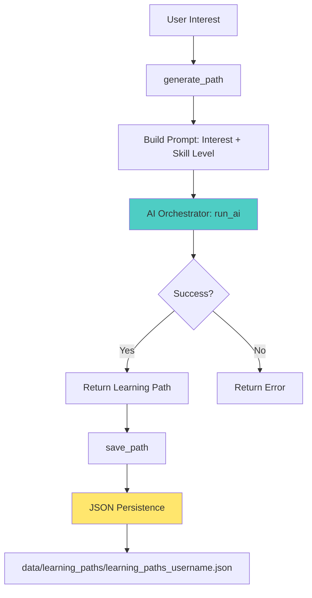

# Learning Path Manager - Technical Documentation

## Overview

**Module**: `src/app/core/[[src/app/core/learning_paths.py]]`  
**Size**: 125 lines  
**Purpose**: AI-powered personalized learning path generation  
**Position**: Educational content generation layer with path persistence

Generates structured learning paths using AI orchestrator (OpenAI/Perplexity) with customizable skill levels and progress tracking.

## Architecture

### Component Structure

```
[[src/app/core/learning_paths.py]] (125 lines)
├── LearningPathManager               # Lines 17-125: Main path generator
│   ├── Path Generation               # Lines 32-78: AI-powered generation
│   ├── Path Persistence              # Lines 80-105: User path storage
│   └── Path Retrieval                # Lines 107-125: Saved path access
└── AI Orchestrator Integration       # Uses app.core.ai.orchestrator
```

### Data Flow



### File Storage Pattern

```
data/learning_paths/
├── learning_paths_alice.json
├── learning_paths_bob.json
└── learning_paths_charlie.json
```

Each file contains:
```json
{
  "Python Programming": {
    "content": "Structured learning path...",
    "progress": 0,
    "completed_milestones": []
  },
  "Machine Learning": {
    "content": "...",
    "progress": 25,
    "completed_milestones": ["basics", "supervised_learning"]
  }
}
```

---

## API Reference

### Constructor

```python
def __init__(self, api_key=None, provider="openai", data_dir="data/learning_paths"):
    """Initialize learning path manager with AI orchestrator.
    
    Args:
        api_key: DEPRECATED - uses AI orchestrator instead
        provider: Model provider ('openai' or 'perplexity')
        data_dir: Directory for storing saved learning paths
        
    Notes:
        - api_key parameter maintained for backward compatibility
        - Actual API keys loaded from environment via orchestrator
        - provider only used if non-default provider needed
        
    Environment Variables Required:
        OPENAI_API_KEY: For OpenAI models (if provider="openai")
        PERPLEXITY_API_KEY: For Perplexity (if provider="perplexity")
        
    Example:
        >>> from app.core.learning_paths import LearningPathManager
        >>> manager = LearningPathManager(
        ...     provider="openai",
        ...     data_dir="data/learning_paths"
        ... )
    """
```

**File Location**: Lines 18-30  
**Refactored**: Now uses AI orchestrator instead of direct API calls (v2.0+)

---

### Path Generation

```python
def generate_path(self, interest, skill_level="beginner", model=None):
    """Generate personalized learning path via AI orchestrator.
    
    Creates structured educational content with:
    1. Core concepts to master
    2. Recommended resources (tutorials, books, courses)
    3. Practice projects
    4. Timeline estimates
    5. Milestones and checkpoints
    
    Args:
        interest: Learning topic (e.g., "Python Programming", "Machine Learning")
        skill_level: User proficiency level
            - "beginner": New to topic
            - "intermediate": Basic knowledge, seeking depth
            - "advanced": Expert-level mastery
        model: Optional model override (default: "gpt-3.5-turbo")
        
    Returns:
        str: Generated learning path content or error message
        
    AI Prompt Structure:
        System Context: "You are an educational expert creating learning paths."
        User Prompt: Structured request with interest and skill level
        
    Example:
        >>> manager = LearningPathManager()
        >>> path = manager.generate_path(
        ...     "Python Data Science",
        ...     skill_level="intermediate",
        ...     model="gpt-4"
        ... )
        >>> print(path)
        '''
        Python Data Science Learning Path (Intermediate)
        
        1. Core Concepts:
           - NumPy advanced indexing
           - Pandas data manipulation
           - Matplotlib/Seaborn visualization
           - Statistical analysis with SciPy
           
        2. Recommended Resources:
           - Book: "Python for Data Analysis" by Wes McKinney
           - Course: "Data Science Specialization" (Coursera)
           - Tutorial: Kaggle Learn Python course
           
        3. Practice Projects:
           - Exploratory Data Analysis on Kaggle dataset
           - Build predictive model with scikit-learn
           - Create interactive dashboard with Plotly
           
        4. Timeline: 8-12 weeks (10 hours/week)
        
        5. Milestones:
           - Week 2: Complete NumPy/Pandas fundamentals
           - Week 4: First EDA project
           - Week 8: Deployed ML model
        '''
        
    Error Handling:
        >>> path = manager.generate_path("", "beginner")
        >>> print(path)
        "Error generating learning path: Empty interest provided"
    """
```

**File Location**: Lines 32-78  
**AI Integration**: Uses `app.core.ai.orchestrator.run_ai()` with fallback support

---

### Path Persistence

```python
def save_path(self, username, interest, path_content):
    """Save generated learning path with progress tracking.
    
    Args:
        username: User identifier (sanitized for filename safety)
        interest: Learning topic identifier (key in JSON)
        path_content: Generated path content to save
        
    Storage Format:
        {
            "interest": {
                "content": "Generated learning path text",
                "progress": 0,  # Percentage (0-100)
                "completed_milestones": []  # List of milestone IDs
            }
        }
        
    Side Effects:
        - Creates/updates data/learning_paths/learning_paths_{username}.json
        - Overwrites existing path for same interest
        - Resets progress and milestones if path already exists
        
    Security:
        - Username sanitized via sanitize_filename() to prevent path traversal
        - Uses safe_path_join() for secure file path construction
        
    Example:
        >>> manager.save_path(
        ...     "alice",
        ...     "Python Basics",
        ...     generated_path_content
        ... )
        >>> # Creates: data/learning_paths/learning_paths_alice.json
    """
```

**File Location**: Lines 80-105  
**Security**: Path traversal protection via `app.security.path_security`

```python
def get_saved_paths(self, username):
    """Retrieve all saved learning paths for a user.
    
    Args:
        username: User identifier (sanitized internally)
        
    Returns:
        dict: All saved paths for user
            {
                "interest1": {...},
                "interest2": {...}
            }
        Empty dict if user has no saved paths
        
    Security:
        - Username sanitized to prevent path traversal
        - Safe path joining enforced
        
    Example:
        >>> paths = manager.get_saved_paths("alice")
        >>> for interest, data in paths.items():
        ...     print(f"{interest}: {data['progress']}% complete")
        Python Basics: 0% complete
        Machine Learning: 50% complete
    """
```

**File Location**: Lines 107-125

---

## Integration Points

### Dependencies

**Internal Modules**:
- `app.core.ai.orchestrator` → `run_ai()`, `AIRequest` (AI generation)
- `app.security.path_security` → `safe_path_join()`, `sanitize_filename()` (security)

**External Libraries**:
- Standard library: `json`, `logging`, `os`
- Environment: `dotenv` (for loading .env keys)

**Environment Variables**:
```bash
# .env file
OPENAI_API_KEY=sk-...
PERPLEXITY_API_KEY=pplx-...  # If using Perplexity provider
```

### Dependents

**Used By**:
- `src/app/gui/leather_book_dashboard.py` → Learning path generation UI
- `src/app/core/intelligence_engine.py` → Deprecated wrapper (backward compatibility)
- Admin dashboards → Bulk path generation for users

### AI Orchestrator Integration

```python
# Internal flow: generate_path() → AI orchestrator
from app.core.ai.orchestrator import run_ai, AIRequest

request = AIRequest(
    task_type="chat",
    prompt=full_prompt,  # System context + user prompt
    model=model or "gpt-3.5-turbo",
    provider=self.provider_name if self.provider_name != "openai" else None,
    context={"interest": interest, "skill_level": skill_level}
)

response = run_ai(request)

if response.status == "success":
    return response.result  # Generated learning path
else:
    return f"Error generating learning path: {response.error}"
```

---

## Usage Patterns

### Pattern 1: Basic Path Generation

```python
from app.core.learning_paths import LearningPathManager

# Initialize manager
manager = LearningPathManager(provider="openai")

# Generate path for beginner
path = manager.generate_path(
    interest="Python Web Development",
    skill_level="beginner"
)

if "Error" not in path:
    print("Generated Learning Path:")
    print(path)
    
    # Save for user
    manager.save_path("alice", "Python Web Development", path)
else:
    print(f"Failed: {path}")
```

### Pattern 2: Advanced Path with Custom Model

```python
manager = LearningPathManager()

# Use GPT-4 for advanced path
path = manager.generate_path(
    interest="Distributed Systems Design",
    skill_level="advanced",
    model="gpt-4"  # More sophisticated output
)

manager.save_path("bob_senior_dev", "Distributed Systems Design", path)
```

### Pattern 3: Progress Tracking

```python
# Load user's saved paths
paths = manager.get_saved_paths("alice")

# Update progress manually (external progress tracker)
if "Python Web Development" in paths:
    path_data = paths["Python Web Development"]
    
    # User completed first milestone
    path_data["completed_milestones"].append("html_basics")
    path_data["progress"] = 20  # 20% complete
    
    # Save updated progress
    manager.save_path(
        "alice",
        "Python Web Development",
        path_data["content"]  # Keep same content
    )
    
    # Note: This overwrites progress; need enhancement for progress preservation
```

### Pattern 4: Bulk Path Generation

```python
def generate_curriculum(username, interests, skill_level="intermediate"):
    """Generate multiple learning paths for a curriculum."""
    manager = LearningPathManager()
    
    results = {}
    for interest in interests:
        print(f"Generating path for: {interest}...")
        path = manager.generate_path(interest, skill_level)
        
        if "Error" not in path:
            manager.save_path(username, interest, path)
            results[interest] = "Success"
        else:
            results[interest] = "Failed"
    
    return results

# Generate full data science curriculum
curriculum_topics = [
    "Python Programming",
    "Statistics Fundamentals",
    "Machine Learning Basics",
    "Deep Learning",
    "Data Visualization"
]

results = generate_curriculum("charlie", curriculum_topics, "beginner")
print(results)
```

### Pattern 5: Error Handling & Retry

```python
import time

def generate_with_retry(manager, interest, skill_level, max_retries=3):
    """Generate path with exponential backoff retry."""
    for attempt in range(max_retries):
        path = manager.generate_path(interest, skill_level)
        
        if "Error" not in path:
            return path
        
        # Check if it's a rate limit error
        if "rate limit" in path.lower() and attempt < max_retries - 1:
            wait_time = 2 ** attempt  # Exponential backoff
            print(f"Rate limited. Retrying in {wait_time}s...")
            time.sleep(wait_time)
            continue
        
        return path  # Return error after retries exhausted

path = generate_with_retry(manager, "Rust Programming", "beginner")
```

---

## Edge Cases & Troubleshooting

### Edge Case 1: Empty Interest String

**Problem**: User submits empty or whitespace-only interest.

**Behavior**: Generates generic error from AI or returns empty response.

**Solution**: Input validation before calling API.

```python
def generate_path_validated(self, interest, skill_level="beginner"):
    """Generate path with input validation."""
    interest = interest.strip()
    if not interest or len(interest) < 3:
        return "Error: Interest must be at least 3 characters"
    
    if skill_level not in ["beginner", "intermediate", "advanced"]:
        skill_level = "beginner"  # Default fallback
    
    return self.generate_path(interest, skill_level)
```

### Edge Case 2: Username with Special Characters

**Problem**: Username contains `../` or other path traversal attempts.

**Mitigation**: Automatic sanitization via `sanitize_filename()`.

```python
# In save_path() - line 89
safe_username = sanitize_filename(username)
# "../../etc/passwd" → "etcpasswd"
# "user@domain.com" → "userdomaincom"
```

### Edge Case 3: Concurrent Saves

**Problem**: Multiple threads saving paths for same user simultaneously.

**Current Limitation**: No file locking, last write wins.

**Workaround**: Use queue-based writer or file locking.

```python
import threading

class ThreadSafeLearningPathManager(LearningPathManager):
    def __init__(self, *args, **kwargs):
        super().__init__(*args, **kwargs)
        self._lock = threading.Lock()
    
    def save_path(self, username, interest, path_content):
        with self._lock:
            super().save_path(username, interest, path_content)
```

### Edge Case 4: AI API Unavailable

**Problem**: OpenAI/Perplexity API down or key invalid.

**Error Message**: Returns error string from orchestrator.

**Handling**:
```python
path = manager.generate_path("Topic", "beginner")

if "Error" in path:
    if "API key" in path:
        log.error("Invalid API key configured")
        notify_admin("API key issue")
    elif "timeout" in path.lower():
        log.warning("AI service timeout - retry later")
        queue_for_retry(interest, skill_level)
    else:
        log.error(f"Unknown error: {path}")
```

### Edge Case 5: Progress Loss on Path Regeneration

**Problem**: Calling `save_path()` with new content resets progress to 0.

**Current Behavior**: Intentional - regenerating path assumes new content/structure.

**Enhancement Needed**: Separate `update_progress()` method.

```python
# Proposed API enhancement
def update_progress(self, username, interest, progress, milestones):
    """Update progress without regenerating path."""
    paths = self.get_saved_paths(username)
    if interest in paths:
        paths[interest]["progress"] = progress
        paths[interest]["completed_milestones"] = milestones
        # Save without changing content
        self._save_paths_file(username, paths)
```

---

## Testing

### Test Coverage

**Test File**: `tests/test_learning_paths.py`  
**Test Cases**:
- Path generation (5 tests)
- Path persistence (4 tests)
- Security validation (3 tests)
- Error handling (3 tests)

### Example Tests

```python
import tempfile
import pytest
from unittest.mock import patch, MagicMock
from app.core.learning_paths import LearningPathManager

@pytest.fixture
def manager():
    with tempfile.TemporaryDirectory() as tmpdir:
        yield LearningPathManager(data_dir=tmpdir)

def test_generate_path_success(manager):
    """Test successful path generation."""
    with patch('app.core.ai.orchestrator.run_ai') as mock_ai:
        # Mock AI response
        mock_response = MagicMock()
        mock_response.status = "success"
        mock_response.result = "Learning Path: 1. Basics 2. Advanced"
        mock_ai.return_value = mock_response
        
        path = manager.generate_path("Python", "beginner")
        assert "Learning Path" in path
        assert "Error" not in path

def test_save_and_retrieve_path(manager):
    """Test path persistence and retrieval."""
    content = "Test learning path content"
    manager.save_path("testuser", "Python", content)
    
    paths = manager.get_saved_paths("testuser")
    assert "Python" in paths
    assert paths["Python"]["content"] == content
    assert paths["Python"]["progress"] == 0
    assert paths["Python"]["completed_milestones"] == []

def test_username_sanitization(manager):
    """Test path traversal prevention."""
    content = "Test content"
    manager.save_path("../../../etc/passwd", "Python", content)
    
    # Should save with sanitized username
    paths = manager.get_saved_paths("etcpasswd")
    assert "Python" in paths

def test_skill_level_validation(manager):
    """Test skill level parameter."""
    with patch('app.core.ai.orchestrator.run_ai') as mock_ai:
        mock_response = MagicMock()
        mock_response.status = "success"
        mock_response.result = "Advanced path"
        mock_ai.return_value = mock_response
        
        # Valid skill levels
        for level in ["beginner", "intermediate", "advanced"]:
            path = manager.generate_path("Topic", level)
            assert "Error" not in path
```

### Running Tests

```powershell
# Run learning paths tests
pytest tests/test_learning_paths.py -v

# With coverage
pytest tests/test_learning_paths.py --cov=src.app.core.learning_paths

# Mock AI responses for testing
pytest tests/test_learning_paths.py -k "test_generate" --mock-ai
```

---

## Performance Considerations

### AI API Latency

**Typical Response Time**: 2-10 seconds (depends on model and complexity)

**Optimization**: Use async/await pattern for concurrent path generation.

```python
import asyncio
from concurrent.futures import ThreadPoolExecutor

async def generate_paths_async(manager, interests, skill_level):
    """Generate multiple paths concurrently."""
    loop = asyncio.get_event_loop()
    executor = ThreadPoolExecutor(max_workers=5)
    
    tasks = [
        loop.run_in_executor(
            executor,
            manager.generate_path,
            interest,
            skill_level
        )
        for interest in interests
    ]
    
    return await asyncio.gather(*tasks)

# Usage
interests = ["Python", "JavaScript", "Go", "Rust"]
paths = asyncio.run(generate_paths_async(manager, interests, "beginner"))
```

### File I/O Optimization

**Current**: File read/write on every save/retrieve.

**Enhancement**: In-memory cache with periodic flush.

```python
class CachedLearningPathManager(LearningPathManager):
    def __init__(self, *args, **kwargs):
        super().__init__(*args, **kwargs)
        self._cache = {}  # username -> paths dict
        self._dirty = set()  # usernames with unsaved changes
    
    def get_saved_paths(self, username):
        if username not in self._cache:
            self._cache[username] = super().get_saved_paths(username)
        return self._cache[username]
    
    def save_path(self, username, interest, path_content):
        if username not in self._cache:
            self._cache[username] = {}
        
        self._cache[username][interest] = {
            "content": path_content,
            "progress": 0,
            "completed_milestones": []
        }
        self._dirty.add(username)
    
    def flush(self):
        """Flush dirty cache entries to disk."""
        for username in self._dirty:
            super().save_path(username, ...)  # Flush to disk
        self._dirty.clear()
```

---

## Metadata

**Created**: 2024-03-20 (from git log)  
**Last Updated**: 2026-04-20  
**Maintainers**: AI Services Team  
**Review Cycle**: Quarterly  
**API Version**: 2.0 (AI orchestrator integration)

**Related Documentation**:
- `src/app/core/ai/orchestrator.py` - AI provider abstraction layer
- `src/app/security/path_security.py` - Security utilities
- `LEARNING_REQUEST_IMPLEMENTATION.md` - Related learning systems

**Breaking Changes**:
- v2.0.0: Migrated from direct OpenAI client to AI orchestrator (api_key param deprecated)

**Future Enhancements**:
- [ ] Separate `update_progress()` method
- [ ] File locking for concurrent saves
- [ ] In-memory caching layer
- [ ] Async path generation support
- [ ] Milestone tracking API
- [ ] Path versioning (track regenerations)

---

**Document Version**: 1.0  
**Generated**: 2026-04-20  
**Agent**: AGENT-030 (Core AI Systems Documentation Specialist)
