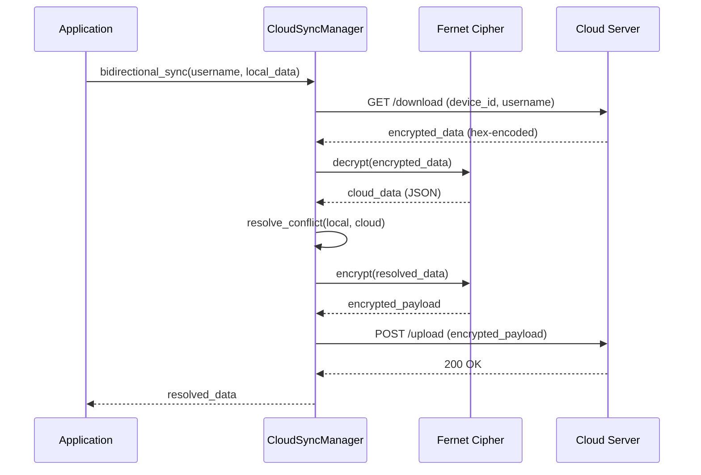

# Cloud Synchronization System

**Module:** `src/app/core/cloud_sync.py`  
**Type:** Core Infrastructure  
**Dependencies:** requests, cryptography (Fernet)  
**Related Modules:** data_persistence.py, user_manager.py

---

## Overview

The Cloud Synchronization System provides encrypted bidirectional sync for cross-device data persistence with automatic conflict resolution. Designed for seamless multi-device experiences with military-grade encryption and offline-first architecture.

### Core Capabilities

- **Encrypted Bidirectional Sync**: Fernet-encrypted data transfer with automatic conflict resolution
- **Device Management**: Unique device fingerprinting with cross-device visibility
- **Automatic Conflict Resolution**: Timestamp-based merge strategy (most recent wins)
- **Auto-Sync Support**: Configurable periodic synchronization (default: 5 minutes)
- **Offline-First Design**: Local-first with eventual consistency
- **Sync Status Tracking**: Real-time sync metadata and device history

---

## Architecture

### System Design

```
┌─────────────────┐         ┌─────────────────┐         ┌─────────────────┐
│   Device A      │         │  Cloud Server   │         │   Device B      │
│                 │         │                 │         │                 │
│ Local State ────┼────────►│ Encrypted       │◄────────┼──── Local State │
│                 │ Upload  │ Storage         │ Download│                 │
│ Device ID:      │         │                 │         │ Device ID:      │
│ a1b2c3d4e5f6    │         │  Sync Queue     │         │ 7a8b9c0d1e2f    │
│                 │         │                 │         │                 │
│ Last Sync:      │         │ Conflict        │         │ Last Sync:      │
│ 14:30:00 UTC    │         │ Resolution      │         │ 14:25:00 UTC    │
└─────────────────┘         └─────────────────┘         └─────────────────┘
        │                           │                           │
        └───────────────────────────┴───────────────────────────┘
                   Sync Metadata + Audit Trail
```

### Data Flow



---

## Core Classes

### CloudSyncManager

**Purpose**: Manages encrypted cloud synchronization with automatic conflict resolution and device tracking.

#### Initialization

```python
from app.core.cloud_sync import CloudSyncManager
import os

# Basic initialization (auto-generates device ID)
sync_manager = CloudSyncManager(
    encryption_key=None,  # Loads from FERNET_KEY env var
    data_dir="data"
)

# Custom encryption key
from cryptography.fernet import Fernet
custom_key = Fernet.generate_key()
sync_manager = CloudSyncManager(
    encryption_key=custom_key,
    data_dir="data/sync"
)

# With cloud endpoint
os.environ["CLOUD_SYNC_URL"] = "https://sync.project-ai.example"
sync_manager = CloudSyncManager()
```

#### Configuration

```python
# Environment variables
CLOUD_SYNC_URL=https://sync.project-ai.example  # Cloud sync server endpoint
FERNET_KEY=<base64-encoded-key>                 # Encryption key (32 bytes base64)

# Auto-sync configuration
sync_manager.enable_auto_sync(interval=300)     # Sync every 5 minutes
sync_manager.disable_auto_sync()                # Disable auto-sync

# Device ID (auto-generated from system info)
device_id = sync_manager.device_id
# Example: "a1b2c3d4e5f67890" (SHA-256 hash of platform.node() + platform.system() + ...)
```

---

## Core Operations

### Upload to Cloud

```python
# Upload user data to cloud (encrypted)
user_data = {
    "preferences": {"theme": "dark", "language": "en"},
    "last_login": "2026-04-20T14:00:00Z",
    "session_count": 42
}

success = sync_manager.sync_upload(
    username="admin",
    data=user_data
)

if success:
    print("Data uploaded and encrypted successfully")
else:
    print("Upload failed (check CLOUD_SYNC_URL configuration)")
```

**Upload Process:**
1. Adds metadata (username, device_id, timestamp)
2. Encrypts data with Fernet cipher
3. Converts encrypted bytes to hex string (JSON-safe)
4. POSTs to `/upload` endpoint
5. Updates sync metadata locally

**Server Endpoint Expected:**
```json
POST /upload
{
  "username": "admin",
  "device_id": "a1b2c3d4e5f67890",
  "encrypted_data": "6741414141426757704c57397a593..."  // hex-encoded
}

Response: 200 OK
```

---

### Download from Cloud

```python
# Download user data from cloud (decrypted)
cloud_data = sync_manager.sync_download(username="admin")

if cloud_data:
    print(f"Downloaded data from device: {cloud_data['device_id']}")
    print(f"Timestamp: {cloud_data['timestamp']}")
    print(f"User data: {cloud_data['data']}")
else:
    print("No cloud data found or download failed")
```

**Download Process:**
1. GETs from `/download` endpoint with username + device_id
2. Receives hex-encoded encrypted data
3. Converts hex to bytes
4. Decrypts with Fernet cipher
5. Returns decrypted JSON dictionary
6. Updates sync metadata locally

**Server Endpoint Expected:**
```json
GET /download?username=admin&device_id=a1b2c3d4e5f67890

Response: 200 OK
{
  "encrypted_data": "6741414141426757704c57397a593..."  // hex-encoded
}

Response: 404 NOT FOUND (no data for user)
```

---

### Bidirectional Sync

```python
# Bidirectional sync with automatic conflict resolution
local_data = {
    "preferences": {"theme": "light", "language": "en"},
    "timestamp": "2026-04-20T14:30:00Z"
}

resolved_data = sync_manager.bidirectional_sync(
    username="admin",
    local_data=local_data
)

# Returns most recent data (local or cloud)
print(f"Using data from: {'cloud' if resolved_data != local_data else 'local'}")
```

**Sync Logic:**
1. Download cloud data
2. If no cloud data exists: Upload local data, return local
3. Compare timestamps (local vs cloud)
4. If local is newer/equal: Keep local, upload if strictly newer
5. If cloud is newer: Return cloud data (client should update)
6. Fallback: Use timestamp-based conflict resolution

**Conflict Resolution Strategy:**
```python
def resolve_conflict(local_data, cloud_data):
    """Most recent data wins (timestamp-based)."""
    local_ts = datetime.fromisoformat(local_data.get("timestamp"))
    cloud_ts = datetime.fromisoformat(cloud_data.get("timestamp"))
    
    if local_ts >= cloud_ts:
        return local_data  # Local is more recent or equal
    else:
        return cloud_data  # Cloud is more recent
```

---

## Encryption System

### Fernet Cipher Details

```python
# Fernet encryption characteristics
- Algorithm: AES-128-CBC + HMAC-SHA256
- Key Size: 32 bytes (256 bits) - base64-encoded
- Output: Base64-encoded ciphertext with embedded timestamp + IV
- Security: Authenticated encryption (prevents tampering)
- Timestamp: Built-in timestamp validation
```

### Encryption Methods

```python
# Encrypt dictionary to bytes
data = {"key": "value", "number": 42}
encrypted_bytes = sync_manager.encrypt_data(data)
# Returns: b'gAAAAABmY3Rp...' (base64-encoded Fernet token)

# Decrypt bytes to dictionary
decrypted_data = sync_manager.decrypt_data(encrypted_bytes)
# Returns: {"key": "value", "number": 42}
```

### Key Management

```python
# Generate new Fernet key
from cryptography.fernet import Fernet
new_key = Fernet.generate_key()
print(new_key.decode())  # Save to .env as FERNET_KEY

# Rotate encryption key (requires re-encrypting all cloud data)
old_sync = CloudSyncManager(encryption_key=old_key)
new_sync = CloudSyncManager(encryption_key=new_key)

# Migrate data
for username in users:
    data = old_sync.sync_download(username)
    if data:
        new_sync.sync_upload(username, data["data"])
```

---

## Device Management

### Device Identification

```python
# Device ID generation (deterministic)
import platform
import uuid
import hashlib

device_info = f"{platform.node()}-{platform.system()}-{platform.machine()}-{uuid.getnode()}"
device_hash = hashlib.sha256(device_info.encode()).hexdigest()
device_id = device_hash[:16]  # First 16 chars

# Example device IDs:
# Desktop: "a1b2c3d4e5f67890"
# Laptop:  "7a8b9c0d1e2f3456"
# Mobile:  "4f5e6d7c8b9a0123"
```

### List User Devices

```python
# Get all devices that have synced data for user
devices = sync_manager.list_devices(username="admin")

for device in devices:
    print(f"Device ID: {device['device_id']}")
    print(f"Current: {device['current']}")  # True if this device
    print(f"Last Sync: {device.get('last_sync')}")
    print(f"Platform: {device.get('platform')}")
    print()

# Example output:
# [
#   {
#     "device_id": "a1b2c3d4e5f67890",
#     "current": True,
#     "last_sync": "2026-04-20T14:30:00Z",
#     "platform": "Windows-10-x86_64"
#   },
#   {
#     "device_id": "7a8b9c0d1e2f3456",
#     "current": False,
#     "last_sync": "2026-04-19T08:15:00Z",
#     "platform": "Linux-6.5.0-x86_64"
#   }
# ]
```

**Server Endpoint Expected:**
```json
GET /devices?username=admin

Response: 200 OK
{
  "devices": [
    {
      "device_id": "a1b2c3d4e5f67890",
      "last_sync": "2026-04-20T14:30:00Z",
      "platform": "Windows-10-x86_64"
    }
  ]
}
```

---

## Sync Status Tracking

### Get Sync Status

```python
# Get detailed sync status for user
status = sync_manager.get_sync_status(username="admin")

print(f"Device ID: {status['device_id']}")
print(f"Cloud Sync Configured: {status['cloud_sync_configured']}")
print(f"Auto-Sync Enabled: {status['auto_sync_enabled']}")
print(f"Auto-Sync Interval: {status['auto_sync_interval']}s")
print(f"Last Upload: {status['last_upload']}")
print(f"Last Download: {status['last_download']}")
```

**Example Output:**
```python
{
    "device_id": "a1b2c3d4e5f67890",
    "cloud_sync_configured": True,
    "auto_sync_enabled": True,
    "auto_sync_interval": 300,
    "last_upload": "2026-04-20T14:30:15Z",
    "last_download": "2026-04-20T14:25:32Z"
}
```

### Sync Metadata File

```python
# Local sync metadata (data/sync_metadata.json)
{
  "admin": {
    "last_upload": "2026-04-20T14:30:15Z",
    "last_download": "2026-04-20T14:25:32Z",
    "device_id": "a1b2c3d4e5f67890"
  },
  "user2": {
    "last_upload": "2026-04-19T09:10:00Z",
    "last_download": "2026-04-19T09:09:45Z",
    "device_id": "a1b2c3d4e5f67890"
  }
}
```

---

## Auto-Sync System

### Enable Auto-Sync

```python
# Enable auto-sync with 5-minute interval (default)
sync_manager.enable_auto_sync(interval=300)

# Enable auto-sync with custom interval (10 minutes)
sync_manager.enable_auto_sync(interval=600)

# Check auto-sync status
if sync_manager.auto_sync_enabled:
    print(f"Auto-sync enabled (every {sync_manager.auto_sync_interval}s)")
```

### Disable Auto-Sync

```python
sync_manager.disable_auto_sync()
print("Auto-sync disabled (manual sync only)")
```

### Auto-Sync Implementation Example

```python
import threading
import time

class AutoSyncThread(threading.Thread):
    def __init__(self, sync_manager, username, get_local_data_func):
        super().__init__(daemon=True)
        self.sync_manager = sync_manager
        self.username = username
        self.get_local_data_func = get_local_data_func
        self.running = True
    
    def run(self):
        while self.running and self.sync_manager.auto_sync_enabled:
            try:
                # Get current local data
                local_data = self.get_local_data_func()
                
                # Perform bidirectional sync
                resolved_data = self.sync_manager.bidirectional_sync(
                    self.username,
                    local_data
                )
                
                # Update local state if cloud data is newer
                if resolved_data != local_data:
                    apply_cloud_changes(resolved_data)
                
                logger.info(f"Auto-sync completed for {self.username}")
                
            except Exception as e:
                logger.error(f"Auto-sync error: {e}")
            
            # Wait for next sync interval
            time.sleep(self.sync_manager.auto_sync_interval)
    
    def stop(self):
        self.running = False

# Usage
def get_user_data():
    return {"preferences": {"theme": "dark"}, "timestamp": datetime.now().isoformat()}

auto_sync = AutoSyncThread(sync_manager, "admin", get_user_data)
auto_sync.start()

# Stop auto-sync
auto_sync.stop()
```

---

## Conflict Resolution Strategies

### Timestamp-Based (Default)

```python
# Most recent data wins
def resolve_conflict(local_data, cloud_data):
    local_ts = datetime.fromisoformat(local_data.get("timestamp", "1970-01-01T00:00:00"))
    cloud_ts = datetime.fromisoformat(cloud_data.get("timestamp", "1970-01-01T00:00:00"))
    
    return local_data if local_ts >= cloud_ts else cloud_data
```

### Last-Write-Wins (LWW)

```python
# Use device_id + timestamp for tie-breaking
def resolve_lww(local_data, cloud_data):
    local_ts = local_data.get("timestamp")
    cloud_ts = cloud_data.get("timestamp")
    
    if local_ts == cloud_ts:
        # Tie-break using device_id lexicographic order
        local_device = local_data.get("device_id", "")
        cloud_device = cloud_data.get("device_id", "")
        return local_data if local_device > cloud_device else cloud_data
    
    return local_data if local_ts > cloud_ts else cloud_data
```

### Manual Merge

```python
# Custom merge logic for specific keys
def resolve_manual_merge(local_data, cloud_data):
    merged = {}
    
    # Merge preferences (combine both)
    merged["preferences"] = {
        **cloud_data.get("preferences", {}),
        **local_data.get("preferences", {})
    }
    
    # Use most recent timestamp
    if local_data.get("timestamp") > cloud_data.get("timestamp"):
        merged["timestamp"] = local_data["timestamp"]
    else:
        merged["timestamp"] = cloud_data["timestamp"]
    
    # Session count: max value
    merged["session_count"] = max(
        local_data.get("session_count", 0),
        cloud_data.get("session_count", 0)
    )
    
    return merged
```

### Operational Transform (OT)

```python
# For real-time collaborative editing (advanced)
def resolve_operational_transform(local_ops, cloud_ops):
    """
    Apply operational transformation to resolve concurrent edits.
    Used for text editors, spreadsheets, etc.
    """
    # Transform local operations against cloud operations
    transformed_local = transform(local_ops, cloud_ops)
    
    # Apply transformed operations
    final_state = apply_operations(cloud_state, transformed_local)
    
    return final_state
```

---

## Server Implementation

### Flask Backend Example

```python
from flask import Flask, request, jsonify
import json
import os
from datetime import datetime

app = Flask(__name__)
DATA_DIR = "cloud_storage"
os.makedirs(DATA_DIR, exist_ok=True)

@app.route('/api/status', methods=['GET'])
def status():
    return jsonify({"status": "online", "timestamp": datetime.now().isoformat()})

@app.route('/upload', methods=['POST'])
def upload():
    data = request.json
    username = data.get("username")
    device_id = data.get("device_id")
    encrypted_data = data.get("encrypted_data")
    
    # Validate input
    if not all([username, device_id, encrypted_data]):
        return jsonify({"error": "Missing required fields"}), 400
    
    # Save encrypted data
    user_file = os.path.join(DATA_DIR, f"{username}.json")
    sync_data = {
        "username": username,
        "device_id": device_id,
        "encrypted_data": encrypted_data,
        "timestamp": datetime.now().isoformat()
    }
    
    with open(user_file, 'w') as f:
        json.dump(sync_data, f)
    
    return jsonify({"status": "success", "timestamp": sync_data["timestamp"]}), 200

@app.route('/download', methods=['GET'])
def download():
    username = request.args.get("username")
    device_id = request.args.get("device_id")
    
    # Validate input
    if not username:
        return jsonify({"error": "Missing username"}), 400
    
    # Load encrypted data
    user_file = os.path.join(DATA_DIR, f"{username}.json")
    
    if not os.path.exists(user_file):
        return jsonify({"error": "No data found"}), 404
    
    with open(user_file, 'r') as f:
        sync_data = json.load(f)
    
    return jsonify({
        "encrypted_data": sync_data["encrypted_data"],
        "timestamp": sync_data["timestamp"]
    }), 200

@app.route('/devices', methods=['GET'])
def list_devices():
    username = request.args.get("username")
    
    # In production, this would query a database of device sync history
    # For now, return the stored device info
    user_file = os.path.join(DATA_DIR, f"{username}.json")
    
    if not os.path.exists(user_file):
        return jsonify({"devices": []}), 200
    
    with open(user_file, 'r') as f:
        sync_data = json.load(f)
    
    devices = [{
        "device_id": sync_data["device_id"],
        "last_sync": sync_data["timestamp"],
        "platform": "Unknown"  # Would be stored in production
    }]
    
    return jsonify({"devices": devices}), 200

if __name__ == '__main__':
    app.run(host='0.0.0.0', port=5000, ssl_context='adhoc')
```

### Deployment Considerations

```bash
# Production deployment with Gunicorn + Nginx
gunicorn -w 4 -b 0.0.0.0:5000 cloud_sync_server:app

# Nginx reverse proxy (SSL termination)
server {
    listen 443 ssl;
    server_name sync.project-ai.example;
    
    ssl_certificate /etc/ssl/certs/project-ai.crt;
    ssl_certificate_key /etc/ssl/private/project-ai.key;
    
    location / {
        proxy_pass http://127.0.0.1:5000;
        proxy_set_header Host $host;
        proxy_set_header X-Real-IP $remote_addr;
    }
}
```

---

## Security Considerations

### Encryption Best Practices

1. **Never Store Unencrypted Keys**
   ```python
   # ❌ BAD: Hardcoded key
   encryption_key = b'gAAAAABmY3Rp...'
   
   # ✅ GOOD: Environment variable
   import os
   encryption_key = os.getenv("FERNET_KEY").encode()
   
   # ✅ BETTER: Secure key vault
   from app.security.key_vault import KeyVault
   encryption_key = KeyVault().get_key("cloud_sync_key")
   ```

2. **Key Rotation**
   ```python
   # Rotate keys annually
   if days_since_key_generation() > 365:
       rotate_fernet_key()
   ```

3. **Transport Security**
   ```python
   # Always use HTTPS for cloud sync
   CLOUD_SYNC_URL = "https://sync.project-ai.example"  # ✅
   CLOUD_SYNC_URL = "http://sync.project-ai.example"   # ❌
   ```

### Data Privacy

```python
# Only sync non-sensitive data
def prepare_sync_data(user_data):
    """Remove sensitive fields before sync."""
    safe_data = user_data.copy()
    
    # Remove sensitive fields
    safe_data.pop("password_hash", None)
    safe_data.pop("payment_info", None)
    safe_data.pop("ssn", None)
    
    return safe_data

# Sync only safe data
safe_data = prepare_sync_data(user_data)
sync_manager.sync_upload("admin", safe_data)
```

### Rate Limiting

```python
# Implement rate limiting to prevent abuse
from time import time

class RateLimiter:
    def __init__(self, max_requests=10, window_seconds=60):
        self.max_requests = max_requests
        self.window_seconds = window_seconds
        self.requests = {}
    
    def allow_request(self, user_id):
        now = time()
        window_start = now - self.window_seconds
        
        # Clean old requests
        if user_id in self.requests:
            self.requests[user_id] = [
                req_time for req_time in self.requests[user_id]
                if req_time > window_start
            ]
        else:
            self.requests[user_id] = []
        
        # Check rate limit
        if len(self.requests[user_id]) >= self.max_requests:
            return False
        
        # Allow request
        self.requests[user_id].append(now)
        return True

# Usage in sync manager
rate_limiter = RateLimiter(max_requests=10, window_seconds=60)

def sync_upload_with_rate_limit(username, data):
    if not rate_limiter.allow_request(username):
        raise RateLimitError("Too many sync requests")
    return sync_manager.sync_upload(username, data)
```

---

## Error Handling

### Exception Hierarchy

```python
CloudSyncError (base)
├── NetworkError
│   ├── ConnectionTimeout
│   ├── ServerUnavailable
│   └── SSLError
├── EncryptionError
│   ├── InvalidKey
│   └── DecryptionFailed
├── ConflictResolutionError
│   ├── TimestampMissing
│   └── InvalidConflictStrategy
└── RateLimitError
```

### Error Handling Patterns

```python
from app.core.cloud_sync import CloudSyncManager
from requests import RequestException, Timeout
from cryptography.fernet import InvalidToken

sync_manager = CloudSyncManager()

try:
    resolved_data = sync_manager.bidirectional_sync("admin", local_data)
except Timeout:
    logger.warning("Cloud sync timeout, using local data")
    resolved_data = local_data
except RequestException as e:
    logger.error(f"Network error during sync: {e}")
    # Retry with exponential backoff
    resolved_data = retry_with_backoff(sync_manager.bidirectional_sync, "admin", local_data)
except InvalidToken:
    logger.critical("Encryption key mismatch or corrupted data")
    # Attempt key recovery
    sync_manager = CloudSyncManager(encryption_key=get_backup_key())
    resolved_data = sync_manager.bidirectional_sync("admin", local_data)
except Exception as e:
    logger.error(f"Unexpected sync error: {e}")
    resolved_data = local_data
```

---

## Testing

### Unit Tests

```python
import unittest
from unittest.mock import Mock, patch
from app.core.cloud_sync import CloudSyncManager

class TestCloudSyncManager(unittest.TestCase):
    def setUp(self):
        self.sync_manager = CloudSyncManager(data_dir="test_data")
    
    def test_encryption_decryption(self):
        """Test encrypt/decrypt cycle."""
        data = {"key": "value", "number": 42}
        encrypted = self.sync_manager.encrypt_data(data)
        decrypted = self.sync_manager.decrypt_data(encrypted)
        self.assertEqual(decrypted, data)
    
    @patch('requests.post')
    def test_sync_upload(self, mock_post):
        """Test upload to cloud."""
        mock_post.return_value.status_code = 200
        
        success = self.sync_manager.sync_upload("test_user", {"data": "value"})
        self.assertTrue(success)
        mock_post.assert_called_once()
    
    def test_conflict_resolution(self):
        """Test timestamp-based conflict resolution."""
        local = {"timestamp": "2026-04-20T14:30:00Z", "value": 1}
        cloud = {"timestamp": "2026-04-20T14:25:00Z", "value": 2}
        
        resolved = self.sync_manager.resolve_conflict(local, cloud)
        self.assertEqual(resolved, local)  # Local is newer
```

---

## Performance Optimization

### Batch Sync

```python
# Sync multiple users efficiently
def batch_sync_users(usernames, get_data_func):
    results = {}
    for username in usernames:
        try:
            local_data = get_data_func(username)
            resolved = sync_manager.bidirectional_sync(username, local_data)
            results[username] = {"status": "success", "data": resolved}
        except Exception as e:
            results[username] = {"status": "error", "error": str(e)}
    return results
```

### Incremental Sync

```python
# Only sync changed fields
def incremental_sync(username, current_data, last_synced_data):
    """Sync only fields that changed since last sync."""
    changes = {}
    for key, value in current_data.items():
        if key not in last_synced_data or last_synced_data[key] != value:
            changes[key] = value
    
    if changes:
        # Upload only changes
        sync_manager.sync_upload(username, {
            "changes": changes,
            "timestamp": datetime.now().isoformat()
        })
```

---

## Configuration

### Environment Variables

```bash
# Cloud sync server URL
export CLOUD_SYNC_URL="https://sync.project-ai.example"

# Fernet encryption key (32 bytes base64-encoded)
export FERNET_KEY="your-base64-fernet-key-here"

# Auto-sync configuration
export AUTO_SYNC_ENABLED=true
export AUTO_SYNC_INTERVAL=300  # seconds
```

### Configuration File

```json
{
  "cloud_sync": {
    "enabled": true,
    "server_url": "https://sync.project-ai.example",
    "encryption": {
      "algorithm": "Fernet",
      "key_rotation_days": 365
    },
    "auto_sync": {
      "enabled": true,
      "interval": 300,
      "retry_count": 3,
      "retry_backoff": 2
    },
    "conflict_resolution": {
      "strategy": "timestamp",
      "fallback": "local"
    }
  }
}
```

---

## Troubleshooting

### Common Issues

#### "ConnectionError: Failed to connect to cloud server"
```python
# Check CLOUD_SYNC_URL configuration
print(os.getenv("CLOUD_SYNC_URL"))

# Test connectivity
import requests
response = requests.get(f"{CLOUD_SYNC_URL}/api/status", timeout=5)
print(response.json())
```

#### "InvalidToken: Decryption failed"
```python
# Key mismatch - verify FERNET_KEY matches server
print(os.getenv("FERNET_KEY"))

# Regenerate key if necessary
from cryptography.fernet import Fernet
new_key = Fernet.generate_key()
print(f"New key: {new_key.decode()}")
```

---

## Future Enhancements

1. **Delta Sync**: Only transfer changed fields (reduce bandwidth)
2. **Compression**: Gzip payloads before encryption
3. **P2P Sync**: Device-to-device sync without cloud server
4. **Versioning**: Track full history of changes (time-travel)
5. **Selective Sync**: Choose which data categories to sync

---

**Last Updated:** 2026-04-20  
**Module Version:** 1.0.0  
**Author:** AGENT-036 (Data & Infrastructure Documentation Specialist)
