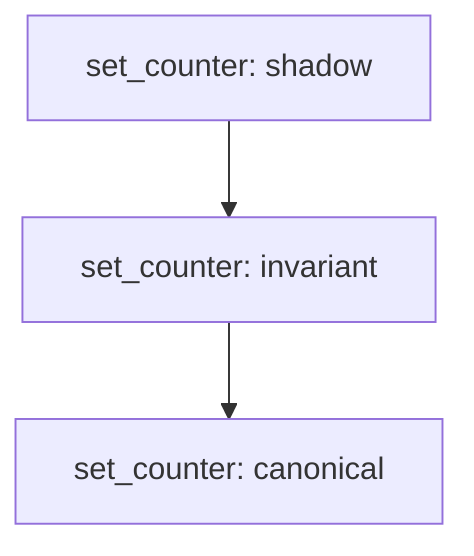

# Shadow Thirst Language Specification — v0.2

**Layer:** UTF Tier 4 — Mutation Simulation and Safety Validation  
**Status:** Implemented / Verified  
**Source:** `src/utf/shadow_thirst/core.py`  
**Conformance:** `conformance/shadow_mutation.json`, `src/utf/tests/test_shadow_thirst.py`

---

## 1. Purpose

Shadow Thirst is the mutation simulation and safety validation layer of the Universal Thirsty Family. Its role is to prevent unsafe state changes from reaching the canonical (authoritative) execution plane.

The central thesis: **no mutation may write canonical state without first passing through a simulation phase and a gate of invariants.** A mutation that fails any critical analyzer is permanently withheld from the canonical plane for that promote cycle.

Shadow Thirst sits at Gate 2 in the UTF pipeline:

```
[TARL Policy Gate 1] → [Shadow Thirst Gate 2] → [Interpreter / VM] → [Constitutional Gate 3]
```

---

## 2. Core Construct

The only top-level declaration in a `.shadowthirst` file is the `mutation`.

```shadowthirst
mutation validated_canonical MutationName(param: Type, ...) {
  shadow {
    // Simulation zone — reads canonical state, CANNOT write canonical_ vars
    // Must be deterministic (no now, rand, random, epoch_ms, uuid4)
    // Must be pure w.r.t. I/O (no pour, sip)
  }

  invariant {
    // Gate checks — must all pass before canonical is touched
    // Must be pure (no I/O, no non-determinism)
  }

  canonical {
    // Authoritative state write — only reachable after shadow + invariant pass
    // canonical_ prefixed variables are written here
    // CANNOT write privileged vars (sys_, root_, auth_, kernel_, admin_, sovereign_, ghost_)
  }
}
```

The keyword `validated_canonical` is required after `mutation`. It signals that the mutation is subject to the full eight-analyzer validation pipeline.

---

## 3. Two-Plane Model

| Plane | Block | Can Write `canonical_` vars? | Determinism Required? | I/O Allowed? |
|---|---|---|---|---|
| **Shadow** | `shadow { }` | NO — hard block | YES | NO |
| **Invariant** | `invariant { }` | NO | YES | NO |
| **Canonical** | `canonical { }` | YES | — | — |

The shadow plane may **read** canonical state variables. It may not write them. This enforcement is static — performed at promote time by `PlaneIsolationAnalyzer` before execution begins.

---

## 4. Analyzer Suite

Eight analyzers run at promote time in the order listed. The first four critical failures cause immediate `REJECT`; all eight results are always reported.

### 4.1 PlaneIsolationAnalyzer — `critical`

**Checks:** The shadow block does not write any variable whose name begins with `canonical_`.

**Failure:** `REJECT` — shadow plane cannot write canonical state.

```shadowthirst
// FAILS PlaneIsolationAnalyzer
mutation validated_canonical bad(val: Int) {
  shadow { drink canonical_x: Int = val; }  // ← illegal write
  invariant { }
  canonical { canonical_x = val; }
}
```

### 4.2 DeterminismAnalyzer — `critical`

**Checks:** The shadow block contains no calls to non-deterministic functions: `now`, `epoch_ms`, `rand`, `random`, `random_bytes`, `uuid4`.

**Rationale:** The shadow simulation must be fully reproducible. Non-deterministic output means the simulation cannot be replayed against the same inputs to produce the same result, violating the replay guarantee.

**Failure:** `REJECT` — shadow plane must be deterministic.

```shadowthirst
// FAILS DeterminismAnalyzer
mutation validated_canonical ts() {
  shadow { drink t: Any = now(); }  // ← non-deterministic
  invariant { }
  canonical { canonical_t = 0; }
}
```

### 4.3 ResourceEstimator — `warning`

**Checks:** Estimated CPU time ≤ 1000ms and estimated memory ≤ 256MB, based on static statement count and reservoir declarations.

**Formula:** `cpu_ms = statement_count × 10`, `mem_mb = reservoir_count × 64`.

**Failure:** Warning only — does not block promotion. Logged in analysis output.

### 4.4 PuritySpringAnalyzer — `critical`

**Checks:** The invariant block contains no calls to impure functions: `pour`, `sip`, `now`, `epoch_ms`, `rand`, `random`, `random_bytes`, `uuid4`.

**Rationale:** Invariants are semantic gates — logical assertions about state. If an invariant performs I/O or depends on non-determinism, it cannot be relied upon as a stable gate.

**Failure:** `REJECT` — invariant block calls impure function.

### 4.5 MemoryEvaporationAnalyzer — `warning`

**Checks:** Peak reservoir estimate ≤ 256MB. Derived from the same pressure calculation as ResourceEstimator.

**Failure:** Warning only — does not block promotion.

### 4.6 CanonicalConvergenceAnalyzer — `critical`

**Checks:** The shadow simulation must be convergent with the canonical commit — it must be modelling the same input-to-output transformation that canonical will apply.

Specifically:
- If the canonical block reads from mutation params, the shadow block must also read from at least one of those params.
- If shadow explores conditional branches (`thirst`/`hydrated`) but canonical is unconditional, and the branch count differential is ≥ 3, the simulation is over-speculative.

**Rationale:** A shadow block that ignores all mutation inputs but canonical commits based on those inputs is not simulating the mutation — it is simulating something else. The simulation fidelity guarantee requires that shadow and canonical operate on the same data.

**Failure:** `REJECT` — shadow and canonical are operating on disjoint state.

### 4.7 PrivilegeEscalationAnalyzer — `critical`

**Checks:** The canonical block does not write to privileged variable namespaces or call privileged functions without an explicit escalation token.

**Privileged variable prefixes:** `sys_`, `root_`, `auth_`, `kernel_`, `admin_`, `sovereign_`, `ghost_`

**Privileged function names:** `escalate`, `sudo`, `elevate`, `override_policy`, `bypass_tarl`, `force_canonical`, `raw_write`

**Rationale:** Canonical state writes to privileged namespaces bypass the normal governance scope. Mutations operating at the `validated_canonical` level do not carry the escalation authority required to write to these namespaces. A mutation needing privileged writes must be declared with a higher-authority token (reserved for future spec versions).

**Failure:** `REJECT` — canonical block writes privileged target without escalation token.

```shadowthirst
// FAILS PrivilegeEscalationAnalyzer
mutation validated_canonical bad(val: Int) {
  shadow { drink x: Int = val; }
  invariant { }
  canonical { sys_config = val; }  // ← privileged namespace
}
```

### 4.8 DivergenceRiskAnalyzer — `warning`

**Checks:** The shadow block does not introduce more than 2 intermediate variables that have no counterpart in the canonical block's commit scope.

**Rationale:** If shadow defines many variables that canonical never references, the simulation is exploring computation that the canonical write does not account for — a divergence risk signal. This does not block promotion (mutations may legitimately simulate more than they commit), but warrants review.

**Failure:** Warning only — logged with the list of shadow-only variable names.

---

## 5. Promote / Reject Flow

```python
from shadow_thirst.core import parse_shadow, promote

module = parse_shadow(source_text)
result = promote(module, dry_run=False)

# result shape:
# {
#   "decision":    "PROMOTE" | "REJECT",
#   "verdict":     "PROMOTE" | "REJECT",
#   "dry_run":     bool,
#   "replay_id":   str,          # first 16 hex chars of replay_hash
#   "replay_hash": str,          # full SHA-256 hex of mutation structure
#   "diff":        str,          # human-readable outcome description
#   "analysis":    [             # one entry per analyzer × mutation
#     {
#       "analyzer": str,
#       "level":    "critical" | "warning",
#       "passed":   bool,
#       "message":  str,
#     }
#   ]
# }
```

Critical failures (`level == "critical"` and `passed == False`) cause `REJECT`. Warning failures are noted but do not block. A `REJECT` means the canonical plane is not touched — the mutation is withheld for this promote cycle.

---

## 6. Replay Hash

Every promote decision produces a `replay_hash` — a SHA-256 digest of the mutation structure:

```json
{
  "mutations": [
    {
      "name":          "set_counter",
      "params":        [["value", "Int"]],
      "shadow_len":    2,
      "invariant_len": 1,
      "canonical_len": 1
    }
  ]
}
```

The hash is stable across identical source text. It provides a compact, reproducible identity for each mutation definition — suitable for audit log entries and conformance verification.

---

## 7. Plugin System

Shadow Thirst loads custom analyzers from `src/utf/shadow_thirst/plugins/*.py`. Any file in that directory that defines an `analyze_plugin(module: ShadowModule) -> list[AnalysisResult]` function is automatically discovered and executed after the eight built-in analyzers.

```python
# plugins/my_org_policy.py
from shadow_thirst.core import AnalysisResult, ShadowModule

def analyze_plugin(module: ShadowModule) -> list[AnalysisResult]:
    results = []
    for m in module.mutations:
        # Example: require all mutations to have at least one param
        results.append(AnalysisResult(
            analyzer="OrgPolicy_RequireParams",
            level="critical",
            passed=len(m.params) > 0,
            message="mutation must declare at least one parameter",
        ))
    return results
```

Plugin failures participate in the same PROMOTE/REJECT decision as built-in analyzers.

---

## 8. CLI

```sh
# Run all 8 analyzers and print JSON results
shadowthirst check path/to/mutation.shadowthirst

# Print the replay hash only
shadowthirst replay path/to/mutation.shadowthirst

# Run full promote pipeline (add --dry-run to skip canonical commit)
shadowthirst promote path/to/mutation.shadowthirst
shadowthirst promote path/to/mutation.shadowthirst --dry-run
shadowthirst promote path/to/mutation.shadowthirst --replay-id custom_id

# Generate Mermaid flowchart of the mutation pipeline
shadowthirst visualize path/to/mutation.shadowthirst
shadowthirst visualize path/to/mutation.shadowthirst -o pipeline.mmd
```

---

## 9. Visualization

`visualize(module)` produces a Mermaid flowchart of the promote pipeline for each mutation:



---

## 10. Conformance

Conformance tests live in:
- `conformance/shadow_mutation.json` — integration fixtures (6 cases)
- `src/utf/tests/test_shadow_thirst.py` — unit tests for all 8 analyzers (21 cases)

To run:

```sh
pytest src/utf/tests/test_shadow_thirst.py -v \
  --override-ini="testpaths=src/utf/tests"
```

All 21 tests must pass on a compliant implementation.

---

## 11. Integration Position in UTF Pipeline

```
[Source .shadowthirst]
        │
        ▼
  parse_shadow()          — lexer + section parser
        │
        ▼
  analyze()               — 8 analyzers, all run
        │
        ├─ any critical FAIL → REJECT (canonical state unchanged)
        │
        └─ all critical PASS → PROMOTE
              │
              ▼
        canonical { } block executes
              │
              ▼
        Canonical State Commit + Audit Log Entry
```

Shadow Thirst is invoked by the UTF pipeline at Gate 2, after `TarlRuntime.evaluate()` returns `ALLOW` and before the interpreter or VM receives the mutation for execution.
