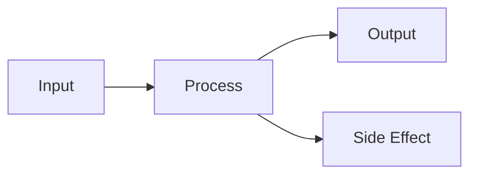

# 💻 <% tp.file.title %>

## 📁 File Information

**File Path:** `<% tp.system.prompt("File path (e.g., src/app/core/module.py)") %>`  
**Language:** <% tp.frontmatter.language %>  
**Project:** <% tp.frontmatter.project %>  
**Last Modified:** <% tp.date.now("YYYY-MM-DD") %>

---

## 📋 Overview

### Purpose
<% tp.system.prompt("What does this code do? (1-2 sentences)") %>

### Scope
<% tp.system.prompt("What is the scope of this module/class/function?") %>

### Responsibilities
- <% tp.system.prompt("Responsibility 1") %>
- Responsibility 2
- Responsibility 3

---

## 🏗️ Architecture

### Class/Module Structure

```<% tp.frontmatter.language %>
# Paste your code structure here
class ClassName:
    """
    Class description
    """
    
    def __init__(self):
        pass
    
    def method_name(self):
        """Method description"""
        pass
```

### Dependencies

**Imports:**
```<% tp.frontmatter.language %>
# List key imports here
import module1
from package import Class
```

**External Dependencies:**
- Package 1 - Purpose
- Package 2 - Purpose
- Package 3 - Purpose

---

## 🔧 Key Components

### Component 1: <% tp.system.prompt("Component name (e.g., MainClass, function_name)") %>

**Type:** <% tp.system.suggester(["Class", "Function", "Module", "Interface", "Type"], ["class", "function", "module", "interface", "type"]) %>

**Description:**
<% tp.system.prompt("Detailed description") %>

**Parameters:**
| Parameter | Type | Required | Description |
|-----------|------|----------|-------------|
|           |      | ✓/✗      |             |

**Returns:**
- **Type:** 
- **Description:** 

**Example Usage:**
```<% tp.frontmatter.language %>
# Example code here
result = component_name(param1, param2)
```

**Edge Cases:**
- Case 1: 
- Case 2: 

---

### Component 2: [Name]

[Repeat structure above]

---

## 🔄 Data Flow



**Description:**
1. Step 1: 
2. Step 2: 
3. Step 3: 

---

## ⚙️ Configuration

### Environment Variables
```bash
# Required environment variables
VARIABLE_NAME=value
```

### Configuration Options
| Option | Type | Default | Description |
|--------|------|---------|-------------|
|        |      |         |             |

---

## 🧪 Testing

### Test Coverage
- **Unit Tests:** `test_<% tp.frontmatter.language %>_module.py`
- **Integration Tests:** 
- **Coverage:** <%* tR += "X%" %>

### Test Cases
1. **Test Case 1:** <% tp.system.prompt("Test case description") %>
   - Input: 
   - Expected: 
   - Actual: 

2. **Test Case 2:**
   - Input: 
   - Expected: 
   - Actual: 

### Running Tests
```bash
# Command to run tests
pytest tests/test_module.py -v
```

---

## 🐛 Known Issues & Limitations

### Current Issues
- [ ] Issue 1: 
- [ ] Issue 2: 

### Limitations
- Limitation 1: 
- Limitation 2: 

### Technical Debt
- Debt 1: 
- Debt 2: 

---

## 🔐 Security Considerations

- **Authentication:** 
- **Authorization:** 
- **Input Validation:** 
- **Data Sanitization:** 
- **Encryption:** 

---

## 🚀 Performance

### Complexity Analysis
- **Time Complexity:** O(?)
- **Space Complexity:** O(?)

### Optimization Notes
- 
- 

### Benchmarks
| Operation | Time | Memory |
|-----------|------|--------|
|           |      |        |

---

## 📝 Usage Examples

### Basic Usage
```<% tp.frontmatter.language %>
# Basic example
from module import ClassName

instance = ClassName()
result = instance.method()
```

### Advanced Usage
```<% tp.frontmatter.language %>
# Advanced example with error handling
try:
    result = advanced_operation(
        param1=value1,
        param2=value2
    )
except Exception as e:
    handle_error(e)
```

---

## 🔗 Related Documentation

- [[API Reference]]
- [[Architecture Design]]
- [[Integration Guide]]
- Parent Module: [[]]
- Related Modules: [[]], [[]]

---

## 📊 Metrics

**Lines of Code:** <%* tR += "~XXX" %>  
**Complexity:** <%* tR += "Low/Medium/High" %>  
**Test Coverage:** <%* tR += "XX%" %>  
**Last Reviewed:** <% tp.date.now("YYYY-MM-DD") %>

---

## 🔄 Change Log

### <% tp.date.now("YYYY-MM-DD") %>
- Initial documentation created

### [Date]
- Change description

---

## 👥 Maintainers

- **Primary:** <% tp.system.prompt("Primary maintainer name") %>
- **Secondary:** 
- **Reviewers:** 

---

**Documentation Version:** 1.0  
**Last Updated:** <% tp.date.now("YYYY-MM-DD HH:mm") %>
