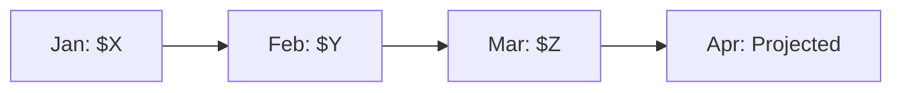

# 🏗️ Infrastructure: <% tp.file.title %>

## 📋 Infrastructure Overview

**Component Name:** <% tp.frontmatter.infrastructure_component %>  
**Type:** <% tp.frontmatter.infrastructure_type %>  
**Cloud Provider:** <% tp.frontmatter.cloud_provider %>  
**Status:** <% tp.frontmatter.status %>  
**Region:** <% tp.system.prompt("Primary region (e.g., us-east-1, eastus)") %>  
**Environment:** <% tp.system.suggester(["Production", "Staging", "Development", "Shared"], ["production", "staging", "development", "shared"]) %>  
**Last Updated:** <% tp.date.now("YYYY-MM-DD") %>

### Purpose
<% tp.system.prompt("What is this infrastructure component used for? (1-2 sentences)") %>

### Quick Facts
- **Provisioned:** <% tp.system.prompt("Provisioning date", tp.date.now("YYYY-MM-DD")) %>
- **Owner:** <% tp.system.prompt("Team/person responsible") %>
- **Cost (Monthly):** $<% tp.system.prompt("Estimated monthly cost", "0") %>
- **Criticality:** <% tp.system.suggester(["Mission Critical", "Business Critical", "Important", "Non-Critical"], ["mission-critical", "business-critical", "important", "non-critical"]) %>

---

## 🎯 Business Context

### Business Drivers
1. **<% tp.system.prompt("Business driver 1 (e.g., Support 10K concurrent users)") %>**
   - Requirement: 
   - Impact: 
   
2. **Business driver 2**
   - Requirement: 
   - Impact: 

### Service Level Objectives (SLOs)
| Metric | Target | Current | Status |
|--------|--------|---------|--------|
| Uptime | <% tp.system.prompt("SLO target (e.g., 99.95%)", "99.9%") %> | | ✅ |
| Performance | <% tp.system.prompt("Performance SLO", "<100ms") %> | | ✅ |
| Availability | <% tp.system.prompt("Availability SLO", "24/7") %> | | ✅ |

### Stakeholders
| Role | Name | Responsibility | Contact |
|------|------|----------------|---------|
| Infrastructure Owner | <% tp.system.prompt("Owner name") %> | Overall component health | |
| DevOps Lead | | Automation & CI/CD | |
| Security Lead | | Security & compliance | |
| Cost Owner | | Budget & optimization | |

---

## 🏗️ Architecture

### Infrastructure Diagram

```mermaid
graph TB
    subgraph "Region: <% tp.system.prompt("Primary region") %>"
        subgraph "Availability Zone 1"
            AZ1A[Component A]
            AZ1B[Component B]
        end
        
        subgraph "Availability Zone 2"
            AZ2A[Component A]
            AZ2B[Component B]
        end
        
        LB[Load Balancer]
    end
    
    subgraph "Data Layer"
        DB[(Database - Primary)]
        CACHE[(Cache)]
        STORAGE[Object Storage]
    end
    
    subgraph "Backup Region: <% tp.system.prompt("DR region", "N/A") %>"
        DR_DB[(Database - Replica)]
    end
    
    LB --> AZ1A
    LB --> AZ2A
    AZ1A --> DB
    AZ2A --> DB
    AZ1A --> CACHE
    AZ2A --> CACHE
    DB --> DR_DB
```

### Component Details

**Primary Components:**
| Component | Type | Purpose | Redundancy |
|-----------|------|---------|------------|
| <% tp.system.prompt("Component 1") %> | <% tp.system.prompt("Type (e.g., EC2, VM, Container)") %> | <% tp.system.prompt("Purpose") %> | <% tp.system.prompt("Redundancy (e.g., 2x AZ, 3 replicas)") %> |
| Component 2 | Type | Purpose | Redundancy |

**Network Architecture:**
```yaml
network:
  vpc_cidr: <% tp.system.prompt("VPC CIDR (e.g., 10.0.0.0/16)") %>
  public_subnets:
    - <% tp.system.prompt("Public subnet 1 CIDR") %>
    - subnet2_cidr
  private_subnets:
    - <% tp.system.prompt("Private subnet 1 CIDR") %>
    - subnet2_cidr
  nat_gateways: <% tp.system.prompt("NAT gateway count", "2") %>
  internet_gateway: true
```

---

## 💻 Technical Specifications

### Compute Specifications

**Instance/Container Details:**
| Resource | Type | Size/SKU | vCPU | Memory | Storage |
|----------|------|----------|------|--------|---------|
| <% tp.system.prompt("Resource 1") %> | <% tp.system.prompt("Type (e.g., t3.large, Standard_D2s_v3)") %> | <% tp.system.prompt("SKU") %> | <% tp.system.prompt("vCPU count") %> | <% tp.system.prompt("Memory (GB)") %> | <% tp.system.prompt("Storage (GB)") %> |
| Resource 2 | | | | | |

**Auto-Scaling Configuration:**
```yaml
auto_scaling:
  enabled: <% tp.system.suggester(["true", "false"], ["true", "false"]) %>
  min_instances: <% tp.system.prompt("Min instances", "2") %>
  max_instances: <% tp.system.prompt("Max instances", "10") %>
  target_cpu_utilization: <% tp.system.prompt("Target CPU %", "70") %>%
  target_memory_utilization: <% tp.system.prompt("Target memory %", "80") %>%
  scale_up_cooldown: <% tp.system.prompt("Scale up cooldown (seconds)", "300") %>s
  scale_down_cooldown: <% tp.system.prompt("Scale down cooldown (seconds)", "600") %>s
```

### Storage Specifications

**Storage Components:**
| Type | Purpose | Size | IOPS | Throughput | Redundancy |
|------|---------|------|------|------------|------------|
| <% tp.system.prompt("Storage 1 type (e.g., SSD, HDD, Object)") %> | <% tp.system.prompt("Purpose") %> | <% tp.system.prompt("Size (GB/TB)") %> | <% tp.system.prompt("IOPS", "N/A") %> | <% tp.system.prompt("Throughput", "N/A") %> | <% tp.system.prompt("Redundancy type") %> |
| Storage 2 | | | | | |

**Backup Strategy:**
- Backup frequency: <% tp.system.prompt("Backup frequency (e.g., Daily, Hourly)") %>
- Backup retention: <% tp.system.prompt("Retention period (e.g., 30 days)") %>
- Backup location: <% tp.system.prompt("Backup storage location") %>
- Backup verification: <% tp.system.prompt("Verification schedule") %>

### Database Specifications (if applicable)

**Database Details:**
```yaml
database:
  engine: <% tp.system.prompt("DB engine (e.g., PostgreSQL, MySQL, MongoDB)", "N/A") %>
  version: <% tp.system.prompt("Version", "N/A") %>
  instance_class: <% tp.system.prompt("Instance class (e.g., db.r5.large)", "N/A") %>
  storage_type: <% tp.system.prompt("Storage type (e.g., gp3, io1)", "N/A") %>
  allocated_storage: <% tp.system.prompt("Storage size (GB)", "N/A") %>
  multi_az: <% tp.system.suggester(["true", "false"], ["true", "false"]) %>
  encryption: <% tp.system.suggester(["true", "false"], ["true", "false"]) %>
  backup_window: <% tp.system.prompt("Backup window (e.g., 03:00-04:00)", "N/A") %>
  maintenance_window: <% tp.system.prompt("Maintenance window", "N/A") %>
```

**Replication:**
- Type: <% tp.system.prompt("Replication type (e.g., Async, Sync, Multi-region)", "N/A") %>
- Read replicas: <% tp.system.prompt("Number of read replicas", "0") %>
- Lag monitoring: <% tp.system.prompt("How lag is monitored", "N/A") %>

---

## 🔧 Infrastructure as Code

### IaC Configuration

**IaC Tool:** <% tp.system.suggester(["Terraform", "CloudFormation", "ARM Templates", "Pulumi", "Ansible", "Manual"], ["terraform", "cloudformation", "arm", "pulumi", "ansible", "manual"]) %>  
**Repository:** `<% tp.system.prompt("IaC repository URL/path") %>`  
**State Management:** <% tp.system.prompt("Where state is stored (e.g., S3, Terraform Cloud)") %>

**Directory Structure:**
```
infrastructure/
├── <% tp.system.prompt("environment (e.g., production/)") %>
│   ├── main.tf              # Main configuration
│   ├── variables.tf         # Variable definitions
│   ├── outputs.tf           # Output values
│   └── terraform.tfvars     # Variable values
├── modules/
│   └── <% tp.system.prompt("module_name/") %>
│       ├── main.tf
│       ├── variables.tf
│       └── outputs.tf
└── README.md
```

### Terraform Example (if applicable)

**Main Configuration:**
```hcl
# Main infrastructure configuration
resource "<% tp.system.prompt("resource_type") %>" "<% tp.system.prompt("resource_name") %>" {
  <% tp.system.prompt("attribute1") %> = <% tp.system.prompt("value1") %>
  attribute2 = var.attribute2_value
  
  tags = {
    Name        = "<% tp.frontmatter.infrastructure_component %>"
    Environment = "<% tp.system.prompt("environment") %>"
    ManagedBy   = "Terraform"
    Owner       = "<% tp.system.prompt("owner") %>"
    CostCenter  = "<% tp.system.prompt("cost_center", "default") %>"
  }
}

# Auto-scaling configuration
resource "aws_autoscaling_group" "main" {
  name                = "${var.environment}-<% tp.frontmatter.infrastructure_component %>-asg"
  min_size            = var.min_instances
  max_size            = var.max_instances
  desired_capacity    = var.desired_instances
  health_check_type   = "ELB"
  vpc_zone_identifier = var.private_subnet_ids
  
  launch_template {
    id      = aws_launch_template.main.id
    version = "$Latest"
  }
  
  tag {
    key                 = "Name"
    value               = "${var.environment}-<% tp.frontmatter.infrastructure_component %>-instance"
    propagate_at_launch = true
  }
}
```

**Variables:**
```hcl
variable "environment" {
  description = "Environment name"
  type        = string
  default     = "<% tp.system.prompt("environment", "production") %>"
}

variable "instance_type" {
  description = "EC2 instance type"
  type        = string
  default     = "<% tp.system.prompt("instance_type", "t3.medium") %>"
}

variable "min_instances" {
  description = "Minimum number of instances"
  type        = number
  default     = <% tp.system.prompt("min_instances", "2") %>
}

variable "max_instances" {
  description = "Maximum number of instances"
  type        = number
  default     = <% tp.system.prompt("max_instances", "10") %>
}
```

### Provisioning Procedure

**Prerequisites:**
- [ ] <% tp.system.prompt("Prerequisite 1 (e.g., AWS credentials configured)") %>
- [ ] Prerequisite 2
- [ ] Network infrastructure exists
- [ ] IAM roles created
- [ ] Security groups defined

**Provisioning Steps:**
```bash
# 1. Initialize Terraform
cd infrastructure/<% tp.system.prompt("environment") %>
terraform init

# 2. Validate configuration
terraform validate

# 3. Plan changes
terraform plan -out=tfplan

# 4. Review plan
# Check resource changes, costs, security implications

# 5. Apply changes
terraform apply tfplan

# 6. Verify deployment
<% tp.system.prompt("Verification command") %>
```

---

## 🔐 Security Configuration

### Security Groups / Firewall Rules

**Inbound Rules:**
| Port | Protocol | Source | Purpose |
|------|----------|--------|---------|
| <% tp.system.prompt("Port (e.g., 443)") %> | <% tp.system.suggester(["TCP", "UDP", "ICMP", "All"], ["TCP", "UDP", "ICMP", "All"]) %> | <% tp.system.prompt("Source (e.g., 0.0.0.0/0, sg-xxx)") %> | <% tp.system.prompt("Purpose (e.g., HTTPS traffic)") %> |
| Port 2 | Protocol | Source | Purpose |

**Outbound Rules:**
| Port | Protocol | Destination | Purpose |
|------|----------|-------------|---------|
| <% tp.system.prompt("Port") %> | <% tp.system.prompt("Protocol") %> | <% tp.system.prompt("Destination") %> | <% tp.system.prompt("Purpose") %> |
| Port 2 | Protocol | Destination | Purpose |

### Encryption

**Encryption at Rest:**
- Storage encryption: <% tp.system.suggester(["AES-256", "AES-128", "Custom", "None"], ["AES-256", "AES-128", "custom", "none"]) %>
- Database encryption: <% tp.system.suggester(["Enabled", "Disabled"], ["enabled", "disabled"]) %>
- Key management: <% tp.system.prompt("Key manager (e.g., AWS KMS, Azure Key Vault)") %>
- Key rotation: <% tp.system.prompt("Rotation schedule (e.g., Annual, 90 days)") %>

**Encryption in Transit:**
- TLS version: <% tp.system.prompt("TLS version (e.g., TLS 1.3)", "TLS 1.3") %>
- Certificate management: <% tp.system.prompt("How certificates are managed") %>
- Certificate rotation: <% tp.system.prompt("Rotation schedule") %>

### IAM / RBAC

**Service Accounts:**
| Account | Purpose | Permissions | Rotation |
|---------|---------|-------------|----------|
| <% tp.system.prompt("Service account 1") %> | <% tp.system.prompt("Purpose") %> | <% tp.system.prompt("Permission level") %> | <% tp.system.prompt("Rotation schedule") %> |
| Account 2 | Purpose | Permissions | Rotation |

**Access Policies:**
```yaml
# IAM policy example
policies:
  - name: <% tp.system.prompt("policy_name") %>
    effect: <% tp.system.suggester(["Allow", "Deny"], ["Allow", "Deny"]) %>
    actions:
      - <% tp.system.prompt("action1 (e.g., s3:GetObject)") %>
      - action2
    resources:
      - <% tp.system.prompt("resource_arn") %>
```

### Compliance

**Compliance Standards:** <% tp.system.prompt("Standards (e.g., SOC2, HIPAA, PCI-DSS)", "N/A") %>

**Compliance Controls:**
- [ ] <% tp.system.prompt("Control 1 (e.g., Audit logging enabled)") %>
- [ ] Control 2
- [ ] Control 3
- [ ] Encryption enabled
- [ ] Access controls implemented
- [ ] Regular security scans

---

## 📊 Monitoring & Alerting

### Monitoring Configuration

**Monitoring Tool:** <% tp.system.prompt("Monitoring tool (e.g., CloudWatch, Datadog, Prometheus)") %>

**Key Metrics:**
| Metric | Threshold | Alert | Dashboard |
|--------|-----------|-------|-----------|
| CPU Utilization | >80% | Yes | Infrastructure Dashboard |
| Memory Utilization | >85% | Yes | Infrastructure Dashboard |
| Disk Usage | >90% | Yes | Storage Dashboard |
| Network In/Out | >1Gbps | No | Network Dashboard |
| Request Count | N/A | No | Application Dashboard |
| Error Rate | >1% | Yes | Application Dashboard |

**Dashboards:**
- **Infrastructure Overview:** <% tp.system.prompt("Dashboard URL", "N/A") %>
- **Performance Metrics:** <% tp.system.prompt("Dashboard URL", "N/A") %>
- **Cost Tracking:** <% tp.system.prompt("Dashboard URL", "N/A") %>

### Alerting Rules

**Alert Configuration:**
| Alert | Condition | Severity | Channel | Escalation |
|-------|-----------|----------|---------|------------|
| Instance Down | Health check fails | P0 | PagerDuty | Immediate |
| High CPU | CPU >80% for 10min | P1 | Slack + Email | 15 min |
| Disk Space Low | Disk >90% | P2 | Slack | 1 hour |
| Cost Anomaly | >20% daily increase | P3 | Email | Next business day |

**Alert Channels:**
- PagerDuty: <% tp.system.prompt("PagerDuty service") %>
- Slack: <% tp.system.prompt("Slack channel (e.g., #infrastructure-alerts)") %>
- Email: <% tp.system.prompt("Email distribution list") %>

### Logging

**Log Sources:**
| Source | Type | Destination | Retention |
|--------|------|-------------|-----------|
| <% tp.system.prompt("Log source 1 (e.g., Application logs)") %> | <% tp.system.prompt("Log type") %> | <% tp.system.prompt("Log destination") %> | <% tp.system.prompt("Retention period") %> |
| System logs | Infrastructure | Log aggregator | 90 days |
| Access logs | Security | SIEM | 1 year |

**Log Format:**
```json
{
  "timestamp": "2026-01-23T10:30:00Z",
  "level": "INFO",
  "component": "<% tp.frontmatter.infrastructure_component %>",
  "instance_id": "i-1234567890abcdef0",
  "message": "Log message",
  "metadata": {
    "region": "<% tp.system.prompt("region") %>",
    "environment": "<% tp.system.prompt("environment") %>"
  }
}
```

---

## 💰 Cost Management

### Cost Breakdown

**Monthly Cost Estimate:**
| Component | Cost | Optimization Potential |
|-----------|------|------------------------|
| Compute | $<% tp.system.prompt("Compute cost", "0") %> | <% tp.system.prompt("Optimization %", "0") %>% |
| Storage | $<% tp.system.prompt("Storage cost", "0") %> | <% tp.system.prompt("Optimization %", "0") %>% |
| Network | $<% tp.system.prompt("Network cost", "0") %> | <% tp.system.prompt("Optimization %", "0") %>% |
| Data Transfer | $<% tp.system.prompt("Transfer cost", "0") %> | <% tp.system.prompt("Optimization %", "0") %>% |
| **Total** | **$<% tp.system.prompt("Total cost", "0") %>** | |

**Cost Trends:**


### Cost Optimization

**Optimization Strategies:**
1. **<% tp.system.prompt("Strategy 1 (e.g., Reserved instances for baseline capacity)") %>**
   - Savings: <% tp.system.prompt("Expected savings %") %>%
   - Implementation: <% tp.system.prompt("How to implement") %>
   - Status: <% tp.system.suggester(["Implemented", "Planned", "Evaluated"], ["implemented", "planned", "evaluated"]) %>

2. **Strategy 2**
   - Savings: %
   - Implementation: 
   - Status: 

**Cost Alerts:**
- Daily budget: $<% tp.system.prompt("Daily budget", "0") %>
- Monthly budget: $<% tp.system.prompt("Monthly budget", "0") %>
- Alert threshold: <% tp.system.prompt("Alert threshold %", "80") %>% of budget

---

## 🔄 Disaster Recovery & Business Continuity

### DR Strategy

**DR Tier:** <% tp.system.suggester(["Tier 1 - Mission Critical (RTO<1h)", "Tier 2 - Business Critical (RTO<4h)", "Tier 3 - Important (RTO<24h)", "Tier 4 - Non-Critical (RTO>24h)"], ["tier1", "tier2", "tier3", "tier4"]) %>

**DR Objectives:**
- **RTO (Recovery Time Objective):** <% tp.system.prompt("RTO (e.g., 1 hour)") %>
- **RPO (Recovery Point Objective):** <% tp.system.prompt("RPO (e.g., 15 minutes)") %>
- **MTTR (Mean Time To Restore):** <% tp.system.prompt("MTTR target", "N/A") %>

### Backup & Restore

**Backup Configuration:**
```yaml
backup:
  frequency: <% tp.system.prompt("Backup frequency (e.g., hourly, daily)") %>
  retention:
    daily: <% tp.system.prompt("Daily retention (days)", "7") %> days
    weekly: <% tp.system.prompt("Weekly retention (weeks)", "4") %> weeks
    monthly: <% tp.system.prompt("Monthly retention (months)", "12") %> months
    yearly: <% tp.system.prompt("Yearly retention (years)", "3") %> years
  encryption: true
  cross_region: <% tp.system.suggester(["true", "false"], ["true", "false"]) %>
  backup_vault: <% tp.system.prompt("Backup vault location") %>
```

**Restore Procedure:**
```bash
# 1. Identify backup to restore
<% tp.system.prompt("List backups command") %>

# 2. Initiate restore
<% tp.system.prompt("Restore command") %>

# 3. Verify restoration
<% tp.system.prompt("Verification command") %>

# 4. Update DNS/routing (if applicable)
<% tp.system.prompt("DNS update command") %>
```

**Restore Testing:**
- Test frequency: <% tp.system.prompt("Test frequency (e.g., Quarterly)") %>
- Last test date: <% tp.system.prompt("Last test date", "N/A") %>
- Next test date: <% tp.system.prompt("Next test date", "N/A") %>

### Failover Strategy

**Failover Type:** <% tp.system.suggester(["Active-Active", "Active-Passive", "Multi-Region", "Single-Region"], ["active-active", "active-passive", "multi-region", "single-region"]) %>

**Failover Procedure:**
1. <% tp.system.prompt("Failover step 1 (e.g., Detect primary region failure)") %>
2. Failover step 2
3. Failover step 3
4. Verify failover success
5. Communicate to stakeholders

**Failback Procedure:**
1. <% tp.system.prompt("Failback step 1 (e.g., Verify primary region health)") %>
2. Failback step 2
3. Failback step 3
4. Resume normal operations

---

## 🚀 Operational Procedures

### Runbook

#### Health Check
```bash
# Check infrastructure health
<% tp.system.prompt("Health check command 1") %>
<% tp.system.prompt("Health check command 2") %>
<% tp.system.prompt("Health check command 3") %>

# Expected output:
# All services: HEALTHY
# All instances: Running
# All health checks: Passing
```

#### Scaling Operations

**Manual Scale Up:**
```bash
# Increase capacity
<% tp.system.prompt("Scale up command (e.g., terraform apply with increased count)") %>
```

**Manual Scale Down:**
```bash
# Decrease capacity
<% tp.system.prompt("Scale down command") %>
```

#### Maintenance Procedures

**Scheduled Maintenance:**
- Maintenance window: <% tp.system.prompt("Maintenance window (e.g., Sunday 02:00-04:00 UTC)") %>
- Notification period: <% tp.system.prompt("Notification period (e.g., 48 hours)") %>
- Approval required: <% tp.system.suggester(["Yes", "No"], ["yes", "no"]) %>

**Maintenance Checklist:**
- [ ] Schedule maintenance window
- [ ] Notify stakeholders
- [ ] Create backup/snapshot
- [ ] Perform maintenance
- [ ] Verify system health
- [ ] Document changes
- [ ] Close maintenance window

---

## 🐛 Troubleshooting

### Common Issues

#### Issue 1: <% tp.system.prompt("Issue name (e.g., High CPU Utilization)") %>

**Symptoms:**
- <% tp.system.prompt("Symptom 1") %>
- Symptom 2
- Symptom 3

**Diagnosis:**
```bash
# Check CPU usage
<% tp.system.prompt("CPU check command") %>

# Check processes
<% tp.system.prompt("Process list command") %>

# Check logs
<% tp.system.prompt("Log check command") %>
```

**Resolution:**
1. <% tp.system.prompt("Resolution step 1") %>
2. Resolution step 2
3. Resolution step 3

**Prevention:**
- <% tp.system.prompt("Prevention measure 1") %>
- Prevention measure 2

---

#### Issue 2: Instance Failure

**Symptoms:**
- Health check failures
- Instance unreachable
- Service degradation

**Diagnosis:**
```bash
# Check instance status
<% tp.system.prompt("Instance status command") %>

# Check system logs
<% tp.system.prompt("System log command") %>
```

**Resolution:**
1. Verify auto-scaling is replacing instance
2. If not, manually terminate and replace
3. Investigate root cause in logs
4. Update monitoring if needed

---

## 📚 Documentation & Resources

### Related Documentation
- [[Infrastructure Architecture]] - Overall infrastructure design
- [[Network Design]] - Network topology and configuration
- [[Security Hardening Guide]] - Security best practices
- [[Cost Optimization Guide]] - Cost reduction strategies
- [[DR Plan]] - Comprehensive disaster recovery plan

### External Resources
- **Cloud Provider Docs:** <% tp.system.prompt("Provider docs URL") %>
- **IaC Repository:** <% tp.system.prompt("Repository URL") %>
- **Monitoring Dashboard:** <% tp.system.prompt("Dashboard URL") %>
- **Cost Dashboard:** <% tp.system.prompt("Cost dashboard URL") %>

### Support Contacts
- **Infrastructure Team:** <% tp.system.prompt("Team contact") %>
- **Cloud Provider Support:** <% tp.system.prompt("Support tier and contact") %>
- **On-Call:** <% tp.system.prompt("On-call rotation/contact") %>

---

## 🔄 Change Management

### Change Log

#### <% tp.date.now("YYYY-MM-DD") %> - Initial Provisioning
- Infrastructure provisioned
- <% tp.system.prompt("Change 1") %>
- Change 2
- Change 3

#### [Date] - [Change Description]
- Change details
- Impact assessment
- Rollback plan

### Planned Changes

**Upcoming Changes:**
| Change | Target Date | Impact | Status |
|--------|-------------|--------|--------|
| <% tp.system.prompt("Planned change 1") %> | <% tp.system.prompt("Date") %> | <% tp.system.suggester(["High", "Medium", "Low"], ["high", "medium", "low"]) %> | ⏳ |
| Change 2 | | | ⏳ |

---

## 📊 Metrics & Reporting

```dataview
TABLE status, infrastructure_type, cloud_provider, last_verified
FROM "docs/infrastructure"
WHERE file.name = this.file.name
```

**Current Metrics:**
- **Uptime (30d):** <% tp.system.prompt("Uptime %", "N/A") %>
- **Avg CPU:** <% tp.system.prompt("Avg CPU %", "N/A") %>
- **Avg Memory:** <% tp.system.prompt("Avg memory %", "N/A") %>
- **Monthly Cost:** $<% tp.system.prompt("Cost", "0") %>
- **Incidents (30d):** <% tp.system.prompt("Incident count", "0") %>

---

**Document Version:** 1.0  
**Template Version:** 1.0  
**Last Updated:** <% tp.date.now("YYYY-MM-DD HH:mm") %>  
**Next Review:** <% tp.date.now("YYYY-MM-DD", 90) %>

---

*This document was created using the Project-AI Infrastructure Documentation Template.*  
*Template location: `templates/system-docs/new-infrastructure-documentation.md`*
