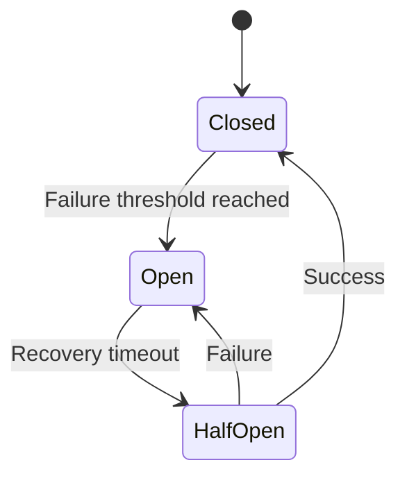

# 🔗 Integration: <% tp.file.title %>

## 📋 Integration Overview

**Integration Name:** <% tp.frontmatter.integration_name %>  
**Type:** <% tp.frontmatter.integration_type %>  
**Protocol:** <% tp.frontmatter.protocol %>  
**Status:** <% tp.frontmatter.status %>  
**Version:** <% tp.system.prompt("Integration version", "1.0.0") %>  
**Last Updated:** <% tp.date.now("YYYY-MM-DD") %>

### Purpose
<% tp.system.prompt("What does this integration do? (1-2 sentences)") %>

### Integration Summary
**Source System:** <% tp.system.prompt("Source system name") %>  
**Target System:** <% tp.system.prompt("Target system name") %>  
**Direction:** <% tp.system.suggester(["Inbound", "Outbound", "Bidirectional"], ["inbound", "outbound", "bidirectional"]) %>  
**Data Flow:** <% tp.system.prompt("What data is exchanged?") %>

---

## 🎯 Integration Context

### Business Use Cases
1. **<% tp.system.prompt("Use case 1") %>**
   - Business value: 
   - Frequency: <% tp.system.prompt("How often? (e.g., Real-time, Batch, On-demand)") %>
   - Priority: <% tp.system.suggester(["Critical", "High", "Medium", "Low"], ["critical", "high", "medium", "low"]) %>

2. **Use case 2**
   - Business value: 
   - Frequency: 
   - Priority: 

### Stakeholders
| Role | Name | Responsibility | Contact |
|------|------|----------------|---------|
| Integration Owner | <% tp.system.prompt("Owner name") %> | Overall integration health | |
| System Owner (Source) | | Source system liaison | |
| System Owner (Target) | | Target system liaison | |
| Operations | | Monitoring & support | |

---

## 🏗️ Architecture

### Integration Architecture

```mermaid
graph LR
    subgraph "Source: <% tp.system.prompt("Source system") %>"
        A[Application]
        B[Integration Layer]
    end
    
    subgraph "Integration Components"
        C[Authentication]
        D[Transform]
        E[Validation]
        F[Error Handler]
    end
    
    subgraph "Target: <% tp.system.prompt("Target system") %>"
        G[API Gateway]
        H[Service]
    end
    
    A --> B
    B --> C
    C --> D
    D --> E
    E --> G
    G --> H
    
    E -->|Error| F
    H -->|Error| F
```

### Integration Pattern
**Pattern Type:** <% tp.system.suggester(["Request-Response", "Fire and Forget", "Pub-Sub", "Request-Callback", "Polling", "Batch Transfer"], ["req-res", "fire-forget", "pubsub", "callback", "polling", "batch"]) %>

**Pattern Description:**
<% tp.system.prompt("Describe the integration pattern and why it was chosen") %>

---

## 🔌 Connection Details

### Endpoint Information

**Base URL:** `<% tp.system.prompt("Base URL (e.g., https://api.example.com/v1)") %>`  
**Environment:** <% tp.system.suggester(["Production", "Staging", "Development"], ["production", "staging", "development"]) %>

**Endpoints:**
| Endpoint | Method | Purpose | Rate Limit |
|----------|--------|---------|------------|
| `<% tp.system.prompt("/endpoint1") %>` | <% tp.system.suggester(["GET", "POST", "PUT", "PATCH", "DELETE"], ["GET", "POST", "PUT", "PATCH", "DELETE"]) %> | <% tp.system.prompt("Purpose") %> | <% tp.system.prompt("Limit (e.g., 100/min)") %> |
| `/endpoint2` | | | |

### Connection Configuration

**Connection Parameters:**
```yaml
connection:
  host: <% tp.system.prompt("Hostname") %>
  port: <% tp.system.prompt("Port", "443") %>
  protocol: <% tp.frontmatter.protocol %>
  timeout: <% tp.system.prompt("Timeout in seconds", "30") %>
  retries: <% tp.system.prompt("Retry count", "3") %>
  keepalive: <% tp.system.suggester(["true", "false"], ["true", "false"]) %>
```

**Network Requirements:**
- Firewall rules: <% tp.system.prompt("Required firewall rules") %>
- IP whitelist: <% tp.system.prompt("Required IPs to whitelist", "N/A") %>
- VPN required: <% tp.system.suggester(["Yes", "No"], ["yes", "no"]) %>
- TLS version: <% tp.system.prompt("TLS version", "TLS 1.3") %>

---

## 🔐 Authentication & Authorization

### Authentication Method
**Type:** <% tp.system.suggester(["OAuth 2.0", "API Key", "JWT", "Basic Auth", "mTLS", "SAML", "Custom"], ["oauth2", "apikey", "jwt", "basic", "mtls", "saml", "custom"]) %>

### OAuth 2.0 Configuration (if applicable)

**Grant Type:** <% tp.system.suggester(["Client Credentials", "Authorization Code", "Resource Owner Password", "Implicit", "Refresh Token"], ["client_credentials", "authorization_code", "password", "implicit", "refresh_token"]) %>

**OAuth Endpoints:**
```yaml
oauth:
  authorization_url: <% tp.system.prompt("Auth URL", "N/A") %>
  token_url: <% tp.system.prompt("Token URL") %>
  refresh_url: <% tp.system.prompt("Refresh URL", "N/A") %>
  scope: <% tp.system.prompt("Required scopes (e.g., read write)") %>
```

**Token Management:**
- Token expiration: <% tp.system.prompt("Token TTL (e.g., 3600 seconds)") %>
- Refresh strategy: <% tp.system.prompt("When/how to refresh") %>
- Token storage: <% tp.system.prompt("Where tokens are stored") %>

### API Key Configuration (if applicable)

**Key Details:**
- Header name: `<% tp.system.prompt("Header name (e.g., X-API-Key)") %>`
- Key format: <% tp.system.prompt("Format (e.g., Bearer token, plain key)") %>
- Key rotation: <% tp.system.prompt("Rotation policy") %>

**Example Request:**
```bash
curl -X GET \
  '<% tp.system.prompt("API endpoint") %>' \
  -H 'X-API-Key: <YOUR_API_KEY>' \
  -H 'Content-Type: application/json'
```

### Credential Management

**Secrets Storage:** <% tp.system.prompt("Where secrets are stored (e.g., AWS Secrets Manager, HashiCorp Vault)") %>

**Environment Variables:**
```bash
# Authentication credentials
<% tp.system.prompt("AUTH_ENV_VAR_1") %>=***  # From: <% tp.system.prompt("Secrets source") %>
AUTH_CLIENT_ID=***
AUTH_CLIENT_SECRET=***
```

---

## 📡 API Specification

### Request Format

**Content Type:** `<% tp.system.prompt("Content type (e.g., application/json)", "application/json") %>`

**Request Headers:**
| Header | Required | Description | Example |
|--------|----------|-------------|---------|
| `Content-Type` | ✓ | Request content type | `application/json` |
| `Authorization` | ✓ | Auth token | `Bearer <token>` |
| `<% tp.system.prompt("Custom header") %>` | <% tp.system.suggester(["✓", "✗"], ["yes", "no"]) %> | <% tp.system.prompt("Description") %> | <% tp.system.prompt("Example") %> |

**Request Body Schema:**
```json
{
  "<% tp.system.prompt("field1") %>": "<% tp.system.prompt("type/example") %>",
  "field2": "value",
  "field3": {
    "nested_field": "value"
  }
}
```

**Example Request:**
```bash
curl -X POST \
  '<% tp.system.prompt("Full endpoint URL") %>' \
  -H 'Authorization: Bearer <TOKEN>' \
  -H 'Content-Type: application/json' \
  -d '{
    "<% tp.system.prompt("field1") %>": "<% tp.system.prompt("value1") %>",
    "field2": "value2"
  }'
```

---

### Response Format

**Success Response:**
```json
{
  "status": "success",
  "code": 200,
  "data": {
    "<% tp.system.prompt("response_field1") %>": "<% tp.system.prompt("value/type") %>",
    "response_field2": "value"
  },
  "timestamp": "2026-01-23T10:30:00Z"
}
```

**Response Codes:**
| Code | Meaning | Action |
|------|---------|--------|
| 200 | Success | Process response |
| 201 | Created | Resource created |
| 400 | Bad Request | Fix request format |
| 401 | Unauthorized | Refresh auth token |
| 403 | Forbidden | Check permissions |
| 404 | Not Found | Verify endpoint |
| 429 | Rate Limit | Implement backoff |
| 500 | Server Error | Retry with backoff |
| 503 | Service Unavailable | Circuit breaker |

**Error Response:**
```json
{
  "status": "error",
  "code": 400,
  "message": "Error description",
  "details": {
    "field": "field_name",
    "error": "Validation error"
  },
  "timestamp": "2026-01-23T10:30:00Z",
  "request_id": "req-abc-123"
}
```

---

## 🔄 Data Mapping

### Request Data Mapping

**Source to Target Field Mapping:**
| Source Field | Target Field | Transformation | Required | Notes |
|--------------|--------------|----------------|----------|-------|
| `<% tp.system.prompt("source.field1") %>` | `<% tp.system.prompt("target.field1") %>` | <% tp.system.prompt("Transformation (e.g., Direct, Format, Calculate)") %> | ✓ | <% tp.system.prompt("Notes") %> |
| `source.field2` | `target.field2` | Direct | ✗ | Optional |

**Transformation Rules:**
```python
# Example transformation logic
def transform_data(source_data):
    """
    Transform source data to target format.
    """
    return {
        "<% tp.system.prompt("target_field") %>": transform_<% tp.system.prompt("field") %>(source_data["<% tp.system.prompt("source_field") %>"]),
        "target_field2": source_data.get("source_field2", default_value),
        "timestamp": datetime.utcnow().isoformat()
    }

def transform_field(value):
    """Custom transformation logic."""
    # <% tp.system.prompt("Transformation description") %>
    return transformed_value
```

### Response Data Mapping

**Target to Source Field Mapping:**
| Target Response | Source Field | Transformation | Notes |
|-----------------|--------------|----------------|-------|
| `<% tp.system.prompt("response.field1") %>` | `<% tp.system.prompt("local.field1") %>` | <% tp.system.prompt("Transformation") %> | |

---

## ⚠️ Error Handling

### Error Classification

**Error Categories:**
| Category | Examples | Handling Strategy |
|----------|----------|-------------------|
| Network | Timeout, Connection refused | Retry with exponential backoff |
| Authentication | 401, 403 | Refresh token, notify admin |
| Rate Limiting | 429 | Backoff, queue requests |
| Validation | 400, 422 | Log, notify developer |
| Server Error | 500, 503 | Retry, circuit breaker |
| Business Logic | Custom errors | Handle per use case |

### Retry Strategy

**Retry Configuration:**
```python
retry_config = {
    "max_retries": <% tp.system.prompt("Max retry count", "3") %>,
    "initial_delay": <% tp.system.prompt("Initial delay (seconds)", "1") %>,
    "max_delay": <% tp.system.prompt("Max delay (seconds)", "60") %>,
    "exponential_base": <% tp.system.prompt("Backoff multiplier", "2") %>,
    "jitter": <% tp.system.suggester(["true", "false"], ["True", "False"]) %>,
    "retryable_codes": [429, 500, 502, 503, 504],
    "retryable_exceptions": ["Timeout", "ConnectionError"]
}
```

**Retry Logic:**
```python
import time
import random

def retry_with_backoff(func, retry_config):
    """
    Retry function with exponential backoff.
    """
    for attempt in range(retry_config["max_retries"]):
        try:
            return func()
        except RetryableException as e:
            if attempt == retry_config["max_retries"] - 1:
                raise
            
            # Calculate backoff delay
            delay = min(
                retry_config["initial_delay"] * (retry_config["exponential_base"] ** attempt),
                retry_config["max_delay"]
            )
            
            # Add jitter
            if retry_config["jitter"]:
                delay *= (0.5 + random.random())
            
            logger.warning(f"Attempt {attempt + 1} failed, retrying in {delay}s: {e}")
            time.sleep(delay)
```

### Circuit Breaker

**Circuit Breaker Configuration:**
```python
circuit_breaker_config = {
    "failure_threshold": <% tp.system.prompt("Failures before opening", "5") %>,
    "recovery_timeout": <% tp.system.prompt("Recovery timeout (seconds)", "60") %>,
    "expected_exception": "IntegrationError",
    "fallback_function": fallback_handler
}
```

**Circuit Breaker States:**


---

## 📊 Monitoring & Observability

### Metrics to Track

**Performance Metrics:**
| Metric | Type | Threshold | Alert |
|--------|------|-----------|-------|
| Response time | Latency | <500ms | >1000ms |
| Success rate | Percentage | >99% | <95% |
| Error rate | Percentage | <1% | >5% |
| Rate limit usage | Percentage | <80% | >90% |
| Throughput | Requests/sec | | |

**Integration Health:**
```python
integration_health = {
    "status": "<% tp.system.suggester(["healthy", "degraded", "down"], ["healthy", "degraded", "down"]) %>",
    "uptime_percentage": <% tp.system.prompt("Uptime %", "99.9") %>,
    "avg_response_time_ms": <% tp.system.prompt("Avg response time", "150") %>,
    "error_rate_percentage": <% tp.system.prompt("Error rate %", "0.1") %>,
    "last_successful_call": "<% tp.date.now("YYYY-MM-DD HH:mm:ss") %>",
    "circuit_breaker_state": "closed"
}
```

### Logging

**Log Format:**
```json
{
  "timestamp": "2026-01-23T10:30:00Z",
  "level": "INFO",
  "integration": "<% tp.frontmatter.integration_name %>",
  "event": "api_call",
  "method": "POST",
  "endpoint": "/api/v1/resource",
  "status_code": 200,
  "response_time_ms": 150,
  "request_id": "req-abc-123",
  "correlation_id": "corr-xyz-789",
  "user_id": "user123"
}
```

**Log Levels:**
- **ERROR:** Failed requests, exceptions, circuit breaker opens
- **WARN:** Retries, rate limit warnings, slow responses
- **INFO:** Successful requests, state changes
- **DEBUG:** Request/response details, transformation logic

### Alerting

**Alert Rules:**
| Alert | Condition | Severity | Channel |
|-------|-----------|----------|---------|
| Integration Down | Error rate >50% for 5min | P0 | PagerDuty |
| High Error Rate | Error rate >5% for 10min | P1 | Slack + Email |
| Slow Response | Avg response >1s for 5min | P2 | Slack |
| Rate Limit Warning | Usage >90% | P3 | Email |

---

## 🧪 Testing

### Test Strategy

**Test Levels:**
| Level | Tool | Coverage | Frequency |
|-------|------|----------|-----------|
| Unit | <% tp.system.prompt("Test framework (e.g., pytest)") %> | <% tp.system.prompt("Coverage %", "80%") %> | Every commit |
| Integration | <% tp.system.prompt("Integration test tool") %> | Key flows | Every PR |
| Contract | <% tp.system.prompt("Contract test tool (e.g., Pact)", "N/A") %> | API contract | Daily |
| E2E | <% tp.system.prompt("E2E test tool") %> | Critical paths | Pre-deployment |

### Test Cases

#### Test Case 1: Successful Request
```python
def test_successful_request():
    """Test successful API request."""
    # Arrange
    client = IntegrationClient(config)
    request_data = {"field1": "value1"}
    
    # Act
    response = client.post("/endpoint", data=request_data)
    
    # Assert
    assert response.status_code == 200
    assert response.json()["status"] == "success"
    assert "data" in response.json()
```

#### Test Case 2: Authentication Error
```python
def test_authentication_error():
    """Test handling of authentication errors."""
    # Arrange
    client = IntegrationClient(invalid_config)
    
    # Act & Assert
    with pytest.raises(AuthenticationError):
        client.get("/endpoint")
```

#### Test Case 3: Retry Logic
```python
def test_retry_logic():
    """Test retry behavior on transient errors."""
    # Arrange
    client = IntegrationClient(config)
    mock_api.set_responses([503, 503, 200])
    
    # Act
    response = client.get("/endpoint")
    
    # Assert
    assert response.status_code == 200
    assert mock_api.call_count == 3  # 2 failures + 1 success
```

### Mock/Stub Environment

**Mock Server:** <% tp.system.prompt("Mock server tool (e.g., WireMock, Postman Mock)", "N/A") %>

**Mock Responses:**
```python
# Mock configuration
mock_responses = {
    "/endpoint1": {
        "method": "GET",
        "status": 200,
        "body": {"data": "mock_data"},
        "headers": {"Content-Type": "application/json"}
    },
    "/endpoint2": {
        "method": "POST",
        "status": 201,
        "body": {"id": "mock-id-123"}
    }
}
```

---

## 🚀 Deployment

### Prerequisites

**System Requirements:**
- [ ] Network connectivity to target system
- [ ] Firewall rules configured
- [ ] Authentication credentials provisioned
- [ ] SSL certificates installed
- [ ] Monitoring configured
- [ ] Logging enabled

**Dependencies:**
```bash
# Required packages
<% tp.system.prompt("package1") %>==<% tp.system.prompt("version") %>
package2==version
package3>=version
```

### Configuration

**Environment-Specific Configuration:**
```yaml
# Development
dev:
  base_url: <% tp.system.prompt("Dev URL") %>
  timeout: 30
  debug: true
  
# Staging
staging:
  base_url: <% tp.system.prompt("Staging URL") %>
  timeout: 30
  debug: false
  
# Production
production:
  base_url: <% tp.system.prompt("Production URL") %>
  timeout: 10
  debug: false
  rate_limit: 1000
```

### Deployment Checklist

- [ ] Configuration validated
- [ ] Credentials tested
- [ ] Network connectivity verified
- [ ] SSL certificates valid
- [ ] Monitoring dashboards created
- [ ] Alerts configured
- [ ] Runbook documented
- [ ] Team trained
- [ ] Rollback plan ready
- [ ] Integration tests passing

---

## 🔧 Operational Procedures

### Runbook

#### Health Check Procedure
```bash
# 1. Check integration health endpoint
curl -X GET '<% tp.system.prompt("Health endpoint") %>' \
  -H 'Authorization: Bearer <TOKEN>'

# 2. Verify response
# Expected: {"status": "healthy", "timestamp": "..."}

# 3. Check metrics
<% tp.system.prompt("Metrics check command") %>
```

#### Emergency Procedures

**Integration Down:**
1. Check circuit breaker state
2. Verify network connectivity
3. Validate authentication tokens
4. Review error logs
5. Check target system status
6. Escalate if needed: <% tp.system.prompt("Escalation contact") %>

**Rate Limit Exceeded:**
1. Check current rate limit usage
2. Implement request queuing
3. Contact API provider for limit increase
4. Review usage patterns

### Troubleshooting

**Common Issues:**

#### Issue 1: Authentication Failures
**Symptoms:**
- 401/403 responses
- "Invalid token" errors

**Diagnosis:**
```bash
# Check token validity
<% tp.system.prompt("Token validation command") %>

# Verify credentials
<% tp.system.prompt("Credential check command") %>
```

**Resolution:**
1. Refresh authentication token
2. Verify credentials in secrets manager
3. Check token expiration
4. Regenerate credentials if needed

#### Issue 2: Timeout Errors
**Symptoms:**
- Connection timeout
- Read timeout
- Slow responses

**Diagnosis:**
```bash
# Test connectivity
<% tp.system.prompt("Connectivity test command (e.g., curl with verbose)") %>

# Check response time
<% tp.system.prompt("Response time test command") %>
```

**Resolution:**
1. Increase timeout configuration
2. Check network latency
3. Review target system health
4. Implement retry logic

---

## 📚 Documentation & Resources

### API Documentation
- **Official API Docs:** <% tp.system.prompt("API documentation URL") %>
- **API Reference:** <% tp.system.prompt("API reference URL", "N/A") %>
- **Changelog:** <% tp.system.prompt("API changelog URL", "N/A") %>
- **Status Page:** <% tp.system.prompt("Status page URL", "N/A") %>

### Internal Documentation
- [[Integration Architecture]] - Overall integration strategy
- [[API Standards]] - API design guidelines
- [[Security Guidelines]] - Security requirements
- [[Monitoring Guide]] - Monitoring setup
- [[Runbook]] - Operational procedures

### Support Contacts
- **API Provider Support:** <% tp.system.prompt("Support email/portal") %>
- **Internal Integration Team:** <% tp.system.prompt("Team contact") %>
- **On-Call:** <% tp.system.prompt("On-call rotation") %>

---

## 🔄 Change Management

### Change Log

#### <% tp.date.now("YYYY-MM-DD") %> - v<% tp.system.prompt("Version", "1.0.0") %>
- Initial integration implementation
- <% tp.system.prompt("Change 1") %>
- Change 2

#### [Date] - v[Version]
- Change description
- Breaking changes
- Migration notes

### Deprecation Notice

**Status:** <% tp.system.suggester(["✅ Active", "⚠️ Deprecated", "🔒 End of Life"], ["active", "deprecated", "eol"]) %>

**If deprecated:**
- Deprecation date: <% tp.system.prompt("Date", "N/A") %>
- Reason: <% tp.system.prompt("Why?", "N/A") %>
- Replacement: <% tp.system.prompt("Replacement integration", "N/A") %>
- Sunset date: <% tp.system.prompt("When will it be removed?", "N/A") %>

---

## 📊 Metrics & SLA

### Service Level Agreement

**SLA Targets:**
| Metric | Target | Current | Status |
|--------|--------|---------|--------|
| Uptime | <% tp.system.prompt("SLA target (e.g., 99.9%)", "99.9%") %> | | ✅ |
| Response Time | <% tp.system.prompt("Response time SLA", "<500ms") %> | | ✅ |
| Success Rate | <% tp.system.prompt("Success rate SLA", ">99%") %> | | ✅ |
| Support Response | <% tp.system.prompt("Support response time", "<1 hour") %> | | ✅ |

### Usage Statistics

```dataview
TABLE status, integration_type, protocol, last_verified
FROM "docs/integrations"
WHERE file.name = this.file.name
```

**Current Stats:**
- **Total Requests (30d):** <% tp.system.prompt("Request count", "N/A") %>
- **Average Response Time:** <% tp.system.prompt("Avg time", "N/A") %>
- **Error Rate:** <% tp.system.prompt("Error rate %", "N/A") %>
- **Peak Throughput:** <% tp.system.prompt("Peak requests/sec", "N/A") %>

---

## 🔒 Security & Compliance

### Security Measures
- [ ] TLS 1.3 encryption
- [ ] API key rotation enabled
- [ ] IP whitelisting configured
- [ ] Request signing implemented
- [ ] Audit logging enabled
- [ ] Secrets in vault
- [ ] Input validation
- [ ] Output sanitization

### Compliance Requirements
**Applicable Standards:** <% tp.system.prompt("Standards (e.g., GDPR, HIPAA, SOC2)", "N/A") %>

**Audit Trail:**
- Audit log location: <% tp.system.prompt("Log storage location") %>
- Retention period: <% tp.system.prompt("Retention period") %>
- Access controls: <% tp.system.prompt("Who can access?") %>

---

**Document Version:** 1.0  
**Template Version:** 1.0  
**Last Updated:** <% tp.date.now("YYYY-MM-DD HH:mm") %>  
**Next Review:** <% tp.date.now("YYYY-MM-DD", 90) %>

---

*This document was created using the Project-AI Integration Documentation Template.*  
*Template location: `templates/system-docs/new-integration-documentation.md`*
