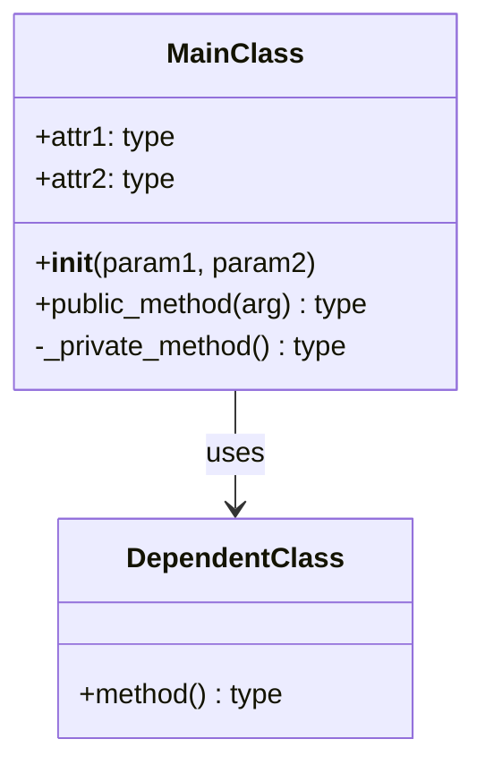
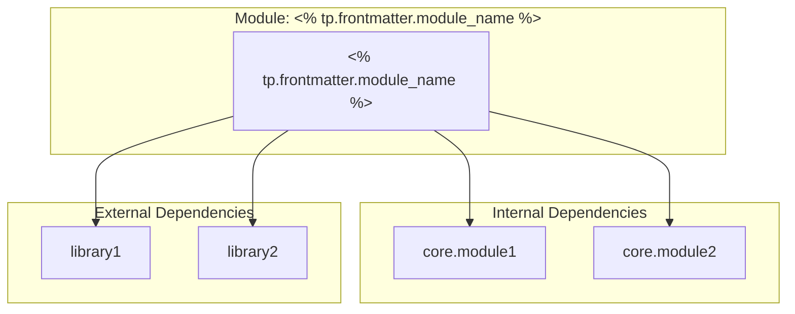
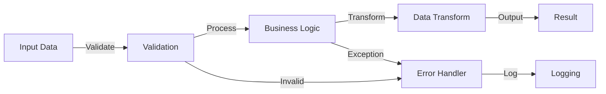
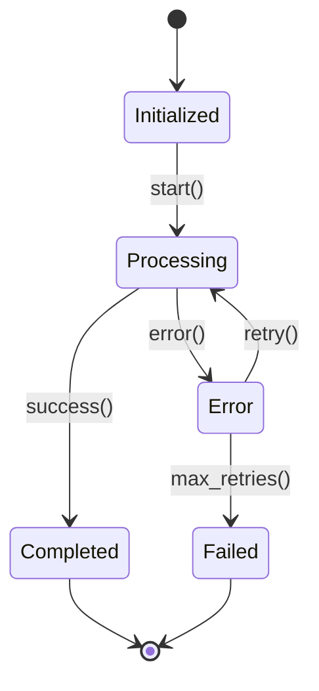

# 📦 Module: <% tp.file.title %>

## 📋 Module Overview

**Module Name:** `<% tp.frontmatter.module_name %>`  
**File Path:** `<% tp.system.prompt("Module file path (e.g., src/app/core/module_name.py)") %>`  
**Language:** <% tp.frontmatter.language %>  
**Type:** <% tp.frontmatter.module_type %>  
**Status:** <% tp.frontmatter.status %>  
**Version:** <% tp.system.prompt("Module version", "1.0.0") %>  
**Last Updated:** <% tp.date.now("YYYY-MM-DD") %>

### Purpose
<% tp.system.prompt("What is the module's primary purpose? (1-2 sentences)") %>

### Scope
**In Scope:**
- <% tp.system.prompt("Capability 1") %>
- <% tp.system.prompt("Capability 2") %>
- <% tp.system.prompt("Capability 3") %>

**Out of Scope:**
- <% tp.system.prompt("What this module does NOT handle") %>
- Responsibility handled by other modules
- External service concerns

---

## 🎯 Module Responsibilities

### Primary Responsibilities
1. **<% tp.system.prompt("Responsibility 1") %>**
   - Description: 
   - Why this module: 
   
2. **Responsibility 2**
   - Description: 
   - Why this module: 

### Design Principles
- **<% tp.system.prompt("Design principle 1 (e.g., Single Responsibility)") %>**
- **Principle 2**
- **Principle 3**

### Module Boundaries
**Owns:**
- Data models: <% tp.system.prompt("What data structures?") %>
- Business logic: <% tp.system.prompt("What business rules?") %>
- State management: <% tp.system.prompt("What state?") %>

**Delegates to:**
- Module 1: Responsibility
- Module 2: Responsibility
- Module 3: Responsibility

---

## 🏗️ Architecture

### Module Structure

```<% tp.frontmatter.language %>
# <% tp.frontmatter.module_name %> structure
"""
<% tp.system.prompt("Module docstring - high-level description") %>
"""

# Constants
CONSTANT_1 = <% tp.system.prompt("Constant value") %>
CONSTANT_2 = value

# Classes
class MainClass:
    """
    <% tp.system.prompt("Class purpose") %>
    
    Attributes:
        attr1 (type): Description
        attr2 (type): Description
    """
    
    def __init__(self, param1, param2):
        """Initialize MainClass."""
        pass
    
    def public_method(self, arg):
        """
        <% tp.system.prompt("Method purpose") %>
        
        Args:
            arg (type): Description
            
        Returns:
            type: Description
            
        Raises:
            ExceptionType: When condition
        """
        pass
    
    def _private_method(self):
        """Internal helper method."""
        pass

# Functions
def module_function(param):
    """
    <% tp.system.prompt("Function purpose") %>
    
    Args:
        param (type): Description
        
    Returns:
        type: Description
    """
    pass
```

### Class Diagram



### Module Dependencies



**Dependency Table:**
| Dependency | Type | Version | Purpose |
|------------|------|---------|---------|
| <% tp.system.prompt("Dependency 1") %> | <% tp.system.suggester(["Internal", "External"], ["internal", "external"]) %> | <% tp.system.prompt("Version", "latest") %> | <% tp.system.prompt("Purpose") %> |
|            |      |         | |

---

## 🔧 API Reference

### Classes

#### Class 1: `<% tp.system.prompt("ClassName") %>`

**Purpose:** <% tp.system.prompt("Class purpose") %>

**Inheritance:**
```<% tp.frontmatter.language %>
class ClassName(<% tp.system.prompt("BaseClass", "object") %>):
    """Class description."""
    pass
```

**Constructor:**
```<% tp.frontmatter.language %>
def __init__(
    self,
    param1: <% tp.system.prompt("param1 type") %>,
    param2: <% tp.system.prompt("param2 type") %>,
    param3: Optional[type] = None
):
    """
    Initialize ClassName.
    
    Args:
        param1: <% tp.system.prompt("param1 description") %>
        param2: <% tp.system.prompt("param2 description") %>
        param3: Optional parameter (default: None)
        
    Raises:
        ValueError: If param1 is invalid
        TypeError: If param2 has wrong type
    """
```

**Attributes:**
| Attribute | Type | Visibility | Description |
|-----------|------|------------|-------------|
| `<% tp.system.prompt("attr1") %>` | <% tp.system.prompt("type") %> | Public | <% tp.system.prompt("Description") %> |
| `attr2` | type | Private | Description |
| `attr3` | type | Protected | Description |

---

**Methods:**

##### `public_method(arg1, arg2) -> ReturnType`

**Purpose:** <% tp.system.prompt("Method purpose") %>

**Signature:**
```<% tp.frontmatter.language %>
def public_method(
    self,
    arg1: <% tp.system.prompt("arg1 type") %>,
    arg2: <% tp.system.prompt("arg2 type") %>,
    **kwargs
) -> <% tp.system.prompt("return type") %>:
    """
    <% tp.system.prompt("Method description") %>
    
    Args:
        arg1: <% tp.system.prompt("arg1 description") %>
        arg2: <% tp.system.prompt("arg2 description") %>
        **kwargs: Optional keyword arguments
        
    Returns:
        <% tp.system.prompt("Return description") %>
        
    Raises:
        ExceptionType: When condition occurs
        
    Example:
        >>> instance = ClassName(param1, param2)
        >>> result = instance.public_method(arg1, arg2)
        >>> print(result)
        Expected output
    """
```

**Parameters:**
| Parameter | Type | Required | Default | Constraints |
|-----------|------|----------|---------|-------------|
| `arg1` | <% tp.system.prompt("type") %> | ✓ | N/A | <% tp.system.prompt("Constraints (e.g., >0, non-null)") %> |
| `arg2` | type | ✓ | N/A | |
| `kwarg1` | type | ✗ | None | |

**Returns:**
- **Type:** <% tp.system.prompt("Return type") %>
- **Description:** <% tp.system.prompt("What is returned") %>
- **Possible values:** <% tp.system.prompt("Value range or options") %>

**Exceptions:**
| Exception | Condition | Handling |
|-----------|-----------|----------|
| `ValueError` | <% tp.system.prompt("When raised") %> | <% tp.system.prompt("How to handle") %> |
| `TypeError` | Invalid type | Validate input types |

**Side Effects:**
- <% tp.system.prompt("Side effect 1 (e.g., Modifies state.attr1)") %>
- Side effect 2
- Side effect 3

**Example Usage:**
```<% tp.frontmatter.language %>
# Basic usage
<% tp.system.prompt("Example 1") %>

# Advanced usage
<% tp.system.prompt("Example 2 with error handling") %>

# Edge case
<% tp.system.prompt("Example 3 with edge case") %>
```

---

##### `_private_method(arg) -> ReturnType`

**Purpose:** <% tp.system.prompt("Internal method purpose") %>  
**Visibility:** Private (internal use only)

**Signature:**
```<% tp.frontmatter.language %>
def _private_method(self, arg: type) -> type:
    """Internal helper method."""
    pass
```

---

### Functions

#### Function 1: `<% tp.system.prompt("function_name") %>()`

**Purpose:** <% tp.system.prompt("Function purpose") %>

**Signature:**
```<% tp.frontmatter.language %>
def function_name(
    param1: <% tp.system.prompt("param1 type") %>,
    param2: <% tp.system.prompt("param2 type") %>,
    *args,
    **kwargs
) -> <% tp.system.prompt("return type") %>:
    """
    <% tp.system.prompt("Function description") %>
    
    Args:
        param1: Description
        param2: Description
        *args: Variable positional arguments
        **kwargs: Variable keyword arguments
        
    Returns:
        Description
        
    Raises:
        ExceptionType: Condition
        
    Example:
        >>> result = function_name(param1, param2)
        >>> print(result)
        Expected output
    """
```

**Parameters:**
| Parameter | Type | Required | Default | Description |
|-----------|------|----------|---------|-------------|
| `param1` | type | ✓ | N/A | |
| `param2` | type | ✓ | N/A | |

**Returns:**
- **Type:** type
- **Description:** What is returned

**Example:**
```<% tp.frontmatter.language %>
# Example usage
result = function_name(value1, value2)
```

---

### Constants & Configuration

#### Module Constants

```<% tp.frontmatter.language %>
# Configuration constants
<% tp.system.prompt("CONSTANT_NAME") %> = <% tp.system.prompt("value") %>
"""<% tp.system.prompt("Constant description") %>"""

DEFAULT_TIMEOUT = 30
"""Default timeout in seconds."""

MAX_RETRIES = 3
"""Maximum number of retry attempts."""
```

#### Configuration Schema

```<% tp.frontmatter.language %>
CONFIG_SCHEMA = {
    "<% tp.system.prompt("config_key_1") %>": {
        "type": <% tp.system.prompt("type (e.g., str, int, bool)") %>,
        "required": <% tp.system.suggester(["True", "False"], ["True", "False"]) %>,
        "default": <% tp.system.prompt("default value", "None") %>,
        "description": "<% tp.system.prompt("Description") %>"
    },
    "config_key_2": {
        "type": "type",
        "required": False,
        "default": None,
        "description": "Description"
    }
}
```

---

## 🔄 Data Flow

### Input → Processing → Output Flow



### State Management

**State Transitions:**


**State Table:**
| State | Valid Transitions | Actions |
|-------|-------------------|---------|
| Initialized | → Processing | Validate inputs |
| Processing | → Completed, → Error | Execute logic |
| Completed | → [End] | Cleanup |
| Error | → Processing, → Failed | Log error, attempt recovery |
| Failed | → [End] | Final cleanup |

---

## 💾 Data Models

### Model 1: `<% tp.system.prompt("ModelName") %>`

**Purpose:** <% tp.system.prompt("Model purpose") %>

**Schema:**
```<% tp.frontmatter.language %>
class ModelName:
    """
    <% tp.system.prompt("Model description") %>
    
    Attributes:
        field1 (type): <% tp.system.prompt("Field description") %>
        field2 (type): Field description
        field3 (Optional[type]): Optional field
    """
    
    field1: <% tp.system.prompt("field1 type") %>
    field2: <% tp.system.prompt("field2 type") %>
    field3: Optional[type] = None
    created_at: datetime
    updated_at: datetime
```

**Validation Rules:**
| Field | Rule | Error Message |
|-------|------|---------------|
| `field1` | <% tp.system.prompt("Validation rule (e.g., Length > 0)") %> | <% tp.system.prompt("Error message") %> |
| `field2` | Rule | Message |

**Example:**
```<% tp.frontmatter.language %>
# Create instance
model = ModelName(
    field1=value1,
    field2=value2
)

# Validate
if model.is_valid():
    model.save()
```

---

## ⚙️ Configuration

### Environment Variables

```bash
# Required for module operation
<% tp.system.prompt("MODULE_ENV_VAR_1") %>=<% tp.system.prompt("description/value") %>
MODULE_ENV_VAR_2=value

# Optional configuration
OPTIONAL_VAR=value
```

### Configuration File

**Location:** `<% tp.system.prompt("Config file path (e.g., config/module_config.json)") %>`

**Format:**
```json
{
  "<% tp.system.prompt("config_key") %>": "<% tp.system.prompt("value") %>",
  "timeout": 30,
  "retries": 3,
  "debug": false
}
```

### Runtime Configuration

```<% tp.frontmatter.language %>
# Configure at runtime
from <% tp.frontmatter.module_name %> import configure

configure(
    setting1=<% tp.system.prompt("value") %>,
    setting2=value,
    debug=True
)
```

---

## 🧪 Testing

### Test Coverage

**Coverage Target:** <% tp.system.prompt("Coverage target (e.g., >80%)", "80%") %>  
**Current Coverage:** <% tp.system.prompt("Current coverage", "N/A") %>  
**Test File:** `<% tp.system.prompt("Test file path (e.g., tests/test_module_name.py)") %>`

**Test Categories:**
| Category | Count | Coverage | Status |
|----------|-------|----------|--------|
| Unit Tests | <% tp.system.prompt("Count", "0") %> | <% tp.system.prompt("%", "0%") %> | ⏳ |
| Integration Tests | 0 | 0% | ⏳ |
| Edge Cases | 0 | 0% | ⏳ |

---

### Test Cases

#### Test Case 1: <% tp.system.prompt("Test case name (e.g., test_basic_functionality)") %>

**Purpose:** <% tp.system.prompt("What does this test verify?") %>

**Test Code:**
```<% tp.frontmatter.language %>
import pytest
from <% tp.frontmatter.module_name %> import ClassName

def <% tp.system.prompt("test_function_name") %>():
    """<% tp.system.prompt("Test description") %>"""
    # Arrange
    <% tp.system.prompt("Setup code") %>
    
    # Act
    <% tp.system.prompt("Action code") %>
    
    # Assert
    <% tp.system.prompt("Assertion code") %>
```

**Test Data:**
| Input | Expected Output | Notes |
|-------|----------------|-------|
| <% tp.system.prompt("Input 1") %> | <% tp.system.prompt("Output 1") %> | <% tp.system.prompt("Notes") %> |
| Input 2 | Output 2 | Notes |

---

#### Test Case 2: Edge Cases

**Purpose:** Test boundary conditions and edge cases

**Test Code:**
```<% tp.frontmatter.language %>
@pytest.mark.parametrize("input,expected", [
    (edge_case_1, expected_1),
    (edge_case_2, expected_2),
    (edge_case_3, expected_3),
])
def test_edge_cases(input, expected):
    """Test edge cases."""
    result = function(input)
    assert result == expected
```

---

#### Test Case 3: Error Handling

**Purpose:** Verify error handling and exception raising

**Test Code:**
```<% tp.frontmatter.language %>
def test_error_handling():
    """Test error handling."""
    with pytest.raises(ValueError, match="error message"):
        function(invalid_input)
```

---

### Running Tests

```bash
# Run all module tests
pytest <% tp.system.prompt("test file path") %> -v

# Run with coverage
pytest <% tp.system.prompt("test file path") %> --cov=<% tp.frontmatter.module_name %> --cov-report=html

# Run specific test
pytest <% tp.system.prompt("test file path") %>::<% tp.system.prompt("test_function_name") %> -v
```

---

## 🔐 Security Considerations

### Input Validation

**Validation Strategy:**
- <% tp.system.prompt("Validation approach 1") %>
- Validation approach 2
- Validation approach 3

**Validation Example:**
```<% tp.frontmatter.language %>
def validate_input(data):
    """
    Validate input data.
    
    Raises:
        ValueError: If validation fails
    """
    if not isinstance(data, expected_type):
        raise TypeError("Invalid type")
    
    if not meets_constraints(data):
        raise ValueError("Constraint violation")
    
    return sanitize(data)
```

### Security Controls

| Control | Implementation | Status |
|---------|----------------|--------|
| Input sanitization | <% tp.system.prompt("How implemented?") %> | ✅ |
| SQL injection prevention | Parameterized queries | ✅ |
| XSS prevention | Output encoding | ✅ |
| Authentication | Token validation | ✅ |
| Authorization | Role checks | ✅ |

### Known Vulnerabilities

**Current Issues:**
- [ ] <% tp.system.prompt("Security issue 1 (or 'None')") %>

**Mitigations:**
- Mitigation 1: Status
- Mitigation 2: Status

---

## 🚀 Performance

### Performance Characteristics

**Time Complexity:**
| Operation | Complexity | Notes |
|-----------|------------|-------|
| <% tp.system.prompt("Operation 1") %> | <% tp.system.prompt("O() notation") %> | <% tp.system.prompt("Notes") %> |
| Operation 2 | O(?) | Notes |

**Space Complexity:**
| Operation | Complexity | Notes |
|-----------|------------|-------|
| Operation 1 | O(?) | Notes |

### Performance Benchmarks

**Benchmark Results:**
```<% tp.frontmatter.language %>
# Benchmark: <% tp.system.prompt("Operation name") %>
# Input size: <% tp.system.prompt("Size (e.g., 1000 items)") %>
# Average time: <% tp.system.prompt("Time (e.g., 0.5ms)") %>
# Memory usage: <% tp.system.prompt("Memory (e.g., 5MB)") %>
```

**Performance Targets:**
| Metric | Target | Current | Status |
|--------|--------|---------|--------|
| Response time | <% tp.system.prompt("Target (e.g., <100ms)") %> | | ⏳ |
| Throughput | <% tp.system.prompt("Target (e.g., 1000 ops/sec)") %> | | ⏳ |
| Memory usage | <% tp.system.prompt("Target (e.g., <50MB)") %> | | ⏳ |

### Optimization Opportunities

1. **<% tp.system.prompt("Optimization 1") %>**
   - Current approach: 
   - Proposed improvement: 
   - Expected gain: 
   
2. **Optimization 2**
   - Current approach: 
   - Proposed improvement: 
   - Expected gain: 

---

## 📝 Usage Examples

### Basic Usage

```<% tp.frontmatter.language %>
"""
Basic usage example for <% tp.frontmatter.module_name %>.
"""
from <% tp.frontmatter.module_name %> import <% tp.system.prompt("ClassName or function_name") %>

# Initialize
<% tp.system.prompt("Basic usage code - step 1") %>

# Use
<% tp.system.prompt("Basic usage code - step 2") %>

# Result
<% tp.system.prompt("Basic usage code - step 3") %>
```

**Output:**
```
<% tp.system.prompt("Expected output") %>
```

---

### Advanced Usage

```<% tp.frontmatter.language %>
"""
Advanced usage with error handling and configuration.
"""
from <% tp.frontmatter.module_name %> import ClassName, configure
import logging

# Configure module
configure(
    setting1=<% tp.system.prompt("custom_value") %>,
    debug=True
)

# Setup logging
logging.basicConfig(level=logging.DEBUG)
logger = logging.getLogger(__name__)

try:
    # Advanced operation
    <% tp.system.prompt("Advanced usage code") %>
    
except ExceptionType as e:
    logger.error(f"Operation failed: {e}")
    # Handle error
    <% tp.system.prompt("Error handling code") %>
    
finally:
    # Cleanup
    <% tp.system.prompt("Cleanup code") %>
```

---

### Integration Example

```<% tp.frontmatter.language %>
"""
Integration with other modules.
"""
from <% tp.frontmatter.module_name %> import ClassName
from other_module import OtherClass

# Create instances
instance1 = ClassName(param1, param2)
instance2 = OtherClass(param3)

# Integrate
result = instance1.method(instance2.data)

# Use result
<% tp.system.prompt("Integration code") %>
```

---

## 🐛 Known Issues & Limitations

### Current Issues

- [ ] **Issue 1:** <% tp.system.prompt("Issue description") %>
  - Impact: <% tp.system.prompt("Impact level") %>
  - Workaround: <% tp.system.prompt("Workaround if available") %>
  - Tracking: <% tp.system.prompt("Issue link", "N/A") %>

- [ ] **Issue 2:** Description
  - Impact: Level
  - Workaround: If available
  - Tracking: Link

### Limitations

1. **<% tp.system.prompt("Limitation 1") %>**
   - Reason: 
   - Alternative: 

2. **Limitation 2**
   - Reason: 
   - Alternative: 

### Future Enhancements

- [ ] <% tp.system.prompt("Enhancement 1") %> - Target: Q<% tp.system.prompt("Q", "1") %> <% tp.date.now("YYYY") %>
- [ ] Enhancement 2 - Target: TBD
- [ ] Enhancement 3 - Target: TBD

---

## 🔗 Integration Guide

### Using This Module

**Installation:**
```bash
# If standalone package
pip install <% tp.system.prompt("package_name", tp.frontmatter.module_name) %>

# If internal module
# Ensure module is in PYTHONPATH
```

**Import:**
```<% tp.frontmatter.language %>
# Import main classes/functions
from <% tp.frontmatter.module_name %> import (
    ClassName,
    function_name,
    CONSTANT_NAME
)

# Import entire module
import <% tp.frontmatter.module_name %>
```

**Initialization:**
```<% tp.frontmatter.language %>
# Basic initialization
instance = ClassName(required_param1, required_param2)

# With configuration
instance = ClassName(
    param1=value1,
    param2=value2,
    optional_param=value3
)
```

---

### Dependent Modules

**Modules that depend on this:**
| Module | Integration Type | Purpose |
|--------|------------------|---------|
| <% tp.system.prompt("Dependent module 1") %> | <% tp.system.suggester(["Direct Import", "Event-driven", "API Call", "Shared State"], ["import", "event", "api", "state"]) %> | <% tp.system.prompt("Why dependency?") %> |
|        |                  | |

**Modules this depends on:**
| Module | Integration Type | Purpose |
|--------|------------------|---------|
| <% tp.system.prompt("Dependency 1") %> | Type | Purpose |
|        |      | |

---

## 🔄 Lifecycle & Maintenance

### Deprecation Status

**Status:** <% tp.system.suggester(["✅ Active", "⚠️ Deprecated", "🔒 End of Life"], ["active", "deprecated", "eol"]) %>

**If deprecated:**
- Deprecation date: <% tp.system.prompt("Date", "N/A") %>
- Reason: <% tp.system.prompt("Why deprecated?", "N/A") %>
- Replacement: <% tp.system.prompt("Replacement module", "N/A") %>
- Migration guide: [[Migration Guide]]

### Change Log

#### <% tp.date.now("YYYY-MM-DD") %> - v<% tp.system.prompt("Version", "1.0.0") %>
- Initial module documentation
- <% tp.system.prompt("Change 1") %>
- Change 2

#### [Date] - v[Version]
- Change description
- Breaking changes
- Migration notes

### Maintenance Schedule

**Review Cycle:** <% tp.system.prompt("Review frequency (e.g., Quarterly)", "Quarterly") %>  
**Next Review:** <% tp.date.now("YYYY-MM-DD", 90) %>  
**Maintainer:** <% tp.system.prompt("Maintainer name/team") %>

---

## 📚 Related Documentation

### Internal Links
- [[System Architecture]] - Overall system design
- [[API Reference]] - Complete API documentation
- [[Developer Guide]] - Development guidelines
- [[Testing Strategy]] - Testing approach
- Parent Module: [[<% tp.system.prompt("Parent module", "N/A") %>]]
- Related Modules: [[]], [[]]

### External Resources
- **Official Docs:** <% tp.system.prompt("External docs URL", "N/A") %>
- **Source Code:** <% tp.system.prompt("GitHub URL", "N/A") %>
- **Issue Tracker:** <% tp.system.prompt("Issues URL", "N/A") %>
- **Tutorials:** <% tp.system.prompt("Tutorial links", "N/A") %>

---

## 📊 Metrics

```dataview
TABLE status, language, module_type, last_verified
FROM "docs"
WHERE file.name = this.file.name
```

**Code Metrics:**
- **Lines of Code:** <% tp.system.prompt("LOC", "N/A") %>
- **Cyclomatic Complexity:** <% tp.system.prompt("Complexity", "N/A") %>
- **Test Coverage:** <% tp.system.prompt("Coverage %", "N/A") %>
- **Dependencies:** <% tp.system.prompt("Dependency count", "N/A") %>

**Quality Metrics:**
- **Code Quality:** <% tp.system.suggester(["A", "B", "C", "D", "F"], ["A", "B", "C", "D", "F"]) %>
- **Documentation:** <% tp.system.suggester(["Complete", "Partial", "Minimal"], ["complete", "partial", "minimal"]) %>
- **Test Quality:** <% tp.system.suggester(["Excellent", "Good", "Fair", "Poor"], ["excellent", "good", "fair", "poor"]) %>

---

## 👥 Contributors & Contacts

**Primary Maintainer:** <% tp.system.prompt("Maintainer name") %>  
**Team:** <% tp.system.prompt("Team name") %>  
**Contact:** <% tp.system.prompt("Contact email/slack") %>

**Contributors:**
| Name | Role | Contribution |
|------|------|--------------|
| <% tp.system.prompt("Contributor 1") %> | | |
|      |      | |

---

**Document Version:** 1.0  
**Template Version:** 1.0  
**Last Updated:** <% tp.date.now("YYYY-MM-DD HH:mm") %>  
**Next Review:** <% tp.date.now("YYYY-MM-DD", 90) %>

---

*This document was created using the Project-AI Module Documentation Template.*  
*Template location: `templates/system-docs/new-module-documentation.md`*
