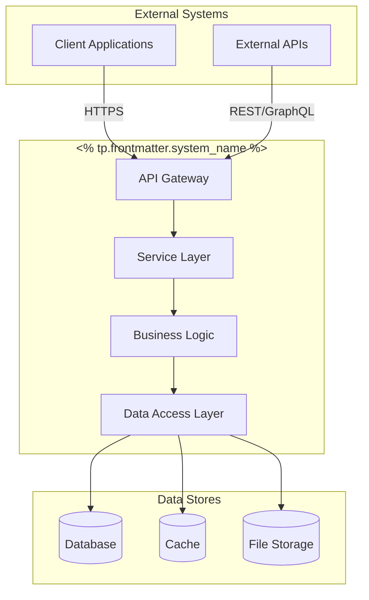
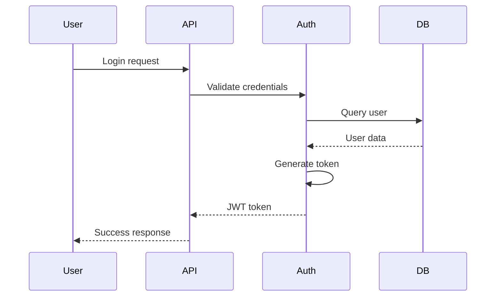
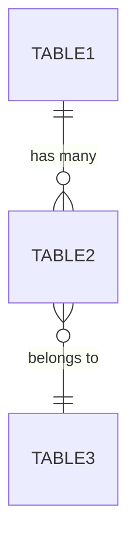
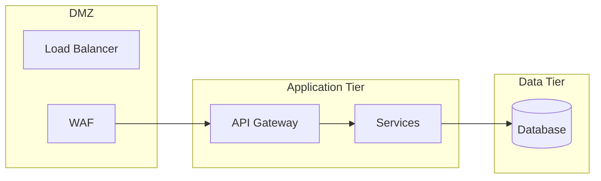
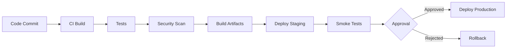
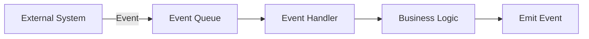

# 🏗️ System: <% tp.file.title %>

## 📋 Executive Summary

**System Name:** <% tp.frontmatter.system_name %>  
**Status:** <% tp.frontmatter.status %>  
**Priority:** <% tp.frontmatter.priority %>  
**Version:** <% tp.system.prompt("System version (e.g., 1.0.0)", "1.0.0") %>  
**Last Updated:** <% tp.date.now("YYYY-MM-DD") %>

### One-Line Description
<% tp.system.prompt("One-line system description") %>

### Purpose & Scope
<% tp.system.prompt("What problem does this system solve? (2-3 sentences)") %>

### Key Capabilities
- <% tp.system.prompt("Capability 1") %>
- <% tp.system.prompt("Capability 2") %>
- <% tp.system.prompt("Capability 3") %>
- Capability 4
- Capability 5

---

## 🎯 System Context

### Business Objectives
1. **<% tp.system.prompt("Business objective 1") %>**
   - Success criteria: 
   - Measurement: 
   
2. **Business objective 2**
   - Success criteria: 
   - Measurement: 

### Technical Objectives
- **Performance:** <% tp.system.prompt("Performance target (e.g., <100ms response time)") %>
- **Availability:** <% tp.system.prompt("Availability target (e.g., 99.9% uptime)") %>
- **Scalability:** <% tp.system.prompt("Scalability target (e.g., 10K concurrent users)") %>
- **Security:** <% tp.system.prompt("Security level (e.g., OWASP compliance)") %>

### Stakeholders
| Role | Name | Responsibility | Contact |
|------|------|----------------|---------|
| Product Owner | <% tp.system.prompt("Product owner name") %> | Business direction | |
| Tech Lead | | Technical decisions | |
| Architect | | System design | |
| DevOps Lead | | Operations & deployment | |

---

## 🏗️ System Architecture

### High-Level Architecture



### Architecture Decisions
<% tp.system.prompt("Key architectural decisions and rationale") %>

### Design Patterns Used
- **<% tp.system.suggester(["MVC", "MVVM", "Repository Pattern", "Factory Pattern", "Observer Pattern", "Singleton Pattern", "Strategy Pattern", "Command Pattern", "Other"], ["mvc", "mvvm", "repository", "factory", "observer", "singleton", "strategy", "command", "other"]) %>** - <% tp.system.prompt("Why this pattern?") %>
- **Pattern 2** - Rationale
- **Pattern 3** - Rationale

---

## 🔧 Component Architecture

### Core Components

#### Component 1: <% tp.system.prompt("Component name (e.g., AuthenticationService)") %>

**Type:** <% tp.system.suggester(["Service", "Module", "Library", "API", "Database", "Worker", "Gateway"], ["service", "module", "library", "api", "database", "worker", "gateway"]) %>  
**Language:** <% tp.system.suggester(["Python", "JavaScript", "TypeScript", "Java", "Go", "Rust", "C++", "Other"], ["python", "javascript", "typescript", "java", "go", "rust", "cpp", "other"]) %>  
**Location:** `<% tp.system.prompt("File/directory path") %>`

**Responsibilities:**
- <% tp.system.prompt("Responsibility 1") %>
- Responsibility 2
- Responsibility 3

**Dependencies:**
```yaml
internal:
  - component-name: purpose
  - component-name: purpose
  
external:
  - library-name: version
  - library-name: version
```

**Interfaces:**
| Interface | Type | Purpose |
|-----------|------|---------|
| `interface_name()` | Public API | |
| `interface_name()` | Internal | |

**Configuration:**
```yaml
component_config:
  setting_1: <% tp.system.prompt("Setting 1 value") %>
  setting_2: value
  timeout: 30s
  retries: 3
```

**Error Handling:**
- Error type 1: Recovery strategy
- Error type 2: Recovery strategy
- Error type 3: Recovery strategy

---

#### Component 2: [Name]
[Repeat structure above]

#### Component 3: [Name]
[Repeat structure above]

---

## 🔄 System Flows

### Flow 1: <% tp.system.prompt("Primary flow name (e.g., User Authentication Flow)") %>



**Steps:**
1. **<% tp.system.prompt("Step 1 description") %>**
   - Input: 
   - Processing: 
   - Output: 
   
2. **Step 2 description**
   - Input: 
   - Processing: 
   - Output: 

**Error Scenarios:**
- Scenario 1: Handling
- Scenario 2: Handling
- Scenario 3: Handling

---

### Flow 2: [Flow Name]
[Repeat structure above]

---

## 💾 Data Architecture

### Data Models

#### Model 1: <% tp.system.prompt("Model name (e.g., User)") %>

```python
class ModelName:
    """
    <% tp.system.prompt("Model description") %>
    """
    id: str
    field_1: str
    field_2: int
    field_3: datetime
    created_at: datetime
    updated_at: datetime
```

**Validation Rules:**
- Rule 1: 
- Rule 2: 
- Rule 3: 

**Business Rules:**
- Rule 1: 
- Rule 2: 

---

### Database Schema

**Database Type:** <% tp.system.suggester(["PostgreSQL", "MySQL", "MongoDB", "Redis", "SQLite", "DynamoDB", "Other"], ["postgresql", "mysql", "mongodb", "redis", "sqlite", "dynamodb", "other"]) %>

**Tables/Collections:**
| Name | Type | Purpose | Size Estimate |
|------|------|---------|---------------|
| <% tp.system.prompt("Table name") %> | <% tp.system.suggester(["Table", "Collection", "Key-Value"], ["table", "collection", "kv"]) %> | | |
|      |      |         | |

**Indexes:**
| Table | Column(s) | Type | Rationale |
|-------|-----------|------|-----------|
|       |           | <% tp.system.suggester(["Primary", "Unique", "Composite", "Full-text"], ["primary", "unique", "composite", "fulltext"]) %> | |

**Relationships:**


---

### Data Storage Strategy

**Primary Storage:** <% tp.system.prompt("Primary data store") %>  
**Cache Layer:** <% tp.system.prompt("Cache strategy (e.g., Redis)", "None") %>  
**Backup Strategy:** <% tp.system.prompt("Backup approach") %>  
**Retention Policy:** <% tp.system.prompt("Data retention period") %>

**Data Migration:**
- Migration tool: <% tp.system.prompt("Migration tool (e.g., Alembic, Flyway)", "N/A") %>
- Migration process: 
- Rollback strategy: 

---

## 🔐 Security Architecture

### Authentication & Authorization

**Authentication Method:** <% tp.system.suggester(["JWT", "OAuth 2.0", "SAML", "API Keys", "mTLS", "Session-based"], ["jwt", "oauth2", "saml", "apikey", "mtls", "session"]) %>  
**Authorization Model:** <% tp.system.suggester(["RBAC", "ABAC", "ACL", "Claims-based"], ["rbac", "abac", "acl", "claims"]) %>

**Token Management:**
- Token type: <% tp.system.prompt("Token type (e.g., JWT)") %>
- Expiration: <% tp.system.prompt("Token expiration (e.g., 1 hour)") %>
- Refresh strategy: <% tp.system.prompt("Refresh token approach") %>
- Revocation: <% tp.system.prompt("Token revocation method") %>

**Roles & Permissions:**
| Role | Permissions | Description |
|------|-------------|-------------|
| <% tp.system.prompt("Role 1") %> | | |
| Role 2 | | |
| Role 3 | | |

---

### Security Controls

**Input Validation:**
- Strategy: <% tp.system.prompt("Validation approach (e.g., Schema-based, whitelist)") %>
- Sanitization: <% tp.system.prompt("Sanitization method") %>
- Encoding: <% tp.system.prompt("Output encoding strategy") %>

**Data Protection:**
- **Encryption at Rest:** <% tp.system.prompt("Encryption method (e.g., AES-256)") %>
- **Encryption in Transit:** <% tp.system.prompt("TLS version (e.g., TLS 1.3)") %>
- **Key Management:** <% tp.system.prompt("Key storage/rotation strategy") %>
- **PII Handling:** <% tp.system.prompt("PII protection measures") %>

**Security Boundaries:**


**Threat Mitigation:**
| Threat | Mitigation | Status |
|--------|------------|--------|
| SQL Injection | Parameterized queries, ORM | ✅ |
| XSS | Output encoding, CSP | ✅ |
| CSRF | CSRF tokens, SameSite | ✅ |
| DoS | Rate limiting, WAF | ✅ |
| Injection | Input validation | ✅ |

---

### Compliance & Audit

**Compliance Requirements:** <% tp.system.prompt("Compliance standards (e.g., GDPR, HIPAA, SOC2)", "N/A") %>

**Audit Logging:**
- Events logged: <% tp.system.prompt("What events are logged?") %>
- Log retention: <% tp.system.prompt("Log retention period") %>
- Log storage: <% tp.system.prompt("Where logs are stored") %>
- Log analysis: <% tp.system.prompt("Log analysis tools") %>

**Security Scanning:**
- SAST: <% tp.system.prompt("SAST tool", "Bandit, Ruff") %>
- DAST: <% tp.system.prompt("DAST tool", "N/A") %>
- Dependency scanning: <% tp.system.prompt("Dependency scan tool", "pip-audit, Safety") %>
- Scan frequency: <% tp.system.prompt("Scan frequency", "On every commit") %>

---

## 🚀 Performance & Scalability

### Performance Characteristics

**Response Times:**
| Operation | Target | Current | Status |
|-----------|--------|---------|--------|
| <% tp.system.prompt("Operation 1") %> | <% tp.system.prompt("Target time") %> | | ⏳ |
| Operation 2 | | | ⏳ |
| Operation 3 | | | ⏳ |

**Throughput:**
- **Target:** <% tp.system.prompt("Throughput target (e.g., 1000 req/sec)") %>
- **Current:** 
- **Peak:** 

**Resource Utilization:**
- CPU: <% tp.system.prompt("CPU target (e.g., <70%)") %>
- Memory: <% tp.system.prompt("Memory target (e.g., <80%)") %>
- Disk I/O: <% tp.system.prompt("Disk I/O target") %>
- Network: <% tp.system.prompt("Network bandwidth target") %>

---

### Scalability Strategy

**Scaling Approach:** <% tp.system.suggester(["Horizontal", "Vertical", "Hybrid"], ["horizontal", "vertical", "hybrid"]) %>

**Horizontal Scaling:**
- Load balancing: <% tp.system.prompt("Load balancer (e.g., Nginx, HAProxy)") %>
- Session management: <% tp.system.prompt("Session strategy (e.g., Redis, sticky sessions)") %>
- Auto-scaling: <% tp.system.prompt("Auto-scaling configuration") %>

**Caching Strategy:**
- **Cache layers:** <% tp.system.prompt("Cache layers (e.g., Redis, CDN)") %>
- **Cache invalidation:** <% tp.system.prompt("Invalidation strategy") %>
- **TTL strategy:** <% tp.system.prompt("TTL configuration") %>

**Performance Optimization:**
- Database query optimization: 
- Code-level optimization: 
- Infrastructure optimization: 

---

### Capacity Planning

**Current Capacity:**
- Users: <% tp.system.prompt("Current user count") %>
- Requests/day: <% tp.system.prompt("Current requests") %>
- Data volume: <% tp.system.prompt("Current data volume") %>

**Growth Projections:**
| Metric | 3 Months | 6 Months | 12 Months |
|--------|----------|----------|-----------|
| Users | | | |
| Requests/day | | | |
| Data volume | | | |

**Scaling Triggers:**
- Trigger 1: Action
- Trigger 2: Action
- Trigger 3: Action

---

## 🔧 Configuration & Environment

### Environment Configuration

**Environments:**
| Environment | Purpose | URL | Access |
|-------------|---------|-----|--------|
| Development | Local dev | localhost | Public |
| Staging | Pre-production | | Restricted |
| Production | Live system | | Restricted |

**Environment Variables:**
```bash
# Required configuration
<% tp.system.prompt("ENV_VAR_1") %>=<% tp.system.prompt("Description/example") %>
ENV_VAR_2=value
ENV_VAR_3=value

# Optional configuration
OPTIONAL_VAR_1=value

# Secrets (managed via secrets manager)
SECRET_API_KEY=***  # From: <% tp.system.prompt("Secrets location (e.g., AWS Secrets Manager)") %>
SECRET_DB_PASSWORD=***
```

**Feature Flags:**
| Flag | Purpose | Default | Rollout % |
|------|---------|---------|-----------|
| <% tp.system.prompt("Feature flag name") %> | | <% tp.system.suggester(["Enabled", "Disabled"], ["enabled", "disabled"]) %> | 0% |
|      |         |         | |

---

### Configuration Management

**Configuration Storage:** <% tp.system.prompt("Where config is stored (e.g., .env, ConfigMap)") %>  
**Secrets Management:** <% tp.system.prompt("Secrets manager (e.g., AWS Secrets, HashiCorp Vault)") %>  
**Config Validation:** <% tp.system.prompt("Validation method") %>

**Config Hierarchy:**
1. Environment variables (highest priority)
2. Config files
3. Default values (lowest priority)

---

## 📦 Deployment Architecture

### Deployment Strategy

**Deployment Model:** <% tp.system.suggester(["Blue-Green", "Canary", "Rolling", "Recreate", "A/B Testing"], ["blue-green", "canary", "rolling", "recreate", "ab-testing"]) %>

**Deployment Pipeline:**


**Deployment Steps:**
1. <% tp.system.prompt("Deployment step 1") %>
2. Deployment step 2
3. Deployment step 3
4. Health checks
5. Smoke tests
6. Production traffic switch

**Rollback Strategy:**
- Rollback trigger: <% tp.system.prompt("When to rollback?") %>
- Rollback process: <% tp.system.prompt("How to rollback?") %>
- Recovery time: <% tp.system.prompt("Target recovery time") %>

---

### Infrastructure

**Hosting Platform:** <% tp.system.suggester(["AWS", "Azure", "GCP", "On-Premise", "Heroku", "DigitalOcean", "Other"], ["aws", "azure", "gcp", "on-premise", "heroku", "digitalocean", "other"]) %>

**Infrastructure as Code:**
- Tool: <% tp.system.suggester(["Terraform", "CloudFormation", "Ansible", "Pulumi", "ARM Templates", "None"], ["terraform", "cloudformation", "ansible", "pulumi", "arm", "none"]) %>
- Repository: <% tp.system.prompt("IaC repository location") %>
- State management: <% tp.system.prompt("State storage location") %>

**Container Orchestration:**
- Platform: <% tp.system.suggester(["Docker Compose", "Kubernetes", "ECS", "AKS", "GKE", "None"], ["docker-compose", "kubernetes", "ecs", "aks", "gke", "none"]) %>
- Container registry: <% tp.system.prompt("Registry location") %>
- Image tag strategy: <% tp.system.prompt("Tagging convention") %>

**Resource Allocation:**
| Component | CPU | Memory | Storage | Replicas |
|-----------|-----|--------|---------|----------|
| <% tp.system.prompt("Component 1") %> | | | | |
| Component 2 | | | | |

---

## 📊 Monitoring & Observability

### Monitoring Strategy

**Monitoring Tools:**
- **Metrics:** <% tp.system.prompt("Metrics tool (e.g., Prometheus, CloudWatch)") %>
- **Logging:** <% tp.system.prompt("Logging tool (e.g., ELK, Splunk)") %>
- **Tracing:** <% tp.system.prompt("Tracing tool (e.g., Jaeger, X-Ray)") %>
- **APM:** <% tp.system.prompt("APM tool (e.g., New Relic, Datadog)") %>

**Key Metrics:**
| Metric | Type | Threshold | Alert |
|--------|------|-----------|-------|
| Response time | Performance | <100ms | >500ms |
| Error rate | Reliability | <0.1% | >1% |
| CPU usage | Resource | <70% | >90% |
| Memory usage | Resource | <80% | >95% |

**Dashboards:**
- Executive dashboard: Key business metrics
- Operational dashboard: System health
- Developer dashboard: Performance & errors
- Security dashboard: Threats & incidents

---

### Alerting

**Alert Channels:**
- PagerDuty: P0/P1 incidents
- Slack: P2/P3 alerts
- Email: Non-urgent notifications

**Alert Rules:**
| Alert | Condition | Severity | Response Time |
|-------|-----------|----------|---------------|
| System Down | Health check fail | P0 | 5 min |
| High Error Rate | Error rate >1% | P1 | 15 min |
| Performance Degradation | Response >500ms | P2 | 1 hour |
| Resource Warning | CPU >80% | P3 | 4 hours |

**On-Call Rotation:**
- Rotation schedule: <% tp.system.prompt("Rotation period (e.g., Weekly)") %>
- Escalation path: <% tp.system.prompt("Escalation procedure") %>

---

### Logging Standards

**Log Levels:**
- **ERROR:** System failures requiring immediate attention
- **WARN:** Potential issues or degraded performance
- **INFO:** Normal system operations
- **DEBUG:** Detailed diagnostic information

**Log Format:**
```json
{
  "timestamp": "2026-01-23T10:30:00Z",
  "level": "INFO",
  "service": "<% tp.frontmatter.system_name %>",
  "message": "Log message",
  "context": {
    "user_id": "user123",
    "request_id": "req-abc-123",
    "ip": "192.168.1.1"
  }
}
```

**Log Retention:**
- Hot storage: <% tp.system.prompt("Hot storage period (e.g., 7 days)") %>
- Warm storage: <% tp.system.prompt("Warm storage period (e.g., 30 days)") %>
- Cold storage: <% tp.system.prompt("Cold storage period (e.g., 1 year)") %>

---

## 🧪 Testing Strategy

### Test Coverage

**Test Levels:**
| Level | Coverage | Tool | Frequency |
|-------|----------|------|-----------|
| Unit | <% tp.system.prompt("Unit test coverage target (e.g., >80%)", "80%") %> | <% tp.system.prompt("Test framework (e.g., pytest)") %> | Every commit |
| Integration | <% tp.system.prompt("Integration test coverage", "60%") %> | | Every PR |
| E2E | <% tp.system.prompt("E2E test coverage", "40%") %> | | Daily |
| Performance | Key flows | | Weekly |

**Test Automation:**
- CI/CD integration: <% tp.system.prompt("CI tool (e.g., GitHub Actions)") %>
- Test parallelization: <% tp.system.suggester(["Yes", "No"], ["yes", "no"]) %>
- Test reporting: <% tp.system.prompt("Reporting tool") %>

---

### Test Scenarios

**Critical Test Cases:**
1. <% tp.system.prompt("Critical test case 1") %>
   - Preconditions: 
   - Steps: 
   - Expected result: 
   
2. Critical test case 2
   - Preconditions: 
   - Steps: 
   - Expected result: 

**Edge Cases:**
- Edge case 1: Handling
- Edge case 2: Handling
- Edge case 3: Handling

**Load Testing:**
- Tool: <% tp.system.prompt("Load test tool (e.g., JMeter, k6)") %>
- Target load: <% tp.system.prompt("Load target") %>
- Duration: <% tp.system.prompt("Test duration") %>

---

## 🔄 Operational Procedures

### Runbook

#### Deployment Procedure
```bash
# 1. Pre-deployment checks
<% tp.system.prompt("Pre-deployment command 1") %>
command2
command3

# 2. Deployment
deployment_command

# 3. Post-deployment validation
validation_command1
validation_command2
```

#### Rollback Procedure
```bash
# Emergency rollback steps
rollback_step1
rollback_step2
rollback_step3
```

#### Health Check Procedure
```bash
# System health verification
health_check_1
health_check_2
health_check_3
```

---

### Disaster Recovery

**RTO (Recovery Time Objective):** <% tp.system.prompt("RTO target (e.g., 1 hour)") %>  
**RPO (Recovery Point Objective):** <% tp.system.prompt("RPO target (e.g., 15 minutes)") %>

**Backup Strategy:**
- Backup frequency: <% tp.system.prompt("Backup frequency") %>
- Backup location: <% tp.system.prompt("Backup storage") %>
- Backup retention: <% tp.system.prompt("Retention period") %>
- Backup testing: <% tp.system.prompt("Test frequency") %>

**Recovery Procedures:**
1. <% tp.system.prompt("Recovery step 1") %>
2. Recovery step 2
3. Recovery step 3
4. Validation
5. Communication

---

### Maintenance Windows

**Scheduled Maintenance:**
- Frequency: <% tp.system.prompt("Maintenance frequency (e.g., Monthly)") %>
- Duration: <% tp.system.prompt("Typical duration") %>
- Day/Time: <% tp.system.prompt("Preferred day/time") %>
- Notification: <% tp.system.prompt("Notification period (e.g., 48 hours)") %>

**Emergency Maintenance:**
- Approval process: <% tp.system.prompt("Emergency approval process") %>
- Communication: <% tp.system.prompt("Emergency communication plan") %>

---

## 🐛 Troubleshooting Guide

### Common Issues

#### Issue 1: <% tp.system.prompt("Common issue description") %>

**Symptoms:**
- Symptom 1
- Symptom 2

**Diagnosis:**
```bash
# Diagnostic commands
diagnostic_command_1
diagnostic_command_2
```

**Resolution:**
```bash
# Resolution steps
fix_command_1
fix_command_2
```

**Prevention:**
- Prevention measure 1
- Prevention measure 2

---

#### Issue 2: [Description]
[Repeat structure above]

---

### Debug Mode

**Enabling Debug Logging:**
```bash
# Enable debug mode
<% tp.system.prompt("Debug enable command") %>
```

**Debug Endpoints:**
- `/health` - System health status
- `/metrics` - System metrics
- `/debug/config` - Current configuration
- `/debug/logs` - Recent logs

**Debug Tools:**
- Tool 1: Purpose
- Tool 2: Purpose
- Tool 3: Purpose

---

## 📚 Dependencies & Integration

### Internal Dependencies

| System | Integration Type | Purpose | Criticality |
|--------|------------------|---------|-------------|
| <% tp.system.prompt("Dependency 1") %> | <% tp.system.suggester(["API", "Database", "Queue", "Event", "Shared Library"], ["api", "database", "queue", "event", "library"]) %> | | <% tp.system.suggester(["Critical", "High", "Medium", "Low"], ["critical", "high", "medium", "low"]) %> |
|        |                  |         | |

### External Dependencies

| Service | Type | Purpose | SLA | Fallback |
|---------|------|---------|-----|----------|
| <% tp.system.prompt("External service 1") %> | <% tp.system.suggester(["API", "Database", "CDN", "Payment", "Auth", "Other"], ["api", "database", "cdn", "payment", "auth", "other"]) %> | | | |
|         |      |         | | |

### Integration Points

**Inbound Integrations:**
- Integration 1: Description
- Integration 2: Description

**Outbound Integrations:**
- Integration 1: Description
- Integration 2: Description

**Event Flows:**


---

## 📖 Documentation & Resources

### Related Documentation

- [[System Architecture Overview]] - Parent architecture document
- [[API Reference]] - API documentation
- [[Deployment Guide]] - Detailed deployment instructions
- [[Security Guidelines]] - Security standards
- [[Operational Runbook]] - Operational procedures
- [[Troubleshooting Guide]] - Common issues and solutions

### External Resources

- **Official Documentation:** <% tp.system.prompt("Official docs URL", "N/A") %>
- **API Documentation:** <% tp.system.prompt("API docs URL", "N/A") %>
- **Source Repository:** <% tp.system.prompt("Git repository URL") %>
- **Issue Tracker:** <% tp.system.prompt("Issue tracker URL") %>

### Training Materials

- Onboarding guide: [[]]
- Architecture deep-dive: [[]]
- Operations training: [[]]

---

## 🔄 Change Management

### Change Log

#### <% tp.date.now("YYYY-MM-DD") %> - v<% tp.system.prompt("Version", "1.0.0") %>
- Initial system documentation created
- Architecture defined
- Deployment procedures documented

#### [Date] - v[Version]
- Change description
- Breaking changes (if any)
- Migration notes

---

### Deprecation Policy

**Deprecation Process:**
1. Deprecation announcement (90 days notice)
2. Warning period (60 days)
3. Migration support (30 days)
4. Final removal

**Current Deprecations:**
- None

---

## 🎯 Future Roadmap

### Planned Enhancements

**Q1 <% tp.date.now("YYYY") %>**
- [ ] <% tp.system.prompt("Q1 enhancement 1") %>
- [ ] Enhancement 2
- [ ] Enhancement 3

**Q2 <% tp.date.now("YYYY") %>**
- [ ] Enhancement 1
- [ ] Enhancement 2

**Q3-Q4 <% tp.date.now("YYYY") %>**
- [ ] Enhancement 1
- [ ] Enhancement 2

### Technical Debt

| Item | Priority | Effort | Target Quarter |
|------|----------|--------|----------------|
| <% tp.system.prompt("Tech debt item 1") %> | <% tp.system.suggester(["High", "Medium", "Low"], ["high", "medium", "low"]) %> | <% tp.system.suggester(["Small", "Medium", "Large"], ["small", "medium", "large"]) %> | |
|      |          |        | |

---

## 📊 Metrics & KPIs

### System Health Metrics

```dataview
TABLE status, priority, last_verified
FROM "docs/systems"
WHERE file.name = this.file.name
```

**Current Status:**
- **Uptime:** <% tp.system.prompt("Current uptime (e.g., 99.95%)", "N/A") %>
- **Error Rate:** <% tp.system.prompt("Current error rate", "N/A") %>
- **Avg Response Time:** <% tp.system.prompt("Current response time", "N/A") %>
- **Active Users:** <% tp.system.prompt("Current user count", "N/A") %>

### Business Metrics

| Metric | Current | Target | Trend |
|--------|---------|--------|-------|
| <% tp.system.prompt("Business metric 1") %> | | | ↗️ |
| Metric 2 | | | → |
| Metric 3 | | | ↘️ |

---

## 👥 Team & Contacts

### Development Team

| Name | Role | Responsibilities | Contact |
|------|------|------------------|---------|
| <% tp.system.prompt("Team member 1") %> | | | |
|      |      |                  | |

### Support Contacts

- **On-Call:** <% tp.system.prompt("On-call contact") %>
- **Email:** <% tp.system.prompt("Team email") %>
- **Slack:** <% tp.system.prompt("Slack channel") %>
- **PagerDuty:** <% tp.system.prompt("PagerDuty service") %>

---

## 🔍 Appendix

### Glossary

| Term | Definition |
|------|------------|
| <% tp.system.prompt("Term 1") %> | <% tp.system.prompt("Definition 1") %> |
| Term 2 | Definition |

### Acronyms

| Acronym | Full Form |
|---------|-----------|
| RTO | Recovery Time Objective |
| RPO | Recovery Point Objective |
| SLA | Service Level Agreement |

### References

1. <% tp.system.prompt("Reference 1 (e.g., RFC, spec, paper)") %>
2. Reference 2
3. Reference 3

---

**Document Version:** 1.0  
**Template Version:** 1.0  
**Last Updated:** <% tp.date.now("YYYY-MM-DD HH:mm") %>  
**Next Review:** <% tp.date.now("YYYY-MM-DD", 90) %>

---

*This document was created using the Project-AI System Documentation Template.*  
*Template location: `templates/system-docs/new-system-documentation.md`*
